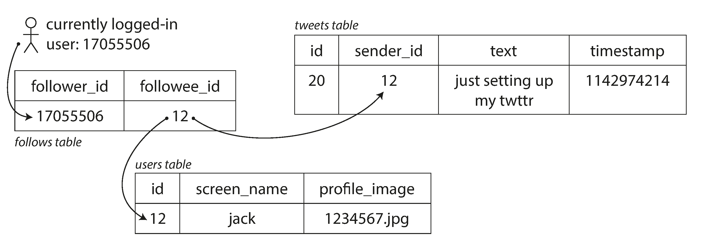
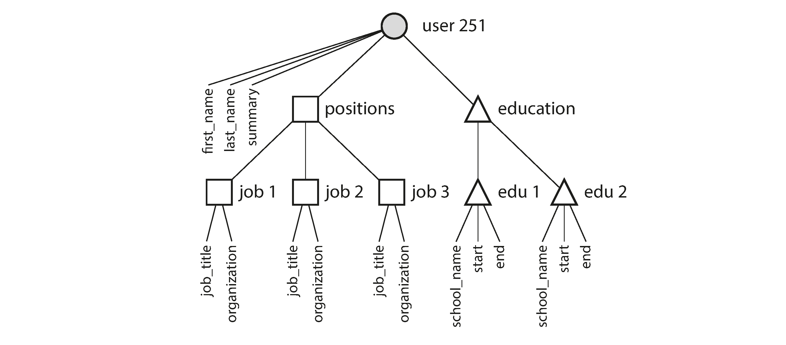

- [Designing Data Intensive Applications](#designing-data-intensive-applications)
  - [Resources](#resources)
  - [Plethora of buzzwords relating to storage and processing of data](#plethora-of-buzzwords-relating-to-storage-and-processing-of-data)
  - [Preface](#preface)
- [Part 1. Foundation of Data Systems \[Chapter 1 - Chapter 4\]](#part-1-foundation-of-data-systems-chapter-1---chapter-4)
  - [Chapter 0: Trade-Offs in Data System Architecture](#chapter-0-trade-offs-in-data-system-architecture)
    - [OLTP vs OLAP](#oltp-vs-olap)
      - [From data warehouse to data lake](#from-data-warehouse-to-data-lake)
    - [Cloud versus Self-Hosting](#cloud-versus-self-hosting)
    - [Cloud-Native System Architecture](#cloud-native-system-architecture)
    - [Separation of storage and compute](#separation-of-storage-and-compute)
    - [Distributed versus Single-Node Systems](#distributed-versus-single-node-systems)
    - [Problems with Distributed Systems](#problems-with-distributed-systems)
    - [Microservices and Serverless](#microservices-and-serverless)
      - [Microservices](#microservices)
      - [Serverless](#serverless)
    - [Cloud Computing versus Supercomputing](#cloud-computing-versus-supercomputing)
    - [Data Systems, Law, and Society](#data-systems-law-and-society)
  - [Chapter 1 : Reliable, Scalable, and Maintainable Applications](#chapter-1--reliable-scalable-and-maintainable-applications)
    - [Reliability](#reliability)
    - [Scalability](#scalability)
    - [Performance](#performance)
    - [Maintainability](#maintainability)
  - [Chapter 2. Data Models and Query Language](#chapter-2-data-models-and-query-language)
    - [Data models](#data-models)
    - [The Object-Relational Mismatch](#the-object-relational-mismatch)
    - [Many-to-One and Many-To-Many relationships](#many-to-one-and-many-to-many-relationships)
    - [Relational Vs Document database Today ?](#relational-vs-document-database-today-)
    - [Which data model leads to simpler application code?](#which-data-model-leads-to-simpler-application-code)
    - [Graph-Like Data Models](#graph-like-data-models)
      - [Property Graphs](#property-graphs)
    - [Cypher Query Language](#cypher-query-language)
    - [Graph Queries in SQL](#graph-queries-in-sql)
    - [Triple-Store and SPARQL](#triple-store-and-sparql)
    - [Summary](#summary)
  - [Chapter 3. Storage and Retrievals](#chapter-3-storage-and-retrievals)
    - [Hash Indexes](#hash-indexes)
  - [Chapter 4. Encoding and Evolution](#chapter-4-encoding-and-evolution)
- [Part 2. Distributed Data](#part-2-distributed-data)
  - [Chapter 5. Replication](#chapter-5-replication)
    - [Leader and Followers](#leader-and-followers)
  - [Chapter 6. Partitioning](#chapter-6-partitioning)
  - [Chapter 7. Transaction](#chapter-7-transaction)
    - [Introduction](#introduction)
    - [The meaning of ACID](#the-meaning-of-acid)
      - [Atomicity](#atomicity)
      - [Consistency](#consistency)
      - [Isolation](#isolation)
      - [Durability](#durability)
    - [Single-Object and Multi-Object Operations](#single-object-and-multi-object-operations)
      - [Single-object writes](#single-object-writes)
      - [The need for multi-object transactions](#the-need-for-multi-object-transactions)
      - [Handling errors and aborts](#handling-errors-and-aborts)
    - [Weak Isolation Levels](#weak-isolation-levels)
    - [Read Committed](#read-committed)
      - [Implementing read committed](#implementing-read-committed)
    - [Snapshot Isolation, repeatable read, and naming confusion](#snapshot-isolation-repeatable-read-and-naming-confusion)
    - [Preventing Lost Updates](#preventing-lost-updates)
      - [Atomic Write Operation](#atomic-write-operation)
      - [Explicity Locking](#explicity-locking)
      - [Automatically detecting lost updates](#automatically-detecting-lost-updates)
      - [Conditional writes (compare-and-set) CAS](#conditional-writes-compare-and-set-cas)
        - [How Replication Handles Lost Updates](#how-replication-handles-lost-updates)
    - [Write Skew and Phantoms](#write-skew-and-phantoms)
      - [What is Write Skew?](#what-is-write-skew)
      - [Why it is tricky to prevent](#why-it-is-tricky-to-prevent)
      - [Possible Solutions](#possible-solutions)
    - [Phantoms(काल्पनिक) Causing Write Skew](#phantomsकाल्पनिक-causing-write-skew)
      - [General Pattern of These Anomalies](#general-pattern-of-these-anomalies)
      - [Phantoms Explained](#phantoms-explained)
      - [ORMs \& Phantoms](#orms--phantoms)
    - [Materializing Conflicts (Workaround)](#materializing-conflicts-workaround)
    - [Serializability](#serializability)
      - [Why it matters ?](#why-it-matters-)
      - [What is Serializability?](#what-is-serializability)
      - [Why Not Always Use It?](#why-not-always-use-it)
    - [Actual Serial Execution](#actual-serial-execution)
      - [Summary of serial execution](#summary-of-serial-execution)
    - [Two-Phase Locking (2PL)](#two-phase-locking-2pl)
      - [2PL is NOT 2PC(ommit)](#2pl-is-not-2pcommit)
      - [Core Idea: Readers and Writers Block Each Other](#core-idea-readers-and-writers-block-each-other)
      - [Performance Problems](#performance-problems)
      - [Phantoms and Predicate Locks](#phantoms-and-predicate-locks)
    - [Serializable Snapshot Isolation (SSI)](#serializable-snapshot-isolation-ssi)
    - [Distributed transactions](#distributed-transactions)
      - [Big picture - what makes distributed transactions hard](#big-picture---what-makes-distributed-transactions-hard)
      - [Two-Phase Commit (2PC) - essentials](#two-phase-commit-2pc---essentials)
        - [Why 2PC can block](#why-2pc-can-block)
        - [Operational consequences](#operational-consequences)
      - [Three-phase commit](#three-phase-commit)
      - [Practical fixes and improvements to vanilla XA/2PC](#practical-fixes-and-improvements-to-vanilla-xa2pc)
    - [Distributed Transactions Across Different Systems](#distributed-transactions-across-different-systems)
      - [Why distributed transactions are controversial ?](#why-distributed-transactions-are-controversial-)
      - [Where the performance cost actually comes from ?](#where-the-performance-cost-actually-comes-from-)
      - [Why we should not dismiss distributed transactions outright ?](#why-we-should-not-dismiss-distributed-transactions-outright-)
      - [Critical distinction - two very different meanings of “distributed transaction”](#critical-distinction---two-very-different-meanings-of-distributed-transaction)
    - [Exactly-once Message Processing - Distributed Transactions](#exactly-once-message-processing---distributed-transactions)
    - [XA Transaction](#xa-transaction)
    - [Summary](#summary-1)
  - [Chapter 8. The Trouble with Distributed Systems](#chapter-8-the-trouble-with-distributed-systems)
  - [Chapter 9. Consistency and Consensus](#chapter-9-consistency-and-consensus)
    - [Consistency Guarantees / Distributed Consistency Models](#consistency-guarantees--distributed-consistency-models)
    - [Linearizability](#linearizability)
      - [What makes a system linearizable ?](#what-makes-a-system-linearizable-)
      - [Relying on Linearizability (Use Cases)](#relying-on-linearizability-use-cases)
      - [Implementing Linearizable Systems](#implementing-linearizable-systems)
      - [Cost of Linearizability](#cost-of-linearizability)
    - [Distributed Transactions and Consensus](#distributed-transactions-and-consensus)
  - [Chapter 10. Batch Processing](#chapter-10-batch-processing)
  - [Chapter 11. Stream Processing](#chapter-11-stream-processing)

# Designing Data Intensive Applications

## Resources

- Author : Martin Kleppmann
- 20 hours of reading (600+ pages book)
[Oreilly Link](https://learning.oreilly.com/library/view/designing-data-intensive-applications/)

## Plethora of buzzwords relating to storage and processing of data
- NoSQL! Big Data! Web-scale! Sharding! Eventual consistency! ACID! CAP theorem! Cloud services! MapReduce! Real-time!

## Preface
- Data intensive 
    - Data as primary challenged - quantity/complexity/changing-nature
    - Store data : Database
    - Expensive opr results : Cache
    - Search by keywords : Search indexes
    - Send msg to another process : Stream processing
    - Accumulated data : batch processing
- Compute intensive 
    - CPU cycles are the bottleneck

- Why read ?
    - If you are Software Engineer/Architect
        - Must have technically accurate and precise understanding of tech 
        - Trade-offs;
    - What about rapid change in tech ?
        - Basic principle remains true 

- Goals ?
    - Navigate the diverse and fast-changing landscape of technologies for **processing** and **storing data**
    - Not just *how*, but also *why* they work that way, and *what* question we need to ask 

- Gains ?
    - Good intuition for what your systems are doing under hood
    - Can reason about their behavior 
    - Good design decision
    - Track down problems that can happen

- Who should read ?
    - If you develop applications that have backend
    - SE, SA and Technical Managers(who loves to code)

- Prereq ?
    - Basic Network/OS
    - Basic relational database

# Part 1. Foundation of Data Systems [Chapter 1 - Chapter 4]

## Chapter 0: Trade-Offs in Data System Architecture 
- Data is central to much application development today
- We call an application data-intensive if data management is one of the primary challenge. While *compute-intensive* the challenge is parallelizing some very large computation
- In DI we worry more about things like storing and processing the data 
- In general many application need to: 
  - Store data so that they can find it later (**databases**)
  - Remember the result of an expensive operation, to speedup reads (**cache**)
  - Allows user to search data by keyword or filter (**search indexes**)
  - Handle events and data changes as soon as they occur (**stream processing**)
  - Periodically crunch a large amount of accumulated data (**batch processing**)

### OLTP vs OLAP
- Online [Transaction|Analytics] Processing
- Both have different pattern of data access. Trasactional queries are more like read, update, delete whereas analytics queries are like aggregation stats rather than individual records

    

- Initially both OLTP and OLAP were carried out through SQL. Later the term *data warehouse* got coined, which means that analytics data will go on a different kind of storage which is optimal for the analytics queries. 
  - A *data warehouse* is a separate database that analysts can query to their hearts’ content, without affecting OLTP operations

#### From data warehouse to data lake
- A data warehouse often uses a relational data model that is queried through SQL. But this might not be the best for all the analysis use cases e.g., for ML we might require to transform data into features (vectors) 
- Consequently, organizations face a need to make data available in a form that is suitable for use by data scientists. The answer is a data lake:
- The data lake contains data in a “raw” form produced by the operational systems, without the transformation into a relational data warehouse schema. 
  - This approach has the advantage that each consumer of the data can transform the raw data into a form that best suits their needs.

### Cloud versus Self-Hosting
- Ultimately, this is a question about business priorities.
- The received management wisdom is that things that are a core competency or a competitive advantage of your organization should be done in-house, whereas things that are non-core, routine, or commonplace should be left to a vendor
- In-house software, operations provides more control but great investment
- Off-the shelf software, outsourced operations (SaaS, cloud) provides less control but lower investment 
- Cloud services are particularly valuable if the load on your systems varies a lot over time
- The biggest downside of a cloud service is that you have no control over it:
  - If the service shuts down or becomes unacceptably expensive, or if the vendor decides to change their product in a way you don’t like, you are at their mercy
  - Data security 
  - If the service goes down, all you can do is to wait for it to recover.

### Cloud-Native System Architecture
-  The term *cloud-native* is used to describe an architecture that is designed to take advantage of cloud services.
   -  Designed for better performance, faster recovery from failures, being able to quickly scale computing resources to match the load, and supporting larger datasets

    | Category | Self-hosted systems | Cloud-native systems|
    |--|--|--|
    | Operational/OLTP | MySQL, PostgreSQL, MongoDB | AWS Aurora, Azure SQL DB Hyperscale, Google Cloud Spanner |
    | Analytical/OLAP | Teradata, ClickHouse, Spark | Snowflake, Google BigQuery |

### Separation of storage and compute
- In traditional computing, disk storage is regarded as durable; to tolerate the failure of an individual hard disk, RAID is often used to maintain copies of data 
- Cloud-native systems typically treat disks more like an ephemeral cache, and less like long-term storage.
- As an alternative to local disks, cloud services also offer virtual disk storage that can be detached from one instance and attached to a different one. 
- Such a virtual disk is not actually a physical disk, but rather a cloud service provided by a separate set of machines, which emulates the behavior of a disk (a block device, where each block is typically 4 KiB in size). 
  - To address this problem, cloud-native services generally avoid using virtual disks, and instead build on dedicated storage services that are optimized for particular workloads. 
  - Object storage services such as S3 are designed for long-term storage of fairly large files, ranging from hundreds of kilobytes to several gigabytes in size.
- Traditionally same computer is responsible for both storage and compute, but in cloud-native, these two responsibility are disaggregated; e.g., S3 only stores large file; to perform analytics data need to move over network so that computation can be perform on compute nodes
- Moreover, cloud-native systems are often *multitenant* and thus enabling better hardware utilization.


### Distributed versus Single-Node Systems
- A system that involves several machines communicating via a network is called a *distributed system*.
- Each of the processes participating in a distributed system is called a *node*.
- There are various reasons why you might want a system to be distributed:
  - Scalability : Data volume / Computation requirement grow bigger than a single machine can handle 
  - Latency : Request around globe. So put datacenter geographically closer
  - Fault Tolerant / High Availability : Work even when machine fail (or an entire datacenter)
  - Elasticity : Busy at some time/ idle at other (scale up and scale down)
  - Legal compliance : Data within country geography


### Problems with Distributed Systems
- Network failures
- Troubleshooting a distributed system is often difficult
- Data consistency 

### Microservices and Serverless
#### Microservices
- Microservices are primarily a technical solution to a people problem: allowing different teams to make progress independently without having to coordinate with each other. 
  - This is valuable in a large company, but in a small company where there are not many teams, using microservices is likely to be unnecessary overhead, and it is preferable to implement the application in the simplest way possible
- Orchestration frameworks such as Kubernetes have become a popular way of deploying services, since they provide a foundation for this infrastructure. 
- Testing a service during development can be complicated, since you also need to run all the other services that it depends on.
- Microservice APIs can be challenging to evolve. 
  - Clients that call an API expect the API to have certain fields. Developers might wish to add or remove fields to an API as business needs change, but doing so can cause clients to fail. 
  - Worse still, such failures are often not discovered until late in the development cycle when the updated service API is deployed to a staging or production environment. 
  - API description standards such as OpenAPI and gRPC help manage the relationship between client and server APIs;

#### Serverless
- Serverless, or function-as-a-service (FaaS), is another approach to deploying services, in which the management of the infrastructure is outsourced to a cloud vendor
- When using virtual machines, you have to explicitly choose when to start up or shut down an instance; in contrast, with the serverless model, the cloud provider automatically allocates and frees hardware resources as needed, based on the incoming requests to your service 
- Serverless deployment shifts more of the operational burden to cloud providers and enables flexible billing by usage rather than machine instances
- The term “serverless” can also be misleading: each serverless function execution still runs on a server, but subsequent executions might run on a different one.

### Cloud Computing versus Supercomputing
- Cloud computing is not the only way of building large-scale computing systems; an alternative is high-performance computing (HPC), also known as supercomputing. 
  - Supercomputers are typically used for computationally intensive scientific computing tasks
  - A supercomputer typically runs large batch jobs that checkpoint the state of their computation to disk from time to time.
  - Supercomputer nodes typically communicate through shared memory and remote direct memory access (RDMA), which support high bandwidth and low latency, but assume a high level of trust among the users of the system

### Data Systems, Law, and Society
- The architecture of data systems is influenced not only by technical goals and requirements, but also by the human needs of the organizations
- General Data Protection Regulation (GDPR)  has given residents of many European countries greater control and legal rights over their personal data
- Legal considerations are influencing the very foundations of how data systems are being designed
  - For example, the GDPR grants individuals the right to have their data erased on request (sometimes known as the right to be forgotten).
  - However, as we shall see in this book, many data systems rely on immutable constructs such as append-only logs as part of their design; how can we ensure deletion of some data in the middle of a file that is supposed to be immutable? How do we handle deletion of data that has been incorporated into derived datasets such as training data for machine learning models? 
  - Answering these questions creates new engineering challenges.


## Chapter 1 : Reliable, Scalable, and Maintainable Applications
> No such hard boundary b/w databases, queues, caches, etc. because now most tools are coming up with multiple features. Thus we will keep these three under single umbrella
### Reliability
- Tolerating hardware & software faults
    - Redundant components ? 
        - When one component dies, the redundant component can take its place while the broken component is replaced
        - Was OK in older system, but cannot tolerate loss of entire machine
        - More data volume & application compute demand == More machines == More hardware faults
    - Software fault-tolerant 
        - Can tolerate entire machine loss (along with hardware redundancy)
        - Operational advantages
            - Schedules downtime/patching, one node at a time without downtime (rolling upgrade)

- Fault, Failure & Fault Tolerant Systems
  - Fault is defined as one component of the system is deviating from the spec
  - Failure is when system as a whole stops providing required service to the user
  - Fault tolerant systems can anticipate the faults and can cope up with them

- Hardware vs Software
    - We make **assumption** hardware faults are independent and random
        - P(Component A fails | Component B failed) = 0 (or may be ~0 : weak correlations)
    - Another class : Systematic faults
        - Correlated across nodes, types : 
            - Software bug
            - Runaway process - use up shared resources - CPU, memory, disk or network bandwidth
            - Slow down of some service
            - Cascading failures
        - These bugs lie dormant until some event trigger them

- Human Errors
    - To avoid
        - Design system that minimizes opportunities for error : Well-designed abstraction, APIs, Admin interface 
        - Decouple components (high risk, low risk) : sandbox environment for experimentation
        - Quick & easy recovery in case of failures (minimize impact)
        - Clear monitoring (performance metrics, error rates) : tracking what is happening for understanding failures i.e telemetry
        - Good management practices 

### Scalability
- Systems ability to cope with increased load
- Define load ? 
    - Depends on the system architecture (load parameters)
    - Example
        - Number of request/sec to a web server
        - Ratio of read/write
        - Simultaneous user in a chat room
        - Cache hit rate

    - Twitter Example with actual past data
        - Post tweet
            - Can publish a new post (4.6k request/sec on average, 12k max)
        - Home timeline 
            - View post of others (300k request/sec)
        - Now you might think this is simple 12k write/sec is not that hard 
            - Yes, true
            - But Twitter scaling challenge is not due to tweet volume, but due to *fan-out* (each user follow many user)
        - Broadly two implementations we can go with 
            - First
                - 
                - Insert tweet to some global collection of tweet
                - When a user request 
                    - Get all the tweets to whom I follow, sort and give back to me 
                    - Query may look like below 
                    ```sql
                    select tweets.*, users.* 
                    from tweets
                    join user on tweets.sender_id=user.id
                    join follows on follows.followee_id=user.id
                    where follows.follower_id = current_user
                    ```
                    - Issue ?
                        - Join (too much data movement disk <-> ram)
                        - Struggle to load home timeline
                    - Sample schema
                        - follows(follower_id, followee_id)
                        - tweets(tweet_msg, sender_id, timestamp)
                        - user(id, scree_name, profile_image)
            - Second
                - Maintain a cache for each user's home timeline
                    - User post a tweet, look up all people who follow the user
                        and insert the new tweet into each of their home timeline cache
                    - This made read cheap (already in cache)
                - 
            - Gains 
                - Approach second is better than first in term of home timeline reads
                - Less work during read
                - Reality check: Tweets are published way less frequent compare to home timeline read
            - Pain 
                - Approach one is better than second in term of publish tweet
                - More work at write in second approach
                    - Assumption Land
                        - Avg distribution of follower per user: 75 followers
                        - Tweets rate: 4.6k
                        - Number of writes : 4.6k * 75 = 345k writes/second
    - In the above Twitter example, the distribution of followers per user(may be weighted by how often those user tweet) is a key load parameter for discussing scalability, since it determine the *fan-out* load

### Performance
- Once load is defined, you can test what happen when the load increases
    - Increase a load parameter and keep the system resources unchanged, impact on performance ?
    - When you increase the load parameter, how much do you need to increase the resource if you want to keep performance unchanged ?
- In batch system throughput weights more. 
- In online system(stream) service response time (client receive - client send)

> Latency Vs Response time : Both are not same. Response time is what client sees (includes network delays, queueing delays). Latency is the duration that a request is waiting to be handled - during which it latent, awaiting service
- Think of response time not as a single number, but as a distribution of values 
    - Percentile is better metric than average
        - 
    - Average doesn't tell you how long users "typically" have to wait ?
    - Median (sort and then check half point) 
        - Median also known as 50th percentile (p50)

- High percentiles of response times, also know as *tail latencies* like p99 (1 in 100), p99.9 (1 in 1000), p99.99 (1 in 10,000)
    - Imp, because they directly affect customers satisfaction and therefore the sales
    - Ex. Amazon
        - Describe response time requirement for internal service in term of the 99.9th percentile
            - Affects only 1 in 1000 request
        - But customer with the slowest request are often those who have most data on their account because they have made many purchase
- Head-of-line blocking (Queuing delay)
  - small number of slow requests hold up the processing of subsequent requests
  - queueing delay accounts for the large part of response time at high percentiles
  - client for generating artificial load, should keep on sending requests independently of the response time thereby not keeping queues artificially shorter in the test
- High percentile becomes more important in backend services that are called multiple times as part of serving a single end-user request
    - Right way of aggregating response time is to add histograms
    - Single service slow == complete system slow
    

- Approach for Coping with Load
    - Architecture design for x level of load might not work well for y level of load
    - **Scaling Trade-off**  
        - Scaling up: Vertical or 
        - Scaling out: Horizontal 
    > Distributing load across multiple machine is also known as *shared-nothing* architecture
    - Good architectures often involves mixture of both the scaling approaches
    - Some system are elastic
        - Automatically add compute resources
        - Good if load is unpredictable
    - Some systems needs to be scaled manually
        - Human analyze
        - Fewer operational surprises
    - Stateless services distribution easy across machines
    - Stateful services are hard to move from single node to distributed setup
    - There is no such *magic scaling sauce* 
        - An architecture that scale well for App x is build on assumption set S (load factors)
        - Therefore, architecture of systems that operate at large scale is usually highly specific to the application
    
### Maintainability

- Major cost of software products
- Pain is to fix other mistakes and maintain legacy code
    -  We should design software in such a way that minimize pain during maintenance, and thus avoid creating legacy sofware ourselves
-  Design software to minimize pain during maintenance
    1. Operability : easy for operations team to keep system running
    2. Simplicity : easy for new engineer to understand the system
    3. Evolvability : easy for engineers to make changes to the systems in future
- Operability
  - making routine tasks easy, allowing operations team to focus their efforts on high-value activities
  - having good visibility into system's health & effective ways to manage it
- Simplicity
  - large projects => complex & difficult to understand
    - slows down everyone who need to work on the system
    - increase cost of maintenance
    - increase risk of introducing bugs when making a change
  - **Good abstraction** : avoid **accidental complexity** 
    - hides implementation detail behind a clean, simple-to-understand façade
    - Examples :
      - high-level programming languages are abstractions that hide machine code, CPU registers, and syscalls
      - SQL is an abstraction that hides complex on-disk and in-memory data structures, concurrent requests from other clients, and inconsistencies after crashes
    - **reusability** : allows us to extract part of the large systems into well-defined, reusable components
- Evolvability : agility on the data system level
  - agile systems : allows making change easier
  - goal is to find ways of increasing agility of larger data systems
  - agility of system dependent on its simplicity and its abstractions

## Chapter 2. Data Models and Query Language

### Data models
- Data models decides
    - your thinking to solve the problem
    - the way software will be written

- Decide data model for you app wisely

- Layering of data models
    - All application are built by layering one data model on another
    - Application developer think in term of objects/entities/data structure eg. people, organizations, goods, actions(API to manipulate)
    - Store data on disk - General purpose data models - JSON, XML, tables or graph model
    - Database engineers thinks JSON/XML/Relations/Graph in term of bytes in memory, disk or network
    - One more lower level - hardware engineers (byte in term of electical current, pulses, pulses of light, etc)

- Each layer hides the complexity of the layers below it by providing a clean data model

- Relational Model vs Document Model
    - Relational model popular for
        - Transactions (ACID) : Banking, airline, etc.

- The Birth of NoSQL (2010)
    - Goal: Overthrow the dominance of relational model's dominance
    - Driving forces behind adoption of NoSQL databases
      1. Greater scalability
      2. Free & open-source software
      3. Specialized query operations not supported by relational model
      4. More dynamic & expressive data model, no restriction with relational schemas

### The Object-Relational Mismatch

- Todays app are developed in OOPs languages
- SQL data models seems highly unrelated with OOPs
    - An awkward translation b/w two
    - This disconnect b/w the models is sometime called *impedance mismatch*

- ORM (Object Relational Mapping) frameworks
    - ex. ActiveRecord, Hibernate
        - reduce the amount of boilerplate code for translation layer
        - But can't completely hide the differences

- Example : LinkedIn : Relational vs JSON
    - Relational
    
    - JSON Document 
        ```json
        {
            "user_id":     251,
            "first_name":  "Bill",
            "last_name":   "Gates",
            "summary":     "Co-chair of the Bill & Melinda Gates... Active blogger.",
            "region_id":   "us:91",
            "industry_id": 131,
            "photo_url":   "/p/7/000/253/05b/308dd6e.jpg",
            "positions": [
                {"job_title": "Co-chair", "organization": "Bill & Melinda Gates Foundation"},
                {"job_title": "Co-founder, Chairman", "organization": "Microsoft"}
            ],
            "education": [
                {"school_name": "Harvard University",       "start": 1973, "end": 1975},
                {"school_name": "Lakeside School, Seattle", "start": null, "end": null}
            ],
            "contact_info": {
                "blog":    "https://www.gatesnotes.com/",
                "twitter": "https://twitter.com/BillGates"
            }
        }
        ```

- Locality is better in JSON 
    - Fetch a profile in relational - perform multiple queries
    - Document-oriented databases uses this data model - CouchDB, RethinkDB, MongoDB, Espresso, etc.
    - Json representation makes this tree (**one-to-many relation**) structure explicit
        

### Many-to-One and Many-To-Many relationships
- Look at the `region_id` and `industry_id`
    - They are not plain text, instead they are IDs
    - Benefits ?
        - Consistent style/Spell check
        - Avoiding ambiguity
        - Ease of updating
        - ID need not to changed but information it identify can be change
    - Removing such duplicates is done in the process of *normalization*

- Normalization data requires Many-To-One relations
    - eg. Many people live in one particular regions
    - M:1 doesn't fit directly to document model 
    - If database doesn't supports join, then emulate than in application code by making multiple queries
        - This shift of code to app might not be good

- More often initial version of application fits well in join-free document model
    - But data becomes more interconnected as more features are introduced which brings many-to-many or many-to-one relations within the data

- Example (Modification to resume)
    - *Organization and school as entities*
        - In example : `organization` and `school_name` are just string
        - Perhaps they should be references to entities instead ?
            - Each org, school, university HAS own web page(logo, news feed)
        - Each resume could -link-> org/school
    - *Recommendations*
        - Add a new feature
            - One user can write recommendation to another
            - Show recommendation on resume of the user, together with name, photo of the user making recommendation
            - If recommender updates their photo
                - All recommendation they have made needs change
                - Therefore recommendation should have reference to the author's profile
            - 
    - Many to Many relation required in above example ?
        - 
        - Data in dotted rectangle can be group into one document
        - References to organizations, schools, and other users represented as references
        - Requires join when queried

### Relational Vs Document database Today ?
- Fault tolerant ? Handling concurrency ? 
- Benefits of using document database
    - Schema flexibility
    - Better performance due to locality
    - Closer to data structure in application
- Benefits of using relational database
    - Support for join
    - M:1, M:N relationship 

### Which data model leads to simpler application code?
- If application has document like structure (a tree of 1:M) and tree is loaded at once, then use document 
    - Major drawback in document : You can't refer directly to a nested item with an document
    - The drawback become a problem if document are deeply nested
    - Poor support for join in document databases may or may not be a problem
        - Problem: If M:N relations exists
        - !Problem: M:N relationship may never needed in an analytical application
    - Reduce use of M:N relations by **denormalizing** your data
        - Denormalization brings more complexity and makes consistency harder

- In fact there is no simple answer to the question; it depends on your application; relationship that exist b/w data items
- Schema flexibility in the document model
    - No schema enforced on data by the JSON/document database
        - Arbitrary key/value can be added
            - Makes migration easy for document database, on the other hand migration in relational database brings downtime
        - Can't say these as schema less, because there is some implicity assumption while reading the data
    
- **Schema-on-read** : Structure of data is implicit and determine at the time of read
    - When to use ? 
        - If data is not homogenous, but heterogeneous.
- **Schema-on-write**: Schema is explicit 
    - If data is homogeneous 

### Graph-Like Data Models
- Usecase : 
  - many-to-many relationships and 
  - complex connections between data
- Consists of two kind of objects
  1. Vertices / Nodes / Entities
  2. Edges / Relationships / Arcs
- Examples
  - Social Graphs
  - The Web Graph
  - Road & Railway Network
- Following figure shows two people, Lucy from Idaho and Alain from Beaune, France. They are married and living in London.
  
- Provides consistent way of storing completely different types of object in a single datastore
- Different ways of structuring data in graphs
  - Property Graph Model
  - Triple-store Model
- Different ways of querying data in graphs : Declarative languages
  - Cypher
  - SPARQL
  - Datalog
  
#### Property Graphs
- vertex consists of 
  - unique identifier
  - set of outgoing edges
  - set of incoming edges
  - collection of properties (key-value pairs)
- edge consists of 
  - unique identifier
  - label to identify kind of relationship between two vertices
  - vertex at which edge starts (tail vertex)
  - vertex at which edge ends (head vertex)
  - collection of properties (key-value pairs)
- mapped to graphstore with two relational tables, one for vertices & one for edges
```sql
CREATE TABLE vertices (
    vertex_id   integer PRIMARY KEY,
    properties  json
);

CREATE TABLE edges (
    edge_id     integer PRIMARY KEY,
    tail_vertex integer REFERENCES vertices (vertex_id),
    head_vertex integer REFERENCES vertices (vertex_id),
    label       text,
    properties  json
);

CREATE INDEX edges_tails ON edges (tail_vertex);
CREATE INDEX edges_heads ON edges (head_vertex);
```
- important aspects of this data model
  - any vertex can have an edge connecting it with any other vertex
  - efficiently find both incoming and outgoing edges for a given vertex (indexes is maintained on tail_vertex and head_vertex), can traverse the graph both forward & backward
  - different labels can be used for storing different relationships, different information can be stored in a single graph
- graphs are good for evolvability, as we add new features to application graph can easily be extended to accommodate changes in application's data structures

### Cypher Query Language
- declarative query language for property graphs (create for Neo4j graph database)
  - Fact: The name it take from a character in Matrix Movie
- subset of data from figure 2.5 can be represented as Cypher query
```sql
CREATE
  (NAmerica:Location {name:'North America', type:'continent'}),
  (USA:Location      {name:'United States', type:'country'  }),
  (Idaho:Location    {name:'Idaho',         type:'state'    }),
  (Lucy:Person       {name:'Lucy' }),
  (Idaho) -[:WITHIN]->  (USA)  -[:WITHIN]-> (NAmerica),
  (Lucy)  -[:BORN_IN]-> (Idaho)
```
    - Each vertex is given a symbolic name like USA or Idaho
    - Arrow notation `(Idaho) -[:WITHIN]-> (USA)` used to create edge labelled with `WITHIN`
- Example query _find the names of all the people who emigrated from the United States to Europe_
  - Cypher query
  ```sql
  MATCH
  (person) -[:BORN_IN]->  () -[:WITHIN*0..]-> (us:Location {name:'United States'}),
  (person) -[:LIVES_IN]-> () -[:WITHIN*0..]-> (eu:Location {name:'Europe'})
  RETURN person.name
  ```
- there are several ways for executing query, and it's up to query optimizer to select most efficient strategy


### Graph Queries in SQL
- Graph data can be represented in the relational database + you can query it using sql
  - But query writing comes with pain
- Unlike simple joins where you know what to join in advance, here in case of graph you may have to traverse a variable number of edges before reaching the vertex you are looking for
> Read more on recursion in SQL 

### Triple-Store and SPARQL
- Equivalent to property graph model (same idea)
- Three part statement (subject, predicate, object) 
  - Example: (lucy, marriedTo, Alan)
  - ```sql
    @prefix : <urn:example:>.
    _:lucy     a       :Person.
    _:lucy     :name   "Lucy".
    _:lucy     :bornIn _:idaho.
    ```
- When predicate is property eg. `_:lucy :name "Lucy"` then the object becomes `String` 
- When predicate represents an edge e.g `_:idaho :within _:usa` then the object become vertex
- `_:someName` doesn't means anything outside this file
  - This only helps us to tag each triplet with a vertex (or all these triplets belongs to same vertex)
- More concise Example:
  - ```sql
    @prefix : <urn:example:>.
    _:lucy     a :Person;   :name "Lucy";          :bornIn _:idaho.
    _:idaho    a :Location; :name "Idaho";         :type "state";   :within _:usa.
    _:usa      a :Location; :name "United States"; :type "country"; :within _:namerica.
    _:namerica a :Location; :name "North America"; :type "continent".
    ```

### Summary 
- All its started with tree (hierarchical data 1:M)
- Hierarchical data was bad for N:M relations, so Relational data model appeared 
- Then relational didn't fit every where, so document model came(when relationship is rare, and self-contained data)
- Graph database on the other targets the use case where every one can related every other
- All three (document, graph and relational) are widely used today
- Each data model comes with it's own query language or framework
  - SQL, MapReduce, MongoDB's, Cypher, SPARQL, and Datalog
- Future<Research> of data models
  - LHC (Large Hadron Collision - to identify God particle) requires to work with Petabytes of data in seconds
  - Genome data (DNA matching)
  - Full-text search


## Chapter 3. Storage and Retrievals

- One of the most fundamental 
  - A database do 2 things - when you give it data, it store; when you ask, it give the data back to you
- This chapter is written in POV of database
  - But why ? As a developer why does this matter to me ?
    - Right, you will be rarely writing your own storage engine, but you do need to select a storage engine appropriate for your application
    - Even having rough idea will work for you
- We will discuss two family of storage engines
  - *Log-structured*, and
  - *page-oriented* such as B-tree

- A simplest database would be just writing to a file and reading
  - But with a simple file you can't handle concurrency, partial writes, error handlings
  - Apart from correctness, there are performance issues also, your search are slow as file size increases

- How to make search fast ?
  - Indexes ? - true they makes read fast, but what about writes, your writes are slow now.

### Hash Indexes

- Simplest Model for index: `f:key -> value`
- Keep this data structure in-memory (faster access)
- For the simplest database example in prev section
  - If we are just appending data to the file, for each key we can keep the `f:key -> (byte offset in the data file)`


## Chapter 4. Encoding and Evolution 


# Part 2. Distributed Data
- In Part 2 we will discuss:
  - What happen when you start storing data on multiple machine for *scalability*, *fault tolerance*, *latency*, *load*?

- Scaling to Higher Load
  - Simplest approach will be vertical scaling or scaling up 
    - many CPU, many RAM, interconnected memory/disk
    - It is also refer as *shared-memory architecture*, all component can be treated as single component
    - But making hardware 2x powerful, generally cost you >= 2x in term of money, and also gain in performance is < 2x (because of overheads)
  - **Share Nothing Architecture**
    - Horizontal scaling or scaling out
    - Each node has it's own hardware component
      - Nodes talk through n/w 
    - No special hardware required by a shared-nothing system
    - Allows you to pick best price/performance ratio

- Replication Vs Partitioning 
  - Two commons ways
    - Replication (keep a copy on several machine)
    - Partitioning (Split big database into small)
  
- In part2 we will mostly discuss *Share Nothing Architecture* 
  
## Chapter 5. Replication

- Why replication ?
  - Latency - Keep you data geographically closer to your users
  - Availability - Allow system to work even if few goes down
  - Throughput - Scale out the number of machine that can server read queries

- For now we will make some assumptions
  - Data is small enough to fit completely on single machine (not sharding)
- We will further discuss how to dealt with the various kind of fault that can occurs in a replicated data system

- If your data never changes, then stop reading further (end of book)
- Difficulty comes when your data is changing 
- We will discuss three popular algorithms for replicating changes between nodes
  - Single-leader
  - Multi-leader
  - Leaderless replication
- Other tradeoffs in replication
  - Sync vs Async
  - Eventual consistent vs Strict 
  
### Leader and Followers
- *Active/passive* or *master-slave* or *primary-secondary* replication
- 
- The feature of replication is built-in feature of many relational database
  - PostgreSQL, MySQL, Oracle Data Guard


## Chapter 6. Partitioning

## Chapter 7. Transaction 

### Introduction
- A transaction is a way for an application to group several reads and writes together into a logical unit.
- Conceptually, all the reads and writes in a transaction are executed as one operation: either the entire transaction succeeds (commit) or it fails (abort, rollback). If it fails, the application can safely retry.
- With txn in place error handling becomes much simpler for the applications, because they don't really need to worry about partial failures
- Transactions are not a law of nature; they were created with a purpose, namely to simplify the programming model for applications accessing a database
- How do you figure out whether you need transactions? In order to answer that question, we first need to understand exactly what safety guarantees transactions can provide, and what costs are associated with them. 
- We will go especially deep in the area of concurrency control, discussing various kinds of race conditions that can occur and how databases implement isolation levels such as **read committed**, **snapshot isolation**, and **serializability**.
- We will examine the two-phase commit protocol and the challenge of achieving atomicity in a distributed transaction.

### The meaning of ACID 
- The safety guarantees provided by transactions are often described by the well-known acronym ACID
- However, A programmer should see ACID as *(AC=Linearizability)*, *(I=Serializability)* D. [Read more here](https://github.com/souraavv/whitepapers-and-books/blob/main/whitepapers/google-spanner.md#serializability-versus-linearizability) 

#### Atomicity
- The atomic is used at multiple place and has several meanings
  - Like in multi-threaded program, if one thread execute an atomic operation, that means there is no way the other thread can see the half-finished operations
  - By contrast, in the context of ACID, atomicity is not about concurrency
  - It doesn't describe what happens if several processes try to access the same data at the same time, because that is covered under letter 'I' Isolation 
  - Rather, ACID atomicity describes what happens if a client wants to make several writes, but a fault occurs after some of the writes have been processed
- If the writes are grouped together into an atomic transaction, and the txn cannot complete (i.e., not commited) due to fault, then the txn is aborted and database must discard any write it has made so far in that tx
- Perhaps abortability would have been a better term than atomicity

#### Consistency
- Similar to A, C is also over-loaded
- The idea of ACID **consistency** is that you have certain statements about your data (invariants) that must always be true
- An invariant may be temporarily violated during transaction execution, but it should be satisfied again at transaction commit.
- If you want the database to enforce your invariants, you need to declare them as constraints as part of the schema e.g.,  foreign key constraints, uniqueness constraints, or check constraints
- More complex consistency requirements can sometimes be modeled using triggers or materialized views
- However, complex invariants can be difficult or impossible to model using the constraints that databases usually provide.
- In that case, it’s the application’s responsibility to define its transactions correctly so that they preserve consistency.
- As such, the C in ACID often depends on how the application uses the database, and it’s not a property of the database alone.

#### Isolation
- Most databases are accessed by several clients at the same time. That is no problem if they are reading and writing different parts of the database, but if they are accessing the same database records, you can run into concurrency problems (race conditions).
- Isolation in the sense of ACID means that concurrently executing transactions are isolated from each other: they cannot step on each other’s toes.
- The classic database textbooks formalize isolation as serializability, which means that each transaction can pretend that it is the only transaction running on the entire database.
- The database ensures that when the transactions have committed, the result is the same as if they had run serially (one after another), even though in reality they may have run concurrently 
- However, serializability has a performance cost. In practice, many databases use forms of isolation that are weaker than serializability: that is, they allow concurrent transactions to interfere with each other in limited ways.
-  Oracle, don’t even implement it (Oracle has an isolation level called “serializable,” but it actually implements snapshot isolation, which is a weaker guarantee than serializability)
   - Imagine har transaction ko database ka snapshot milta hai jab wo start hoti hai.
   - Us transaction ke saare reads usi snapshot ke according honge
   - Snapshot Isolation phantoms aur write skew ko nahi pakadta (In later section we will see what is Phantom and write skew issue)

#### Durability
- Durability is the promise that once a transaction has committed successfully, any data it has written will not be forgotten, even if there is a hardware fault or the database crashes
- Many databases therefore use the fsync() system call to ensure the data really has been written to disk. 
- Databases usually also have a write-ahead log or similar, which allows them to recover in the event that a crash occurs part way through a write. [See more](https://github.com/souraavv/whitepapers-and-books/discussions/5#discussioncomment-14540651)
- Perfect durability does not exist: if all your hard disks and all your backups are destroyed at the same time, there’s obviously nothing your database can do to save you.

### Single-Object and Multi-Object Operations
- Multi-object transactions require some way of determining which read and write operations belong to the same transaction
- In relational databases, that is typically done based on the client’s TCP connection to the database server: on any particular connection, everything between a `BEGIN TRANSACTION` and a `COMMIT` statement is considered to be part of the same transaction
- If the TCP connection is interrupted, the transaction must be aborted.
- On the other hand, many nonrelational databases don’t have such a way of grouping operations together. Even if there is a multi-object API (for example, a key-value store may have a multi-put operation that updates several keys in one operation), that doesn’t necessarily mean it has transaction semantics

#### Single-object writes
- Atomicity and isolation also apply when a single object is being changed. For example, imagine you are writing a 20 KB JSON document to a database:
  - If network connection abort ?
  - Power failure where database is running ?
  - Another client read the data ?
- Those issues would be incredibly confusing, so storage engines almost universally aim to provide atomicity and isolation on the level of a single object 
- Atomicity can be implemented using a log for crash recovery 
- And isolation can be implemented using a lock on each object 
- Similarly popular is a conditional write operation, which allows a write to happen only if the value has not been concurrently changed by someone else (compare-and-set)
- Strictly speaking, the term atomic increment uses the word atomic in the sense of multi-threaded programming. In the context of ACID, it should actually be called an isolated or serializable increment, but that’s not the usual term.
- These single-object operations are useful, as they can prevent lost updates when several clients try to write to the same object concurrently (preventing lost updates)

#### The need for multi-object transactions
- There are some use cases in which single-object inserts, updates, and deletes are sufficient. However, in many other cases writes to several different objects need to be coordinated:
  - In a relational data model, a row in one table often has a foreign key reference to a row in another table. 
  - Similarly, in a graph-like data model, a vertex has edges to other vertices. 
  - In databases with secondary indexes (almost everything except pure key-value stores), the indexes also need to be updated every time you change a value. These indexes are different database objects from a transaction point of view: 

#### Handling errors and aborts
- A key feature of a transaction is that it can be aborted and safely retried if an error occurred
- If the transaction actually succeeded, but the network was interrupted while the server tried to acknowledge the successful commit to the client (so it timed out from the client’s point of view), then retrying the transaction causes it to be performed twice—unless you have an additional application-level deduplication mechanism in place.
- If the error is due to overload or high contention between concurrent transactions, retrying the transaction will make the problem worse, not better
  - It is only worth retrying after transient errors (for example due to deadlock, isolation violation, temporary network interruptions, and failover); after a permanent error (e.g., constraint violation) a retry would be pointless.
- If the transaction also has side effects outside of the database, those side effects may happen even if the transaction is aborted. For example, if you’re sending an email, you wouldn’t want to send the email again every time you retry the transaction. 
  - If you want to make sure that several different systems either commit or abort together, two-phase commit can help


### Weak Isolation Levels
- If two transactions don’t access the same data, or if both are read-only, they can safely be run in parallel, because neither depends on the other. 
- Concurrency issues (race conditions) only come into play when one transaction reads data that is concurrently modified by another transaction, or when the two transactions try to modify the same data.
- Concurrency bugs are hard to find by testing, because such bugs are only triggered when you get unlucky with the timing. 
- For that reason, databases have long tried to hide concurrency issues from application developers by providing *transaction isolation*
  - In theory, isolation should make your life easier by letting you pretend that no concurrency is happening
  - serializable isolation means that the database guarantees that transactions have the same effect as if they ran serially (i.e., one at a time, without any concurrency).
- In practice, isolation is unfortunately not that simple.
- Serializable isolation has a performance cost, and many databases don’t want to pay that price 
- In practice several weak isolation levels that are used

### Read Committed
- The most basic level of transaction isolation is read committed. Two gurantees
  - When reading from the database, you will only see data that has been committed (no dirty reads).
  - When writing to the database, you will only overwrite data that has been committed (no dirty writes).
- Some databases support an even weaker isolation level called read uncommitted. It prevents dirty writes, but does not prevent dirty reads. Let’s discuss these two guarantees in more detail

#### Implementing read committed
- Read committed is a very popular isolation level. It is the default setting in Oracle Database, PostgreSQL, SQL Server, and many other databases
- Most commonly, databases prevent dirty writes by using row-level locks: when a transaction wants to modify a particular row (or document or some other object), it must first acquire a lock on that row. 
-  It must then hold that lock until the transaction is committed or aborted.
-  Only one transaction can hold the lock for any given row; if another transaction wants to write to the same row, it must wait until the first transaction is committed or aborted before it can acquire the lock and continue.
- This locking is done automatically by databases in read committed mode (or stronger isolation levels).
- However, the approach of requiring read locks does not work well in practice, because one long-running write transaction can force many other transactions to wait until the long-running transaction has completed, even if the other transactions only read and do not write anything to the database (harms response time)
- A more commonly used approach to preventing dirty reads is the one  for every row that is written, the database remembers both the old committed value and the new value set by the transaction that currently holds the write lock.
- While the transaction is ongoing, any other transactions that read the row are simply given the old value
- Only when the new value is committed do transactions switch over to reading the new value  (MVCC)

### Snapshot Isolation, repeatable read, and naming confusion
- MVCC is a commonly used implementation technique for databases, and often it is used to implement snapshot isolation
- . However, different databases sometimes use different terms to refer to the same thing: for example, snapshot isolation is called "repeatable read" in PostgreSQL, and "serializable" in oracle
- Unfortunately, the SQL standard’s definition of isolation levels is flawed—it is ambiguous, imprecise, and not as implementation-independent as a standard should be

### Preventing Lost Updates
- Happens in read-modify-write cycles
- If two transactions do this concurrently, one modification may be lost (later write overwrites earlier one).

#### Atomic Write Operation 
- Database provide this feature atomic update operations
- Best solution if the update can be expressed as an atomic operation.
- But sometimes operation is not as straight forward, think of scnearios where concurrent writes are happening on Google doc, two user are editing page concurrently, we need CRDT (Conflict-Free Replicated Data Type)
- Atomic operations are usually implemented by taking an exclusive lock on the object when it read so that no other txn can read it until the update has been applied
  - Another option is to simply force all atomic operation to be executed on single thread (this can be trick interview question)
- Unfortunately, ORM (object-relation model) frameworks make it easy to accidently write code that performs unsafe read-modify-write cycles instead of using atomic operation provided by database

#### Explicity Locking
- Another simple option to prevent lost updates
- But remember there are changes of getting into deadlock if multiple object are attempted to lock, although database automatically detect deadlocks, and abort one of the involved txn so that system can make progress

#### Automatically detecting lost updates
- Atomic operations and locks are ways of preventing lost updates by forcing the read-modify-write cycles to happen sequentially.
- An alternative is to allow them to execute in parallel and, if the transaction manager detects a lost update, abort the transaction and force it to retry its read-modify-write cycle.
- Lost update detection is a great feature, because it doesn’t require application code to use any special database features—you may forget to use a lock or an atomic operation and thus introduce a bug, but lost update detection happens automatically and is thus less error-prone. However, you also have to retry aborted transactions at the application level.
  - Something like watch in Redis

#### Conditional writes (compare-and-set) CAS
- Some databases (without full transactions) provide conditional writes.
- Prevents lost updates by allowing update only if value hasn’t changed since last read
- Equivalent to atomic compare-and-set (CAS) at the CPU level.
    ```sql
    UPDATE wiki_pages 
    SET content = 'new content'
    WHERE id = 1234 AND content = 'old content';
    ```
- Must check if update succeeded; if not, retry **read-modify-write** cycle.
- Alternative approach:
  - Use a version number column (incremented on every update).
  - Update applies only if version matches the one you last read.
  - This is known as **optimistic** locking.

>[!IMPORTANT]
> Important MVCC note:
> 
> Under MVCC (Multi-Version Concurrency Control), normally you only see values visible to your snapshot.
> But many implementations make an exception:
> Writes from other concurrent transactions are visible in the WHERE clause of UPDATE/DELETE.
> Otherwise, CAS-style checks would not work.
>

- CAS doesn't work in case of replicated systems
  - Multiple replica may accept write concurrently

##### How Replication Handles Lost Updates
- Allow concurrent writes to create conflicting versions
- Use application logic or special data structures to resolve/merge later.
- If updates are commutative:
  - Order of applying doesn’t matter → safe merge.
  - Examples:
    - Increment counter.
    - Add element to a set.
  - Basis of CRDTs (Conflict-Free Replicated Data Types).
  - Note both of the above operation are monotonic (also called G-SET) in nature i.e., if you allow negation or removal of element of set (also called U-SET) then that will not straight-forward
- Other simplest is LWW (Last Write Win)
  - But prone to lost update
  - But most replicated database implement this 

### Write Skew and Phantoms
- We have already seen dirty write and lost updates (both involves multiple txns updating the same object)
  - Dirty write become serious problem in case if uncommited work by txn which is over-wrote can abort
  - Lost update can misses out the update of one of the writer
- But more subtle anomalies exist when *different objects* are *updated concurrently*
- Example
  - Doctor On-Call Example (Write Skew)
    - Rule: Hospital must always have at least one doctor on call.
    - Doctors A and B are both on call.
    - Both fall sick and independently request leave at the same time.
  - Transaction logic:
    - Each transaction checks: "≥ 2 doctors are on call" → true (both see 2).
    - Each removes themselves.
    - Both commit → result: 0 doctors on call, violating the rule.

#### What is Write Skew?
- Not a dirty write, Not a lost update
- Conflict arises only under concurrency – if run sequentially, second transaction would be blocked.

#### Why it is tricky to prevent
- Atomic single-object ops don’t help (multiple objects involved).
- Requires true serializable isolation to be automatically prevented.

#### Possible Solutions
- Serializable isolation: strongest guarantee, prevents write skew.
- Database constraints:
  - Useful if you can express the rule
  - Or Workarounds: triggers, materialized views
    - Like you can write a rule function `check_on_call`, before update, delete on doctors table (directly validate the invariant on each update.) 
        ```sql
        CREATE OR REPLACE FUNCTION check_on_call()
        RETURNS trigger AS $$
        DECLARE
        cnt INTEGER;
        BEGIN
        -- Count how many doctors would still be on call after this change
        SELECT COUNT(*) INTO cnt
        FROM doctors
        WHERE shift_id = NEW.shift_id
            AND on_call = true
            AND doctor_id <> NEW.doctor_id;

        -- If no one else is left on call, reject this update
        IF cnt = 0 AND NEW.on_call = false THEN
            RAISE EXCEPTION 'Cannot take last doctor off call for shift %', NEW.shift_id;
        END IF;

        RETURN NEW;
        END;
        $$ LANGUAGE plpgsql;

        CREATE TRIGGER enforce_on_call
        BEFORE UPDATE ON doctors
        FOR EACH ROW
        WHEN (OLD.on_call = true AND NEW.on_call = false)
        EXECUTE FUNCTION check_on_call();
        ```
    - Under weaker isolation levels, race conditions can still slip through unless the trigger’s internal query locks rows or forces serialization
    - A materialized view is a stored query result (like a snapshot table) that can be refreshed automatically or transactionally (tracks the invariant explicitly)
        ```sql
        CREATE MATERIALIZED VIEW shift_on_call_counts AS
        SELECT shift_id, COUNT(*) AS num_on_call
        FROM doctors
        WHERE on_call = true
        GROUP BY shift_id;
        ```
    - Then, you enforce a CHECK constraint on this view or on a companion summary table:
        ```sql
        ALTER TABLE shift_on_call_counts
        ADD CONSTRAINT at_least_one_on_call CHECK (num_on_call >= 1);
        ```
- Explicity locking
  - Manually lock all rows your transaction depends on.
  - FOR UPDATE locks rows → ensures no concurrent modification
    ```sql
    BEGIN TRANSACTION;

    SELECT * FROM DOCTORS
    WHERE ON_CALL=TRUE
    AND SHIFT_ID=1234 FOR UPDATE;

    UPDATE DOCTORS
    SET ON_CALL=FALSE
    WHERE NAME='A'
    AND SHIFT_ID=1234

    COMMIT;

    ```
- More example
  - Meeting Room Booking
  - Multiplayer Game
  - Username Claiming
  - Preventing Double-Spending

### Phantoms(काल्पनिक) Causing Write Skew

#### General Pattern of These Anomalies
- Across doctor shifts, meeting bookings, usernames, money accounts, multiplayer games:
  - **Step 1**: A transaction does a SELECT to check some requirement/precondition.
    - Examples:
      - ≥ 2 doctors on call
      - No booking for this room/time.
      - Position not occupied.
      - Username not taken.
      - Balance not negative.
  - **Step 2**: Based on the check, application decides to proceed or abort
  - **Step 3**: Transaction performs a write (`INSERT`, `UPDATE`, `DELETE`).
  - **Step 4**: That write changes the precondition of step 1.
- This is a race condition

#### Phantoms Explained
- A phantom = a situation where one transaction’s write changes the result set of another transaction’s query.
- Not just overwriting an existing row, but creating or deleting rows that match the query condition.
- Example:
  - T1 checks “any booking for noon?” → sees none.
  - T2 concurrently inserts a booking at noon.
  - Now T1’s original query result is invalid – a phantom row appeared.
- Key difference with doctors example:
  - Doctors: locking rows (`SELECT … FOR UPDATE`) can protect the rows read.
  - Phantoms: when query checks for absence of rows, there may be nothing to lock.
    - E.g., “is username X taken?” If the result is empty, `SELECT FOR UPDATE` has nothing to attach to.
  - That’s why phantoms are harder to prevent than write skew involving existing rows.

#### ORMs & Phantoms
- ORM-generated SQL often follows the check-then-insert/update pattern.
- This makes ORM-based code especially vulnerable to phantom-induced write skew.

### Materializing Conflicts (Workaround)
- Problem: When no rows match the condition, there’s nothing to lock and thus phantom risk.
- Solution: Introduce artificial lockable rows.
- Example: Meeting Room Booking
  - Create a table `room_slots(room_id, time_slot)` ahead of time.
  - Rows represent all possible room+time combinations (say for next 6 months, broken into 15 min slots).
  - Now, before booking a room:
    - Transaction locks (`SELECT … FOR UPDATE`) the relevant slot rows.
    - Checks for overlapping bookings.
    - Inserts booking if clear.
  - These rows aren’t actual booking data, they’re just lock objects.
- Why it works ?
  - By “materializing” phantom rows into pre-existing rows, conflicts are converted into standard row-lock conflicts.
  - This forces txns to wait/abort rather than silently overlap.
- Downsides ?
  - Requires careful schema design.
  - Adds maintenance burden
  - Mixes concurrency control into the data model

### Serializability

#### Why it matters ?
- We've seen race conditions - dirty writes, lost updates, write skew, and phantoms
- Lower isolation levels (read committed, snapshot isolation, repeatable read) prevent some, but not all

#### What is Serializability?
- Strongest isolation level.
- Guarantees: Even though transactions may run in parallel, the result is as if they had run one by one, serially.

#### Why Not Always Use It?
- Historically, serializability was too expensive (locks, waiting, deadlocks).
- Newer techniques improved feasibility.
- Today, 3 approaches:
  - Actual Serial Execution (remove concurrency entirely)
    - cons: limits throughput, only for small txns, 
  - Two-Phase Locking (2PL).
  - Optimistic Concurrency Control (e.g., Serializable Snapshot Isolation, SSI)

### Actual Serial Execution
- The simplest way of avoiding concurrency problems is to remove the concurrency entirely: to execute only one transaction at a time, in serial order, on a single thread
  -  If multi-threaded concurrency was considered essential for getting good performance during the previous 30 years, what changed to make single-threaded execution possible?
  -  Two developments caused this rethink:
     -  RAM became cheap enough that for many use cases it is now feasible to keep the entire active dataset in memory
     -  Database designers realized that OLTP transactions are usually short and only make a small number of reads and writes 
     -  By contrast, long-running analytic queries are typically read-only, so they can be run on a consistent snapshot (using snapshot isolation) outside of the serial execution loop.
-  Implemented by Redis, H-Store, VoltDB, Datomic 
-  Limitations ?
   -  Yes, limited to a single CPU core
- Does I need to make any changes to the txn structure so that I can utilize single thread as much possible ? 
  - Yes
  - Encapsulating transaction in stored procedure
    - In the early days of databases, the intention was that a database transaction could encompass an entire flow of user activity.  For example, booking an airline ticket is a multi-stage process (searching for routes, fares, and available seats; deciding on an itinerary; booking seats on each of the flights of the itinerary; entering passenger details; making payment)
    - Database designers thought that it would be neat if that entire process was one transaction so that it could be committed atomically.
    - Unfortunately, humans are very slow to make up their minds and respond. If a database transaction needs to wait for input from a user... Most of the txns will be idle
    - Most databases cannot do that efficiently, and so almost all OLTP applications keep transactions short by avoiding interactively waiting for a user within a transaction.
      - On the web, this means that a transaction is committed within the same HTTP request—​a transaction does not span multiple requests
      - A new HTTP request starts a new transaction.
      - Drawbacks ?
        - Yes, a lot of time spent in network communication between application and the database 
    - For this reason, systems with single-threaded serial transaction processing don’t allow interactive multi-statement transactions. 
    - Instead, the application must either limit itself to transactions containing a single statement, or submit the entire transaction code to the database ahead of time, as a stored procedure
    - 
  - Pros and cons of stored procedures
    - Each database vendor had its own language for stored procedures
    - Code running in a database is difficult to manage: compared to an application server, it’s harder to debug, more awkward to keep in version control and deploy, trickier to test, and difficult to integrate with a metrics collection system for monitoring.
  - Sharding
    - Executing all transactions serially makes concurrency control much simpler, but limits the transaction throughput of the database to the speed of a single CPU core on a single machine
    -  Read-only transactions may execute elsewhere, using snapshot isolation, but for applications with high write throughput, the single-threaded transaction processor can become a serious bottleneck.
    -  In order to scale to multiple CPU cores, and multiple nodes, you can shard your data 
    -  Design shard such that each txn only needs to read/write within a single shard
    -  If required to reach multiple shards, then db must coordinate the txn across all the shards it touches
    -   The stored procedure needs to be performed in lock-step across all shards to ensure serializability across the whole system.
#### Summary of serial execution
- Every transaction must be small and fast
- It is most appropriate in situations where the active dataset can fit in memory. 
- Write throughput must be low enough to be handled on a single CPU core, or else transactions need to be sharded without requiring cross-shard coordination.

### Two-Phase Locking (2PL)
- For ~30 years, the primary way to achieve serializability (strongest isolation) was Two-Phase Locking (2PL), especially the Strong Strict 2PL (SS2PL) variant.
  - It relies heavily on locks on database objects.

#### 2PL is NOT 2PC(ommit)
- 2PL = concurrency control for isolation
- 2PC = a protocol for atomic commit in distributed systems

#### Core Idea: Readers and Writers Block Each Other
- 2PL heavily strengthens lock rules:
  - Reads need Shared locks
    - Multiple readers can share the same lock.
    - If a writer holds an exclusive lock, readers must wait.
  - Writes need Exclusive locks
    - A writer must wait for all readers of the object to finish.
    - Writer blocks readers and other writers.
- Key differences vs Snapshot Isolation (MVCC)
  - 2PL: readers block writers, writers block readers.
  - MVCC: readers never block writers, writers never block readers.
- Because 2PL blocks aggressively, it prevents:
  - Lost updates
  - Phantoms
  - Write skew

- Implementation
  - Used in: MySQL InnoDB (serializable)
- Two phases:
  - Growing phase: acquires locks
  - Shrinking phase: release locks at commit/abort

- Deadlocks
  - Two txn waiting for each others
    - DB detects deadlock cycles
    - Abort one txn
    - Application must retry
  - Deadlock are much more commons under 2PL 

#### Performance Problems
- This is why 2PL is not popular for modern high-throughput systems.
  - High lock overhead
  - Reduced concurrency
  - Readers blocking writers
  - Deadlock retries waste work

#### Phantoms and Predicate Locks
- The phantom problem
  - A transaction reads a set of rows. Another transaction inserts a new row that matches the same condition.
  - This can break serializability (isolation)
- Too complex and many locks, too slow

### Serializable Snapshot Isolation (SSI)
- 2PL don't perform well and serial execution don't scale well
- On other hand we have weak isolation levels that have good performance, but are prone to various race conditions (lost updates, write skew)
- A newer alternative to 2PL that provides:
  - Full serializability
  - Without blocking reads/writes
  - Without single-thread bottlenecks
- Used by
  - PostgreSQL (serializable)
  - CockroachDB
  - FoundationDB
- Pessimistic vs Optimistic Concurrency
  - 2PL = Pessimistic
    - Block as soon as a conflict might happen
    - Safe but kills throughput
  - SSI = Optimistic
    - Let transactions run without blocking
    - Validate at commit
    - Abort if conflicts detected
  - Trade-offs:
    - If contention is high → many aborts → bad performance
    - If contention is moderate → performs better than 2PL

    | Model                                     | Blocking?                   | Phantom protection | Performance                      | Best use                    |
    | ----------------------------------------- | --------------------------- | ------------------ | -------------------------------- | --------------------------- |
    | **2PL**                                   | Heavy blocking (read-write) | Yes                | Poor under load                  | Old-school OLTP             |
    | **Snapshot Isolation (MVCC)**             | None                        | No                 | Fast                             | General workloads           |
    | **Serializable Snapshot Isolation (SSI)** | No                          | Yes                | Near-MVCC speed with correctness | Modern databases            |
    | **Serial Execution**                      | Single-threaded             | Yes                | Fast if in-memory                | High-speed OLTP like VoltDB |


### Distributed transactions
#### Big picture - what makes distributed transactions hard
- In a single-node DB, committing a transaction is a local, atomic event: write data, write a commit record to disk, done
- In a distributed transaction the commit must be coordinated across multiple nodes (multiple shards, replicas, or even different systems).
- The core difficulty is the atomic commitment problem - we want either all participants to commit or all to abort
- If some nodes commit and others abort, the system becomes inconsistent and recovery is painful or impossible.
- Practical failure modes you must handle:
  - Nodes crash during the protocol and recover later with partial state.
  - Network messages (prepare/commit) are lost or delayed.
  - Some participants detect constraint violations while others do not.
  - Coordinator crashes after participants have voted but before broadcasting the final decision.

#### Two-Phase Commit (2PC) - essentials


- 2PC guarantees atomic commit by splitting commit into two phases:
  - Phase 1 - prepare: coordinator asks participants "can you commit?" Participants ensure they can commit (durably persist writes) and reply yes/no.
  - Phase 2 - commit/abort: if all said yes, coordinator decides commit and tells everyone to commit; else it tells everyone to abort.
- The safety comes from two promises:
  - A participant voting "yes" promises it can commit later (it has made its local writes durable).
  - The coordinator's final decision is durable and irrevocable once written to its log.

##### Why 2PC can block


- If the coordinator crashes after participants vote "yes" but before sending the final decision, participants are left "in doubt". They must wait for the coordinator to recover - they cannot unilaterally commit or abort without risking inconsistency.
- During this in-doubt period locks and resources are typically held, blocking other transactions and potentially degrading the system.

##### Operational consequences
- Long-held locks while waiting for coordinator recovery can cause large parts of the app to stall.
- Loss or corruption of the coordinator log can produce unrecoverable in-doubt transactions requiring manual intervention.
- These failure modes explain why 2PC is considered "blocking" and operationally expensive.

#### Three-phase commit
- Two-phase commit is called a blocking atomic commit protocol due to the fact that 2PC can become stuck waiting for the coordinator to recover.
- As an alternative to 2PC, an algorithm called three-phase commit (3PC) has been proposed
- However, 3PC assumes a network with bounded delay and nodes with bounded response times; in most practical systems with unbounded network delay 
- A better solution in practice is to replace the single-node coordinator with a fault-tolerant consensus protocol (Chapter 10)

#### Practical fixes and improvements to vanilla XA/2PC
- If you must use distributed commit, design choices can reduce the pain:
  - Replicate the coordinator using a fault-tolerant consensus protocol (Raft/Paxos) so the coordinator itself is highly available and its log is durable across failures.
  - Replicate participants and coordinate with their replication protocols to reduce single-shard faults causing aborts.
  - Integrate atomic commit with the database's concurrency control so deadlocks and conflict detection work across shards.

### Distributed Transactions Across Different Systems
#### Why distributed transactions are controversial ?
- Distributed transactions, especially those implemented using two-phase commit (2PC), have a mixed reputation:
  - Pros
    - Provide strong safety guarantees (notably atomic commit)
    - Enable correctness across multiple systems when partial failure is possible
  - Cons
    - Cause significant operational complexity
    - Often degrade performance

#### Where the performance cost actually comes from ?
- Disk forcing (fsync)
  - Required to ensure crash recovery correctness
  - Forces synchronous, durable writes on the critical path
- Additional network round-trips
  - Coordinator <-> participants communication
  - Latency multiplies with number of participants

#### Why we should not dismiss distributed transactions outright ?
- Despite the drawbacks:
  - Distributed transactions encode important correctness lessons
  - They formalize how to reason about atomicity under partial failure
  - Understanding them helps evaluate alternatives (sagas, compensation, idempotency)
- Rejecting 2PC without understanding it leads to re-inventing weaker, often unsafe mechanisms.

#### Critical distinction - two very different meanings of “distributed transaction”
- A common mistake is conflating two fundamentally different scenarios.
  - Type 1 - Database-internal distributed transactions
    - Def. Transactions that span multiple nodes of the same distributed database
    - Characteristics
      - All participants run the same database software
      - The system controls:
        - Replication
        - Sharding
        - Failure detection
        - Recovery semantics
      - Examples
        - YugabyteDB
        - FoundationDB
        - Spanner
        - Cassandra
        - MySQL Cluster (NDB engine)
    - Why these often work well ?
      - Can apply database-specific optimizations that are impossible in general 2PC
      - These systems are not using “generic” distributed transactions. They are using bespoke, tightly integrated protocols.
      - Database-internal distributed transactions can be efficient and practical because the system controls the entire stack.
  - Type 2 - Heterogeneous distributed transactions
    - Def. Transactions spanning multiple, different systems, such as:
      - Databases from different vendors
      - Databases + message brokers
      - Databases + other stateful services
    - Requirements
      - Must ensure atomic commit across systems
      - Participants may have:
        - Different failure models
        - Different durability guarantees
        - Different transaction semantics
      - Why this is hard
        - No shared implementation assumptions
        - Limited optimization opportunities
        - Failures are harder to reason about and recover from
      - This is where most real-world pain with distributed transactions comes from.
      - Heterogeneous distributed transactions are fundamentally more complex and fragile due to lack of shared assumptions.
      - Criticism of distributed transactions usually applies to the heterogeneous case, but is often (incorrectly) generalized to all distributed transactions.
- Summary
  - Distributed transactions are not inherently broken - they work best inside a single distributed database, and become risky and expensive when forced across heterogeneous systems.

### Exactly-once Message Processing - Distributed Transactions
- In heterogeneous systems, message processing often involves:
  - Consuming a message from a message broker
  - Performing side effects (typically database writes)
- The correctness requirement:
  - A message should be acknowledged if and only if its processing side effects are durably committed
- This avoids:
  - Message loss
  - Duplicate processing
  - Partial side effects

- How distributed transactions enable exactly-once semantics ?
  - Using a heterogeneous distributed transaction, we can:
    - Atomically commit:
      - Message acknowledgment (or offset advance)
      - Database updates
    - Abort both if either fails
  - Outcome:
    - If processing fails → transaction aborts → message is safely redelivered
    - If processing succeeds → both message ack and side effects commit together
  - This creates the illusion of exactly-once processing, even if retries occur internally.
    - Retries are allowed; duplicate effects are not.
- Meaning of “exactly-once semantics”
  - Externally visible side effects occur once
  - Internal retries may happen
  - Partial effects are discarded on abort
- This is stronger than at-least-once, and safer than at-most-once, but relies on strict assumptions.
- Safe retry condition
  - A processing step can be safely retried only if:
    - All side effects are either:
      - Rolled back on abort, or
      - Idempotent
  - If this holds:
    - Retries are indistinguishable from a single execution

### XA Transaction
- XA (X/Open XA) is a standard for two-phase commit (2PC) across heterogeneous systems
- Widely supported by:
  - Databases: PostgreSQL, MySQL, Oracle, SQL Server, Db2
  - Message brokers: ActiveMQ, IBM MQ, MSMQ, HornetQ
- It is a C API specification (not a network protocol)
- Architecture
  - Application code starts a transaction
  - Drivers (JDBC/JMS) decide whether calls belong to an XA transaction
  - Drivers expose callbacks:
    - prepare
    - commit
    - rollback
  - Transaction coordinator:
    - Tracks participants
    - Collects prepare responses
    - Decides commit or abort
    - Persists decision in a local log
  - Where the coordinator lives
    - Typically not a separate service
    - Usually a library loaded inside the application process
    - Uses local disk for logging transaction decisions
- Failure behavior
  - If the application process crashes or the machine dies:
    - The coordinator dies with it
    - Participants that already prepared are left in-doubt
    - Databases cannot contact the coordinator directly
    - Recovery requires:
      - Restarting the application server

### Summary 

| Isolation level        | Dirty reads | Read skew | Phantom reads | Lost updates | Write skew |
|------------------------|-------------|-----------|---------------|--------------|------------|
| Read uncommitted       |  Possible  |  Possible|  Possible    |  Possible   |  Possible |
| Read committed         |  Prevented |  Possible|  Possible    |  Possible   |  Possible |
| Snapshot isolation     |  Prevented |  Prevented|  Prevented   | ? Depends    |  Possible |
| Serializable           |  Prevented |  Prevented|  Prevented   |  Prevented  |  Prevented |

- Dirty reads
  - One client reads another client’s writes before they have been committed. The read committed isolation level and stronger levels prevent dirty reads.

- Dirty writes
  - One client overwrites data that another client has written, but not yet committed. Almost all transaction implementations prevent dirty writes.

- Read skew
  - A client sees different parts of the database at different points in time. Some cases of read skew are also known as nonrepeatable reads. This issue is most commonly prevented with snapshot isolation, which allows a transaction to read from a consistent snapshot corresponding to one particular point in time. It is usually implemented with multi-version concurrency control (MVCC).

- Lost updates
  - Two clients concurrently perform a read-modify-write cycle. One overwrites the other’s write without incorporating its changes, so data is lost. Some implementations of snapshot isolation prevent this anomaly automatically, while others require a manual lock (SELECT FOR UPDATE).

- Write skew
  - A transaction reads something, makes a decision based on the value it saw, and writes the decision to the database. However, by the time the write is made, the premise of the decision is no longer true. Only serializable isolation prevents this anomaly.

- Phantom reads
  - A transaction reads objects that match some search condition. Another client makes a write that affects the results of that search. Snapshot isolation prevents straightforward phantom reads, but phantoms in the context of write skew require special treatment, such as index-range locks.


## Chapter 8. The Trouble with Distributed Systems 
- In this chapter we will turn our pessimism to the maximum and assume that any thing *can go wrong will go wrong*


## Chapter 9. Consistency and Consensus 
- Faults are inevitable in distributed systems :
  - What can go wrong ?
    - packets can be lost, reordered, duplicated or arbitrarily delayed in the network
    - clocks are approximate at best
    - nodes can pause (GC the one-and-only Garbage Collection) or crash at any time
  - So how to deal with them ?
    1. Straight forward solution : Let the entire service fail, and show the error message to the user
    2. Or, Keeping the service functioning correctly by tolerating faults i.e __fault tolerant distributed systems__
- Building fault tolerant systems :
  - Find some general purpose abstractions with useful guarantees.
  - Implement them once and let applications rely on those guarantees. This will allow applications to ignore some of the problems with distributed systems.
- Consensus : one of the most important abstractions for distributed systems
  - Getting all of the nodes to agree on something.
  - What's the catch ? There might be n/w faults or, process failures and this hides 🫣 it from the application
- We need to explore the range of guarantees and abstractions that can be provided in a distributed system in order to understand the scope of what can and cannot be done
  1. Linearizability and examine it's pros & cons
  2. Examine the issue of ordering events in a distributed system
  3. Distributed Trasactions and Consensus, how to atomically commit a distributed transaction, which will finally lead us towards solutions for the consensus problem

### Consistency Guarantees / Distributed Consistency Models
- Timing issues in replicated database (let it be single-leader / multi-leader or leaderless replication)
  - If we look at two db nodes at the same moment in time we are likely to see different data on the two nodes because write requests arrive on different nodes at different times.
- Distributed consistency is all about coordinating the state of the replicas in the face of delays and faults.
1. Eventual Consistency / Convergence
  - If we stop writing to a db and wait for some __unspecified__ length of time, then eventually all read requests will return the same value.
  - Why it's not sufficient ? / Issues 🤔
    - This is a very weak guarantee, it doesn't say anything about when the replicas will converge. Until the time of convergence, read could return anything or nothing.
    - Hard for application developers to adapt, so different from behaviour of variables in a single-threaded program. If we write a value and then immediately read it again, there is no guarantee that we will see the value we just wrote, because the read may be routed to a different replica.
    - Bugs are too subtle and hard to find : Edge cases only become apparent when there is a fault in the system or at high concurrency.
2. Strong Consistency
  - Stronger guarantees with ease of use
  - Not free :
    - May have worse performance.
    - Less fault tolerant than systems with weaker guarantees.
  - Linearizability is one of the strongest consistency models

### Linearizability
- AKA atomic consistency, strong consistency, immediate consistency or external consistency.
- System maintains **illusion for the client** that there is only **one copy of the data**, and **all operations on it are atomic**. With this guarantee, even though there might be multiple replicas in reality, the application does not need to worry about them.
- Linearlizability as a **recency guarantee**, maintaining the illusion of a single copy of the data means guaranteeing that the value read is the most recent, up-to-date value, and doesn't come from a stale cache or replica.
#### What makes a system linearizable ?
- Formal Definition : To test whether the system'e behaviour is linearizable record the timings of requests and responses, and check whether they can be arranged into a valid sequential order.
- Example 1 
  - 
  - Due to variable network delays, a client doesn’t know exactly when the database processed its request. It only knows that it must have happened sometime between the client sending the request and receiving the response (b/w the start and end of a bar)
  - In this example, we perform two types of operations on register :
    1. **read(x) ⇒ v** means the client requested to read the value of register x, and the database returned the value v.
    2. **write(x, v) ⇒ r** means the client requested to set the register x to value v, and the database returned response r (which could be ok or error).
  - First read by client A completed before the write begins, it must definately return the old value 0
  - Last read by client A begins after the write has completed, so it must definately return the new value 1
  - What about the read operations that overlap in time with the write operation ? might return 0 or 1, but the readers might see value flip back and forth between the old and the new value several times while the write is going on. This breaks illusion of _single copy of data_
  - Atomic update : In linearizable we assume that there must be some point in time between the start and the end of the write operation at which the value of x atomically flips from 0 to 1. And therefore if one client read returns the new value of 1, all subsequent reads must also return the new value, even if the write operation has not yet completed (because of n/w delays).
- Example 2 
  - 
  - In the above figure, we have added a third type of operations besides read and write : 
    3. cas(x, vold, vnew) ⇒ r means the client requested an atomic compare-and-set operation. If the current value of the register x equals vold, it should be atomically set to vnew. If x ≠ vold then the operation should leave the register unchanged and return an error. r is the database’s response (ok or error).
  - Each operation in the figure is marked with a vertical line inside the bar of the operation, this is the time when we think the operation was executed. Those markers are joined up in a sequential order.
  - The requirement of linearizability is that the lines joining up the operation markers always move forward in time (from left to right), never backwards.
  - This model doesn't assume any transaction isolation: another client may change a value at any time. C first reads 1 and then reads 2, because the value was changed by B between the two reads. An atomic CAS operation can be used to check the value hasn't been concurrently changed by another client.
  - Final read by client B is not linearizable. In absence of the other request, it would be okay for B's read to return 2. However, the client A has already read the new value 4 before B's read started, so B is not allowed to read an older value than A.
> **Linearizability v/s Serializability**
> 1. **Linearizability** : 
> - Recency guarantee on reads and writes of a register
> 2. **Serializability** : 
> - Isolation property of transactions, where every transaction may read and write multiple objects (rows, documents, records)
> - It guarantees that transactions behave the same as if they had executed in some serial order
> 
> Database may provide both serializability and linearizability, and this combination is known as strict serializability or strong one-copy serializability. Implementations of serializability like 2PL and actual serial execution are typically linearizable
>
> Serializable snapshot isolation (SSI) is not linearizable. The whole point of consistent snapshot is that it does not include writes that are more recent than the snapshot, and thus reads from the snapshot are not linearizable.

#### Relying on Linearizability (Use Cases)
1. Locking and Leader Election
- In single-leader replication we need to ensure that there is only leader and not several (split brains).
- One way is to use a lock for leader election, every node that starts up tries to acquire the lock, and the one that succeeds becomes the leader.
- Lock implementation must be linearizable : all nodes must agree which node owns the lock; otherwise it is useless.
- Example : Apache Zookeeper and etcd are often used to implement distributed locks and leader election. They uses consensus algorithms to implement linearizable operations in fault-tolerant way.
> [!IMPORTANT]
> Linearizable storage service is the basic foundation for coordination tasks.

2. Constraints and Uniqueness Guarantees
- Uniqueness constraints are common in databases. For example, a username and email address must uniquely identify one user.
- In a file storage service there cannot be two files with the same path and filename.
- These operations are similar to atomic compare-and-set, setting the username to the ID of the user who claimed it, provided that the username is not already taken.
- For enforcing these constraints on the data being writte, we need linearlizability (such that if two people try to concurrently create a user or a file with the same name, one of them will be returned an error).

3. Cross-channel timing dependencies

- Example : Website where users can upload a photo, and a background process resize the photos to a lower resolution for faster downloads
- Image resizer needs to be explicitly instructed to perform a resizing job, and this instruction is sent from web server to the resizer via a message queue. Web server cannot place the entire photo of several megabytes in size on the queue, since most message brokers are designed for small messages
> [!CAUTION]
> If the file storage service is not linearizable, then there is a risk of race condition : the message queue might be faster than the internal replication inside the storage service. In this case, resizer fetches the image, it might see an old version of the image, or nothing at all.

#### Implementing Linearizable Systems
1. Use a single copy of data, but this approach is not fault-tolerant. When single node holding that one copy failed, that data would be lost or at least inaccessible until the nodes was brought up again.

Common approach to make system fault-tolerant is to use **replication** :

2. **Single Leader Replication** 
- Leader has the primary copy of the data that is used for writes and the followers maintain backup copies of the data on other nodes.
- If we make reads from the leader, or from synchronously updated followers, they have the potential to be linearizable.
- Not every single leader database is linearizable either by design (Eg : snapshot isolation) or due to concurrency bugs.
- Using the leader for read relies on the assumption that we know for sure who the leader is, if a delusional leader continues to serve requests, it is likely to voilate linearizability.
3. **Consensus Algorithm**
- Consensus algorithms bear resemblance to single-leader replication. Also they contain measures to prevent split brain and stale replicas.
4. **Mutli-Leader Replication**
- Generally not linearizable, as they concurrently process writes on multiple nodes and asynchronously replicate them to other nodes.
5. **Leaderless Replication**
- Leaderless replication i.e Dynamo style, strict quoram reads and writes (w+r>n) are not always linearizable or strongly consistent.

- The quorum condition is met (w + r > n), but this execution is nevertheless not linearizable: B’s request begins after A’s request completes, but B returns the old value while A returns the new value.
- It is possible to make Dynamo-style quorums linearizable at the cost of reduced performance: a reader must perform read repair synchronously, before returning results to the application, and a writer must read the latest state of a quorum of nodes before sending its writes.
- It is also safest to assume that a leaderless system with Dynamo style replication does not provide linearizability.

#### Cost of Linearizability
- Network disruption between the two datacenters, client can reach out to datacenters, but the datacenters cannot connect to each other
1. Multi-leader replicated database : each datacenter continue to operate normally: since writes from one datacenter are async replicated to the other, the writes are simply queued up and exchanged when network connectivity is restored
2. Single-leader replicated database : leader must be in one of the datacenter. Any writes and any linearizable reads must be sent to the leader. If the application requires linearizable reads and writes, the network interruption causes the application to become unavailable in the datacenters that cannot connect to the leader. They can still reads from the follower, but they might be stale (nonlinearizable).
> The issue isn't specific to multi-datacenter deployments, but can occur on any unreliable network, even within one datacenter.
- The applications that doesn't require linearizability can be more tolerant to network problems. 

- **CAP Theoram** (Consistency, Availability, Partition Tolerance): 
  - Network partitions are kind of fault, they will happen whether we like it or not.
  - At times when the n/w is working correctly, a system can provide consistency (linearizability) and total availability.
  - When n/w fault occurs, we have to choose between either linearizability or total availability aka Consistent or Available when Partitioned. 
  - CAP encouraged database engineers to expore wider design space of distributed shared-nothing systems, which were more suitable for implementing large-scale web services.
  - It only focuses on one kind of fault (n/w partition or nodes that are alive but disconnected from each other) but doesn't say anything about n/w delays, dead nodes or other trade-offs.

> [!IMPORTANT]
> **Performance and Fault Tolerance**
> 
> Many distributed systems choose not to provide linearizability to increase performance, no so much for fault tolerance. 
> Linearizability is slow and this is true all the time, not only during a network fault.
> - Faster algorithm for linearizability does not exist, the response time of read and write requests is at least proportional to the uncertainty of delays in the network.
> - Weaker consistency models can be much faster.

### Distributed Transactions and Consensus
- Situations in which it is important for the nodes to agree.
1. Leader Election Problem
  - In db with single-leader replication, all nodes need to agree on which node is the leader (consensus).
  - If some of the nodes can't communicate with others due to network fault, split brain situation might arise when two nodes both believe themselves to be leader.
  - If there are two leaders, they would both accept writes and their data would diverge, leading to inconsistency and data loss.
2. Atomic Commit Problem
  - Database that supports distributed transactions, i.e transactions spanning across several nodes or partitions.
  - We have a problem that a transaction may fail on some nodes but succeed on others.
  - We have to get all nodes to agree on the outcome of the transaction (consensus) : either they all abort / roll back or they all commit.
> [!TIP]
> **Controversy on FLP Result**
> 
> Named after authors Fischer, Lynch and Paterson which proves that there is no algorithm that is always able to reach consensus, if there 
> is a risk that a node may crash.
>
> But it was proved in the async system model, a very restrictive model that assumes a deterministic algo that cannot use any clocks or timeouts.
>
> If the algo is allowed to use timeouts, or some other way of identifying suspected crashed nodes, then consensus becomes solvable.


## Chapter 10. Batch Processing

## Chapter 11. Stream Processing

