- [Java](#java)
  - [Topic 1: Programming in the Small I:](#topic-1-programming-in-the-small-i)
    - [Naming in Java](#naming-in-java)
    - [Basic Datatypes in Java](#basic-datatypes-in-java)
    - [System Class in Java](#system-class-in-java)
    - [System.in In Java](#systemin-in-java)
    - [System.out in Java](#systemout-in-java)
    - [String Class](#string-class)
    - [ENUMS (Enumerated Types) in JAVA](#enums-enumerated-types-in-java)
    - [Text Input and Output](#text-input-and-output)
    - [Programming Environment](#programming-environment)
    - [**Java Development Kit (JDK)**](#java-development-kit-jdk)
    - [Command Line Environment](#command-line-environment)
    - [The Problem of Packages](#the-problem-of-packages)
  - [Topic 2: - Blocks, Loops, Branches, if, switch and exceptions](#topic-2---blocks-loops-branches-if-switch-and-exceptions)
    - [Blocks and Loops](#blocks-and-loops)
    - [Topic 3: - Subroutine, parameters, return - API, Packages, and Javadoc - Program design (precondition, post-condition)](#topic-3---subroutine-parameters-return---api-packages-and-javadoc---program-design-precondition-post-condition)
    - [Static subroutines and Static variables](#static-subroutines-and-static-variables)
    - [**Global and Local variables**](#global-and-local-variables)
    - [Lambda Expressions](#lambda-expressions)
    - [Function Interfaces](#function-interfaces)
    - [Method Reference](#method-reference)
    - [APIs, Packages, Modules, and Javadoc](#apis-packages-modules-and-javadoc)
    - [Using classes from the packages](#using-classes-from-the-packages)
    - [About modules in JAVA](#about-modules-in-java)
    - [Javadoc](#javadoc)
    - [Static Import](#static-import)
    - [Declaring variable with var](#declaring-variable-with-var)
    - [Named Constants (final keyword)](#named-constants-final-keyword)
    - [Naming and Scope Rules](#naming-and-scope-rules)
  - [Topic4: - Object and classes](#topic4---object-and-classes)
    - [Topics to cover](#topics-to-cover)
    - [Object and classes](#object-and-classes)
    - [Object, classes and instances](#object-classes-and-instances)
    - [Fundamentals of Objects](#fundamentals-of-objects)
    - [Static Factory Method vs Objects](#static-factory-method-vs-objects)
    - [Getters and Setters](#getters-and-setters)
    - [Arrays and Objects](#arrays-and-objects)
    - [Constructor and Object Initialization](#constructor-and-object-initialization)
    - [Garbage Collection (TODO : GKCS)](#garbage-collection-todo--gkcs)
    - [Programming With Objects](#programming-with-objects)
    - [Object Oriented Analysis and Design (OOAAD)](#object-oriented-analysis-and-design-ooaad)
    - [Inheritance, Polymorphism and Abstract Class](#inheritance-polymorphism-and-abstract-class)
    - [Singleton Class in Java](#singleton-class-in-java)
    - [Polymorphism](#polymorphism)
    - [Abstract Class](#abstract-class)
    - [Final method and classes](#final-method-and-classes)
    - [This and Super](#this-and-super)
    - [Super and This as Constructor](#super-and-this-as-constructor)
    - [Interfaces](#interfaces)
    - [Defining and Implementing Interfaces](#defining-and-implementing-interfaces)
    - [Default Methods](#default-methods)
    - [Interfaces AS Types](#interfaces-as-types)
    - [Auto Closeable Interface](#auto-closeable-interface)
    - [Nested Classes](#nested-classes)
    - [Static Nested Class (TODO)](#static-nested-class-todo)
    - [Nested Inner Class](#nested-inner-class)
    - [Anonymous Inner Class](#anonymous-inner-class)
    - [Method Local Inner Class](#method-local-inner-class)
    - [Access Modifiers in Java (Four)](#access-modifiers-in-java-four)
    - [Non-access Modifiers in Java](#non-access-modifiers-in-java)
    - [General OOPs concept in Java](#general-oops-concept-in-java)
    - [Java Inheritance](#java-inheritance)
    - [Abstract Class in Java](#abstract-class-in-java)
    - [Abstract Keyword in Java](#abstract-keyword-in-java)
    - [Wrapper Classes in Java](#wrapper-classes-in-java)
    - [Java Nested Static Class](#java-nested-static-class)
    - [Throwable Class in Java](#throwable-class-in-java)
    - [Marker Interfaces in Java](#marker-interfaces-in-java)
  - [Topic 5 - GUI part](#topic-5---gui-part)
  - [Topic 6: - Array, Dynamic array, linked list, searching, sorting, multi-dimensional arrays](#topic-6---array-dynamic-array-linked-list-searching-sorting-multi-dimensional-arrays)
    - [**Variable Arity Methods**](#variable-arity-methods)
    - [**Array Processing**](#array-processing)
    - [**Dynamic Arrays**](#dynamic-arrays)
    - [**Parameterized Types in Java with example of ArrayList**](#parameterized-types-in-java-with-example-of-arraylist)
    - [Programming  with ArrayList](#programming--with-arraylist)
    - [Two Dimensional List and ArrayLists](#two-dimensional-list-and-arraylists)
    - [Interface \& Classes - ArrayList, List, AbstractList and Arrays.asList()](#interface--classes---arraylist-list-abstractlist-and-arraysaslist)
    - [Wrapper Class](#wrapper-class)
    - [**Auto boxing** in Java](#auto-boxing-in-java)
    - [Record](#record)
    - [Searching and Sorting](#searching-and-sorting)
    - [Two Dimensional Arrays](#two-dimensional-arrays)
  - [Topic 7: CORRECTNESS AND ROBUSTNESS -](#topic-7-correctness-and-robustness--)
  - [Topic 8: Linked List and Recursion](#topic-8-linked-list-and-recursion)
    - [Recursion](#recursion)
    - [Linked List](#linked-list)
    - [Stack](#stack)
  - [Topic 9: Generic Programming and Collection classes (TODO)](#topic-9-generic-programming-and-collection-classes-todo)
  - [Topic 10: I/O Stream, Files and Networking](#topic-10-io-stream-files-and-networking)
    - [Character and Byte Stream](#character-and-byte-stream)
    - [Print Writer](#print-writer)
    - [Data Streams](#data-streams)
    - [Difference between Data Streams and File Streams](#difference-between-data-streams-and-file-streams)
    - [Buffered Reader (Reading Text)](#buffered-reader-reading-text)
    - [The Scanner Class](#the-scanner-class)
    - [Serialize Object I/O](#serialize-object-io)
    - [File - A persistent storage](#file---a-persistent-storage)
    - [General Scenario:: Scanner for read and PrintWriter and write](#general-scenario-scanner-for-read-and-printwriter-and-write)
    - [Files and Directories](#files-and-directories)
    - [Programming with Files](#programming-with-files)
    - [Persistent Data](#persistent-data)
    - [Network](#network)
    - [URLs AND URLConnection](#urls-and-urlconnection)
    - [TCP/IP and Client-server architecture](#tcpip-and-client-server-architecture)
    - [Two way communication in TCP/IP](#two-way-communication-in-tcpip)
    - [Socket in Java](#socket-in-java)
  - [Topic 11 - Thread and Multiprocessing](#topic-11---thread-and-multiprocessing)
    - [Creating and Running Threads](#creating-and-running-threads)
    - [Operation on Threads](#operation-on-threads)
    - [Volatile variables](#volatile-variables)
    - [Atomic Variables](#atomic-variables)
    - [Programming with Threads](#programming-with-threads)
    - [Threads vs Timers](#threads-vs-timers)
    - [Recursion in Threads](#recursion-in-threads)
    - [Threads for background computation](#threads-for-background-computation)
    - [Threads for multiprocessing](#threads-for-multiprocessing)
    - [Threads and parallel processing](#threads-and-parallel-processing)
    - [Problem Decomposition](#problem-decomposition)
    - [Thread pool and tasks queues](#thread-pool-and-tasks-queues)
    - [The Executive Service approach](#the-executive-service-approach)
    - [Wait and Notify](#wait-and-notify)
    - [Threads and Networking](#threads-and-networking)
    - [ReEntrant Lock in Java](#reentrant-lock-in-java)
    - [The Blocking I/O Problem](#the-blocking-io-problem)
    - [An Asynchronous Network Chat program](#an-asynchronous-network-chat-program)
    - [Hierarchy of Collection framework](#hierarchy-of-collection-framework)
  - [Topic 12 - Exceptions in Java](#topic-12---exceptions-in-java)
    - [Checked Exceptions](#checked-exceptions)
    - [Unchecked Exceptions](#unchecked-exceptions)
    - [User Creating Exceptions](#user-creating-exceptions)
    - [Throw and Throws in Java (TODO)](#throw-and-throws-in-java-todo)
    - [Finally in Java](#finally-in-java)
    - [Finalize Method in Java](#finalize-method-in-java)
    - [Assertion Errors](#assertion-errors)
    - [Virtual Machine Error](#virtual-machine-error)
  - [Topic 13: Java Virtual Machine Architecture](#topic-13-java-virtual-machine-architecture)
    - [Class Loader Subsystem](#class-loader-subsystem)
    - [JVM Memory](#jvm-memory)
    - [Execution Engine](#execution-engine)
    - [Java Native Interface (JNI)](#java-native-interface-jni)
  - [Topic 14: Software Automation Tools for Java](#topic-14-software-automation-tools-for-java)
    - [Gradle](#gradle)
    - [Maven](#maven)
    - [What is `archtype:generate` means ?](#what-is-archtypegenerate-means-)
    - [**Run the Application**](#run-the-application)
    - [**What is an Artifact in Maven project ?**](#what-is-an-artifact-in-maven-project-)
    - [Local Maven Repository](#local-maven-repository)
    - [Main Directory in the Java project](#main-directory-in-the-java-project)
    - [Package Hierarchy in Java](#package-hierarchy-in-java)
  - [Topic 15 - JVM Internals](#topic-15---jvm-internals)
    - [JVM System Threads](#jvm-system-threads)
    - [Per Thread](#per-thread)
    - [Shared between Threads](#shared-between-threads)
    - [Memory Management](#memory-management)
    - [Non-Heap Memory](#non-heap-memory)
    - [Just In Time compilation](#just-in-time-compilation)
    - [Method Area](#method-area)
    - [Class File Structure](#class-file-structure)
  - [Topic 16 : Java Collection](#topic-16--java-collection)
    - [Collection Framework](#collection-framework)
    - [List Interfaces](#list-interfaces)
  - [Topic 17. Extras (decide name later)](#topic-17-extras-decide-name-later)
    - [Annotation](#annotation)

# Java

Garbage info - Inventor - James Gosling, First name OAK (from tree), and java since the Iceland is covered with coffee seeds

- And No max than 3-4 hours for simple/easy topics
- New topics can be spread over 5-8 hours based upon the need

<aside>
💡 If garbage collection in Java is so good, why don’t it collected itself 🙂

</aside>

## Topic 1: Programming in the Small I:

Names and Things - Variables and Types - Objects and subroutines - Text input and output - Expression - Programming Environment 

### Naming in Java

- Naming convention of variable should be **camel case** and naming for classes must be **capitalise**
- In Java subroutines are also known as modules
- Subroutine is a set of program instructions that have been chunked together and given a name

### Basic Datatypes in Java

- short (16 bits)
- int (32 bits)
- long (64 bits)
- float and double
- chars
- literals ‘a’
    - tab), carriage return), (line feed),
- String literals
    - “I said, " Are you listening! ”"

### System Class in Java

- `System` in Java is a final class that provides access to system resources and properties as well as **standard input, output, and error streams**
- It is part of `java.lang` package. This package got automatically imported in each java file
- Key functionality
    - `System.in`, `System.out`, `System.err`
    - `System.exit` (terminal the JVM), `System.gc()` - Run the garbage collector
    - `System.getProperties()` - Get system properties
        
        ```java
        String osName = System.getProperty("os.name");
        String javaVersion = System.getProperty("java.version");
        String userDir = System.getProperty("user.dir");
        String userHome = System.getProperty("user.home");
        String classPath = System.getProperty("java.class.path");
        ```
        
    - Some other important routines
        - `System.currentTimeMillis()` and `System.nanoTime()`
- When a class contains a static variable or routine, the name of the class is the part of full name of the variable of subroutine For example: `System.exit(0);`
    - Here `exit` subroutine of `class System` and the full name is `System.exit`
    
    <aside>
    📌 Calling `System.exit(0)` will terminate the program and shutdown the JVM
    
    </aside>
    
    - The parameters value $0$ tells that program terminated normally
    - To indicate error you can return $1$, this might be read by some other program
    - In general this is accepted by the *OS* and most it ignore that value

### System.in In Java

- `System.in` is an instance of `InputStream` class in Java
- This is connected to the standard input device
- Provide method like `read()`
- `read()` method is blocking method, which mean it will block until there is not data available
- `System.in`may throw the `IOException` which might be due to Interrupted I/O operations
- `System.in`provides the raw bytes and probably you might want to wrap that into characters using `InputStreamReader`

```java
InputStreamReader reader = new InputStreamReader(System.in);
char userInput = (char) reader.read();
```

### System.out in Java

- `System.out.println(x)` and `System.out.print(x)`
    
    <aside>
    ✅ $x$ must of type string, else you need to convert it first
    
    </aside>
    
    - If no param is passed then **new line feed** is used (or printed)
    - In this `System` is a class and `out` is a **static variable** within that class
    - This static variable point to an object of `PrintScreen` class and thus `System.out` together is an object
        
        ```java
        public final static PrintStream out = null;
        ```
        
    - At the end `println` is a subroutines or method belongs to that class `PrintStream`
    - `System.out` is typically set to an actual `PrintStream` object when a Java program starts running
    - The object got connected to the standard output stream, which is usually console (this is done by JVM)
    - There is one more variety
        - `System.out.printf()` : same as cpp (can use formatted string)
        - Formatted string e.g. `System.out.printf(“%1.2f”, amount);`
        - `%d`(integer), `%s`, `%20s`(minimum number of character)
        - For currency “`%,d`”
        - left justified `%-20s`
        - Also using `"""`  `"""` You can easily shift to the multiple lines

<aside>
💡 System is one of the many standard class in Java. Another useful class is java is `MATH` Ex. `Math.PI, Math.E, Math.abs, Math.sin(x), Math.cos(x), Math.sqrt(x), Math.tan(x) Math.asin(x), Math.exp()`, `Math.log(x), Math.pow(x, y), Math.floor(x), Math.random() Math.ceil(x)`

</aside>

### String Class

- Strings in Java are **immutable**, meaning you can’t change it once it gets created
    
    ```java
    String str = "hello";
    str = str + "world"; // creates a new String object
    ```
    
- **String literals vs String Object**
    - The compiler maintains a pool of string literals, so if you create a string with the same value as an existing string literal, it will reference the existing one rather than creating a new object
    - This **string pool** is a special area in **heap** section
    
    ```java
    String str1 = "hello";
    String str2 = new String("hello");
    ```
    
- **Common String operations**
    
    ```java
    String str = "hello, world!";
    Character c = str.charAt(index);
    String subString = str.substring(0, 5); // "hello"
    int index = str.indexOf("World"); // returns 7
    boolean startsWithHello = str.startsWith("hello"); 
    int length = str.length();
    boolean areEqual = str1.equals(str2);
    String formattedString = String.format("hello, %s", "JOHN");
    String concatenated = str1 + str2;
    ```
    

<aside>
💡 **String Interning** - You can use `intern()` method to add a string to the pool and return a reference to the pool if the string is not already present

```java
String str1 = new String("Hello").intern(); // added to the string pool
```

This will return existing reference if string is present in the pool

```java
String s1 = "hello";
String s2 = new String("hello");
String s3 = s2.intern();
System.out.println(s1 == s2); // false
System.out.println(s2 == s3); // true
```

</aside>

- Core Java also provide **Mutable** strings using `StringBuilder()` and `StringBuffer()` class
    
    ```java
    StringBuilder r = new StringBuild("Hello");
    r.append(" world!");
    r.append("\n new line");
    r.insert(5, "new");
    r.delete(5, 10); // delete [5, 9]
    r.replace(6, 11, "replaced"); // [6, 10]
    r.reverse();
    String k = r.toString();
    System.out.println(k);
    ```
    

### ENUMS (Enumerated Types) in JAVA

- A special type of class called AS ENUMS (enumerated types)
    - To create new types
    - A type with fixed list of values
    - `enum { }`
    - `enum Season { SPRING, SUMMER, FALL, WINTER }`
    - An enum value represent some constant values (which can be changes)
    - To refer these types `Season.WINTER` we can refer like this
    - Season `vacation = Season.SUMMER`
    - You can printout the value of enum simply using System.out.print(vacation)
    - Other thing in enum is ordinal So Season.SPRING.ordinal() is the int value 0
    - More or less enum are more readable names to the constant values based on the context
        - For example `enum Day {SUNDAY, …}` and `enum Month = {JAN, FEB, …}`

### Text Input and Output

- `System.out` sends the output to the standard output
- This destination of output is not fixed and it can be changed, you can change this to file
- Using `Scanner` for the Input
    - `Scanner` is defined in the package `java.util` i.e `import java.util.Scanner`
    - `Scanner stdin = new Scanner(System.in);`
    - `stdin` is an object of Scanner and now you can also use the
    - Over stdin we can use several subroutines like `stdin.nextInt()`, `stdin.nextLong()`, `stdin.nextBoolean()`
- `++` and `--` are allowed as in cpp
- Relational operators : `==, !=, <, >, <=` and `>=`
- The `==` operator if you use to compare two object, then it will check if they are at the same location
- There are subroutine for this, because all these are objects in java and thus they can’t be match directly.
- Boolean operators `&&`, `||`
- Conditional operators
    - `?  :`  [copied from C/C++]

### Programming Environment

- Two basic approach
    - **Command Line Environment** (CLI)
    - **Integrated development environment** *(IntelliJ IDEA, BlueJ, Eclipse, VSCode)*

### **Java Development Kit (JDK)**

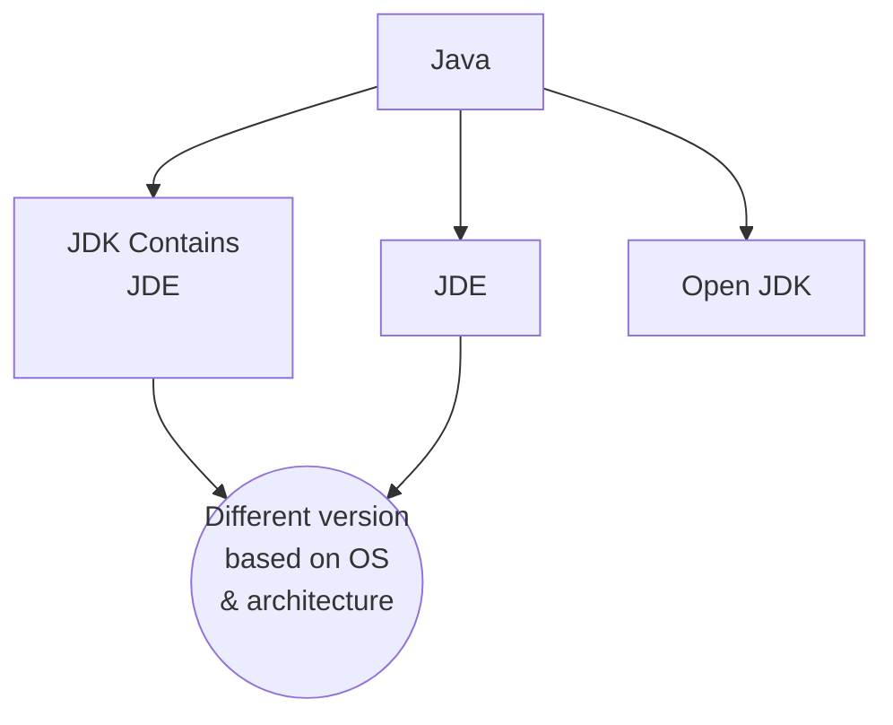

- Basic development system for Java is called as **JDK**
- Java comes in two version
    - Development kit version: ***JDK***
    - Runtime environment version: ***JDE***
    - Runtime only allow you to run already compiled java programs and it doesn’t allow you to compile your program
    - A development kit on the other hand comes with runtime environment it self.
    - Now IDE contains this development kit (JDK by default)
- **JDK** is not open source and used for commercial purpose only
- **OpenJDK** can be use for the education purpose
- **JDK** comes in different version based on the OS and type of CPU (or architecture like intel and AMD i.e x86 CPUs, M1 macs uses `aarch64`)
- For Linux you can easily install **OpenJDK** using the usual software manager for your distribution (apt or snap for ubuntu)
- To use java and `javac` command you first need to put bin directory from **OpenJDK** directory to the `PATH` environment variable or use full path to java and `javac` binary

### Command Line Environment

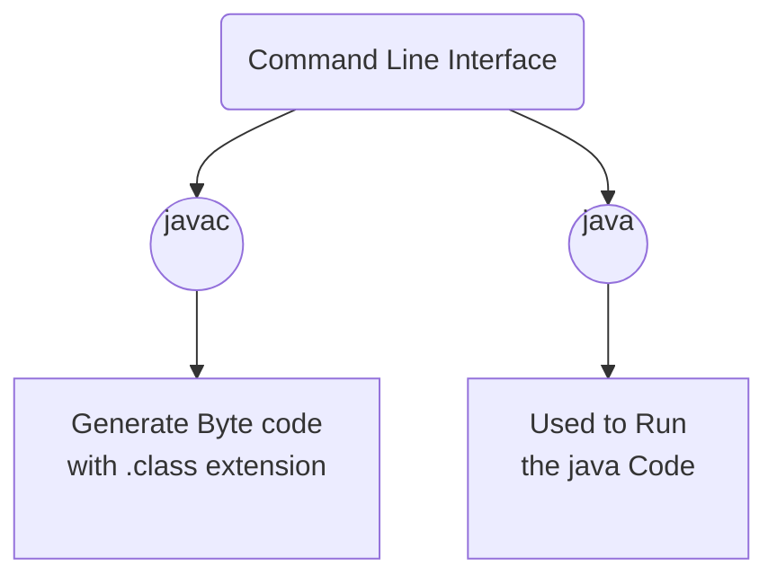

- `javac` command is use to compile the java code and generate `.class` extension files
- `java` command is used to run the java code
- After this you must run using `java filename` (without extension)

### The Problem of Packages

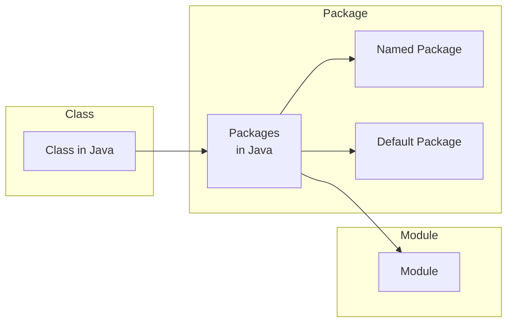

- Every class in java is contained in something called **package**
- All the Java’s standard classes are in **named packages**.
- This include even classes like `String` and `System`, which are in a package called `java.lang` are automatically imported into any Java file
- But classes in other package must be imported using `import` directive

<aside>
📌 Classes that are not put into any package belongs to `default` package

</aside>

## Topic 2: - Blocks, Loops, Branches, if, switch and exceptions

Java is a free format language and thus there are no syntax rule for formatting the code on the page

### Blocks and Loops

- We can also have blocks in Java.
- All the variable or work done in blocks are removed from the memory as soon as the block end is reached
- Two ways to control the flow of the program using *loops* or using *if* conditions
- Loops
    - While loop: You will never find a while loop standing by itself, and thus it must be inside some function
- The Basic if condition

```java
if (conditions) {
    statement 1 
}
else {
    statement 2
}
```

- Basic algorithm design and how to proceed to solve a problem, like solving the simpler version, look for invariants
- Coding, Testing and Debugging
    - Bugs : semantic errors that shows up the incorrect behaviour
- Do while statement
    
    ```java
    static void factorial (int target) {
        long fact = 1;
        do {
                fact *= target--;
        } while (target > 0);
        System.out.println("Factoial " + fact);
    }
    ```
    
- `break` and `continue`

<aside>
📌 You can also have the **name tagging** to the loop and thus break and continue can be associated with the specific loop..

```java
bigloop: while (i < n) { 
    j = 0; 
    while (j < m) { 
        if (s1.charAt(i) == s1.charAt(j)) { 
                break bigloop; 
        } 
    }
}
```

</aside>

- For statement (Standard for loop)
    
    ```java
    for (int i = 0; i < n; ++i) { 
        System.out.println("i = " + i);
    }
    ```
    
- Enhanced for Loops
    
    ```java
    for (String name: names) {
        System.out.println(name);
    }
    ```
    
- Nested For loops
- Branching if conditions, multiway branching
- Switch statement
    
    ```java
    switch (cur) {
        case JAN:
            System.out.println("Yes it is Jan!");
            break;
        case FEB: 
            System.out.println("No, It is Feb");
        default:
            break;
    }
    ```
    
- You can also use Enum in the switch case
- Exceptions and `try..catch`
    - We can catch the error at the runtime and then we can handle those, instead just simply allowing program to crash
- Note exceptions are those events which can be handle
- Exception in Java are represented by as objects of type Exceptions
- Array declaration

```java
int [] arr = new arr[10];  // one dimensional array
int [][] arr = new arr[10][20]; // Two dimensional array
```

### Topic 3: - Subroutine, parameters, return - API, Packages, and Javadoc - Program design (precondition, post-condition)

- Subroutines in java can be **static** and **non-static**
- A subroutine is a named group which bind together instruction specific to a given task
- Subroutines are the **black box** and abstraction to the details
- An interface which must be straightforward to interact

### Static subroutines and Static variables

- Every subroutines in Java must be inside some class
- Subroutines are grouped into named classes (and classes are grouped into named packages)
- Static and non-static subroutines
    - Static routines are attached to the class
    - Non-static routines are attached to the objects
- A subroutines that is in the class or object is often called a method
- `public static void main(String[] args)`
    - `public` is access specifier: If public then can be used outside the class, else not
    - `static` refer that function can be called without creating an instance of the class
    - `void` is the return type of the function
    - `main` is the name of the function (or subroutine)
    - `(…)` contains the list of parameters which need to be passed to the function. Parameters are an interface to this black box
- **Calling subroutines is simple**
    - For static you can call using `className.subroutine_name(params…);`
    - But Note that this subroutine must be pubic in order to call from outside
- **Member variables**
    - They are also called as global variables. There are different from the local variables which are declared inside the subroutines.
    - The reason is because we have this naming convention
    - Similar to static routines you can also have static member variables
- **Throwing Exceptions**
    - Exceptions are object
    - You can also throw these object if you while handling some situation
    - Ex. `throw new IllegalArgumentException(“some random text”);` and then you can handle this in `try...catch`

### **Global and Local variables**

- There are three kind of variables that can access inside a subroutine
    - Local variable declared inside the subroutine
    - Parameters passed to the subroutine
    - Static/global variable declared outside the subroutine
    - If param type are primitive, then any change to those inside the subroutine has no effects, but in other case they have effects
    - A global variable if it `public`, then it can be used by other classes as well
- **Return value**
    - A subroutine that returns a value is called as function
    - A given function can only return a value of a specific type i.e return type
    - Return statement doesn’t have to be the last statement in the function

### Lambda Expressions

- Ability to make it possible to work with subroutine just like
- This represents a value of type `function`
- Later we will se functional interface for the type of function, where this can help say if you want to assign a lambda function to a variable.

<aside>
💡 Also note that **lambda** **expression** not only represents the functions but also represents the subroutine

</aside>

```java
// FunctionalInterfaceDemo.java
package Java8;

@FunctionalInterface
public interface Converter<F, T> {
    T convert (F from);
}

// returns the first character of the string s
class Something {
    public static String startWith(String s) {
        return String.valueOf(s.charAt(0));
    }
}

// a private class person with firstname and lastname property 
class Person {
    String firstName; // default access (will be discussed later in these notes)
    String lastName; // default access 

    Person() {}

    Person(String firstName, String lastName) {
        this.firstName = firstName;
        this.lastName = lastName;
    }
    public String getFirstName() {
        return this.firstName;
    }
}

// private interface PersonFactory 
interface PersonFactory<P extends Person> {
    P create(String firstName, String lastName);
}

public class FunctionalInterfaceDemo {
    public static void main(String[] args) {

        // Case 1.
        Converter<String, Integer> converter = (from) -> Integer.valueOf(from); 
        // This is a body to the convert function in the interface
        // here we are providing that as a lambda expression 
        Integer val = converter.convert("23");
        System.out.println("the value is = " + val);
        // Case 2.
        // Or you also have a second choice, which is to reference a function method
        // and this can be done using :: 
        Converter<String, Integer> converter2 = Integer::valueOf; // Integer is a Java builtin class and valueOf is a class method
        System.out.println(converter2.convert("28"));

        // Case 3.
        Converter<String, String> something = Something::startWith; 
        // reference to a self defined class method
        System.out.println(something.convert("K"));
    
        /**
         * How Does :: work in case of constructor ? 
         */
        PersonFactory<Person> personFactory = Person::new;
        Person person = personFactory.create("R", "K");
        System.out.println(person.getFirstName());
    }
}
```

```java

// LambdaScopeDemo.java
package Java8;

import Java8.FunctionalInterfaceDemo.*;

class Lambda4 {
    static int outerStaticNum;
    int outerNum;
    void testScopes() {
        Converter<Integer, String> stringConverter1 = (from) -> {
            outerNum = 23;
            return String.valueOf(from);
        };
        Converter<Integer, String> stringConverter2 = (from) -> {
            outerStaticNum = 72;
            return String.valueOf(from);
        };
        String val = stringConverter1.convert(2);
        String val2 = stringConverter2.convert(3);
        System.out.println("val " + val + "val2 = " + val2);
    }
}

public class LambdaScopeDemo {
    static int outerStaticNum;
    int outerNum;
    /**
     * @param args
     */
    public static void main(String[] args) {
        final int num = 1;
        Converter<Integer, String> stringConverter 
                                                = (from) -> String.valueOf(from + num);
        System.out.println(stringConverter.convert(2));
        /**
         * Note that If you want to use any thing from the
         * outer environment like variable, then those must
         * need to be final (constant). If they are not
         * then your code will not compile
         * There is concept of Capturing variable in java lambda function
         */
        Lambda4 obj = new Lambda4();
        obj.testScopes(); 
    }
}
```

### Function Interfaces

- A functional interface in Java are designed to used as lambdas, where you can define a method behavior directly without having to a whole new class to implement it
- A functional interface define specify the information for one subroutine
- A functional subroutine is similar to a java class, and it can be defined in a .java file, just like a class
- However note that it’s just content is for a single subroutine
    
```java
public interface FunctionR2R { 
    double valueAt(double x);
}
```
    
- The above code would be in the file named FunctionR2R.java
- It specify a function called as valueAt with one param
- Java also comes up with many standard functional interfaces. One of the most important and simple is Runnable, which is already define in `java.lang`
    
```java
    public interface Runnable {
        public void run();
    }
```

```java
public class Main {
    public static void main(String[] args) {
        Runnable myRunnable = () -> { 
                for (int i = 0; i < 3; ++i) {
                    System.out.println("hello from the runnable");
                }
        };
        Thread thread = new Thread(myRunnable);
        thread.start(); // run method of Runnable get executed once thread.start() get called
    }
}
```
    
- There are several other kind of interface in java, for now we will only focus on functional interfaces as they are important to understand the lambda function in Java
- The name of functional interface is a type just like we have `int`, `String` e.g `Runnable myRunnable;`

<aside>
📌 So, this means it can be used to **declare variables** and **parameters** and to specify the **return type** of a function

</aside>

- When a type is a functional interface, a value of that type can be given to a lambda expression
- The lambda expression in a anonymous function, but it does have the formal parameters and as well as the definition `() -> {}`

<aside>
💡 Parameters type can be omitted, if you think that they can be **self-deduced**

```java
FunctionR2R sqr; 
sqr = (double x) -> {return x * x;}; 
sqr = (x) -> x * x; 
sqr = (x) -> {return x * x;}; 
sqr = x -> x * x; 
sqr = (double fred) -> fred * fred; 
sqrt = (z) -> z * z;
```

</aside>

- Now in Java `sqr` is not quite a function. It is a value of type `FunctionR2R`, which means that it contains a function named valueAt, a specified in the definition of interface `FunctionR2R`. The full name of that function is `sqr.valueAt`, and we must use the full name to call the function

<aside>
💡 Note that brackets for params are not optional if they are more than one params

</aside>

- Things get more interested when you can use these lambda expression as an actual parameters, which is the most common use in practice
    
```java
static double sum (FunctionR2R f, int start, int end) { 
    double total = 0; 
    for (int n = start; n <= end; ++n) { 
        total += f.valueAt(n); 
    } 
    return total; 
} 
System.out.println(sum(x -> x *x, 1, 100)); 
System.out.println(sum(num -> Math.pow(2, num), 1, 10));
```
    
- Suppose that we have a subroutine that performs a given task several times. The task can be specified as a value of type Runnable
    
```java
static void doSeveralTimes ( Runnable task, int repCounts ) { 
    for (int i = 0; i < repCount; ++i) { 
        task.run(); 
    } 
}
    
doSeveralTimes(()-> System.out.println(“hello world!”), 10);

doSeveralTimes(()-> { 
    int count = 5 + (int) (21 * Math.random()); 
    for (int i = 1; i <= count; ++i) { 
            System.out.println(i + " "); 
    } 
    System.out.println(); }, 
100);
```
    
- We can also return type as these lambda expression
    
```java
static FunctionR2R makePowerFunction (int n) { 
    return x -> Math.pow(x, n); 
}
```
    
- A functional interface has exactly one abstract method. Since default methods have an implementation, they are not abstract

[What are functional interfaces used for in Java 8?](https://stackoverflow.com/questions/36881826/what-are-functional-interfaces-used-for-in-java-8)

- If an interface declares an abstract method overriding one of the public method of `java.lang.Object`, that also doesn’t count towards the interface abstract method count since any implementation of the interface will have an implementation from `java.lang.Object` or elsewhere
- To be more precise, you have to have *exactly one* abstract method that **doesn’t** override a method in `java.lang.Object` in a functional interface.
- ✅ Correct method
    
```java
public interface Foo {
    public void something();
}
```
    
- ❌ Wrong way
    
```java
public interface Foo {
    public void doSomething();
    public void domeSomethingElse():
}
```
    
- But the below will give the compilation error
    
```java
@FunctionalInterface 
public interface foo {
    public void doSomething();
    public void doSomethingElse();
}
```
    

### Method Reference

- Shorthand in Java to make your code more concise, especially when you are working with lambda expression
- Say if we want to have `x -> Math.sqrt(x)`
- Making this as square root doesn’t make sense, so we can directly pass method references
    
    ```java
    System.out.println(sum(Math::sqrt, 1, 100) );
    ```
    
- **Static Method Reference**
    
```java
ClassName::staticMethodName
// lambda expression
list.forEach(s -> System.out.println(s));
// method reference
list.forEach(System.out.println);
```
    
- **Instance Method Reference**
    
```java
list.forEach(someObject::someMethod);
```
    

### APIs, Packages, Modules, and Javadoc

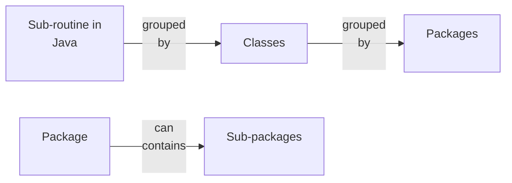

- Java standard packages like all subroutines in java, the routine in the standard API are grouped into classes. To provide large-scale organisation, classes in Java can be grouped into packages
- A package can contains both classes and packages
- A package that is contain within package is called sub-package
- One of the su- packages of java, for example, is named `util.` Since util is contained in java, its full name is actually `java.util`
- The package util contains variety of classes like scanner

java → lang → util → io Math `sqrt()` Scanner File `random()` `nextInt()` Socket `String` `nextDouble()` `Integer` Timer Data

### Using classes from the packages

`import java.util.*;` 

The `*` is a wildcard that matches every **class** in the package, however it doesn’t match with the **sub packages**, It is ok to use wildcard, but its better to practice use specific classes, this also avoid the duplicate class name which might be used in different packages

<aside>
🚨 NOTE: You can not import the entire contents of all sub packages of the java package by saying `import java.*.`

</aside>

<aside>
🟢 But the package of `java.lang` are so important, thus they are by ***default imported*** into java files

</aside>

It’s as if every program began with the statement import java.lang.*;

This is why we are capable to use `java.lang.String`, `java.lang.Math.sqrt()`. However you can still use the complete path  

<aside>
📌 Programmers can have their own packages e.g package utilities; (This above line must be in the source code file) The source code file is saved in a folder with the same name as the package name Any class which is used in utilities say utilities.net, then that must be in the folder named as net

</aside>

A class that is in package has an **automatic access** to other classes in the same package

- A project where we are likely to have many classes, it’s better to group all those together into a package
- If a class is not specifically placed into any package, then it is placed into a **default package**

### About modules in JAVA

- A **module** is a collection of package - Package is a collection of classes - These modules were introduced with Java 9
- **Reasons** ?
    - Better access control
    - Before modules, a class that is declared `public` can be used anywhere from any class in any package, as can it’s public variable and methods
- For a class that is in module, on the other hand, `public` only automatically mean `public` within the module where it is defined
- However, a module can explicitly exports a package, and once it is exported it make the public classes in the package accessible from anywhere, including from other modules and from classes that are not part of modules
- It is even possible to export a package just to a specified modules, providing an even finer level of access control

<aside>
📌 Thus, now we can have packages which are essentially private

</aside>

- They provide service to other packages in the same module, but invisible from outside of the module
- So `module` is also a black box and any package which is not exported is a part of it’s hidden implementation
- ❓ Another important motivation for module is to have sheer size of standard **JRE (Java Runtime Environment)**, which includes all of standard classes
- A given application will only use a small part of the standard runtime
- Modularisation makes it possible to construct smaller, custom JREs that contain only the modules required by an application
    - **JDK** included `jlink` command for make custom runtimes, which can include modules that define an application as well as the standard modules that are required to run that application
    - The runtime then can be distributed as a standalone application that can be executed even by people who have not installed JDK on their computer
    - But just as for the JDK itself, different version of the custom runtime will be needed for window, macOS, and for linux
    - Furthermore, if there are any security updates made to JDK, they are not automatically applied to custom runtimes
    - Compiled classes file from the standard modules are stored together in a file named modules inside a directory lib in the main JDK directory
    - This is so called as `jimage file` and there is also a command line tool to work with these `jimage` file
    - If you use `jlink` tool to create a custom runtime, part of what it does is to create a custom modules file containing just the modules that are required during runtime
    - In JDK directory also has a subdirectory named `jmods` that contains the modules in another form (however they are not used for compiling and running programs they are mostly used by `jlink`)

### Javadoc

- To use an API effectively, you need good documentation for it

<aside>
💡 **JAVA APIs** is prepared using a system called **Javadoc**

</aside>

- Javadoc documentation is prepared from special comments that are placed in java source code file. Normal comments begin with `/* */`, but javadoc begin with `/**` rather than simply `/*`.
- This must be prepared before the subroutine that it is commenting on
- All these comments are ignored by the java lang, but there is a tool called javadoc that reads Java source code files, extract any Javadoc comments that it finds, and creates a set of Web pages that containing the comments in a nicely formatted, interlinked form

<aside>
✅ By default javadoc will only pick public classes into docs

</aside>

- If javadoc doesn’t contain information then it will construct one, but the comments will contain only basic information such as the name, return type and parameters list of a subroutine
- Also comments can contain the html commands
- In addition to HTML commands, Javadoc comments can include doc tags, which are processed as commands by the javadoc tool
- A doc tag has a name that begins with the character @
    - `@author`
        - Can be only use for a class and followed by the name of author
    - `@param`
        - Info about params
    - `@return`
        - Info about return type
    - `@throw`
        - And exception that it might throw

<aside>
🟢 These tags must be placed at the end of the comments

</aside>

- The description can extend to several lines
- This subroutine computes the area of a rectangle, given its width and its height. The length and the width should be positive numbers. A sample description
    
    ```java
    /**
    @param width the length of one side of the rectangle
    @param height the length the second side of the rectangle
    @return the area of the rectangle
    @throws IllegalArgumentException if either the width or the height is a negative number.
    */
    public static double areaOfRectangle( double length, double width ) { 
            if ( width < 0 || height < 0 ) 
                    throw new IllegalArgumentException(“Sides must have positive length.”); 
                    double area; area = width * height; return area; 
    }
    ```
    

### Static Import

- To refer static member you have to use the class name
- For those parts which are not static, you can still work smoothly and without writing long statements, ex. `Scanner (java.util.Scanner)`
- But what about `System.out` ? and other static members like `Math.sqrt`
- There are another type of imports directive that can be used to import the static members of a class in the same way that the ordinary import directive imports classes from a package
- That form of imports is called ***static imports***
    
    ```java
    import static ..;
    ```
    
- To import all public static members of a class
    
    ```java
    import static ..* ;
    ```
    
- **Example** `import static java.lang.System.out;` then you can use simple name out instead of `System.out,` this mean that you can use `out.println` instead of `System.out.println()`
- If you are working extensively with math class, then `import static java.lang.Math.*;`
- But note that this required you to have the package name, even for the classes in the standard package i.e `java.lang`

<aside>
ℹ️ So one consequence of this is that what if you don’t have the package name, i.e what happen to the default package? Yes you are right, you can’t do static imports there.

</aside>

- More on program design
    - [ ]  PENDING

### Declaring variable with var

- In **java11**, there is a new way to declare variables using the keyword `var`
- Also if you are declaring using var, then you must give the variable an initial value
- A variable declared with `var` have a defined type, just like any other variable
- The java compiler uses the type of initial value to define the type of that variable
    
    e.g `var interestRate = 0.05;`-- var converted to double
    

### Named Constants (final keyword)

- Sometimes some variables are not suppose to changed after it is initialised
    - `public final static double interestRate = 0.05;`
- It is legal to apply final modifier to local variables and to formal parameters and even to class and subroutine
- Ex. `Math.PI, PI` is defined `public final static`
- Enumerated type constants are also example of named constant `enum Alignment {LEFT, RIGHT, CENTER}`
- The main reason to name the constants so that we can change their value from single point if required later

### Naming and Scope Rules

- **Scope**: The portion of the program source code where the variable is valid is called scope
- For `static` member the scope is straightforward.
- The scope of a static subroutine is the entire source code of the class in which it is defined
- This allow to call the subroutine even before object is defined/declared
- It is possible to call a subroutine from it’s inside (“recursion”)
- Example
    
    ```java
    public class Game { 
            static int count; // member variable 
            static void playGame() { 
                    int count; // local variable . . 
                // Some statements to define playGame() . 
        } 
            // More variables and subroutines. . 
    }
    ```
    
- Local variable `count` makes the count which is member variable hidden inside the `playGame()`
- But still we can use `Game.count` to refer to the static variable

<aside>
📌 In Java, there is one exception, which might not be other language You can’t use the argument param or any local variable, declared even inside a nested loop

```java
void badSub(int y) {
    int x;
    while (y > 0) {
        int x; // ERROR: x is already defined.
        ...
        ...
    }
}

 // The above is an ERROR in java
```

</aside>

- But if scope of `x` is inside a while loop, once it scope goes, you can still use the same variable name in another while loop

<aside>
📌 NOTE : It is completely perfect to have param name and subroutine name same

</aside>

## Topic4: - Object and classes

### Topics to cover

- Inheritance and polymorphism
- This and Super
- Interfaces
- Nested classes
- Anonymous inner class

### Object and classes

- A subroutine can represent a single task, but an object can encapsulate both data in form of variable and number of different tasks or **behaviours** related to the data
- **OOPs** represents an attempt to make programs more closely model the way people think and deal with the world
- In OOPs instead of task, we find objects
    - Task are set of instructions, where as object are entities which have behavior
- To some extent OOPs is change in POV

### Object, classes and instances

- Classes **describes** objects, more precisely **non-static part of class defines object**
- A kind of **factory or blueprint** to produce object
- Objects are **created or destroyed** as program runs, and there can be many object of same type

<aside>
📌 Memory for static variables are allocated by class, and they are shared by objects, whereas non-static variables get separate copies in each of their

</aside>

- An object that is created from a class is called an **instance** of that class
- **Static method** and **variable** are some time also called **class variable** and class methods

### Fundamentals of Objects

- Note that, declaring a variable does not create an object!
- This is an important point, which is related to the very important Fact
    
    <aside>
    📌  In Java, no variable can ever hold an object. A variable can only hold a reference to an object
    </aside>
    
- You should think of objects as floating around independently in the computer’s memory. In fact there is special portion of memory called as **heap**
- Instead of holding the object itself, variable only hold the necessary information to find the object in the memory
- This information is called **reference** or **pointer**
- In effect, reference to an object is the address of memory location where the object is stored.
- Objects are created using `new` operator (not routine/method, it is an operator) e.g `std = new Student();` the variable std refers or points to the object
- It is possible for a variable like std, whose type is given by a class, to refer to no object at all.
- We say in that case std holds a null pointer or null reference
- The `null` pointer in java is written as null
- You can store `null` reference in the variable std by saying `std = null;`
    
    <aside>
    📌 `null` is an actual value that is stored in the variable, not a pointer to something else
    
    </aside>
    
- It is not correct to say that variable **points to null** - since there is no object and hence no instance variable to refer it!
- So if `std` is `null`, it is illegal to access any variables from the type of std

<aside>
📌 When one object variable is assigned to another, only reference is copied, the object referred is not copied.

</aside>

- When we write `std2 = std;`You can test **object equality** by using `==`, `=!` .
- So basically `==` in object check, whether **location is same or not**
- It don’t check the value, so if you have string to compare then `str == “HELLO”` will not work, `str.equals(“HELLO”);`

<aside>
📌 But we can still check the null equality

</aside>

- **So what happen if a variable is of type final** ❓
    - This means the content of variable cannot change, and what does a variable of some class-type contains, location or reference to the actual object (if not null), so location is now constant, but still we can change data only reference can’t be change

### Static Factory Method vs Objects

```java
package com.oracle.app;
/**
 * A static factory method has some advantages and disadvatanges over the constructor
 * 1. Unlike constructor they have name 
 * 2. 
 */
class Demo {
    public static Boolean valueOf(boolean b) {
        return b ? Boolean.TRUE : Boolean.FALSE;
    }
}
public class App 
{
    public static void main( String[] args )
    {
        System.out.println("Hello World!");
        Boolean obj1 = Demo.valueOf(false);
        Boolean obj2 = Demo.valueOf(false);
        System.out.println(obj1.equals(obj2));// true

    }
}
```

Advantages of using Static factory 

1. They have name, but the constructor don’t have name
2. Unlike constructor it can return the same instance again and again, where as a constructor always open a new object as soon as it is invoked

### Getters and Setters

- Making members of `class` `public`, make them accessible outside
- Privates are only accessible within the class
- Allowing setters and getters make it possible to access these variables
- Name of getter must be prefix with `get` + “rest_name”and yes same for setter `set` + “rest_name”

<aside>
📌 Setters are mutators

</aside>

### Arrays and Objects

```java
list = new int[3];
list[1] = 7;
newlist = list;
newlist[1] = 42;
System.out.println(list[1]);
```

- Arrays are object in Java, they can also hold objects
- The value that is copied into subroutine is the not the content, but just the reference
    
    ```java
    import java.util.Arrays;
    class Test
    {
        public static void main (String[] args) 
        {
            int arr1[] = {1, 2, 3};
            int arr2[] = {1, 2, 3};
            if (Arrays.equals(arr1, arr2))
                System.out.println("Same"); // yes this will output
            else
                System.out.println("Not same");
        }
    }
    ```
    
- Thus any change to the array, will be made persist, even if subroutine ends
    
    ```java
    Student[] classlist; classlist = new Student[30]; 
    for (int i = 0; i < 30; ++i) { 
            classlist[i] = new Student(); 
    }
    ```
    

### Constructor and Object Initialization

- **Initialising Instance Variables**
    - Object type are different from primitive type in Java
    - Objects are explicitly constructed, where as for primitive it is not the case
    - The process of constructing an object means, first, finding some unused memory in the heap that can be used to hold the object, and second, filling the object instance variable
    - We don’t worry about the memory location where it is stored, but for us the concern to init the value of the object
    - For static variable, you must init them inside the class, because that is the first time when they are getting the memory, and it’s better to init them at that point of time
    - Else they will get default value
    - The default value is `null` (In particular, for string object)
- **Constructors**
    - Objects are created with operator `new`
        
        ```java
        PairOfDice dice; 
        dice = new PairOfDice();
        ```
        
    
    <aside>
    📌 Note that `PairOfDice()` looks like a subroutine call, and this no surprising we are indeed calling a special type of subroutine called **constructor**
    
    </aside>
    
    - But there is no such subroutine in the class, so how ?
        - System is providing a default constructor
    - **Default constructor**, allocate memory and init with default value
    
    <aside>
    📌 The name of constructor must be same as the name of class
    
    ```java
    public class PairOfDice {
         public int die1; 
         public int die2;
         public PairOfDice(int val1, int val2) { 
                die1 = val1; 
                die2 = val2; 
         }
    }
    ```
    
    </aside>
    
    - There is no return type to constructor and same name as the class
    - Now we can call `dice = new PairOfDice(1, 1);`
    - We can have as many as constructor of an objects, just keep the signature same
    - Constructors are subroutines, but of special types
    - They are not the instance method, since they don’t belong to the object
    - They are more like static member of class, but they are not and cannot be defined static
    
    <aside>
    📌 In fact, according to the Java language specification, they are not the member of class
    
    </aside>
    
    - Unlike another subroutine, a constructor can be only called by the operator
        
        ```java
        public Student { 
                    private String name; private int ID;
              private static int nextUniqueID = 0;
        
              Student (String theName) {
                  name = theName;
                  nextUniqueID++;
                  ID = nextUniqueID;
              }
          }
        ```
        
    
    <aside>
    💡 Although, the above code looks safe and you might think that it will always generate the unique id for each student, but that is not completely true. Yes, it is true, when you have just a single thread running
    
    </aside>
    
    - **What if we have multiple threads running ?**
        - In that case you might end-up with two or more students with the same id.
        - So parallel programming is difficult and there are lot of cases to look for

### Garbage Collection (TODO : GKCS)

- What about destroying objects ?
    - In Java destruction take place on it’s own
- If there are no variables that refers to an object
- Java uses procedure called garbage collection to reclaim memory occupied by objects that are no longer accessible to a program
- Handling all these by programmer can cause lot of issue like **dangling pointer** problem or it could lead to **memory leak**

### Programming With Objects

- Object Oriented Analysis and Design (OOAD)
- Some **built-in classes**
    - A good programmer remember and practice built-in classes
    - Most of the problems are already solved here and you should use these
- The class `OBJECT`
    - Main feature of OOP is the ability to created subclasses of a class
    - Every class in java is a subclass of other class
    - The method `equal(obj)` is defined in `class Object` i.e `obj1.equals(obj2)`
    - The string class overrides this method for string
    - The instance method in Object class `toString()` returns a `string`

### Object Oriented Analysis and Design (OOAAD)

- Why to reinvent the wheel for each new project, when you can reuse the component from previous project
- In OOPs, we can make subclasses from a class, and then creates more reusability

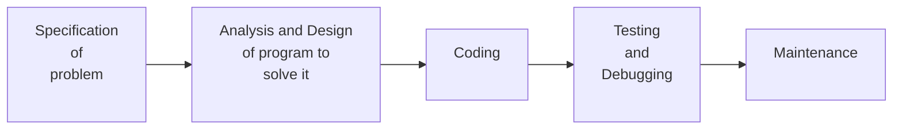

- A large programming project goes through multiple stages
These all stages together are referred as the Software life cycle
    1. Specification of problem
    2. Analysis and Design of program to solve it
    3. Coding
    4. Testing and Debugging
    5. Maintenance
- The systematic approach to programming, using accepted principles of good design is called software engineering
- The software engineer tries efficiently construct programs that verifiably meet their specification
- OOPs is relevant at the stage of coding (program development). But there are Object oriented methodology for analysis and design

<aside>
📌 **Identifying noun as classes and verbs as the method from the problem specification is important**

</aside>

### Inheritance, Polymorphism and Abstract Class

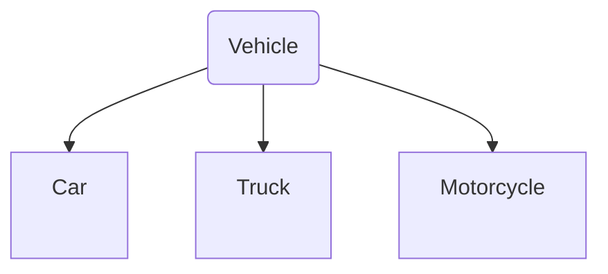

- A class represents a set of objects which shares the same **structure** and **behaviour**
- If object shares some, but not all, of their structure and behaviour.
- Such similarities can be expressed using **inheritance** and **polymorphism**
- `public class extends  { … // changes and additions }`
- One more access specifier which is known as **protected**, which comes into picture once we started talking about the subclass
- Protected are open to all the subclass which are (direct or indirect) of the class in which it is defined, but it can’t be used in non-subclasses
- A protected member can also be accessed by any class in the same package as the class that contains the protected member

<aside>
📌  A variable that can hold the reference to an object of `class A` can also hold a reference to an object belonging to any subclass of  `A`

</aside>

- `Vehicle myVehicle = new Car();` variable `myVehicle` hold the reference to a subclass instance `car`
- The object **remembers** that it is in-fact a `Car`, not just a `vehicle`

<aside>
🟢 Information about the actual class of that object is stored as part of information about that object

</aside>

- Also you can validate instance belong to which class `if (myVehicle instanceOf Car)`, whereas `myCar = myVehicle`, is **invalid** ❌, since myVehicle can be of any other vehicle type
- If for some reason you know that myVehicle only refers to car. Then you can perform typecast `myCar = (Car)myVehicle`

<aside>
💡 Note brackets are important since **`.`** has higher precedence as compare to typecast `((Car)myVehicle).numberOfDoors` The parenthesis becomes necessary before accessing `numberOfDoors`

</aside>

- If you do wrong typecast then compiler will throw you errors
- `ClassCastException` is thrown in case typecasting is not valid

### Singleton Class in Java

- An object which can only have one instance any given point of time
- Useful in some scenario, where you want to restrict the number of object creation from a given class
- To do so
    - **Make the constructor private**
    - **Write a static method inside that has return type object of this singleton class. Here is the concept of lazy init is used to write this static method**

<aside>
📌 **Early initialization** - The object creation take place at the load time. **Lazy initialization** - The object creation is done according to the requirement

</aside>

```java
class SingletonClass {
    private static SingletonClass instanceExists = null;
    public String s;

    private SingletonClass() {
        s = "hi I am a string part of singleton class";
    }

    public static synchronized SingletonClass getInstance() {
        if (instanceExists == null) {
            instanceExists = new SingletonClass();
        }
        return instanceExists;
    }
}

public class ExampleSingletonClass {
    public static void main(String[] args) {
        SingletonClass obj1 = SingletonClass.getInstance();
        SingletonClass obj2 = SingletonClass.getInstance();

        System.out.println(obj1.hashCode() + " and " + obj2.hashCode());
        if (obj1 == obj2) {
            System.out.println("the both objects are same");
        }
        else {
            System.out.println("Not same");
        }
    }
}
/*
Output
1365202186 and 1365202186
the both objects are same
*/
```

### Polymorphism

- Same function but with different purpose, during inheritance, we might have a method/sub-routine, which could be define differently for different subclasses
    
    ```java
    class A {
        int a, b, c;
    
        **public void add(int x, int y)**
        {
            a = x;
            b = y;
            System.out.println("addition of a+b is:" + (a + b));
        }
    
        **public void add(int x, int y, int z)**
        {
            a = x;
            b = y;
            c = z;
            System.out.println("addition of a+b+c is:" + (a + b + c));
        }
    
        public void print()
        {
            System.out.println("Class A's method is running");
        }
    };
    ```
    

### Abstract Class

- An abstract class is one that is not used in constructing objects, but only as a basis of making subclasses
- An abstract class exists to represents the common properties of the classes
- A class that is not **abstract** is called as **concrete**
- You can create object related to concrete classes, but not related to the abstract classes
- `Redraw()` method in Shape class is an example of abstract method
- `abstract void redraw();` - syntax to define and tell the system that this is a abstract method

<aside>
📌 Any class that is not a subclass of any class is made as subclass of object class, which essentially means every class is an subclass of some class ?

</aside>

```java
public class myClass {…
// is extended to
public class myClass extend Object { ...
```

> This means `Object` class is at the top in the hierarchy
> 

> Semantically Object is not declared as abstract class, which means that you can create object of **`Object`** class. However, there is not much you can do with that class
> 

### Final method and classes

- `final` modifiers make it impossible to assign a new value to variable, once it is init (during the construction of the class)
- A `final` class cannot be used as the subclass, then it not possible to extend that class, else you will get error
- Also if you make a method `final`, then it is not possible for all the subclass to have the same method with the same signature
- Thus `final` gives you guarantee, if you can that method then you are always sure that only that method will get call

### This and Super

- Two variables - `this` and `super` (automatically defined in any instance method or **constructor**)
- The special variable **THIS**
    - self in python == this in java == this in cpp
        
        ```java
        public class Student { 
            private String name; 
            public Student(String name) { 
                    this.name = name; 
            } 
        }
        ```
        
- There are some other purpose of this
    - Sometimes you are writing an instance method, you need to pass the object that contains the method or subroutine, as an actual parameter

<aside>
📌 `super` refers to the **superclass**

</aside>

- The reason to use `super` is to access the items which are hidden in the class
- E.g accessing a variable from the superclass, if subclass also have a variable with the same name (although it will surely have)

<aside>
📌 The variable in subclass **doesn’t replace** the variable of same name is superclass; it merely hides it. This hiding is referred as **overriding.**

</aside>

- Let’s say you want to add some additional feature to existing function in super class, then
    
    ```java
    public class GraphicalDice extends PairsOfDice { 
                public void roll() { 
                    super.roll(); // same code call from the parent redraw(); 
                // additional feature 
        } 
    }
    ```
    

### Super and This as Constructor

<aside>
📌 Constructors are not inherited

</aside>

- If you `extends` an existing class to make a subclass, the constructor in the superclass don’t become part of subclass
- If you want constructors in subclass you have to define those new
- But if you don’t define you will get a default constructor, which is not a good thing
- Also, if your superclass is doing lot of work during construction you have to repeat that in the subclass
- In worst case you might not have the code for superclass
- So, to call the constructor of the superclass you have to use the special keyword known as super, you first call `supper(argument list)`

<aside>
📌 Note that this must be the first line, it can’t be placed anywhere

</aside>

- You can use the special variable known as `this` to call another constructor in a given class. Say if you have 5 different constructor, and from **one of the constructor you want to call another constructor**
    
    ```java
      public Work(int row, int col, int a, int b);
      public Work() {
          this(42, 42);
      }
      public Work(int row, int col) {
          this(row, col, 16, 16);
      }
    ```
    
- This will save your effort to repeat the code and reduce potential bugs in the code

### Interfaces

- Multiple inheritance allows a class to make two or more class superclass (C++ allow this)

<aside>
📌 Multiple Inheritance is not allowed in Java (not carrying problems of cpp)

</aside>

- However, java do have a feature that can be used to accomplish many of the same goal as multiple inheritance
- Interfaces
    - **Functional interfaces** (lambda function) we have already seen
- There are lot of standard interfaces in java package

```java
package Java8;

interface Formula {
    double calculate(int a);
    default double sqrt(int a) {
        return Math.sqrt(a);
    }
}
public class InterfaceDemo  {
    public static void main(String[] args) {
        Formula formula = new Formula() {
            **@Override**
            public double calculate(int a) {
                return sqrt(a * 100);
            }
        };
        System.out.println(formula.calculate(400));
        System.out.println(formula.sqrt(400));
    }
}
```

<aside>
📌 Check out the annotation **`@Override`**

</aside>

### Defining and Implementing Interfaces

- Interface in java consists of set of instance method interfaces, without any associated implementation
    
    ```java
    public interface Strokeable { 
            public void stroke (GraphicalContext g); 
    }
    public class Line implements Strokeable { 
            public void stroke (GraphicalContext g) { 
                … // do some implementation 
        } 
    }
    ```
    
- So, we can note few things, the class which implements interface use the special keyword named `implements`
- We say an object implements an interface if it belongs to a class that implements an interface
- While a class an only extend to one class, a class can implement any number of interfaces
- In fact a class can have both `extends` and `implements`
    
    ```java
    class FilledCircle extends Circle implements Strokeable, Fillable {
        // do something
    }
    ```
    
- The point is like that interfaces are not classes, yet they are more like in feature an **abstract class** can provide
- Although an **abstract-class** can contain **non-abstract methods**
- An interface must contains **public** and **abstract method**
    - In fact, there is no option, it is not necessary to specify either of the modifier in the declaration

<aside>
💡 An interface is like a **pure abstract class**

</aside>

- This is also a convenient way to define **name constants** that can be used in class
    
    ```java
    public interface ConversionFactors { 
            int INCHES_PER_FOOT = 12; 
            int FEET_PER_YARD = 3; 
            int YARD_PER_MILE = 1760; 
    }
    ```
    
- Note that in particular that any variable that are defined in an interface is a constant. It’s not really a variable at all.
- An interface cannot add **instance variables** to the classes that implement it
- Apart from the syntax related to interface, you should also worry about the syntactically meaning of methods define inside the interface
- The interface definition must includes comments to express the meaning, and classes that implements the interfaces must read those comment to implement those methods

### Default Methods

- From Java8, **interfaces** can contain `default` methods
- Default method has an implementation, it can have body
- Essentially, default methods are inherited just the way classes extends the default implementation from the parent class/superclass
    
    ```java
      public interface Readable {
          public char readChar();
          **default** public String readLine() {
              StringBuilder line = new StringBulider();
              char ch = readChar();
              while (ch != '\n') {
                  line.append(ch);
                  ch = readChar();
              }
              return line.toString();
          }
      }
    ```
    
- A concrete class that implements this interface must provide an implementation for `readChar()`
- But the definition of `readLine()` will get inherited
- `readChar()` definition is implemented by the class which `implements` the interface `Readable`

### Interfaces AS Types

- Even though you can’t construct an object from interface, you can declare a variable whose type is given by the interface
- Say if class named Line implements `Strokeable`
    
    ```java
    Strokeable figure; 
    figure = new Line(); 
    figure.stroke(g); 
    figure = new Circle(); 
    figure.stroke(g);
    ```
    
- A variable of type `Strokeable` can refers to any object of any class that implements the `Strokeable` interface
- In java, a type can be class an interface any 8-primitive built-in types
- Of, course however classes can be used to construct new objects
- We can also have array type of `Strokeable`
    
    ```java
    Strokeable [] listOfFigures; 
    listOfFigures = new Strokeable[10]; 
    listOfFigures = new Line(); 
    listOfFigures = new Circle(); 
    listOfFigures = new Line();
    ```
    

### Auto Closeable Interface

- 

### Nested Classes

- In Java, one class can be nested inside another class
- Small trivial classes are build to support work for large classes
- Nested classes can be either named or anonymous
- Interfaces can also be nested inside the class

### Static Nested Class (TODO)

- Not associated with object
- There is nothing private to the outer class, even if the variables are marked as private
- Static Nested class can only access the static members of the outer class and can’t access the non-static (instance variable or methods) of the outer class
    
    ```java
    public class OuterClass {
        private static int outerData = 10;
        static class NestedClass {
            void display() {
                System.out.println("data from the outer class" + outerData);
            }
        }
    }
    ```
    

### Nested Inner Class

- Inner class are **non-static**
- Thus it become associated with the object
- It can access any private instance variable of the outer class
- Like class, we can also have an interface nested
- Note the syntax to create **`new Outer().new Inner();`**

```java
class Outer {
    class Inner {
        public void show() {
            System.out.println("In a nested class method");
        }
    }
}

class Main {
    public static void main(String[] args) {
        Outer.Inner in = new Outer().new Inner();
        in.show();
    }
}
```

<aside>
📌 After Java 16 you are allowed to have static member in inner class also

</aside>

### Anonymous Inner Class

- Without any name
- They are created in two ways
    - As a subclass of the specified type
    - As an implementer of a specific interface

Method 1

```java
import java.util.*;

class Demo {
    void show() {
        System.out.println("The is Demo class");
    }
}

class AnonymousClassExample {
    static Demo d = new Demo() {
        void show() {
                super.show();
                System.out.println("I am Anonymous class");
        }
    };

    public static void main(String[] args) {
        d.show();
    }
}

/* Output
The is Demo class
I am Anonymous class
*/
```

Method 2

```java
interface Hello {
    void show();
}

class AnonymousClassExample {
    static Hello h = new Hello() {
        public void show() {
            System.out.println("I am an anonymous Class");
        }
    };
    public static void main(String[] args) {
        h.show();
    }
}

```

- Most use case of these inner class comes up when we have **callbacks** and **Event Handlers** in GUI

### Method Local Inner Class

- A class can be inside a subroutine definition
- Such classes are local classes
    
    ```java
    class Outer {
            void outerMethod() {
                    int x = 98;
                    System.out.println("inside outerMethod");
                    class Inner {
                            void innerMethod() {
                                    System.out.println("x= " + x); 
                                    // allowed after JDK 1.8, before that it is not 
                                    // allowed to access non-final variable of outer method
                            }
                    }
                    Inner y = new Inner();
                    y.innerMethod();
            }
    }
    class MethodLocalVariableDemo {
            public static void main(String[] args) {
                    Outer x=new Outer();
                    x.outerMethod();
            }
    }
    ```
    

### Access Modifiers in Java (Four)

There are four type of access specifiers modifiers available in Java


- **Default**
    - When no access specifiers for a class, method or data member - It is said to having the **default** access specifier
    - Only accessible within the same package
    
    ```java
    // Java program to illustrate default modifier 
    package p1; 
    
    // Class Geek is having Default access modifier 
    class Geek 
    { 
        void display() 
        { 
            System.out.println("Hello World!"); 
        } 
    }
    ```
    
    This will lead to the compile time error
    
    ```java
    // Java program to illustrate error while 
    // using class from different package with 
    // default modifier 
    package p2; 
    import p1.*; 
    
    // This class is having default access modifier 
    class GeekNew 
    { 
        public static void main(String args[]) 
        { 
            // Accessing class Geek from package p1 
            Geek obj = new Geek(); 
    
            obj.display(); 
        } 
    }
    ```
    
- **Private**
    - Only accessible within the class
- **Protected**
    - Accessible within same package or subclasses in different packages
        
        ```java
        package p1;
        
        public class A {
            protected void display() {
                System.out.println("hi");
            }
        }
        ```
        
        This will work, since we are extending the class A in another package
        
        ```java
        package p2;
        import p1.*;
        
        class B extends A {
            public static void main(String[] args) {
                B obj = new B();
                obj.display();
            }
        }
        
        // output : hi
        ```
        
- **Public**
    - Access everywhere

### Non-access Modifiers in Java

- **Static**
    - Used for memory management
    - Used to share the same **variable** or **method**  or **block** or nested **class** (applicable for the following)
        - Static blocks
            
            ```java
            class Test {
                static int a = 10;
                static int b;
                static {
                    System.out.println("Static block init");
                    b = a * 4;
                }
                public static void main(String[] args) {
                    System.out.println("from main");
                }
            }
            // output 
            // Static block init
            // from main
            ```
            
        - Static Classes
            - Only Nested classes are allowed to by static
            - Nested Static classes more precise
    - Belongs to class rather than instance
    
    <aside>
    📕 Interesting property about static keyword
    
    - Can’t access the non-static members
    - Can be overloaded(same name but with different parameters) but can’t be overridden
    - Associated with class not objects
    - Accessible without object instantiation
    - Shared memory allocation
    </aside>
    
- **Final**
    - value can’t be modified
    - convention is use capital letters only
- **Synchronized**
    - Synchronization is java is provided using mutual exclusion, which means that exclusive access is provided to each variable
    - A method is declared to be synchronized by adding the reserve keyword synchronized as a modifier to the definition of the method
        
        ```java
        public class ThreadSafeCouter {
                private int count = 0;
                synchronized public void increment() {
                        count = count + 1;
                }
                synchronized public void getValue() {
                        return count;
                }
        }
        ```
        
- **Transient**
    - Used in serialization
    - If we don’t want to save a value into file then we use transient
    - Say if we have password and while serializing we don’t that particular field to written to file while serializing we can do so using transient
- **Volatile**
    - Say if are threads running on different cores then they might have different copy of the same sharedObj
    - If one thread changes it will only appear in the local copy of that core and will not be visible to the other core
    - Although cache coherency is common in hardware now, but still a programmer you might not want to rely on the hardware for the work
    - Synchronized in Java provides both visibility and mutual exclusion
        - Visibility - It means that changes made by one thread to shared data are visible to other threads
        - Mutual Exclusion - It means only one thread or process can execute a block of code at a time
    - But sometimes we might not need mutual exclusion and might be only need visibility
    - This make sure that value will never get cached
    
    ```java
    class SharedObj {
        static int sharedVar = 6;
    }
    ```
    
- **Native**
    - The method is implemented in native code using JNI (Java Native Interface)
    - The native modifier indicates that a method is implemented in platform dependent code, often seen in C language
    - Main objective of native keyword
        - To improve the performance of the system
        - To achieve machine level/memory level communication
        - To use already existing legacy non-java code

### General OOPs concept in Java

### Java Inheritance

- **Is-a relationship**
    - Car is a vehicle
    - Orange is a fruit
    - SDE is an Engineer
    - Dog is an Animal
- Allow you to create a new class from the existing class
- The new class that get created is called sub-class (child or derive class)
- And the class from which this derivation is done is called super class or parent class
    
    ```java
    class Animal {
        public void eat() {
            System.out.println("I can eat");
        }
    }
    
    class Dog extends Animal {
        @Override
        public void eat() {
            System.out.println("Dog can eat");
        }
        public void bark() {
            System.out.println("Dog is barking");
        }
    }
    
    ```
    

### Abstract Class in Java

- We can’t create object of an abstract class
    
    ```java
    abstract class Language {
        //
    }
    ```
    
- We can extend the abstract class, but we can’t create the objects
- An abstract method doesn’t have any body in general
    
    ```java
    abstract class Language {
    
      // method of abstract class
      public void display() {
        System.out.println("This is Java Programming");
      }
    }
    
    class Main extends Language {
    
      public static void main(String[] args) {
        
        // create an object of Main
        Main obj = new Main();
    
        // access method of abstract class
        // using object of Main class
        obj.display();
      }
    }
    ```
    
    ```java
    abstract class MotorBike {
      abstract void brake();
    }
    
    class SportsBike extends MotorBike {
        
      // implementation of abstract method
      public void brake() {
        System.out.println("SportsBike Brake");
      }
    }
    
    class MountainBike extends MotorBike {
        
      // implementation of abstract method
      public void brake() {
        System.out.println("MountainBike Brake");
      }
    }
    
    class Main {
      public static void main(String[] args) {
        MountainBike m1 = new MountainBike();
        m1.brake();
        SportsBike s1 = new SportsBike();
        s1.brake();
      }
    }
    ```
    

### Abstract Keyword in Java

The main use of abstract classes in java is to have a structure for the subclasses and to ensure that certain methods are implemented in a consistent way across all subclasses (or it is a contract)

- Abstract is a non-access modifier in Java application for classes, methods but not variables
- It is used to achieve abstraction in OOPs
- Characteristics of Java abstract keyword
    - Abstract classes can’t be initialized
    - Abstract method have no body
    - Abstract class can have both concrete or abstract method
        - For the use of subclasses
    - Abstract class can have constructor
        - Typically called by the concrete subclasses
        - Never got call by any instance (since we can’t create)
    - Can contain instance variables
        - For internal purpose or for the use of subclasses
    - Can implements interfaces
        - Provided concrete implementation of all the methods of the interface

```java
abstract type methodName(parameter-list);
```

Rules for the Abstract classes in Java

- Any class that contains one or more abstract methods must also be declared as abstract
- Illegal combinations
    - final, abstract native, abstract synchronized, abstract static, abstract private
    - The purpose of final is to prevent the inheritance, where as abstract class completely depend on the child class for the implementation
    - In case of method final is used to prevent overriding where as abstract method need to be overwritten in sub-class

**How abstract is different from the interface ?**

- A class can extend only one class, but can implements multiple interfaces
- Access modifier can be there in the classes (abstract), but with interfaces everything is public always
- Variables can be present in the abstract class, but not in interface
- All method in interface are by default abstract, whereas in case of abstract class it is not necessary

### Wrapper Classes in Java

- Wrapper classes are final and immutable
- Two main concepts are in wrapper classes
    - **AutoBoxing** - converting a primitive type into object
    - **Unboxing** - converting object into primitive type
- Object are needed if we wish to modify the arguments passed into a method (because primitive types are passed by value)
- An object is also needed to use synchronization while Threads
- Apart from the above there are lot of utility available

### Java Nested Static Class

- In Java only nested classes are allowed to be static
- A static class can included static and non-static fields and methods
- We can’t access the non-static method of outer class from the inner static class
- We can access the static members without creating an instance of a class. We can access them simply by using their class name
- Also instance of static nested class can be created without creating the instance of outer class

```java
class Animal {
    static class Mammal {
        public void displayInfo() {
            System.out.println("I am Mammal");
        }
    }
    public void eat() {
        System.out.println("Eating...");
    }
}

class Main {
    public static void main(String[] args) {
        Animal animal = new Animal();
        Animal.Mammal mammal = new Animal.Mammal
        mammal.displayInfo();
    }
    // mammal.eat() // is an error
}
```

- Although you can’t have top level static class in Java but you can simulate a static class like this
    - Declare your `final`  Prevent extension of class since extending a static  class makes no sense
    - Make the constructor `private` Presents init from a client code
    - Make all member functions `static` Since class can’t be init and thus no instance method can be called, so no purpose to keep things non-static
    
    <aside>
    📌 Note that compiler will not prevent from declaring an instance member. This will only show up if you try to access that instance member
    
    </aside>
    
    ```java
    package Classes;
    import Classes.MyStaticClass;
    
    public class StaticClassExample {
        public static void main(String[] args) {
            MyStaticClass.setMyStaticMember(5);
            System.out.println("Static value: " + MyStaticClass.getMyStaticMember());
        }
    }
    ```
    
    ```java
    package Classes;
    
    public final class MyStaticClass {
        private static int myStaticMember;
        private MyStaticClass() {
            myStaticMember = -1;
        }
        public static int getMyStaticMember() {
            return myStaticMember;
        }
        public static void setMyStaticMember(int val) {
            myStaticMember = val;
        }
    }
    ```
    
    <aside>
    📌 A great example is the `Math` class that contains some mathematical constants such as `PI` and `E` and simply provides mathematical calculations. Requiring instantiation in such a case would be unnecessary and confusing
    
    </aside>
    
- A class `Foo` with only `static` methods is not the same as `static class Foo`

<aside>
🟢 Static means something which is initialized only once (eg. main function). There sole purpose is allow to called member function without getting instance first. They are different from the abstract classes, because abstract classes are there for extending and subclasses provide implementation.

</aside>

### Throwable Class in Java

- Superclass of all every error(abnormal break - `OutOfMemoryError`, `StackOverflowError`) and exception(checked or unchecked) in the Java language
- Only object of that are one of the subclasses this class are thrown by any Java Virtual Machine
- `Throwable` class is the root class
- This class is inherited by two further classes `Exception` and `Error`
    
    ```java
    public class Throwable extends Object implements Serializable 
    ```
    
- Public constructor of this class
    1. **`Throwable()` -** null as the detailed message
    2. **`Throwable(String message)`** 
    3. **`Throwable (String message, Throwable cause)`**
    4. **`Throwable (Throwable cause)`**
- Protected Constructors
    1. `Throwable (String message, Throwable cause, boolean enableSuppression, boolean writeStackTrace)` 

```java
import java.io.*:

class Demo {
    
}
```

### Marker Interfaces in Java

1. **Cloneable Interface**
    
    ```java
    import java.lang.Cloneable;
    
    class A implements Cloneable {
        int i;
        String s;
        public A (int i, String s) {
            this.i = i;
            this.s = s;
        }
        @Override
        protected Object clone() throws CloneNotSupportedException {
            return super.clone();
        }
    }
    
    public class Test {
        public static void main(String[] args) throws CloneNotSupportedException {
                A a = new A(20, "HI");
                A b = (A)a.clone();
                System.out.println(b.i);
        }
    }
    ```
    
2. **Serializable Interface**
    - Makes an object eligible for saving into a file
        
        ```java
        import java.io.*;
        
        class A implements Serializable {
            int i;
            String s;
            public A (int i, String s) {
                this.i = i;
                this.s = s;
            }
        }
        
        public class Test {
            public static void main(String[] args) 
                throws IOException, ClassNotFoundException {
                    A a = new A(20, "hi");
                    FileOutputStream fos = new FileOutputStream("demo.dump");
                    ObjectOutputStream oos = new ObjectOutputStream(fos);
                    oos.writeObject(a);
                    
                    FileInputStream fis = new FileInputStream("demo.dump");
                    ObjectInputStream ois = new ObjectInputStream(fis);
                    A b = (A)ois.readObject();
                    oos.close();
                    ois.close();
            }
        }
        ```
        
3. **Remote Interface Depreciated feature**
    - Presents in `java.rmi` package
    - A remote object is stored at some machine and accessed from another machine
    - We need to flag it using Remote interface
    - `java.rmi` package is depreciated in the presence of other remote communication method like web services or RPC
        
        ```java
        import java.rmi.*;
        
        public interface Search extends Remote {
                public String query(Stirng search) throw RemoteException;
        }
        ```
        

## Topic 5 - GUI part

Graphics, Paining, Mouse events, timer & keyword events basic components, layout, menus and dialogs

## Topic 6: - Array, Dynamic array, linked list, searching, sorting, multi-dimensional arrays

```java
for (String name: namelist) {
        System.out.println(name);
}

for (var item: itemArray) {
    int[] intList = new int[10];
}
```

### **Variable Arity Methods**

- Before **Java5**, everything need to have fixed arity
- **Java5** introduced variable arity method
- An example of `System.out.println()` is an example definition `public static double average (double… numbers)`
- Here, the `…` after the type name, `double`, is what makes an variable arity method
- This means any number of `double` parameters can be provided to `average` of `double` type
- The values corresponding to the variable arity type variable are placed in the array
    
    ```java
    for (int i = 0; i < number.length; ++i) { 
            sum = sum + number[i]; 
    }
    
    int[] primes = {2, 3, 5, 7, 11, 13, 17, 19};
    int[] primes = new int[] {2, 3, 5, 7, 11, 13, 17, 19}
    ```
    

### **Array Processing**

```java
B = Array.copyOf(A, A.length)
Array.fill(array, value)
Array.fill(array, fromIndex, toIndex, value)
Array.toString(array)
Array.sort(array)
Array.sort(array, fromIndex, toIndex)
Array.binarySearch(array, value)
```

### **Dynamic Arrays**

```java
import java.util.ArrayList;

public class Main {
    public static void main(String[] args) {
        // Creating an ArrayList of integers
        ArrayList<Integer> numbers = new ArrayList<>();

        // Adding elements to the ArrayList
        numbers.add(10);
        numbers.add(20);
        numbers.add(30);

        // Accessing elements
        int firstNumber = numbers.get(0);
        System.out.println("First number: " + firstNumber); // Output: 10

        // Modifying an element
        numbers.set(1, 25);

        // Removing an element
        numbers.remove(2);

        // Iterating over the ArrayList
        for (Integer number : numbers) {
            System.out.println(number);
        }
    }
}
```

### **Parameterized Types in Java with example of ArrayList**

- Do we need a different class for each type ? No java, provides something called as **parameterized** type
- `ArrayList` and in fact `ArrayList` for any object of type `T`
- The type parameter `T` must be an object type such as class name or interface name It can’t be primitive type.
- This mean unfortunately, you can not have an `ArrayList` of `int` and `char`
- ArrayList is allowed, since `String` is an object
- `list.add(obj), list.get(index), list.set(idx, obj); list.clear(), list.remove(idx); list.remove(obj); list.indexOf(obj)`
- Benefits of using parameterized type is that you can detect most things at the compile time rather than waiting for any runtime failures and can prevent potential bug
    
    ```java
    import java.util.ArrayList;
    
    public class Main {
        public static void main() {
            ArrayList<String> myStrings = new ArrayList<>();
            myString.add("hello");
            myString.add("world");
            
            String firstString = myString.get(0);
            System.out.prinln("First string is " + firstString);
            for (String str: myString) {
                System.out.println(str);
            }
        }
    }
    ```
    

### Programming  with ArrayList

```java
import java.util.ArrayList;

public class ReverseWithArrayList {
    ArrayList<Integer> list;
    list = new ArrayList<Integer>();
    while (true) {
        int number = TextIO.getInInt();
        if (number == 0) {
            break;
        }
        list.add(number);
    }
    for (int i = list.size() - 1; i >= 0; --i) {
        System.out.println("%10d\n", list.get(i));
    }
}

// Also in loop control variables we can have same primitive type, because of unboxing

for (Double num: numbers) {
    if (num != null) {
        sum = sum + num;
    }
}
```

### Two Dimensional List and ArrayLists

- A sample program which is using **Two dimensional List** and using **iterator** as well as **enhanced for loops**
    - Key Points - List is an interface implemented by ArrayList
    
    <aside>
    📌 Also Note that `Arrays.asList()` returns a fixed sized array and thus not mutable, if you try to change then you will get *run time exception* i.e `UnsupportedOperationException`
    
    </aside>
    
    ```java
    import java.util.ArrayList;
    import java.util.Arrays;
    import java.util.List;
    import java.util.Iterator;
    
    public class IntegerIterator {
        public static void main(String[] args) {
            // Nested List
            // List is an interface, which is implemented by ArrayList, 
                    // LinkedList, Stack, Vector, ..
            List<List<Integer>> nestedList = new ArrayList<>();
            // Arrays is a class in java.util which provide static method like asList
            nestedList.add(Arrays.asList(1, 2, 3));
            nestedList.add(Arrays.asList(4, 5));
            nestedList.add(Arrays.asList(6));
            
            // Iterator type of variable hold the .iterator() return by the List
            Iterator<List<Integer>> outerIterator = nestedList.iterator();
            
            // On iterator you have two main method i.e next() 
                    // -> returns the value
            // hasNext() return boolean true or false 
            // Until outer iterator has next element
            while (outerIterator.hasNext()) {
                List<Integer> innerList = outerIterator.next();
                Iterator<Integer> innerIterator = innerList.iterator();
                while (innerIterator.hasNext()) {
                    System.out.println(innerIterator.next());
                }
                System.out.println(innerList);
            }
            // more optimal (enhance for loop)
            for (List<Integer> innerList : nestedList) {
                for (Integer val : innerList) {
                    System.out.println(val);
                }
            }    
        }
    }
    ```
    

### Interface & Classes - ArrayList, List, AbstractList and Arrays.asList()

- **ArrayList**
    
    ```java
    // filepath : java.util.ArrayList
    public class ArrayList<E> extends AbstractList<E>
            implements List<E>, RandomAccess, Cloneable, java.io.Serializable
    
    // here we override the add method provided by AbstractList
    private void add(E e, Object[] elementData, int s) {
        if (s == elementData.length)
            elementData = grow();
        elementData[s] = e;
        size = s + 1;
    }
    // grow method
    private Object[] grow(int minCapacity) {
        return elementData = Arrays.copyOf(elementData,
                                           newCapacity(minCapacity));
    }
    ```
    
- **ArrayList as subclass in Arrays**
    
    ```java
    // filepath: java.util.Arrays has a subclass ArrayList
    
    private static class ArrayList<E> extends AbstractList<E>
            implements RandomAccess, java.io.Serializable
    ```
    
- **AbstractList**
    
    ```java
    // filepath: java.util.AbstractList<E>
    public abstract class AbstractList<E> extends 
                    AbstractCollection<E> implements List<E> {
    // add method in this file 
    public void add(int index, E element) {
        throw new UnsupportedOperationException();
    }
    ```
    
- **List Interface in Java**
    
    ```java
    public interface List<E> extends Collection<E> { .. 
    ```
    
- **Collection is also an interface**
    
    ```java
    public interface Collection<E> extends Iterable<E> {
    ```
    

### Wrapper Class

- In Java, wrapper classes are a set of classes that allow primitive data types to be treated as object. Each of the eight primitive data type (such as int, char, boolean etc) has a corresponding wrapper class. These class provides methods to convert primitive data types into objects and vice versa
    
    ```java
    String strNum = "123";
    int myInt = Integer.parseInt(strNum);
    
    int maxIntValue = Integer.MAX_VALUE;
    
    Integer n = Integer.valueOf(28);
    ```
    
- But in the above case we have seen that we can’t use primitive type like `int`
- For all those cases we have Wrapper classes `Integer`, `Characters`
- These classes contains the `static` methods `Double.parseDouble()` and `Integer.parseInteger()`
- There are wrapper classes for `Long`, `Short`, `Byte`, `Float`, `Boolean`
- `Integer n = Integer.valueOf(42);`
- The value of `n` has same information as `int`
- You are just wrapping an integer with the object wrapper
- The method `Integer.valueOf()`, each wrapper class has a `static` `valueOf()` method for wrapping a primitive type value in an object
- `Integer.valueOf()` is a static factory method that returns an object of type Integer
- The Integer class also have constructor for creating objects, but it has been depreciated

### **Auto boxing** in Java

Primitive types are automatically converted into wrapper types. This was introduced in Java5

This is true even in the case when you are passing, say if the formal parameter of a function are of type Integer object and if you are passing

```java
ArrayList integerList;
integerList = new ArrayList();
integerList.add(Integer.valueOf(42));
// but because of autoboxing we can write
integerList.add(42);

int num = integerList.get(3)
int num = integerList.get(3).intValue();
```

- There is one issue that sometimes causes problem: A list can hold null values, since it is not primitive
- But the above `int num = integerList.get(3)`, will cause error if at *index 3* we have null
- Example - `Integer myInteger = 42;` Here 42 is primitive type, but is automatically converted to an `Integer` object. This is called auto boxing
- Similarly `int myInt = myInteger;` is an example of unboxing
    
    ```java
    ArrayList<Integer> numbers = new ArrayList<>();
    // Autoboxing: 10 is automatically converted to an Integer object
    numbers.add(10); 
    // Unboxing: Integer is automatically converted to int
    int firstNumber = numbers.get(0); 
    
    ```
    

### Record

- Array have integer index, but record allow names instead of numbers
- They are introduced in Java 15 and they are concise way to model immutable data by combining fields and methods related to those fields
- Similar to `struct` in C, they exists way before the classes and object
- Java `record` in immutable
    
    ```java
    public record Complex(double re, double im) {
        ...
    }
    public final static Complex one = new Complex(1, 0);
    ```
    

### Searching and Sorting

```java
import java.util.Arrays;

public class BinarySearch {
    public static int binarySearch(int[] arr, int target) {
        int left = 0;
        int right = arr.length - 1;

        while (left <= right) {
            int mid = left + (right - left) / 2;

            if (arr[mid] == target) {
                return mid; // Element found at index mid
            }

            if (arr[mid] < target) {
                left = mid + 1;
            } else {
                right = mid - 1;
            }
        }

        return -1; // Element not found
    }

    public static void main(String[] args) {
        int[] arr = {1, 3, 5, 7, 9, 11, 13, 15};
        int target = 7;
        int result = binarySearch(arr, target);
        System.out.println("Element " + target + " found at index: " + result);
    }
}
```

### Two Dimensional Arrays

```java
int [][] A;
A = new int[3][4];
```

## Topic 7: CORRECTNESS AND ROBUSTNESS -

Correctness and Robustness - Problems in java, exception and try..catch, assertion - Threads (mutual exclusion, wait and notify) 

## Topic 8: Linked List and Recursion

- Linked list and recursion - stack, queue, ADT - Binary tree - Recursive Descent Parser - Quiz

### Recursion

- Read above line again
    
    ```java
    static in binarySearch(int[] A, int loIndex, int hiIndex, int value) {
        int (loIndex > hiIndex) {
            return -1;
        }
        else {
            int middle = (loIndex + hiIndex) / 2;
            if (value == A[middle]) {
                return middle;
            }
            else if (value < A[middle]) {
                return binarySearch(A, loIndex, middle - 1, value);
            }
            else {
                return binarySearch(A, middle + 1, hIndex, value); 
            }
        }
    }
    ```
    

### Linked List

```java
class Node {
    String item;
    Node next;
}

Node runner;
runner = head;
while (runner != null) {
    process(runner.item);
    runner = runner.next;
}
```

### Stack

```java
private class StackOfInts { 
 private static class Node { 
        int item; Node next; 
    } private Node top;
    
 public void push(int N) {
        Node newTop;
        newTop = new Node();
        newTop.item = N;
        newTop.next = top;
        top = newTop;
    }
    
    public int pop() {
        if (top == null) {
            throw new IllegalStateException("can't pop from an empty stack");
        }
        int topItem = top.item;
        top = top.next;
        return topItem;
    }
    
    public boolean isEmpty() {
        return (top == null);
    }
}
```

## Topic 9: Generic Programming and Collection classes (TODO)

- Generic programming in Java allows you to create **classes**, **interfaces**, and **methods** that can work with any data type.
- This means you can write code that is independent of the type of data it operates on.
- Generics provide compile-time type safety and help to eliminate the need for explicit type casting.

```java
public class Box<T> {
    private T value;
    public Box (T value) {
        this.value = value;
    }
    public T getValue() {
        return this.value;    
    }
    public void setValue(T newValue) {
        this.value = newValue;
    }
}

public class Main {
    public static void main(String[] args) {
        Box<Integer> intBox = new Box<>(42);
        int value = intBox.getValue();
        Box<String> strBox = new Box<>("hello");
    }
}
```

- You can also have generic methods
    
    ```java
    public class Utils {
        public static <T> void printArray(T[] arr) {
            for (T element: arr) {
                System.out.print(element + " ");
            }    
            System.out.println();
        }
    }
    ```
    
    Here `<T>` is the declaration of type parameter 
    

## Topic 10: I/O Stream, Files and Networking

```
Table of Content -

1. I/O STREAM, READERS, AND WRITERS
2. FILES
3. PROGRAMMING WITH FILES
4. NETWORKING
5. INTRODUCTION TO XML 
6. I/O STREAM, READERS AND WRITERS
```

- A program need to interact with the rest of world, without it is nothing and mostly be useless
- The interaction of a program with the rest of the world is referred as input/output
- There are lot of Input output devices to talk to the system, but it is so complex so we need some really good abstraction
- In Java I/O abstraction are called as I/O streams
- Other I/O abstraction such as `File` and `channel` also exits, but in this section we will look only at streams

### Character and Byte Stream

- **Byte streams**: Byte streams and they are not human readable. There are two abstract classes. These are mainly used when you are writing  such as images, audio, and other non-text data
    1. Input Stream `(FileInputStream)`
    2. Output Stream `(FileOutputStream)`
    
    ```java
    import java.io.IOException;
    import java.io.FileInputStream;
    import java.io.FileOutputStream;
    
    public class ByteStream {
        public static void main(String[] args) [
            try {
                // writing to a file 
                FileOutputStream outputStream = new FileOutputStream("myFile.dat");
                byte[] data = {65, 66, 67, 68, 69}; // ASCII values for A, B, C, D, E
                outputStream.write(data);
                outputStream.close();
    
                //Reading from the file
                FileInputStream inputStream = new FileInputStream("myFile.dat");
                int byteValue;
                while ((byteValue = inputStream.read()) != -1) {
                    System.out.print((char)byteValue);
                }
                inputStream.close();
            } catch (IOException e) [
                e.printStackTrace();    
            }
        }
    }
    ```
    
- **Character Stream** : Human readable format. There are two abstract classes in `java.io` package
    1. Reader (`read()`, `close()`)
    2. Writer (`write()`, `close()`)
        
        ```java
        import java.io.IOException;
        import java.io.FileReader;
        import java.io.FileWriter;
        
        public class CharacterStream {
            public static void main(String[] args) {
                FileWriter writer = new FileWriter("filename.txt");
                writer.write("hello this is a test");
                writer.close();
        
                FileReader reader = new FileReader("filename.txt");
                int character;
                while ((character = reader.read()) != -1) {
                    system.out.print((char)character);
                }
                reader.close();
            } catch (IOException e) {
                e.printStackTrace();    
            }
        }
        ```
        
    
    They are abstract and they provide basic api, which are design by all the classes which extends these classes
    
- To link these we have other class which are used for in between conversion
- UTF-8 is the common encoding technique we use and it is a variable width encoding technique. It is also backward compatible with ASCII. UTF-8 make more frequent letter less bytes as compare to less frequent letter and thus optimize the cost. Also it can support multiple languages.

<aside>
📌 **UTF-8(Uniform Transformation Format)** doesn’t have a byte order issue (unlike UTF-16 and UTF-32), making it suitable for use in network protocol or file format.

</aside>

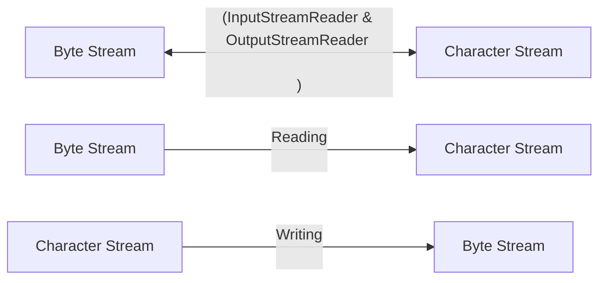

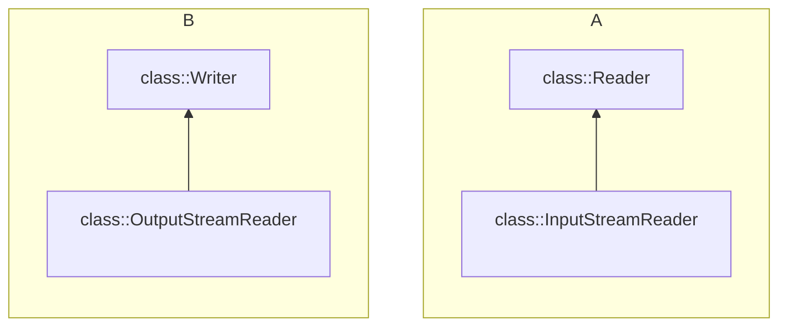

1. `InputStreamReader` inherited from Reader class
    
    ```java
    package Chapter10_IOstreams;
    import java.io.*;
    
    public class InputStreamReaderExample {
        public static void main(String[] args) {
            try {
                // reading bytes
                FileInputStream fis = new FileInputStream("input.txt"); 
                // encoding 
                InputStreamReader isr = new InputStreamReader(fis, "UTF-8"); 
                int charCode;
                while ((charCode = isr.read()) != -1) {
                    char character = (char) charCode;
                    System.out.print(character);
                }            
                isr.close();
            } catch (IOException e) {
                e.printStackTrace();
            }
        }
    }
    ```
    
2. `OutputStreamReader` inherited from Writer class
    
    ```java
    package Chapter10_IOstreams;
    import java.io.*;
    
    public class OutputStreamReaderExample {
        public static void main(String[] args) {
            try {
                FileOutputStream fos = new FileOutputStream("input2.txt", false);
                OutputStreamWriter osw = new OutputStreamWriter(fos, "UTF-8");
                String text = "hello, world!";
                osw.write(text);
                osw.close();
            } catch (IOException e) {
                e.printStackTrace();
            }
        }    
    }
    ```
    
- But note that both are used for raw data reading, they don’t provide any parsing methods, like say if you are reading integer, you will only get the lines in string format only, you have to parse those.
- For that in `java.util` we have very special class named as `Scanner` class, which provide all these high level features and is capable of dealing with input from several kind of streams

### Print Writer

- Extend from the `class Writer`
- It provides convenient methods for writing ***formatted text*** to the output stream
- Belongs to `java.io` package
- `PrintWriter` includes: `print()`, `printf()`, `println()`, all high level methods to write into several output streams
- It also provides the feature of **auto flushing**, data is immediately write as soon it is obtained to the output stream
    - Writing to a **file**
        
        ```java
        try {
            PrintWriter write = new PrintWriter("output.txt");
            writer.println("");
            write.print();
            write.printf("Formated number %d", 42);
            write.close();
        }
        catch (IOException e) {
            System.out.println("Something bad happen during input reading");
        }
        ```
        
    - Writing to **Console**
        
        ```java
        import java.io.PrintWriter;
        
        public class PrintWriterExample {
            public static void main(String[] args) {
                PrintWriter writer = new PrintWriter(System.out);
                writer.println("Hello, World!");
                writer.printf("Formated number :%d", 42);
                writer.close();
            }
        }
        ```
        
    - Appending to a file
        
        ```java
        import java.io.PrintWriter;
        import java.io.FileWriter;
        
        public class PrintWriterExample {
            public static void main(String[] args) {
                try {
                    PrintWriter writer 
                            = new PrintWriter(new FileWriter("output.txt", append=true)));
                    writer.println("Appending Text");
                    writer.close();
                } catch (IOException e) {
                    e.printStackTrace();
                }
            }
        }
        ```
        
    
    Note that you may receive an `IOException`, thus you must need to wrap the code into `try..catch` block
    

### Data Streams

- Stream used to read and write **primitive data,** because they provides some nice method to do so
- These streams provides a way to handle raw binary data, such as reading and writing individual data elements, and are more efficient than character based stream while dealing with non-textual data ✅
1. **DataInputStream** `readInt()`, `readDouble()`, `readBoolean()`, `readUTF()`
    1. This allow you to read primitive data types and strings from an input stream in a machine-independent way 
    
    ```java
    package Chapter10_IOstreams;
    
    import java.io.DataInput;
    import java.io.DataInputStream;
    import java.io.DataOutputStream;
    import java.io.FileInputStream;
    import java.io.FileOutputStream;
    import java.io.IOException;
    
    public class DataStreamExample {
        public static void main(String[] args) {
            try {
                DataOutputStream dos = new DataOutputStream(
                                                    new FileOutputStream("data.dat", false)
                                                );
                dos.writeInt(42);
                dos.writeDouble(3.14);
                dos.writeUTF("Hello, world!");
                dos.close();
    
                DataInputStream dis = new DataInputStream(
                                                            new FileInputStream("data.dat")
                                                        );
                int intValue = dis.readInt();
                double doubleValue = dis.readDouble();
                String stringValue = dis.readUTF();
                dis.close();
                System.out.println(intValue + " " + 
                                                    doubleValue + " " + stringValue);
            
            } catch (IOException e) {
                e.printStackTrace();
            }
        }
    }
    ```
    
2. **DataOutputStream** `writeInt()`, `writeDouble()`, `writeBoolean()`
    
    ```java
    try (DataOutputStream dos = new DataOutputStream(
                                                                new FileOutputStream(filename)
                                                            )) {
        dos.writeln(42);
        dos.writeUTF("hello, Data Streams!");
        dos.writeBoolean(true);
    }
    catch (Exception e) {
        e.printStackTrace();
    }
    ```
    

### Difference between Data Streams and File Streams

| Data Streams | File Streams |
| --- | --- |
| Higher level classes (to write specific data types) | Low level class in java (to write raw bytes) |
| Allow you to read and write primitive data type independent of machine way | Deals with bytes and provides stream to write/read to the files, but they don’t provide method to read the primitive type as such directly  |
| Built on the top of InputStream and OutputStream, readInt(), readDouble(), readUTF(), writeInt(), writeDouble(), writeUTF() | Provides raw methods like read(), write(), read(byte[]), write(byte[])  |

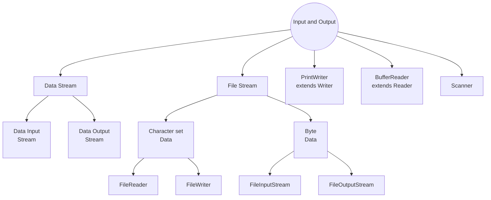

### Buffered Reader (Reading Text)

- From Reader abstract class defined in package `java.io`
- `BufferedReader extends Reader` class and provides efficient reading of text from a character input stream.
- The additional feature that `BufferedReader` provide is an internal storage which is called as buffer
- The buffer reduced the interaction with the input device and it buffer the data and thus read the whole buffer (or some optimized based on application)
    
    ```java
    package Chapter10_IOstreams;
    import java.io.*; 
    
    public class BufferedReaderExample {
        public static void main(String[] args) {
            try {
                FileReader fr = new FileReader("input.txt");
                BufferedReader br = new BufferedReader(fr);
    
                String line;
                while ((line = br.readLine()) != null) {
                    System.out.println(line);
                }
                br.close();
    
            } catch (IOException e) {
                e.printStackTrace();
            }
                    // Reading from the input stream 
            BufferedReader in = new BufferedReader(
                                                                    new InputStreamReader(System.in)
                                                            );
            try {
                String line = in.readLine();
                while (line != null) {
                    System.out.println("The line entered is : " + line);
                    line = in.readLine();
                }
            }
            catch (IOException e) {
                e.printStackTrace();
            }
        }
    }
    ```
    

<aside>
📌 BufferedReader is must faster and efficient because it reads data in chunks rather than one character a time, reducing the number of I/O operations

</aside>

- Buffering (internal buffer) allows for more efficient reading by reducing the overhead of frequent disk reads.

### The Scanner Class

- Java lacks the built-in support for basic input
- The `Scanner` class was introduced to make it easier to read basic data type from character stream input source
- The `Scanner` class is defined in package called `java.util`
- Scanner acts as wrapper for the `Reader`, `InputStream`, a `String`, a `File`
    
    ```java
    package Chapter10_IOstreams;
    
    import java.util.Scanner;
    
    public class ScannerExample {
        public static void main(String[] args) {
            Scanner scanner = new Scanner(System.in);
            System.out.println("Enter you name: ");
            String name = scanner.nextLine();
    
            System.out.println("Enter your age: ");
            int age = scanner.nextInt();
    
            System.out.println("Your name is " + name + 
                                                                    " and your age : " + age);
            scanner.close();
        }
    }
    ```
    
- When processing input, a `scanner` usually work with token
- A token is meaningful string of character that cannot, for the purpose at hand, be further broken down into smaller meaningful pieces e.g in the above example we have two tokens `name` and `age`.
- A `scanner` tokens must be separated by delimiters (by default this is whitespace), else you can set `scanner.useDelimiter(…)`
- `scanner.next()`, reads the next token from the input stream and returns it as `String`
- `scanner.nextInt()`, `scanner.nextDouble()`, and so on - read the next token from the input source and tries to convert it to a value of `int` and `double`
- There are methods for reading values from any of the primitive type
- `scanner.nextLine()` read the entire line from the input source, upto the next end of line character
- All of these method generate exceptions
    - If an attempt is made to read post the end of input, an exception of type `NoSuchElementException` is thrown
    - Method such as `scanner.getInt()`, will throw exception like `InputMismatchException`
- `scanner.hasNext()` boolean value, whether there is a token next or not ?
- `scanner.hasNextInt()`, `scanner.hasNextDouble()` and so no
- `scanner.hasNextLine()` - return boolean value that it is true if there is at-least one more line of input

### Serialize Object I/O

- How to **read/write** objects ?
    - Encoding objects as a sequence of data values belonging to the primitive type, which then can be output as byte stream or character
    - This is called serializing object

<aside>
📌 Streams which provides much convenient way to handle data serializations and deserialization

</aside>

- This means they are used when we have dealt with platform independent format.
- The main data streams in Java are. Both are subclasses of `InputStream` and `OutputStream`
    1. `ObjectInputStream`
    2. `ObjectOutputStream`
- **ObjectInputStream** are used for reading serialized objects from an input stream
    - This allow you to read more complex data structures (e.g objects)
    - From stored stream data, convert back to the object which are comfortable for Java to read
- **ObjectOutputStream**
    - Writing serialized objects to the output stream
    - It allow you to write complex data structure to a stream in a platform independent format, so that they can be later deserialized and reconstruct as objects
    
    <aside>
    🟢 Note in the below example I have used **try-with-resource** in Java, which take out the worry to close the resource
    
    </aside>
    
    ```java
    import java.io.*;
    
    class Person implements Serializable { 
        private String name; 
        private int age; 
    }
    
    public class DataStreamExample {
        public static void main (String[] args) {
          try (**ObjectOutputStream** oos = new ObjectOutputStream(
                                            new FileOutputStream("data.txt")) {
              Person person = new Person("John Doe", 30);
              oos.writeObject(person);
          }
          catch (IOException e) {
              e.printStackTrace();
          }
          try (**ObjectInputStream** ois = new ObjectInputStream(
                                                    new FileInputStream("data.txt")) {
              Person restoredPerson = (Person) ois.readObject();
              System.out.println("Name: " + restoredPerson.getName());
          }
          catch (IOException e) {
              e.printStackTree();
          }
      }
    }
    ```
    
    <aside>
    🚨 WARNING: These streams are optimized to avoid writing the same object more than once. When an object is encountered for a second time, only a reference to the first reference is written. Unfortunately, if the object has been modified in the meantime, the new data will not be written
    
    </aside>
    
    - Thus `ObjectOutputStreams` are more suitable, when you know that data is immutable
    
    <aside>
    📌 String are an example of immutability
    
    </aside>
    

### File - A persistent storage

- Purpose of file is to store the data into persist storage, so that it can survive when there is no power
- `FileReader` and `FileWriter` two subclasses from `Reader` and `Writer`, to read and write the human readable and writable text to the files
- For files storing data in the machine format, we have `FileInputStream`, `FileOutput` Stream
- All these classes are defined in `java.io` package
    
    ```java
    FileReader data;
    try {
        data = new FileReader("data.txt");
    }
    catch (FileNotFoundException e) {
        ...
    }
    ```
    
- `FileNotFoundException` is a subclass of `IOException`
- `FileReader` only provide primitive functionality, but if you need more, you need to wrap up the FileReader with some classes like `BufferedReader`
    
    ```java
    Scanner BufferedReader data;
    try {
        data = new BufferedReader(new FileReader("data.dat"));
    }
    catch (FileNotFoundException e) {
        ... // handle the exception
    }
    ```
    
- Similarly you can construct the
    
    ```java
    try {
        Scanner in = new Scanner(new File("input.txt"));
        while (in.hasNextLine()) {
            System.out.println(in.nextLine());
        }
    } catch (FileNotFoundException e) {
        e.printStackTrace();
    }
    ```
    
- Working with output file : `PrintWriter`

<aside>
📌 Remember to flush, when you are writing, else some portion of data, might not be found on the file. After you are finished, it’s a good idea to close the resource

</aside>

- But note that close can throw `IOException`

<aside>
📌 Also note that calling `close()`, will automatically call the `flush()`

</aside>

### General Scenario:: Scanner for read and PrintWriter and write

- So we will mostly use **Scanner** to read the data and **PrintWriter** to write the data
    
    ```java
    Scanner data;
    PrintWriter result;
    ArrayList number;
    number = new ArrayList();
    try {
        data = new Scanner(new File("data.dat"));
    }
    catch (FileNotFoundException e) {
        System.out.println("Can't find the file");
        return;
    }
    
    try {
        result = new PrintWriter("result.dat");
    }
    catch (FileNotFoundException e) {
        System.out.println("Can't open file results.data!");
        System.out.println("Error : " + e);
        data.close();
        return;
    }
    
    // using java try-with-resource
    
    try (Scanner data = new Scanner(new File("input.txt"));
        PrintWriter results = new PrintWriter("results.dat");) {
        ArrayList<Double> number = new ArrayList<Double>();
        while (data.hasNextDouble()) {
            double inputNumber = data.nextDouble();
            number.add(inputNumber);
        }
        System.out.println(number.size());
        for (int i = number.size() - 1; i >= 0; --i) {
            System.out.println(number.get(i));
            results.println(number.get(i));
        }
        System.out.println("Done!");
        data.close();
        results.close();
    } catch (FileNotFoundException e) {
        e.printStackTrace();
    }
    ```
    

### Files and Directories

- Relative and full path to the file
- While working with command line, only safe to stick to using simple file names only
- It is possible in java program to find out the absolute path names for two important directories
    - `System.getProperty(“user.dir”);` returns the absolute path name of the current directory as a String
    - `System.getProperty(“user.home”);` returns the absolute path name of the user’s home directory as String
- To avoid the problem caused by differences in path names between platform Java has the class `java.io.File`
- `java.io.File` provides platform independent representation of file and path name
- File object has a constructor `new File(String)` that creates a File object from a path name The name can be a simple name, relative path, or an absolute path
- File object contains several useful instance methods
    - `file.exists()`
        - boolean value function return true if the file named by the File object already exists
    - `file.isDirectory()`
        - boolean value function return `true` if the File object refers to a directory
    - `file.delete()`
        - Deletes the files, if it exists. returns a boolean value to indicate whether the file was successfully deleted
    - `file.list()`
        - If file object refers to a directory, this function returns an array of type `String[]` containing the names of the files in that directory
        - Otherwise, it returns `null`
    - `file.listFiles()`
    
    ```java
    package Chapter10_IOstreams;
    
    import java.io.File; 
    import java.util.Scanner;
    
    public class DirectoryList { 
        public static void main(String[] args) { 
            String directoryName;  
            String[] files; 
            Scanner scanner = new Scanner(System.in);
            System.out.println("Enter a directory name: ");
            directoryName = scanner.nextLine().trim();
            **File directory = new File(directoryName);**
    
            if (directory.isDirectory() == false) {
                if (directory.exists() == false) {
                    System.out.println("There is no such directory!");
                }
                else {
                    System.out.println("That file is not a directory");
                }
            }
            else {
                files = directory.list();
                System.out.println("Files in directory");
                for (int i = 0; i < files.length; ++i) {
                    System.out.println(" " + files[i]);
                }
            }
            scanner.close();
        }
    }
    ```
    

### Programming with Files

- Reading from a file
    
    ```java
    source = new FileInputStream(sourceName); 
    copy = new FileOutputStream(copyName);      
    int data = source.read(); // returns a single byte
    copy.write();
    BufferedInputStream(new FileInputStream(sourceName));
    ```
    

### Persistent Data

- Once a program ends, any data that was stored in variables and objects in the program is gone
- The problem is how to make the data persistent between runs of the program ?
- Store data to the file (or some database - but the data in database is also stored in files)
    
    ```java
    PrintWritter(new FileWrite(dataFile))
    ```
    

### Network

- Network is another possible source of input data and where data can be output
- In Java, you can work with network with `inputstream` and `outputstream`
- There are lot of problem in network communication, when you are send data, you may required synchronization
- But fundamentally all these are form of Input/output
- One of the java standard package called `java.net`
- This package include several classes that can be used for networking
- Two different style of network I/O are supported
    
    1 .**Fairly high level,** is based on World Wide Web Provides the sort of network communication capability that is used by a web browser when it download pages from the web to view
    
    - The main class that is used is `java.net.URL`, `java.net.URLConnection`
    - All object of type URL is an abstraction representation of a **Uniform Resource Locator**, which is an address for an HTML document or other resource
    - A **URLConnection** represents a network connection to such a resource
    
    2. **More general** and more important, view the network at lower level 
    
    - Based on the idea of Socket
    - A socket is used by a program to establish a connection with another program on a network
    - Communication over network involves two socket, one on each of the computer involved in communication
    - Java uses a class called `java.net.Socket` to represents socket that are used for network communication
    - Sockets can even connect program running on same machine
    - All these connection use the same physical network connection

### URLs AND URLConnection

- Url class is used to represent resources on www.
- Every resource has an address, which identifies it uniquely and contains enough information for a Web browser to find the resource on the network and retrieve it
- The address is called URL or **Universal Resource Locator**
- An object belonging to such a class URL class, represents such an address
- Once you have a URL object, you can use it to open a `URLConnection` to the resource at that address `url : "https://math.edu/eck/index.html"`
- Note `public URL (String urlName)` throws `MalformedURLException`
- MalformedURLException class is a subclass of IOException, and it requires mandatory exception handling
- Once you have a valid URL object, you can call its `openConnection()` method to setup a connection
- This method returns a `URLConnection`
- The `URLconnection` object can, in turn, be used to create an InputStream for reading data from the resource represented by URL
- This is done by calling getInputStream() method
    
    ```java
    URL url = new URL(urlAddressString):
    URLConnection connection = url.openConnection();
    InputStream urlData = connection.getInputStream();
    ```
    
- Both `openConnection()` and `getInputStream()` methods can throw exceptions of type `IOException`
- Once, you have input stream you can read form it in the usual way, include wrapping in another stream type such as `BufferedReader` or `Scanner`
- And reading from stream, of-course can generate Exceptions
- You can also use `getContentType()` to see the format called a mime type
- **MIME** type includes *"text/plain", "text/html", "image/jpeg", "image/png"* and many others
- All **MIME** type contains two parts
    - General type such as "text" and "image" and
    - Specific type than general category like "html" or "png"

<aside>
💡 **MIME** stands for **Multipurpose Internal Mail Extension**

</aside>

```java
package Chapter10_Networking;

import java.io.BufferedReader;
import java.io.IOException;
import java.io.InputStreamReader;
import java.net.URL;
import java.net.URLConnection;

public class NetworkingExample {
    public static void main(String[] args) {
        try {
            URL url = new URL("http://www.columbia.edu/~fdc/sample.html");
            URLConnection connection = url.openConnection();
            InputStream urlData = connection.getInputStream();
            String contentType = connection.getContentType();
            System.out.println(contentType);

            if (contentType == null || contentType.startsWith("text")) {
                BufferedReader in = new BufferedReader(
                                                                            new InputStreamReader(urlData)
                                                                        );
                while (true) {
                    String line = in.readLine();
                    if (line == null) {
                        break;
                    }
                    System.out.println(line);
                }
                in.close();
            }
        } catch (IOException e) {
            System.out.println("exception " + e);
            e.printStackTrace();
        }
    }
}
```

- `InputStream` is the most basic stream to read the data. It gets the raw data like binary, images, audio or any non-textual data
- And we know that `InputStreamReader` is a bridge between the byte stream data and character-oriented stream. This convert the `InputStream` into character stream based on the encoding
- `BufferedReader` is used to read character from a character-input stream (like `InputStreamReader`) with efficient reading of text (since read in the chunks into the buffer), arrays and lines
- URL can begins with `http`, `https`, `ftp` and `file://` (url that refers the file on your local computer)

### TCP/IP and Client-server architecture

- Communication over internet is based on a pair of protocols called the **Transmission Control Protocol** and **Internet Protocol**, which are collectively referred as **TCP/IP**
- Most basic communication protocol called **UDP (User Datagram Protocol).**  This is also one of core protocol of the Internet Protocol suite (IP) and the other we have seen is the TCP. Some of the feature of UDP are
    - Connectionless
    - Unreliable
    - Low Overhead
    - No Flow Control
    - No Ordered Delivery

### Two way communication in TCP/IP

It’s the ability to two devices to exchange data bidirectionally over a network using the TCP/IP protocol suites

1. **Establishing a Connection**
    - This is also known as Handshake
    - Here basic details of buffer sizes and other info is shared before any communication starts
2. **IP Addressing and Ports**
    - Port is an endpoint referring to a process
    - Every device is uniquely identified by an IP address
3. **Sockets**
    - A socket is a combination of IP address and port number
    - When two devices want to communicate they establish a socket connection
4. **Client-Server Model**
5. **Three-way handshake**
    - **Client sends a SYN message** - Client wants to connection and thus sends
    - **Server Responds with SYN-ACK** - Server is willing to accept new connection ?
    - **Client sends an ACK message** - Client ACK the server response
6. **Data Transmission**
    - Data is divided into small packets
    - Each packets is marked with a sequence number which helps in reassembling the data on the receiving end
7. **Flow control and congestion control**
    - To prevent the congestion control
    - And to make sure that the data overflown doesn’t happen
8.  **Acknowledgment and Retransmission**
    - Required when you want to do worry about the re-transmission
9. **Bi-Directional Data Transfer**
10. **Connection Terminate**
    1. **Client Sends a FIN (finish) message -** Client want to close the connection 
    2. **Server sends an ACK -** Server sends it’s ACK for the client request
    3. **Server sends a FIN message -** Server is also ready to close the connection
    4. **Client send an ACK -** Client ACK the server message

> Two-way communication using TCP/IP is fundamental to various networked applications, including web browsing, email, file transfer, and more. It ensures reliable and ordered data delivery between devices, making it a crucial protocol for modern networking.
> 
- For two programs to communicate using TCP/IP, each program must create a **socket** and those **socket** must be connected
- Once such a connection is made, communication takes places using `InputStream` and `OutputStream`
- The hard part at first is making a network connection in the first place
    - Two sockets are involved
- To starts with one program must create a socket that will wait passively until a connection request comes in from another socket
- The waiting socket is called listening for a connection
- Another program creates a socket that sends out a connection request to the listening socket
- When the listening socket receives that connection request, it responds, and the and connection is established
- Once that is done, each program can obtain an **input stream** and an **output stream** for sending data over connection
- Communication takes places through stream until and unless one of stream get close
- A program that creates a listener socket is sometimes said to be **server** and the socket is called as **server-socket**
- A program that connects to a server is called a **client**, and the socket that is used to create connection is called **client-socket**
- the idea is that the server is out somewhere on the network, waiting for a connection request from some client
- This is called as **client/server** model
- When a client connects to a listening socket in a server of that type, that socket doesn’t stop listening
- Instead, it continues listening for additional client connection request at the same time
- But for multiple connections at the same you either need a **thread pool** 🧵 ****or **async**
- The URL class that we have seen uses a client socket behind the scene to do any necessary network communication
- On the other side of that connection is a server program that accepts a connection request from the URL object, reads a request, for a particular file on the server computer , and responds by transmitting the contents of that file over the network back to the URL object. After transmitting the data, the server closes the connection
- Every computer on internet has IP address which identify it
    - IPv6 = 128 bit
    - IPv4 = 32 bit
- A computer can have several IP addresses, and can have both IPv4 and IPv6 addresses
- Usually, one of the loop back address, which is used when a computer wants to communicate with the program on the same computer
- The loopback address in `IPv4: 127.0.0.1` and can also be referred to using the domain name localhost
- network interface name and ip (network interface name is only useful for the the os)
- A single computer might have several program which are communicating, and thus we requires port numbers
- A port number is **16-bit** positive integers
- A potential client knows both the IP address and port on which server is listening

> A web server, for example, generally listen for connection on port 80
> 
- IP is get known from the domain name

<aside>
📌 NOTE: Only allocate port number after 1024, before this area reserved

</aside>

### Socket in Java

- To implement TCP/IP connections, the `java.net` package provides two classes i.e `ServerSocket` and `Socket`
    
    ```java
    // creating a socket
    Socket socket = new Socket("127.0.0.1", 8080);
    // Getting input and output 
    InputStream inputStream = socket.getInputStream();
    OutputStream outputStream = socket.getOutputStream();
    
    // sending data
    String message = "hello, server!";
    outputStream.write(message.getBytes());
    
    // recieving data
    byte[] buffer = new byte[1024];
    int byteRead = inputStream.read(buffer);
    String receivedMessage = new String(buffer, 0, byteRead);
    
    socket.close();
    ```
    
- A `ServerSocket` represents a listening port that waits for connection from the client
    
    ```java
    // server code
    import java.net.Socket;
    import java.nio.charset.StandardCharsets;
    import java.net.ServerSocket;
    
    import java.io.InputStreamReader;
    import java.io.PrintWriter;
    import java.io.BufferedReader;
    import java.io.IOException;
    
    public class ServerSocketExample {
        public static void main(String[] args) {
            try {
                ServerSocket serverSocket = new ServerSocket(8080, 0, null);
                System.out.println("server is and waiting for connections ...");
                while (true) {
                    Socket clientSocket = serverSocket.accept();
                    System.out.println("Connection established with " 
                                                                                + clientSocket.getInetAddress());
                    
                    BufferedReader reader = new BufferedReader(
                                                                                        new InputStreamReader(
                                                                                            clientSocket.getInputStream()
                                                                                        ), 
                                                                                        8192
                                                                                    ); // size of buffer is 8192
                    String message = reader.readLine();
    
                    PrintWriter writer = new PrintWriter(
                                                                            clientSocket.getOutputStream(), 
                                                                            true, 
                                                                            StandardCharsets.UTF_8);
                    writer.println("Reply To Client:: Server received: " 
                                                                + message);
                    clientSocket.close();
                }
            } catch (IOException e) {
                e.printStackTrace();
            }
        }
    }
    ```
    
    ```java
    // client code
    package Chapter10_Networking;
    
    import java.io.BufferedReader;
    import java.io.IOException;
    import java.io.InputStreamReader;
    import java.io.PrintWriter;
    import java.net.Socket;
    import java.nio.charset.StandardCharsets;
    
    public class EchoClient {
        public static void main(String[] args) {
            try {
                Socket socket = new Socket("127.0.0.1", 8080);
                BufferedReader reader = new BufferedReader(
                                                                                    new InputStreamReader(
                                                                                        socket.getInputStream()
                                                                                    ), 
                                                                                    8192
                                                                            );
                PrintWriter writer = new PrintWriter(socket.getOutputStream(), 
                                                                                true, StandardCharsets.UTF_8);
                String message = "Hello, Server!";
                writer.println(message);
                String response = reader.readLine();
                System.out.println("server reponse: " + response);
                socket.close();
            } catch (IOException e) {
                e.printStackTrace();
            }
        }
    }
    ```
    
- A `socket` represents one endpoint of an actual network connection
- A Socket can be client socket that sends a connection request from a client
- But a Socket can also be created by a server to handle multiple connections requested from a client
- This allow server to create multiple sockets and handle multiple connections
- A `ServerSocket` doesn’t itself participate in connection; it just listens for connection request
    
    ```java
    try { 
            ServerSocket server = new ServerSocket(8080); 
            while (true) { 
                    Socket connection = server.accept(); 
                    provideService(connection); 
            } 
    } catch (IOException e) { 
            System.out.println(“Server shut down with error” + e); 
    }
    ```
    

## Topic 11 - Thread and Multiprocessing

- Modern CPU has multiple cores and thus we may need to write parallel programs to utilize the full potential of a machine
- For Java programmers that means threads
- Learning to manage and control cooperation among threads is the main hurdle that you will face in this chapter
- But before using threads understand their safely, hazards and benefits
- In java a single task is known as thread
- The term thread refers to **thread of control** or **thread of execution** meaning the sequence of instructions that are executed one after another
- Every java program has at least one thread; when the java virtual machine runs your program, it creates a that is responsible for executing the main routine of the program
- The main thread in turn can create multiple threads, which are responsible for handling events
- But a whole new category of problem comes with threads

### Creating and Running Threads

- In Java, a thread is represented by object belonging to the class `java.lang.Thread`
- The purpose of thread class is to execute a single method and to execute it only once
- There are two methods to program the thread
    1. Extends the thread class to a subclass, and define `public void run()` in the subclass. 
    2. This `run()` method defines the task that will be executed in the thread
        
        ```java
        package Threads;
        
        import java.lang.Thread;
        
        public class ThreadExample extends Thread {
            private String name;
            public ThreadExample(String name) {
                this.name = name;
            }
            public void run() {
                for (int i = 0; i < 100; ++i) {
                    System.out.println("Thread is running... " + i);
                }   
            }
        
            public static void main(String[] args) {
                ThreadExample threadExample = new ThreadExample("hello");
                threadExample.start();
            }
        }
        ```
        
- However, creating object doesn’t automatically start the thread running or cause the run() method to be executed
- To do that, you must call the `start()` i.e `greeting.start();`
- The `start()` methods return immediately without waiting for it to terminate
- Notice that `run()` method is different from `start()` method, since `run()` will only invoke from the same running thread and it will not create a new thread
- When a thread calls a subroutine, there is still only one thread of control, which is in the subroutine for a time until the subroutine returns
- When a thread starts another threads, there is a new thread of control that runs in parallel with the original thread of control, and can even continue after the original thread terminates
- Second way is to define a class that implements the `interface java.lang.Runnable`
- The `Runnable` interface defines a single method, `public void run()`
- Given a `Runnable`, it is possible to create a Thread whose task is to execute the Runnable’s `run()` method
- The Thread class has a constructor that takes a Runnable as its parameter. When an object that implements the Runnable interface is passed to the constructor, the run() method of the thread will simply call the `run()` method from the Runnable
    
    ```java
    package Threads;
    import java.lang.Thread; 
    
    public class NamedRunnable implements Runnable {
        private String name;
        public NamedRunnable(String name) {
            this.name = name;
        }
        public void run() {
            System.out.println("Greeintg from the thread..." + this.name);
        }
    
        public static void main(String[] args) {
            NamedRunnable thread = new NamedRunnable("sourav");
            thread.run();
            Thread greetingThread = new Thread(() -> 
                                                                System.out.println("This is lambda thread"));
            greetingThread.start();
        }
    }
    ```
    

Another example to compute the primes

```java
package Threads;
import java.lang.Thread;  

public static class CountPrimesThread extends Thread {
      int id;
      public CountPrimesThread(int id) {
          this.id = id;
      }
      public void run() {
          long startTime = System.currentTimeMillis();
          int count = countPrimes(2, MAX);
          long elapsedTime = System.currentTimeMillis() - startTime;

      }

            public static void main(String[] args) {
              int numberOfThreads = 10;
              CountPrimeThread[] workers = new CountPrimeThread[numberOfThreads];
              for (int i = 0; i < numberOfThread; ++i) {
                  worker[i] = new CountPrimeThread(i);
              }
              for (int i = 0; i < numberOfThread; ++i) {
                  worker[i].start();
              }
              System.out.println("Threads have been created and started");
          }
}

```

### Operation on Threads

A sample program 

```java
CountPrimeThreads[] workers = new CountPrimeThreads[numberOfThreads];
long startTime = System.currentTimeMillis();
```

- `Runtime` class provides information about the environment in which it is running
- This might be useful to decide when you are working with parallel programs, to distributed the work based on number of processors
- `Runtime.getRuntime().availableProcessors()`, returns int which refers to the number of the processors available to Java Virtual Machine. In some cases it might be smaller than the number of processors present on the machine
- `thread.isAlive()` returns a `boolean` value to known whether a thread terminated or working
- `Thread.sleep(milliseconds)`, lets a thread to sleep
- A sleeping thread is still alive, but it is not running
- `Thread.sleep()` can `throw InterruptedException`, which is a checked exception that required mandatory exception handling
    
    ```java
    try {
        Thread.sleep(lengthOfPause);
    } catch (InterruptedException e) {
        e.printStackTrace();
    }
    ```
    
- One thread can **interrupt** another thread to wake it up when it is sleeping or paused for certain other reason
- A thread can be interrupted by calling the method `thread.interrupt()`
- Doing so can be convenient way to send a **signal** from one thread to another
- A thread knows it has been interrupted when it get `InterruptedException`
- Outside any catch handler for the exception, the thread can check whether it has been interrupted by calling the `static` method `Thread.interrupted()`

<aside>
📌 It also has unusual property of clearing the interrupted status of the thread, so you only get one chance to check for an interruption

</aside>

- In our own program thread are not going to interrupt unless you interrupt them
- So most often, you are not likely to need to anything in response to an `InterruptException`
- Sometimes it’s necessary for one thread to wait another thread to die
- This is done with the help of `join()` method from the Thread class
- If another thread call `join` on a thread, then the calling thread goes to sleep until another thread didn’t terminate
- `join(m)` - wait up till **m milliseconds** have elapsed

```java
for (int i = 0; i < numberOfThreads; ++i) {
    worker[i] = new CountPrimesThread();
    worker[i].start();
}

for (int i = 0; i < numberOfThreads; ++i) {
    while (worker[i].isAlive()) {
        try {
            worker[i].join();
        }
        catch(InterruptedException e) {
            // do handling
        }
    }
}
long elapsedTime = System.currentTimeMillis() - startTime;
```

<aside>
📌 Threads have two properties that are occasionally useful

1. **Daemon status**
2. **Priority** 
</aside>

- A thread can designated as daemon thread by calling `thread.setDaemon(true)`
- This must be done before thread starts and it can throw exception of type `SecurityException` if the calling thread is not allowed to modify the thread properties

<aside>
📌 The JVM exists as there are **no** **non-daemon** threads that are alive. That is, the fact that daemon thread is still alive, doesn’t keep the JVM alive

</aside>

- A daemon thread might exists, for example, only to provide some services to some other thread

<aside>
💡 A call `System.exit()` forces the JVM to terminate, even if there are **non-daemon** threads still running

</aside>

- The priority of thread is more important property
    - Every thread has a priority specified using
    - `thread.getPriority()` and `thread.setPriority(n)`
    - Priority can’t be invalid integers, else you will get `IllegalArgumentException`
    - `Thread.MIN_PRIORITY`, `Thread.MAX_PRIORITY`
    - The default priority is given to a thread is `Thread.NORM_PRIORITY`
    - Note that `thread.setPriority(n)` can also throw a exception of type `SecurityException` if the thread that calls the method is not allowed to set priority of thread to the specified value
- There is also a static method to get the reference to the current thread, so that you can change the properties of that thread `Thread.currentThread().getPriority();`
- Synchronization can help in avoiding race conditions, but it introduces new problem called as deadlock
- The real difficulty comes when two thread communicate in some way
- One way that threads interact is by sharing resources
- When two thread need access to same resource, such as variable there can be race conditions
    
    `count = count + 1;` Is a three step process 
    
    ```mermaid
    graph LR
      1[Read Count] --> 2[Increment] --> 3[Updated Back]
    ```
    
- If two threads are running and there is context switch after reading count the final value will become 2 since both thread read 1, instead of the actual answer 3
- The **first thread** is in race to complete all the steps before it is interrupted by another thread
- To fix the problem of race conditions, there has to be some way for a thread to get exclusive access to the shared resources
- This is not a trivial thing to implements, but java provides a high level implementation of this
- It is done by using **Synchronization** methods
- Used to protect the access to a resources
- Synchronization is java is provided using mutual exclusion, which means that exclusive access is provided to each variable
- A method is declared to be synchronized by adding the reserve keyword synchronized as a modifier to the definition of the method
    
    ```java
    public class ThreadSafeCouter {
            private int count = 0;
            synchronized public void increment() {
                    count = count + 1;
            }
            synchronized public void getValue() {
                    return count;
            }
    }
    ```
    
- If `tsc` is type of `ThreadSafeCounter`, then any thread can call `tsc.increment()` to add 1 to the counter in a **complete safe way**
- The fact that increment is synchronized means that only one thread can get access exclusively to the function

<aside>
📌 Remember that synchronization by itself doesn’t guarantee exclusive access. It only guarantee mutual exclusion among all the thread.

</aside>

- However `ThreadSafeCount` class doesn’t provide all possible race condition that might arises when using a counter
    
    ```java
    if (tsc.getValue() == 10) {
            doSomething();
    }
    ```
    
- There can be still race condition here, which occurs if a second thread increments the counter in between the time the first thread test `tsc.getValue() == 10` and the time it calls `doSomething()`
- The synchronization of `ThreadSafeCount` class only provide exclusive access but doesn’t avoid the race conditions
    
    ```java
    synchronized(tsc) {
            if (tsc.getValue() == 10) {
                    doSomething();
            }
    }
    ```
    
- Note that the synchronized statements takes an object - `tsc` in this case, as a kind of parameter
    
    <aside>
    📌 In Java, Mutual exclusion is always associated with an object; We say that the synchronization is ON that object
    
    </aside>
    
- For example, the if statement above is **synchronized on `tsc`**
- The synchronized instance methods, such as those in the `class ThreadSafeCount`, is synchronized on the object that contains the instance method
- In fact, adding synchronized modifier to the definition of an instance method is pretty much equivalent to putting the body of the method in a synchronized statement of the form `synchronized(this) { ... }`
- It is also possible to have static synchronized methods, on the special class object that represent the class containing the static method
    
    <aside>
    📌 Two threads cannot be synchronized on the same object at the same time
    
    </aside>
    

> The real rule of synchronization in java is that:
> 

<aside>
📌 If one thread is synchronized on an object, and a second thread tries to synchronized on that object, it must need to wait

</aside>

- This essentially means that two thread even can’t execute two different method at the same time (same method is too far)
- This is implemented using something called as **synchronization lock**

<aside>
📌 Every object has synchronization lock and that lock can be held by only one thread at a time

</aside>

- To enter a synchronized statement or synchronized method, a thread must obtain the associated object locks
- If the lock is available then thread obtains the lock immediately
- It releases the lock after it finishes the executing the synchronized code

<aside>
💡 Reasoning about invariants becomes much more complex when we are talking about the threads

</aside>

- For `ThreadSafeCounter()` class to have the class invariant that “the value of count is the number of times that `increment()`”
- In a single thread program that is trivially true, however in multiple threaded program we need synchronization make sure that this is true
- A deadlock occurs when a thread waits forever for a resource that it will never get

### Volatile variables

- Synchronization is one way for controlled communication between two threads
    
    ```mermaid
    graph TD
      1[Synchronization] --> 2[Volatile Variables]
        1 --> 3[Atomic Varaibles]
    ```
    
- Two other such techniques
    1. Volatile variables
    2. Atomic variables
- In general, we have seen synchronized methods and statements

> However, synchronization is fairly expensive computationally, and excessive use of it must be avoided
> 
- So in some cases it makes sense for threads to refer to shared variable without synchronizing their access to those variables

<aside>
📌 However, a subtle problem arises when the value of a shared variable is set in one thread and used in another.  Because of the way that threads are implemented in Java, the second thread might read the old value, because **cache** of shared variable is allowed in Java

</aside>

- This means each thread changes the value of a shared variable, the local copies in the caches of other threads are not immediately changed, so that other thread can continue seeing the old value
- It is possible to use a shared variable safely outside of synchronized code, but in that case, the variable must be declared to be `volatile`
- The volatile keyword is a modifier that can be added to a global variable as in `private volatile int count;`

<aside>
📌 If a variable is declared as `volatile` then no thread will keep a local copy of that variable in its cache

</aside>

- Instead the thread will always reads from the original
- Access to volatile variable is less efficient that non-volatile, but still more efficient that synchronized variables
- But remember using volatile don’t solve the race condition, the increment operation can still be interrupted by another thread

<aside>
📌 Also declaring a object volatile, doesn’t make the content volatile, only make the variable volatile. For this reason volatile is mostly used with primitive types

</aside>

- A typical example of using volatile: to send a signal from one thread to another that tells the second thread to terminate
- The two threads would share a variable

```java
  volatile boolean terminate = false;
```

- But you might be wondering, why on one place one might need cache because that is causing lot of problems
    - Often when you are utilizing multiple processors in parallel programming, your threads are scheduled on different processors and each processors has it own cache, with thread can utilizes it’s own local cache, accessing through cache is much much faster than memory and thus it reduces the cycles
    - The main copy or master copy is always stored in RAM

### Atomic Variables

- The problem with `count = count + 1`, it takes multiple steps to execute the statement is only correct if it is executed in single step
- An atomic operation is something that can’t be interrupted
- It is **all-or-nothing** affairs
- It cannot be partially completed
- Synchronization is considered one of the way to get the atomicity as we have seen in `SaveThreadCounter` class
- Still, it would be nice to have atomic operations that don’t required synchronization, especially since such operation might be implemented very efficiently on **hardware level**
- Java has package called `java.util.concurrent.atomic` that defines classes that implements atomic operation on several simple variables
- AtomicInteger `private static AtomicInteger total = new AtomicInteger();`
- If you want to add something and get the value you can use method like `total.addAndGet(x);` this is completely atomic
- Also same method for adding one and subtracting one `total.incrementAndGet()`, `total.decrementAndGet()`
- The method `getAndSet(x)`, set the value to `x` and returns the previous value that `x` is replacing
- But note that atomic variables doesn’t automatically solve all race conditions involving that variable
    
    ```java
    int currentTotal = tota.addAndGet(x);
    System.out.println("val = " + currentTotal;
    ```
    

### Programming with Threads

### Threads vs Timers

### Recursion in Threads

### Threads for background computation

### Threads for multiprocessing

### Threads and parallel processing

### Problem Decomposition

- The common technique used is to divide the problem into fairly large number of problems many many subproblems than processors
- Each time a processor is done with one job it will be assigned to a new job
- This will keep most processors busy
- This is also known as “load balancing”
- While subproblem should be small, they shouldn’t be too small
- There is computation overhead of assigning job and creating them
- All subproblems are independent

### Thread pool and tasks queues

- Once we have decided how to decompose a tasks into subtasks, there is a question of how to assign those subtasks to threads
- When several threads are available for performing tasks, those threads are called a thread pool
- Threads pools are used to avoid creating new thread to perform each task
- Instead when a task need to performed it can be assigned to any idle thread in the **pool**
- Once all the thread in thread pool are busy, any additional tasks will have to wait until one of the thread become idle
- This is a natural application of queue
- Associated with the thread pool we have a queue
- Queue is a shared resource
- And with the shared resources we can have race conditions
- Thus we need synchronization mechanism, without that it may happen that two thread start taking tasks from the queue and end up taking the same task
- Java has built-in class to solve the problem : `ConcurrentLinkedQueue` It is a parameterized class that can take objects as type If we pass runnable type of objects, then
- This class represents a queue, implemented as a linked list, in which operations are properly synchronized

```java
ConcurrentLinkedQueue<Runnable> queue = new ConcurrentLinkedQueue<>();

queue.add(x);
queue.poll() 
// poll will return in case if their is no task)
```

- Both classes are defined in the package java.util.concurrent and both are implemented
- From the interface called `BlockingQueue` `bqueue.take()` - Removes an item from the queue and returns it. If the queue is empty when this method is called, the thread that called it will work until an item becomes available. This method throws an `InterruptException` if the thread is interrupted while it is blocked
- `bqueue.put(item)` - blocks until no space
- `bqueue.clear()` - remove all the items from the queue and discards them
- There are many additional methods like `.poll(500)` is similar, but it will not block more than 500 milliseconds
- An `ArrayBlockingQueue` has a maximum capacity that is specified when it is constructed

```java
ArrayBlockingQueue<ItemType> bqueue = new ArrayBlockingQueue<>(25);
LinkedBlockingQueue<ItemType> bqueue = new LinkedBlockingQueue<>();

private class WorkerThread extends Thread {
    WorkerThread() {
        try {
            setPriority(Thread.currentThread().getPriority() - 1);
        }
        catch (Exception e) {
                    // do something
        }
        try {
            setDaemon(true);
        }
        catch (Exception e) {
                        // do something
        }
        start(); // thread starts as soon as object get constructed;
    }
    public void run() {
        while (true) {
            try {
                Runnable task = taskQueue.take();
                task.run();
            }
            catch(InterruptedException e) {

            }
        }
    }
}
```

- Once thread is blocked, it will not see the new value of running until it becomes unblocked

### The Executive Service approach

- Thread pool is so common in parallel programming, it is not surprising that Java has higher level tools for creating and managing thread pools
- The interface `ExecutorService`, in package `java.util.concurrent`, define services that can executed tasks that are submitted to it
- Class `Executor` contains static methods to create `ExecutiveService` of various type
- `Executor.newFixedThreadPool(n)`, where `n` is an int, creates a thread pool with `n` threads
    
    ```java
    int processors = Runtime.getRuntime().availableProcessors();
    ExecutorService executor = Executor.newFixedThreadPool(processors);
    ```
    
- The method `executor.execute(task)` can be used to submit a `Runnable` object, task for execution
- This method returns immediately after placing task into a queue of waiting tasks
- Threads in thread pool remove the task from the queue and execute them
- The method `executor.shutdown()` tells the thread pool to shutdown after all waiting tasks have been executed
- After this method is called, it's not legal to add more new tasks
- It's not error to call `shutdown()` more than once
- The threads in the thread pool are not daemon threads, thus they will stop the JVM to get shutdown, before getting finish
- There is also a method called `executor.shutdownNow()` is similar to executor.shutdown except it also discard any waiting tasks in the queue
- Tasks to the ExecutorService can be also of type object of type `Callable<T>`, which is a parameterized functional interface that defines the the method `call()` with no parameters and a return type `T`.
- A `Callable` represents a task that outputs a value
- A `Callable` `c`, can be submitted to an `ExecutorService` by calling `executor.submit(c)` unlike we have `executor.execute(task)` for all the `Runnable`
- The Callable will be call at some time in future at some time
- The problem is how to get the results of this since it will start and return the value somewhere in future, once it will get execute
- For that we have a solution called `Future<T>`, which represents a value of Type `T` that might be available until some time in future
- The method executor.submit(c) returns a Future that represents the results of future computation
- A Future, `v`, defines several methods, including `v.isDone()`, which is a boolean-valued function that can be used to check whether the results is available; and `v.get()`, which will retrieve value of the Future
- The method `v.get()` also need to wrap in `try...catch` as this can return exceptions

```java
private static class CountPrimeTasks implements Callable<Integer> {
    int min, max;
    public CountPrimeTasks(int min, int max) {
        this.min = min;
        this.max = max;
    }
    public Integer call() {
        int count = countPrimes(min, max);
        return count;
    }
}

int processors = Runtime.getRuntime().availableProcessors();
ExecutorService executor = Executor.newFixedThreadPool(processors);
ArrayList<Future<Integer>> results = new ArrayList<>();

for (int i = 0; i < numberOfThreads; ++i) {
    CountPrimeTask oneTask = ...;
    Future<Integer> oneResult = executor.submit(oneTask);
    results.add(oneResult);
}

int total = 0;
for (Future<Integer> res: results) {
    try {
        total += res.get(); // wait for a task to complete
    }
    catch (Exception e) {

    }
}
```

### Wait and Notify

- Suppose that if we want to make our own version of blocking queue
- To do that, we must be able to make an thread block just until some event occurs
- The thread waiting for the event to occur, somehow it must be notified when that happens
- There are two threads involved, since the event that will wake one thread is caused by an action by another thread, such as adding an item to the queue
- Note that this is not only limited to the blocking queue. Whenever one thread produce some sort of results that is needed by another thread, and thus some order in their execution
- There are two methods `wait()` and `notify()` methods that are defined as instance methods in class Object and so can be used with any object
- The general idea is that when a thread calls a `wait()` method in some object, that thread goes sleep until the `notify()` method in the same object is called
- Now irony of situation is that thread B has done the work but thread A is in infinite sleep
- Now, there is a really nasty race condition in this code. The two thread might execute their code in the following order
    1. Thread A check the if condition and just before it can call `obj.wait`
    2. Thread B did all the work and call the notify
    3. Now Thread A call `obj.wait`
- `notify()` called before the `wait()`, so we have lost the `notify()` call
- The solution is to synchronized the code, note whenever there is race condition we take the help from the synchronization
- The solution is to enclose both thread A and thread B in the synchronized statements
- It is very natural to synchronized on the same object
    
    ```java
    makeResults = generateResults();
    synchronized(lock) {
        sharedResults = makeResults;
        lock.notify();
    }
    synchronized(lock) {
        while (sharedResults == null) {
            try {
                lock.wait();
            }
            catch (InterruptedException e) {
                            e.printStackTrace();
            }
        }
        useResults = sharedResults;
    }
    
    useTheResults(useResult);
    ```
    
- `lock.wait()` is a special case: When a thread calls `lock.wait()`, it give up the lock that it holds on the synchronization object
- Thus giving another thread a chance to execute the `synchronized(lock)` block that contains the `lock.notify()` statement
    
    ```java
    import java.util.LinkedList;
    
    public class MyLinkedBlockingQueue {
        private LinkedList<Runnable> taskList = new LinkedList<Runnable>();
    
        public void clear(){
            synchronized(taskList) {
                taskList.clear();
            }
        }
    
        public void add() {
            synchronized(taskList) {
                taskList.addLast(task);
                taskList.notify();
            }
        }
    
        public Runnable take() throws InterruptedException {
            synchronized(taskList) {
                while (taskList.isEmpty()) {
                    taskList.wait();
                }
                return taskList.removeFirst();
            }
        }
    }
    ```
    
- You can also used synchronized on this i.e without using it on the separate object, like we did in the above case
- `wait()` and `notify()` really means `this.wait()` and `this.notify()`
- If you want to wake all the threads, then `obj.notifyAll()`
- `obj.wait()` notify the thread which has called `obj.wait()`, nothing related with the object
- We can also pass milliseconds to the wait method

### Threads and Networking

- Network communication is asynchronous
- From one side of network, you can receive message at any time
- The arrival of message is an event that is not under the control of program that is receiving the message
- An event-oriented networking API would be good approach to dealing with the async nature of network communication
- But that is not the approach taken in Java :(, Instead java took the approach that typically uses Threads

### ReEntrant Lock in Java

- Recursive locks
- Synchronization mechanism in Java
- This allow a thread to acquire the lock multiple times without getting blocks
- Used when we have recursive call to the same function or call to another subroutine
- Unlike synchronized blocks, reentrant locks required explicit locking and unblocking
    
    ```java
    import java.util.concurrent.locks.*;
    
    public class ReentrantLockExample {
        private final ReentrantLock lock = new ReentrantLock();
        public void performTask() {
            lock.lock();
            try {
                    performSubTasks();
            }
            finally {
                lock.unlock();
            }
        }
        public void performSubTask() {
            lock.lock();
            try {
                // do something
            }
            finally {
                lock.unlock();
            }
        }
    }
    ```
    

### The Blocking I/O Problem

- Network programming uses socket (we have seen earlier)
- A socket represents in simple just represents one end of the network connection
- Every socket has an associated input stream and output stream
- The data written in the output stream of one of the method, appears in the input stream of the other end
- Input method wait for the data from the other end, and the thread that are calling those input method have to wait(block) until data arrives
- It is also possible for an output method in a socket output stream to block
- This can happen if the program tries to output data to the socket faster than the data can be transmitted over the network
- A socket uses a little buffer to transmit the data over the network, if buffer get filled up then the method got blocked
- Note that when the output method returns, it doesn’t means that the data has gone out over the network
- It just means that the data has gone into the buffer and is scheduled for later transmission
- We say network communication has blocking I/O, because input and output operation on network can block for indefinite periods of time. Program that uses the network must be prepared to deal with this blocking
- You might block you complete program for this input output or either you can still run some part of code which can run in parallel using threads
- In case of blocking I/O, on the other hand, it can make sense to have many threads that there are processors, since at any given time many of the threads can be blocked and only unblocked thread are fighting for the computation cycles

### An Asynchronous Network Chat program

### Hierarchy of Collection framework

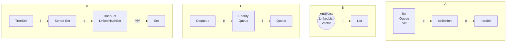

## Topic 12 - Exceptions in Java

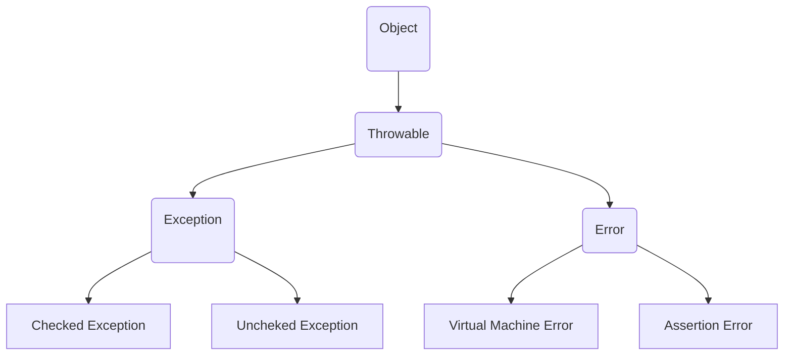

### Checked Exceptions

- Compile time exceptions because they are checked by compiler
- Examples
    - **IOException** - when I/O operation fails or is interrupted
        
        ```java
        try {
            // Perform I/O operations
        } catch (IOException e) {
            e.printStackTrace();
        }
        ```
        
    - **FileNotFoundException**
        
        ```java
        try {
            FileReader fileReader = new FileReader("myfile.txt");
        } catch (FileNotFoundException e) {
            e.printStackTrace();
        }
        ```
        
    - **InterruptedException** - thread is waiting, sleeping or doing it’s activity
        
        ```java
        try {
            SimpleDateFormat sdf = new SimpleDateFormat("yyyy-MM-dd");
            Date date = sdf.parse("2021-10-20");
        } catch (ParseException e) {
            e.printStackTrace();
        }
        ```
        
    - **ClassNotFoundException**
    - **SQLException**
        
        ```java
        try {
            // Database operations
        } catch (SQLException e) {
            e.printStackTrace();
        }
        ```
        
    - **NoSuchMethodException**

### Unchecked Exceptions

- Unchecked exceptions are only checked at the runtime
- Typically arises when you do things like null dereferencing or attempting to access out-of-bound array
- **Examples**
    - **NullPointerException**
        
        ```java
        String str = null;
        int length = str.length(); // Throws NullPointerException
        ```
        
    - **ArrayIndexOutOfBoundException**
        
        ```java
        int[] arr = {1, 2, 3};
        int value = arr[3]; // Throws ArrayIndexOutOfBoundsException
        ```
        
    - **ArithmeticException**
        
        ```java
        int result = 10 / 0; // Throws ArithmeticException
        ```
        
    - **IllegalArgumentException**
        
        ```java
        public void doSomething(int value) {
            if (value < 0) {
                throw new IllegalArgumentException("Value cannot be negative");
            }
        }
        ```
        
    - **ConcurrentModificationException**
        
        ```java
        List<String> names = new ArrayList<>();
        names.add("Alice");
        names.add("Bob");
        names.add("Charlie");
        
        for (String name : names) {
            if (name.equals("Bob")) {
                names.remove(name); // This will throw ConcurrentModificationException
            }
        }
        ```
        
        To avoid this we can use
        
        ```java
        List<String> names = new ArrayList<>();
        names.add("Alice");
        names.add("Bob");
        names.add("Charlie");
        
        Iterator<String> iterator = names.iterator();
        while (iterator.hasNext()) {
            String name = iterator.next();
            if (name.equals("Bob")) {
                iterator.remove(); // This is safe
            }
        }
        // please note that you must call next() before calling each 
        // call to remove() else you will get exception 
        // iterator.next() is the way to update the iterator pointing
        // when you remove it point to the element just behind to that
        // if it is the first element, then it will point to the next element
        ```
        

### User Creating Exceptions

- User can also create exception by extending the class `Exception`

```java
**// CustomException.java**
public class ClassException extends Exceptions {
    public CustomException (String message) {
        super(message);
    }
}
**// main.java**
public class Main {
    public static void main(String[] args) {
         try {
                throw new CustomException("this is a custom exception");
         } catch (CustomException e) {
                System.out.println(e.getMessage());
         }
    }
}
```

### Throw and Throws in Java (TODO)

- **Throw**
    - Is used to explicitly throw the error from a method or block of code
    - An exception is a subclass of `Throwable`  and user defined exception typically extends `Exception` class
    
    ```java
    throw instance
    throw new ArithmeticException("/ by zero");
    ```
    
- **Throws**
    - Java throws is used when we want to indicate that this method might throw one of the listed type exceptions
    - The caller to these methods has to handle the exception using a try-catch block
        
        ```java
        // Java program to demonstrate working of throws
        class ThrowsExecp {
        
            static void fun() throws IllegalAccessException
            {
                System.out.println("Inside fun(). ");
                throw new IllegalAccessException("demo");
            }
        
            public static void main(String args[])
            {
                try {
                    fun();
                }
                catch (IllegalAccessException e) {
                    System.out.println("caught in main.");
                }
            }
        }
        ```
        
        ```java
        // Java program to illustrate throws
        class tst {
            public static void main(String[] args)
                throws InterruptedException
            {
                Thread.sleep(10000);
                System.out.println("Hello Geeks");
            }
        }
        ```
        

### Finally in Java

- Finally keyword is associated with the try-catch block
- Guarantee that a section of code will be executed, even if an exception is thrown
- The main purpose of having final is to clean down all the resources
- Resource leakage thus can be avoided
    
```java
class A {
    static void A() {
        try {
            System.out.println("inside A");
            throw new RuntimeException("demo");
        }
        finally {
            System.out.println("A's  final");
        }
    }

    static void B() {
        try {
            System.out.println("inside B");
            return;
        }
        finally {
            System.out.println("B's  final");
        }
    }
    
    public static void main(String args[]) {
        try {
            A();
        }
        catch (Exception e) {
            System.out.println("Exception caught");
        }
        B();
    }
}
    
/* Output 
inside A
A's finally
Exception caught
inside B
B's finally
*/
```
    
```java
import java.io.FileWriter;
import java.io.IOException;
import java.io.PrintWriter;

class K {
    private static final int SIZE = 10;
    public static void main(String[] args) {
        PrintWriter out = null;
        try {
            System.out.println("Entered try statement");
            out = new PrintWriter(new FileWriter("outfile.txt"));
        }
        catch (IOException e) {
            
        }
        finally {
            if (out != null) {
                System.out.println("Closing PrintWriter");
                out.close();
            }
            else {
                System.out.println("PrintWriter not open");
            }
        }
    }
}
```
    

### Finalize Method in Java

Earlier finally was the here, but finalize we don’t require

<aside>
💡 Note this is not a keyword, but just a method, so we can call this method **explicitly**

</aside>

- It is the method which Garbage collector always calls just before the deletion or destroying of the object
- Clean-up activity
    
    ```java
    protected void finalize throw Throwable {};
    ```
    
- `Object` class contains the finalize method
- `Object` class is the superclass of all classes
- This is an empty implementation and we need to override this

<aside>
💡 As a user you can call this method explicitly but this will not destroy the object

</aside>

- Only when garbage collector call then this will get destroy
- Also note this will be called only with the object
    
```java
class Hello {
    public static void main(String[] args) {
        String s = new String("RR");
        s = null;
        System.gc();
        System.out.println("Main completes");
    }
    // overiding
    public void finalize() {
        System.out.println("finalize method overridden");
    }
}
```

### Assertion Errors

- An `AssertionError` is an exception in Java that is thrown when an assertion made by the `assert` statement fails.
- Assertions are used to verify that certain conditions in a program are true at specific point in the execution
- If assertion fails then it means there is some issue during the run time

<aside>
📌 Also make sure that assertion can be enabled or disabled at runtime using JVM parameter (`-ea` to enable, `-da` to disable)

</aside>

```java
int num = 5;
assert num > 10 : "Number is not greater than 10";
```

### Virtual Machine Error

- These errors don’t happen at the level of application itself, instead they happen at the level of JVM
- Examples
    - **OutOfMemoryError**
    - **StackOverflowError**
    - **InternalError**

## Topic 13: Java Virtual Machine Architecture

- Runtime engine for all the java applications
- JVM is the one which calls the `main` method present in the Java code
- JVM is the part of JRE
- Java application are called as **WORA** **(Write Once Run Anywhere)** - thanks to JVM
- When we compile a `.java` files we get a complied `.class` of the same name
- The `.class` goes into various steps


### Class Loader Subsystem

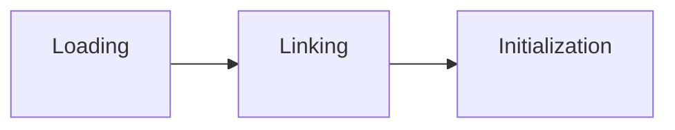

- It is mainly responsible for the three activities
    - **Loading**
    - **Linking**
    - **Initialization**
- **Loading**
    - The class loader reads the `.class`  file, generates the corresponding binary data and save in the method area (JVM Memory part)
    - For each `.class` file JVM stores following information in the method area
        - Class file related to enum/class/interface
        - Modifiers, variables and method information
        - Fully qualified name of the loaded class and it’s immediate parent class
    - After **loading** is done, JVM creates an object of type Class to represent this file in the heap memory
        
        ```java
        Student s2 = new Student();
        // c2 will point to same object where 
        // c1 is pointing
        Class c2 = s2.getClass();
        System.out.println(c1==c2); // true
        ```
        
    - Object is of type Class predefined in `java.lang` package
- **Linking**
    - Verification
        - Checks if file is generated by a valid compiler or not
    - Preparation
        - JVM allocates memory for the class static variable and initializing memory to default value
    - Resolution
        - Replacing symbolic references with direct references
- **Initialization**
    - All static variables are assigned with their values
    - Top to bottom from parent to child

### JVM Memory

- **PC register**
    - Stores the address of the current instruction of a thread
- **Native Method Stack**
    - For every thread, a separate native stack is created. It stores native method information
- **Stack Area**
    - For every thread, **JVM** creates one run-time stack which is stored here
- **Heap Area**
    - Information of all object is stored in the heap area
    - One heap area per **JVM**
    - Shared resource
- **Method Area**
    - All class level information like class name, immediate parent class name, methods and variables information etc
    - There is only one method area per **JVM** and it is shared resource

### Execution Engine

- This executes the `.class` (byte code)
- Reads byte  code line by line
- Three parts
    - **Interpreter**
        - read line by line and thus even if a method is called multiple time, it get interpret multiple times
    - **Just-In-Time Compiler (JIT)**
        - More efficient
        - It compiles the entire byte code and change it to native code
        - So whenever Interpreter sees the repeated method calls, JIT provides direct native code for that part so that re-interpretation is not required
    - **Garbage Collector**
        - Destroy unreferenced objects
        - `System.gc()` and `Runtime.gc()` are two ways to to request for garbage collection to JVM explicitly

### Java Native Interface (JNI)

- It is an interface that interacts with the Native Method libraries and provides native libraries (C/C++)

---

## Topic 14: Software Automation Tools for Java

- Maven and Gradel

### Gradle

- Gradle is open source and facilitate the automated development of software
- Groovy based DSL

### Maven

- Open-source project management utility
- Develops pure Java language-based software
- It require Java compilation
- Standard Directory Layout in Maven Project
- At top level we have `pom.xml`, file descriptor of the project. POM Stands for Project Object Model. It is an XML file which contains information about the project and it’s dependencies. You can configure dependencies, build, settings, and more in this file

| Path | Description of Path |
| --- | --- |
| src/main/java | Application / Library sources |
| src/main/resource | Application / Library resources |
| src/main/filters | Resources filter file |
| NOTICE.txt | Notice and attributes required by libraries that the project depends on  |

```java
mvn archetype:generate -DgroupId=com.oracle -DartifactId=first-app-in-maven -DarchetypeArtifactId=maven-archetype-quickstart -DinteractiveMode=false
```

### What is `archtype:generate` means ?

- Create a project based on predefined **project templates**, known as `archetype`
- The Maven Archetype **Plugin** is a tool that allows you to create new Maven projects based on templates. These templates, or archetypes, define the basic structure and contents of a project.
- When you run `mvn archetype:generate`**,** you're instructing Maven to use the Archetype Plugin's `generate` goal to create a new project.
- `maven-archetype-quickstart`: Provides a basic template for a Java application with a simple `Main` class and a sample test class.

Explanation of options

- `DgroupId`: This is the identifier for your project's group. It's typically in reverse domain format (e.g., `com.oracle`). It helps uniquely identify your project in the Maven repository.
- `DartifactId`: This is the name of your project (e.g., `my-java-project`). It's the identifier for your project within the group.
- `DarchetypeArtifactId`: This is the Maven archetype (template) to use. In this case, we're using `maven-archetype-quickstart`, which provides a basic project structure.
- `DinteractiveMode**=**false`: This disables interactive mode, which means Maven won't prompt you for input during project creation. It will use the default values provided.

**`mvn compile`**

- This will compile all the code `src/main/java`

**`mvn test`**

- To run all the test files

**`mvn package`**

- To build the **JAR** (**J**ava **AR**chive) file or any other artifact specified in **pom.xml**

### **Run the Application**

```java
java -cp target/first-app-in-maven-1.0-SNAPSHOT.jar com.oracle.App // say If App.java is the file in your case
```

- `-cp target/your-artifactId.jar` This flag tells java from where to find the classes needed to run your program
- `cp` stands for **class path**
- `com.example.Main` is the fully qualified name to the of the class that contains the `main` method you want to run

### **What is an Artifact in Maven project ?**

- An artifact represents a deployable component of the project
- It can be JAR (Java Archive)file, or WAR (Web Application Archive)
- An artifact is the result of compiling and packaging your project and this contains compiled classes of your project
- Each artifact has unique identifier consists of `groupId, artifactId, version` in Maven

**`mvn clean install`**

- The goal named as clean remove the **target** directory, which contains the compiled classes
    - **install**: The goal compiles your code, runs tests, and packages your into an artifact. It also install the artifact in the local Maven repository

### Local Maven Repository

- Local cache of the Maven
- Maven stores project dependencies here
- When you build a Maven project, it downloads required libraries (dependencies) from remote repository, like Maven Central and store them in local repository
- This is typically located in the .m2 directory within the home folder

---

### Main Directory in the Java project

**`src` (Source) Directory:**

- The **`src`** directory is where the source code of your Java project resides. It contains all the **`.java`** files that make up your application.
- **Significance:** This is where you write the code that defines the behavior of your program.

**`com` Package (or your chosen package name):**

- Inside **`src`**, you typically find a package structure, often starting with a domain name in reverse order (e.g., **`com.example.project`**).
- **Significance:** Packages provide a way to organize related classes into meaningful namespaces. They help avoid naming conflicts and provide a clear structure for your code.
- **Example:** If you're developing a web application, you might have packages like **`com.example.project.controller`**, **`com.example.project.model`**, and **`com.example.project.dao`** to organize different components of your application.

**`java` (or your project-specific package) Package:**

- Inside the package (e.g., **`com.example.project`**), you might have further sub-packages that represent different parts of your application (e.g., **`controller`**, **`model`**, **`dao`**).
- **Significance:** This further organizes your codebase, making it easier to locate and work with specific classes.
- **Example:** In the **`com.example.project.controller`** package, you might have classes that handle HTTP requests and responses.

**Class Files (`.java` files):**

- Inside each package, you have the actual Java source files with a **`.java`** extension.
- **Significance:** These files contain the code that defines your classes, interfaces, and their behavior. Each file typically corresponds to a single class or interface.

**`resources` Directory (Optional):**

- Alongside the **`src`** directory, you might find a **`resources`** directory. This is where non-code files like configuration files, images, or XML files might be stored.
- **Significance:** Storing resources separately from source code makes it easier to manage and modify them without affecting the logic of your application.
- **Example:** In a web application, you might have a **`resources`** directory containing files like **`application.properties`** for configuration settings.

**`lib` (Libraries) Directory (Optional):**

- This directory might contain external libraries or dependencies that your project relies on. These can be **`.jar`** files or other libraries.
- **Significance:** Managing external libraries separately from your source code helps keep your project organised and makes it easier to update or replace dependencies.
- **Example:** If you're using a library like Apache Commons, you might include the relevant **`.jar`** files in the **`lib`** directory.

**`bin` (Binary) Directory (or `target` in some build tools):**

- After compiling, this directory might contain the compiled **`.class`** files. This directory is often generated by the IDE or build tools.
- **Significance:** These are the files that the JVM executes. They're the compiled version of your source code.
- **Example:** For a class **`Main`** in package **`com.example.project`**, you might find a file **`com/example/project/Main.class`** in the **`bin`** directory.

**`dist` (Distribution) Directory (Optional):**

- In some projects, you might find a **`dist`** directory that contains the distributable files of your application (e.g., JAR files, WAR files for web applications, etc.).
- **Significance:** This is where you would find the files that you distribute to end-users.
- **Example:** If you're building a standalone Java application, the final executable JAR file might be located in the **`dist`** directory.

---

### Package Hierarchy in Java

- [com.java.app](http://com.java.app) - is an example of package hierarchy in Java.

**`com` - Top-Level Package Component:**

- The **`com`** component is typically used to indicate that the code belongs to a company or organization. It's a convention to use the company's domain name in reverse order. For example, if a company owns the domain **`oracle.com`**, their Java packages might start with **`com.oracle`**.
- **Example:** **`com.oracle`** is a top-level package for code associated with the company **`oracle.com`**

---

**Why Do We Use Packages?**

1. **Organization and Modularity:**
    - Packages help organize code into logical units. This makes it easier to find and work with specific classes or modules.
2. **Avoiding Naming Conflicts:**
    - Packages provide a namespace, which helps prevent naming conflicts. For example, two different packages can have classes with the same name without conflicting.
3. **Access Control:**
    - Packages also play a role in access control.
    - Classes in the same package have default access to each other's members, even if they are not public.


## Topic 15 - JVM Internals

Resource - [https://blog.jamesdbloom.com/JVMInternals.html](https://blog.jamesdbloom.com/JVMInternals.html) 


- A thread is a thread of execution in a program
- JVM allows application have multiple threads of execution running concurrently
- In JVM there is direct mapping of Java Thread and a native Operating System Thread
- State of Java Thread
    - **Thread Local Storage**
    - **Allocation buffers**
    - **Synchronization objects**
    - **Stack**
    - **Program Counter (PC)**
    - **Native thread is created**
- The native thread is reclaimed once Java Thread terminate
- The OS is thus responsible for scheduling threads and dispatching them to any available CPU
- Once native thread is init then it will call `run()` method in Java thread
- When thread terminate all resources for both the native and Java thread are released

### JVM System Threads

- Use `jconsole` or any other debugger it is possible to see there are numerous threads running in the background
- Main is one of those thread, which is created as part of invoking `public static void main`
- Main Background thread in JVM
    
    
    | Thread Name | Description |
    | --- | --- |
    | VM Thread | The thread waits for operations to appear that require the JVM to reach a safe-point. The reason these operation have to happen on a separate thread is because they all require the JVM to reach at a safe point where modification to the heap can not occur. The type of operation performed by this thread are “stop-the-world” garbage collections, thread stack dumps, thread suspension and biased locking revocation |
    | Periodic task thread | This thread is responsible for the timer events (i.e interrupts) that are used to schedule execution of periodic operations |
    | GC Threads | These thread supports different type of garbage collection activities that occurs in the JVM |
    | Compiler Threads | These thread compile byte code to the native code at runtime |
    | Single Dispatcher Threads | This thread receives the signals sent to the JVM process and handle them inside the JVM by calling the appropriate JVM methods |

### Per Thread

| Component | Description |
| --- | --- |
| PC | PC points to the memory address in the Method Area. Address of current or next instruction (or opcode). All CPUs have there own PC and PC is incremented after each instruction |
| Stack | LIFO in nature. Each thread has it’s own stack. This stack hold the frame of each method. A new frame is pushed to the stack for every method invocation. Frame is remove in case of normal return or if uncaught exception is thrown during the method invocation. The stack is not directly manipulated (except two command push and pop) and thus object reside on heap for the modification purpose |
| Native Stack | Native stack will be a C stack |
| Stack Restriction | In case if you not have enough space on the stack for creating a new frame then you will get OutOfMemoryError is thrown |
| Frame | Each method has an associate frame. Each frame contains 1) Local variable Array 2) Return value 3) Operand Stack 4) Reference to runtime constant pool for class of the current method |
| Local Variable Array | All variable used during the execution of the method, including a reference to this, all method parameters and other locally defined variables. A local variable can be (boolean, byte, char, long, short, int, double, reference, return Address). All type takes a single slot in the local variable array except long and double, they takes two slot |
| Operand Stack | Operand stack is used during the execution of byte code instruction |
| Dynamic Linking | Each frame contains a reference to the runtime constant pool. The reference point to the constant pool for the class of the method begin executed for that frame. This reference is used to support the dynamic linking. All references to the variable and methods are stored in the class’s constant pool as a symbolic reference. A symbolic reference is a logical reference not a reference that actually points to a physical memory location. JVM implementation can decide when to resolve symbolic reference (eager or static resolution). Or the lazy, only when symbolic reference is used for the first time. If a symbolic reference to a class that has not been resolved yet, then this class will be loaded. Each direct reference is stored as an offset against the storage structure associated with the runtime location of the method |

### Shared between Threads

- Heap
    - Allocate class instances and arrays at runtime
    - Array and object can’t be store on stack, because a frame is not allowed to change the shape once it is allocated
    - The frame can only store the reference to the object on the heap
    - The reason to do so is also that we don’t want always object to get destroy as soon as the method end
    - The sole responsibility of cleaning object is of Garbage collector
    - To support Garbage collection the heap section is further divided into three parts
        - **Young Generation**
            - Often split between Eden and Survivor
        - **Old Generation**
            - Also called as Tenured Generation
        - **Permanent Generation**

### Memory Management

- Objects and Arrays are never explicitly de-allocated instead the garbage collector automatically reclaims that
- Typically this work as follows
    
    ```mermaid
    graph LR
        1[New Object<br> are created into <br> young generation<br><br>] --> 2[Minor Garbage collection <br> will operate in young generation<br> Objects that are<br>still alive will be<br>moved from eden space<br>to the survivor space<br><br><br>]
        2 --> 3[Major Garbage Collection<br>Pause the application thread to pause<br> Move object between <br> generation i.e from young <br> to Old generation<br><br><br>]
      3 --> 4[Permanent Generation is collected <br> every time old generation<br> is collected <br> collected when they are full<br><br><br>]
    
    ```
    

### Non-Heap Memory

- Objects that are logically considered as part of the JVM mechanics are not created on Heap
- The non-heap memory include
    
    ```mermaid
    graph TD
      1[Non-Heap Memory<br><br>] --> 2[Permanent Generation]
        1 --> 3[Code Cache]
        2 --> 4[The Method Area]
        2 --> 5[Interned Strings<br><br>]
    ```
    

### Just In Time compilation

- Java byte code is interpreted and thus it is not executed fast
- To improve performance the **Oracle Hotspot VM** looks for “hot” areas of byte code
- Hot area are those section which are executed frequently
- These hot area are compiles to native code.
- The native code is then stored in the **Code Cache**

### Method Area

<aside>
📌 Note that all the threads shared the same method area, so access to the method area data and process of dynamic linking must be thread safe. If two threads attempt to access a field or method of a class that has not yet been loaded it must be only be loaded once and both thread must not continue execution until it has been loaded.

</aside>

- The method area stores per class information
    - Class Loader Reference
    - Run Time Constant Pool
        - Numeric constants, field references, method references, attributes
    - Field Data
        - Name, type, modifiers attributes
    - Method Data
        - Name, return type, parameter type, modifiers, attributes
    - Method Code
        - Per method byte code
        - Operand stack size
        - Local variable size
        - Local variable table
        - Exception table
            - Per Exception handler
                - Start Point
                - End Point
                - PC offset for handler code
                - Constant pool index for exception class being caught

### Class File Structure

- A complied class file consists of the following structures

```java
ClassFile {
    u4            magic;
    u2            minor_version;
    u2            major_version;
    u2            constant_pool_count;
    cp_info        contant_pool[constant_pool_count – 1];
    u2            access_flags;
    u2            this_class;
    u2            super_class;
    u2            interfaces_count;
    u2            interfaces[interfaces_count];
    u2            fields_count;
    field_info        fields[fields_count];
    u2            methods_count;
    method_info        methods[methods_count];
    u2            attributes_count;
    attribute_info    attributes[attributes_count];
}
```

## Topic 16 : Java Collection

### Collection Framework

- The collection interface in Java
    - `java.util.collection` and [`java.util.Map`](http://java.util.Map) are two main root interfaces of Java collection class
- What is Framework ?
    - Set of classes and interfaces
    - Provides ready-made architecture

<aside>
📌 All the collections can be imported using `import java.util.*`

</aside>


<aside>
🟢 `Iterable` Interface is the root interface for the entire `collection` framework. The collection framework extends the iterable interface

</aside>

- The following six interfaces are described below
    - Collection interface
    - List Interface
    - Queue Interface
    - Deque Interface (Double-ended queue)
    - Set Interface
    - Map
- **Collection Interfaces**
    - contains all the basic method which every collection like adding the data into the collection, removing the data, clearing the data etc
    - All the classes which implement the interfaces provides the body to these functions

### List Interfaces

- Child Interface of the collection interface
- Index specific functions
- `ArrayList`, `LinkedList`, `Vector` and `Stack`
1. ArrayList
    1. Provides Dynamic array in Java
    2. Size grows and shrink automatically 
    
**Method in ArrayList**
    
```java
import java.util.ArrayList;
import java.util.Iterator;
import java.io.*;

public class ArrayListDemo {
    public static void main(String[] args) {
        ArrayList<Integer> arrlist = new ArrayList<Integer>(5);
        
        // Method 1 : ADD
        arrlist.add(15); //  add 
        arrlist.add(3, 15); // index, element : throws IndexOutOfBoundsException 
        
        // Method 2 : REMOVE
        arrlist.remove(1); // index of element
        arrlist.remove(Integer.valueOf(15)); 
        // go to remove the value, 
        // don't use Integer(5) - this is depreciated
        
        // using interator to remove 
        // While iterating use the below method i.e itr.remove(), safer 
        Iterator itr = arrlist.iterator();
        while (itr.hasNext()) {
            int x = (Integer) itr.next();
            if (x < 10) {
                itr.remove();
            }
        }
        // Method 3 : SET
        arrlist.set(idx, val);
        // Method 4: Contains
        arrlist.contains(value);
        // Using streams on the list
        List<Integer> newList = arrlist.stream().distinct().collect(Collector.toList());
        // Method 5: GET
        Integer val = arrlist.get(index);
        Collections.sort(arrlist);        
        for (Integer number: arrlist) {
            System.out.println("number = " + number);
        }
    }
}
```
    
2. **LinkedList**
    
    
3. **Vector**
    
How Does Vector class looks like ? 

```java
public class Vector<E> extends AbstractList<E> implements List<E>, RandomAccess, Cloneable, Serializable
```

Constructor for the Vector

```java
Vector<E> v = new Vector<E>(); // default vector with initial capacity = 10
Vector<E> v = new Vector<E> (int size); // user-defined size
Vector<E> v = new Vector<E> (int size, int incr); // increment when resize upward is required
Vector<E> v = new Vector<E> (Collection c) 
```

Time complexity - $O(n)$ and Space complexity $O(n)$
    
```java
import java.util.Vector;

public class VectorDemo {
    public static void main(String[] args) {
        Vector<String> newV = new Vector<String>();
        // add(index: int, value: E) method 
        newV.add("HI"); // add(index, value);
        newV.add("NOW");
        // get(index: int) method 
        newV.get(index);
        
        // addAll(Collection c) method 
        Collection<String> c = new ArrayList<String>();
        c.add("hi");
        newV.addAll(c); 

        // addElement() method is used to append to end by increasing the size of
        // vector by 1, return boolean 
        newV.addElement("last");

        // capacity() method
        int size = newV.capacity();

        // clear() method
        newV.clear();

        // clone() method
        Object copy_vector = newV.clone();

        // contains() method
        newV.contains("hi");

        // for each on vector
        newV.forEach((n) -> System.out.println(n));
        newV.forEach((n) -> print(n));
        

    }
}
```
    
**Stream in Java**
    
```java
import java.util.Vector;
import java.util.stream.Collectors;
import java.util.stream.Stream;
import java.util.List;
import java.util.Random;

public class StreamDemo {
    public static void main(String[] args) {
        Vector<Integer> vec = new Vector<Integer>();
        Random random = new Random();
        final int MAX_LIMIT = 10;
        for (int i = 0; i < 6; ++i) {
            vec.add(random.nextInt(MAX_LIMIT));
        }
        Stream<Integer> stream = vec.stream();
        stream.forEach((v) -> System.out.println(v));
        // after this stream get close()
        try {
            stream.forEachOrdered((v) -> System.out.println(v));
        } catch (IllegalStateException e) {
            System.out.println("Something bad happen!");
            e.getMessage();
        }

        System.out.println("All even numbers ");
        vec.stream()
                .filter(val -> val % 2 == 0)
                .forEach(System.out::println);

        System.out.println("Square of each number");
        vec.stream()
                .map(val -> val * val)
                .forEach(System.out::println);

        long count = vec.stream().count();
        System.out.println("Total number of element = " + count);

        System.out.println("list from the vector");
        List<Integer> newList = vec.stream().collect(Collectors.toList());
        newList.forEach(val -> System.out.println(val));

        System.out.println("Distinct element only");
        vec.stream().distinct().forEach(System.out::println);
        System.out.println("limit the printing");
        vec.stream().limit(2).forEach(System.out::println);
        System.out.println("Skip the two element");
        vec.stream().skip(2).forEach(System.out::println);
        System.out.println("Sort the element");
        vec.stream().sorted().forEach(System.out::println);
    }
}
```
    
4. Stack
5. AbstractList
6. AbstractSequentialList


## Topic 17. Extras (decide name later)

### Annotation
- Resources
  - [https://www.programiz.com/java-programming/annotations](https://www.programiz.com/java-programming/annotations) 

- In java `@inteface` keyword is used to declare an annotation type 
- Annotation provides the metadata about a program that can be inspected at the runtime using reflection 

```java
@Retention(RetentionPolicy.RUNTIME)
@Target(ElementType.TYPE)
public @interface myMetadata {
    String index();
    boolean local() default false;
}
```

- `@Retention` 
  - Specify when annotation is available to use 
  - `RetentionPolicy.SOURCE`
    - Only in the source code and are discarded during compilation
    - Use case: compile-time checks, code generation and other preprocessing tasks
    - Example: `@Override` - Override method of superclass
  - `RetentionPolicy.CLASS` 
    - Recorded in the class file, but not retained by the JVM at runtime 
    - They are in bytecode but can't be access during runtime using Reflection
    - Use case: Annotations used by tools and libraries that process class files, such as bytecode manipulation tools.
    - Default retention policy if not specified
  - `RetentionPolicy.RUNTIME`
    - Retained by JVM and also accessible during runtime using reflection 
    - Used for runtime processing
    - Use case:  Dependency injection framework 
    - Example: `@Deprecated`, custom annotations
    
    ```java

    // Example 1.

    import java.lang.annotation.Retention;
    import java.lang.annotation.RetentionPolicy;

    @Retention(RetentionPolicy.RUNTIME)
    public @interface RuntimeLevelAnnotation {
        String value();
    }


    @RuntimeLevelAnnotation(value = "example")
    public class ExampleClass {
        public static void main(String[] args) {
            Class<ExampleClass> clazz = ExampleClass.class;
            
            if (clazz.isAnnotationPresent(RuntimeLevelAnnotation.class)) {
                RuntimeLevelAnnotation annotation = clazz.getAnnotation(RuntimeLevelAnnotation.class);
                System.out.println("Value: " + annotation.value()); // output: example
            }
        }
    }

    ```

- `@Target`
  - Annotation in Java
  - This tells where an annotation type can be applied 
  - Examples: 
    - `ElementType.FIELD`, `ElementType.METHOD`, `ElementType.PARAMETER`, `CONSTRUCTOR`, `LOCAL_VARIABLE`,... and many more

    ```java

    // Example 1.
    @Retention(RetentionPolicy.RUNTIME)
    @Target(ElementType.METHOD)
    public @interface MyMethodAnnotation {
        String value() default "default value";
    }

    public class MyClass {
        @MyMethodAnnotation(value = "Hello")
        public void myMethod() {
            // Method implementation
        }
    }

    // Example 2: 

    @Retention(RetentionPolicy.RUNTIME)
    @Target(ElementType.FIELD)
    public @interface MyFieldAnnotation {
        String description() default "No description";
    }

    public class MyClass {
        @MyFieldAnnotation(description = "This is a field")
        private String myField;
    }

    // Example 3.


    @Retention(RetentionPolicy.RUNTIME)
    @Target(ElementType.PARAMETER)
    public @interface MyParameterAnnotation {
        String value() default "default";
    }

    public class MyClass {
        public void myMethod(@MyParameterAnnotation("param value") String param) {
        }
    }
    ```

- More on annotation
  - `@NoArgsConstructor` - Generate no-argument constructor 
    - Init value to their default values
  - `@Data` - Includes getter and setters for all fields and setters for all non-final field
    - `@Data` annotation automatically adds getters (`getName()`, `getAge()`), setters (`setName()`, `setAge()`), `toString()`, `equals()`, `hashCode()`, and a no-argument constructor to the Person class. 

- Spring Framework Annotations
  - `@Autowired`: Injects dependencies automatically.
    ```java
    import org.springframework.beans.factory.annotation.Autowired;

    public class MyService {
        @Autowired
        private MyRepository repository;
        
        // Class implementation
    }
    ```
    - **Explanation**: `@Autowired` automatically injects an instance of `MyRepository` into the `repository` field when `MyService` is instantiated, facilitating dependency injection in Spring applications.

  - `@Component`: Marks a class as a Spring component.
    ```java
    import org.springframework.stereotype.Component;

    @Component
    public class MyComponent {
        // Class implementation
    }
    ```
    - **Explanation**: `@Component` marks `MyComponent` as a Spring-managed component, allowing it to be automatically detected and instantiated by Spring's component scanning mechanism.

  - `@RequestMapping`: Maps HTTP requests to handler methods.
    ```java
    import org.springframework.web.bind.annotation.RequestMapping;
    import org.springframework.web.bind.annotation.RestController;
    import org.springframework.web.bind.annotation.RequestMethod;

    @RestController
    @RequestMapping("/api")
    public class MyController {
        @RequestMapping(value = "/endpoint", method = RequestMethod.GET)
        public String handleRequest() {
            // Method implementation
        }
    }
    ```
    - **Explanation**: `@RequestMapping` maps HTTP GET requests to the `/api/endpoint` URL path to the `handleRequests()` method, allowing it to process and respond to HTTP requests.

  - `@Transactional`: Defines the scope of a database transaction.
    ```java
    import org.springframework.transaction.annotation.Transactional;

    @Transactional
    public class MyService {
        // Class implementation
    }
    ```
    - **Explanation**: `@Transactional` ensures that all methods of `MyService` are executed within a single database transaction, managing transactional boundaries and ensuring data integrity.

- JUnit Annotations
  - `@Test`: Marks a method as a test method.
    ```java
    import org.junit.Test;

    public class MyTest {
        @Test
        public void testMethod() {
            // Test method implementation
        }
    }
    ```
    - **Explanation**: `@Test` marks `testMethod()` as a unit test method, allowing JUnit to identify and execute it as part of test runs, verifying expected behavior and outcomes.

  - `@Before`: Executed before each test method.
    ```java
    import org.junit.Before;

    public class MyTest {
        @Before
        public void setUp() {
            // Setup method implementation
        }
    }
    ```
    - **Explanation**: `@Before` ensures that `setUp()` method is executed before each `@Test` method, providing a consistent setup environment for tests, initializing necessary resources or state.

  - `@After`: Executed after each test method.
    ```java
    import org.junit.After;

    public class MyTest {
        @After
        public void tearDown() {
            // Teardown method implementation
        }
    }
    ```
    - **Explanation**: `@After` ensures that `tearDown()` method is executed after each `@Test` method, performing cleanup tasks, releasing resources, or resetting state post-test execution.

  - `@BeforeClass`: Executed once before any test method in the class.
    ```java
    import org.junit.BeforeClass;

    public class MyTest {
        @BeforeClass
        public static void setUpClass() {
            // Class setup method implementation
        }
    }
    ```
    - **Explanation**: `@BeforeClass` ensures that `setUpClass()` method is executed once before any `@Test` method in the class, performing class-level setup tasks, initializing shared resources, or setting up test data.

  - `@AfterClass`: Executed once after all test methods in the class.
    ```java
    import org.junit.AfterClass;

    public class MyTest {
        @AfterClass
        public static void tearDownClass() {
            // Class teardown method implementation
        }
    }
    ```
    - **Explanation**: `@AfterClass` ensures that `tearDownClass()` method is executed once after all `@Test` methods in the class, performing class-level cleanup tasks, releasing shared resources, or finalizing test data.

- Hibernate/JPA Annotations
  - `@Entity`: Marks a class as an entity mapped to a database table.
    ```java
    import javax.persistence.Entity;
    import javax.persistence.Id;

    @Entity
    public class User {
        @Id
        private Long id;
        // Class implementation
    }
    ```
    - **Explanation**: `@Entity` marks `User` as an entity class, mapping it to a database table. The `@Id` annotation specifies `id` as the primary key of the table.

  - `@Id`: Specifies the primary key of an entity.
    ```java
    import javax.persistence.Id;

    public class User {
        @Id
        private Long id;
        // Class implementation
    }
    ```
    - **Explanation**: `@Id` specifies that `id` is the primary key of the `User` entity, allowing Hibernate/JPA to identify and manage instances of `User` in the database.

  - `@GeneratedValue`: Defines the strategy for generating primary keys.
    ```java
    import javax.persistence.GeneratedValue;
    import javax.persistence.GenerationType;
    import javax.persistence.Id;

    public class User {
        @Id
        @GeneratedValue(strategy = GenerationType.IDENTITY)
        private Long id;
        // Class implementation
    }
    ```
    - **Explanation**: `@GeneratedValue` specifies that the value of `id` is automatically generated by the database (using an identity column), ensuring unique and sequential primary key values for `User` entities.

  - `@Column`: Maps a field or property to a column in the database.
    ```java
    import javax.persistence.Column;
    import javax.persistence.Entity;
    import javax.persistence.Id;

    @Entity
    public class User {
        @Id
        private Long id;

        @Column(name = "username", nullable = false)
        private String username;
        // Class implementation
    }
    ```
    - **Explanation**: `@Column` maps the `username` field to a column named `username` in the database table for `User`. Additional attributes like `nullable` specify constraints on the column.

- Jackson Annotations (for JSON Processing)
  - `@JsonProperty`: Maps a field name in Java to a JSON property name.
    ```java
    import com.fasterxml.jackson.annotation.JsonProperty;

    public class User {
        @JsonProperty("user_name")
        private String username;
        // Class implementation
    }
    ```
    - **Explanation**: `@JsonProperty` maps the `username` field in Java to a JSON property named `user_name` during serialization and deserialization with Jackson, allowing customization of JSON field names.

  - `@JsonIgnore`: Ignores a field or method during serialization and deserialization.
    ```java
    import com.fasterxml.jackson.annotation.JsonIgnore;

    public class User {
        private String password;

        @JsonIgnore
        public String getPassword() {
            return password;
        }
        // Class implementation
    }
    ```
    - **Explanation**: `@JsonIgnore` excludes the `getPassword()` method from being serialized to JSON or deserialized from JSON, ensuring sensitive information like passwords is not exposed.

  - `@JsonFormat`: Configures the format of dates and times during serialization and deserialization.
    ```java
    import com.fasterxml.jackson.annotation.JsonFormat;

    public class Event {
        @JsonFormat(shape = JsonFormat.Shape.STRING, pattern = "yyyy-MM-dd HH:mm:ss")
        private Date eventDate;
        // Class implementation
    }
    ```
    - **Explanation**: `@JsonFormat` specifies the format (`"yyyy-MM-dd HH:mm:ss"`) for serializing and deserializing `eventDate` field of `Event` class to and from JSON, ensuring consistent date/time representation.

- Servlet Annotations
  - `@WebServlet`: Declares a servlet component.
    ```java
    import javax.servlet.annotation.WebServlet;
    import javax.servlet.http.HttpServlet;
    import javax.servlet.http.HttpServletRequest;
    import javax.servlet.http.HttpServletResponse;
    import java.io.IOException;

    @WebServlet(name = "MyServlet", urlPatterns = "/myservlet")
    public class MyServlet extends HttpServlet {
        protected void doGet(HttpServletRequest request, HttpServletResponse response) throws IOException {
            // Servlet logic
        }
    }
    ```
    - **Explanation**: `@WebServlet` registers `MyServlet` as a servlet component in the web application, handling HTTP GET requests to `/myservlet` URL pattern with the logic defined in `doGet()` method.

  - `@WebFilter`: Declares a filter component.
    ```java
    import javax.servlet.annotation.WebFilter;
    import javax.servlet.*;

    @WebFilter(filterName = "MyFilter", urlPatterns = "/*")
    public class MyFilter implements Filter {
        public void doFilter(ServletRequest request, ServletResponse response, FilterChain chain) throws IOException, ServletException {
            // Filter logic
            chain.doFilter(request, response);
        }
    }
    ```
    - **Explanation**: `@WebFilter` declares `MyFilter` as a filter component applied to all URL patterns (`"/*"`) in the web application, allowing custom processing of HTTP requests and responses.

  - `@WebListener`: Declares a listener component.
    ```java
    import javax.servlet.annotation.WebListener;
    import javax.servlet.ServletContextEvent;
    import javax.servlet.ServletContextListener;

    @WebListener
    public class MyServletContextListener implements ServletContextListener {
        public void contextInitialized(ServletContextEvent sce) {
            // Initialization logic
        }

        public void contextDestroyed(ServletContextEvent sce) {
            // Cleanup logic
        }
    }
    ```
    - **Explanation**: `@WebListener` registers `MyServletContextListener` as a listener component in the web application, allowing execution of initialization (`contextInitialized()`) and cleanup (`contextDestroyed()`) logic during application startup and shutdown phases.

- Java EE and Jakarta EE Annotations
  - `@Stateless`: Marks a session bean as stateless.
    ```java
    import javax.ejb.Stateless;

    @Stateless
    public class MyStatelessBean {
        // Class implementation
    }
    ```
    - **Explanation**: `@Stateless` annotates `MyStatelessBean` as a stateless session bean in Java EE or Jakarta EE, ensuring that each method invocation is independent of previous invocations, suitable for stateless business logic.

  - `@Stateful`: Marks a session bean as stateful.
    ```java
    import javax.ejb.Stateful;

    @Stateful
    public class MyStatefulBean {
        // Class implementation
    }
    ```
    - **Explanation**: `@Stateful` marks `MyStatefulBean` as a stateful session bean, allowing it to maintain conversational state across multiple client invocations, suitable for scenarios requiring state retention between method calls.

  - `@Singleton`: Marks a session bean as a singleton.
    ```java
    import javax.ejb.Singleton;

    @Singleton
    public class MySingletonBean {
        // Class implementation
    }
    ```
    - **Explanation**: `@Singleton` declares `MySingletonBean` as a singleton session bean, ensuring that only one instance exists per container, suitable for managing shared resources or caching data across multiple clients.

  - `@Resource`: Specifies a resource (e.g., data source, JMS queue) to be injected.
    ```java
    import javax.annotation.Resource;
    import javax.jms.Queue;

    public class MyJmsService {
        @Resource(mappedName = "jms/myQueue")
        private Queue queue;
        // Class implementation
    }
    ```
    - **Explanation**: `@Resource` injects the JMS `myQueue` resource into `queue` field of `MyJmsService`, allowing access to the specified resource (e.g., data source, message queue) configured in the application server or context.

- Swagger Annotations (for API Documentation)
  - `@Api`: Adds metadata to describe the API class.
    ```java
    import io.swagger.annotations.Api;

    @Api(value = "UserController", description = "REST APIs related to User entity")
    public class UserController {
        // Class implementation
    }
    ```
    - **Explanation**: `@Api` annotates `UserController` to provide metadata about REST APIs related to the User entity, facilitating comprehensive documentation and understanding of API endpoints and operations.

  - `@ApiOperation`: Describes an operation (HTTP method) in the API.
    ```java
    import io.swagger.annotations.ApiOperation;
    import org.springframework.web.bind.annotation.GetMapping;
    import org.springframework.web.bind.annotation.RestController;

    @RestController
    public class UserController {

        @ApiOperation(value = "Get a list of all users", response = User.class, responseContainer = "List")
        @GetMapping("/users")
        public List<User> getUsers() {
            // Method implementation
        }
    }
    ```
    - **Explanation**: `@ApiOperation` documents `getUsers()` method as an HTTP GET operation to retrieve a list of all users, specifying `User` class as the response type in a collection (`List`), aiding in API documentation and usage clarity.

  - `@ApiParam`: Describes a parameter in an operation.
    ```java
    import io.swagger.annotations.ApiParam;
    import org.springframework.web.bind.annotation.GetMapping;
    import org.springframework.web.bind.annotation.RequestParam;
    import org.springframework.web.bind.annotation.RestController;

    @RestController
    public class UserController {

        @ApiOperation(value = "Get user by ID")
        @GetMapping("/users/{id}")
        public User getUserById(
                @ApiParam(value = "User ID", required = true) @RequestParam("id") Long userId) {
            // Method implementation
        }
    }
    ```
    - **Explanation**: `@ApiParam` specifies `userId` as a parameter in `getUserById()` method for retrieving a user by ID, documenting its description ("User ID") and mandatory requirement (`required = true`), enhancing API documentation and parameter understanding.

- Guava Annotations
  - `@Nullable`: Indicates that a parameter, return value, or field can be `null`.
    ```java
    import javax.annotation.Nullable;

    public class UserService {
        public void updateUser(@Nullable User user) {
            // Method implementation
        }
    }
    ```
    - **Explanation**: `@Nullable` annotates `user` parameter of `updateUser()` method to indicate that it can accept `null` values, providing clarity about its potential nullability and ensuring robust handling of nullable inputs.

  - `@Immutable`: Marks a class as immutable (its state cannot be changed after construction).
    ```java
    import com.google.common.annotations.Immutable;

    @Immutable
    public class ImmutableUser {
        private final String name;
        private final int age;

        public ImmutableUser(String name, int age) {
            this.name = name;
            this.age = age;
        }

        // Getter methods
    }
    ```
    - **Explanation**: `@Immutable` designates `ImmutableUser` class as immutable, enforcing that its state (fields `name` and `age`) cannot be modified after construction, ensuring thread safety and preventing unintended state changes.


