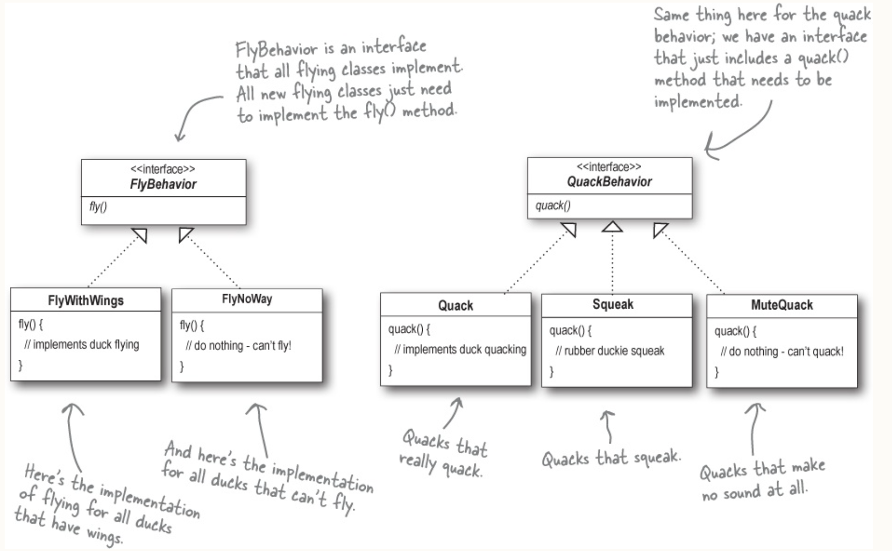
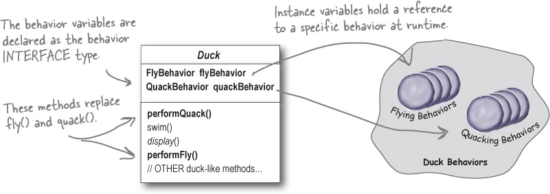
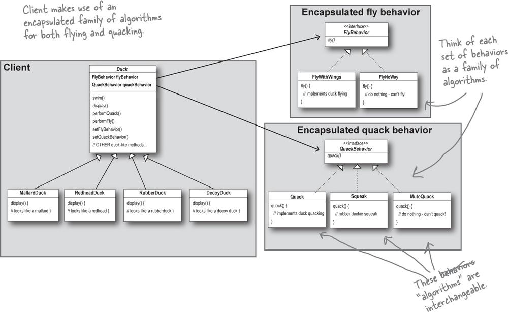
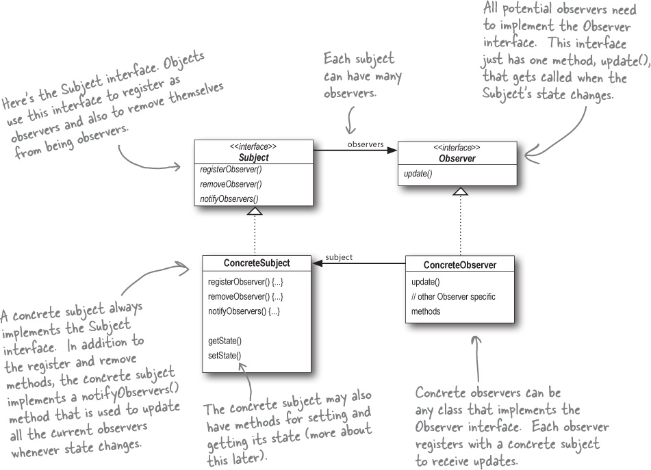
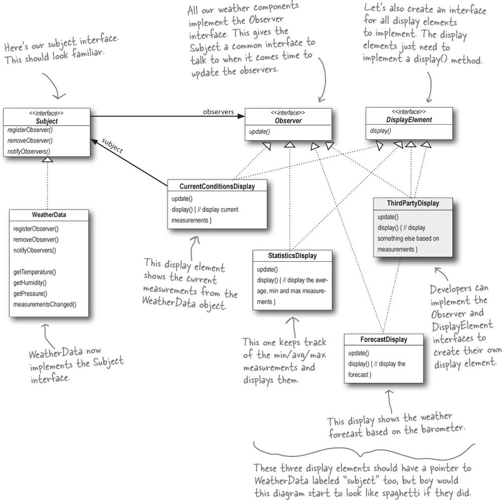
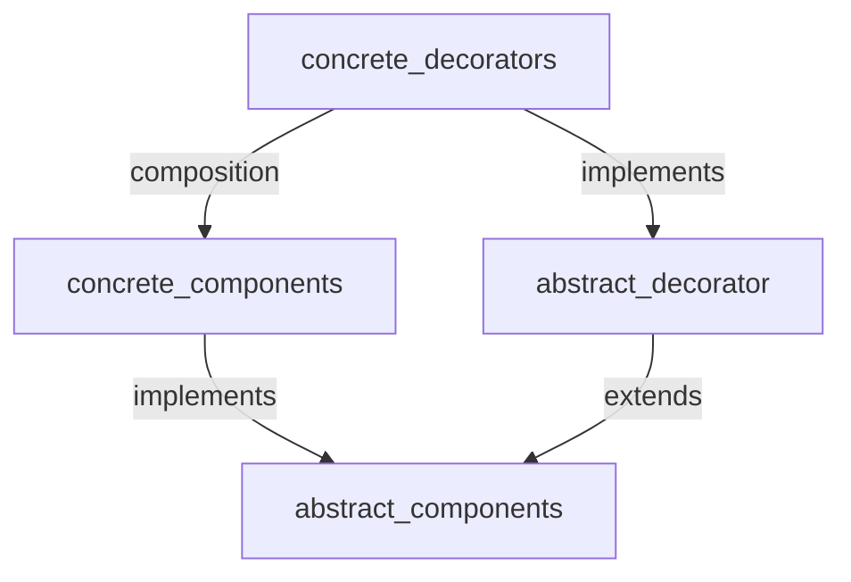

- [Head First Design Patterns](#head-first-design-patterns)
  - [Introduction to Design Patterns](#introduction-to-design-patterns)
  - [Chapter 1. First Design Pattern - Name will be introduced at the end](#chapter-1-first-design-pattern---name-will-be-introduced-at-the-end)
    - [Designing the Duck Behaviors](#designing-the-duck-behaviors)
    - [Integrating the Duck Behavior with Duck](#integrating-the-duck-behavior-with-duck)
    - [More Integration](#more-integration)
    - [The Big Picture on encapsulated behaviors](#the-big-picture-on-encapsulated-behaviors)
    - [HAS-A can be better than IS-A](#has-a-can-be-better-than-is-a)
  - [Chapter 2. The Observer Pattern: Keeping your Objects in the know](#chapter-2-the-observer-pattern-keeping-your-objects-in-the-know)
    - [Publisher + Subscriber = Observer Pattern](#publisher--subscriber--observer-pattern)
    - [The Observer Pattern defined](#the-observer-pattern-defined)
    - [The Observer Pattern defined: the class diagram](#the-observer-pattern-defined-the-class-diagram)
    - [The Power of Loose Coupling](#the-power-of-loose-coupling)
    - [Designing the Weather Station](#designing-the-weather-station)
    - [Implementing the Weather Station](#implementing-the-weather-station)
    - [Implementing the Subject interface in WeatherData](#implementing-the-subject-interface-in-weatherdata)
    - [Now, let’s build those display elements](#now-lets-build-those-display-elements)
    - [Test](#test)
  - [Decorator Pattern : Structural Design Pattern](#decorator-pattern--structural-design-pattern)
    - [Inheritance vs Composition](#inheritance-vs-composition)
    - [Diagram](#diagram)
  - [Factory Design Pattern](#factory-design-pattern)
  - [Singleton Design Pattern](#singleton-design-pattern)
  - [Command Pattern](#command-pattern)
  - [Chapter 7. Adaptor and Facade (मुखौटा) Design Pattern](#chapter-7-adaptor-and-facade-मुखौटा-design-pattern)
    - [Adaptor Pattern](#adaptor-pattern)
    - [Object Adaptor and Class Adaptor](#object-adaptor-and-class-adaptor)
    - [Real-world Adaptors](#real-world-adaptors)
      - [New world Iterators](#new-world-iterators)
      - [Old world Enumerator](#old-world-enumerator)
    - [Comparision b/w similar looking pattern](#comparision-bw-similar-looking-pattern)
    - [Facade Pattern](#facade-pattern)
      - [The Principle of Least Knowledge](#the-principle-of-least-knowledge)


# Head First Design Patterns

Book - Head First Design Patterns (Eric Freeman et. al.)

## Introduction to Design Patterns
- Why should I use design patterns ? 
  - Why not? You can leverage the knowledge and lessons learned from other developers who have faced similar design challenges and successfully navigated them.
- Functional or non-functional requirements often change over time in a project, and writing maintainable and extensible code is essential for software to thrive.
- Design patterns don’t go directly into your code, they first go into your BRAIN. Once you’ve loaded your brain with a good working knowledge of patterns, you can then start to apply them to your new designs, and rework your old code when you find it’s degrading into an inflexible mess of jungle spaghetti code.
- Patterns aren’t invented, they are discovered.
- Patterns provide a shared language that can maximize the value of your communication with other developers.
- Patterns are proven object-oriented experience.
- Good OO designs are reusable, extensible, and maintainable.
- Knowing the OO basics does not make you a good OO designer.

## Chapter 1. First Design Pattern - Name will be introduced at the end

- Will start with an example 
    <details>
    <summary> Simple SimUDuck App </summary>

    - `Duck` is a super class and all other class inherits the `Duck` superclass 
    ```java
    class Duck {
        void quack() 
        void swim()
        void display()
    }

    class MallardDuck extends Duck {
        void display() {
            log.info("Mallard duck - method override");
        }
    }

    class RedheadDuck extends Duck {
        void display() {
            log.info("ReadHead duck - method override");
        }
    }
    ```

    </details>

- But now we need the ducks to FLY 
  - How hard can this be ? - I'll simply add a `fly()` method in `Duck` class and that's all 
- But now something went wrong - Why are rubber flying ? 
  - You failed to notice that not *all* subclasses of `Duck` should fly

>[!NOTE] 
> A localized update to the code caused nonlocal side effects (flying rubber ducks)!

- What happened ? 
  - What you have thought was a great use of inheritance for the purpose of **reuse** hasn't turned out so well when it comes to maintenance 
- What If I override these method in the sub-classes ? 
  - No, don't even think that. What would you do when it comes to wooden ducks. They aren't suppose to be fly or quack..
- Ok, fine How about *interfaces* ?
    <details>
    <summary> Expermient with intefaces : Move fly and quack to an interface </summary>

    ```java
    // modified Duck class 
    public class Duck {
        public void swim() {}
        public void display() {}
    }

    public interface Flyable {
        void fly() {}
    }

    public interface Quackable {
        void quack() {}
    }

    public MallardDuck extends Duck implements Quackable {
        void quack() {
            log.info("Mallard duck quack");
        }
    }
    ```
    </details>

- Isn't this nice ? 
  - Nope, code reuse nahi hoga. Har duck ko manually fly aur quack ka behavior likhna padega, jo duplicate code aur maintenance problems create karega.
  - The above will become a maintenance nightmare for you

- Now what ? Summary till this point 
  - Can't use inheritance because not all subclasses have flying or quacking behavior
- Using interfaces like *Flyable* and *Quackable* solves the problem partially but creates maintenance nightware and no code resuability

- Our first lesson

>[!NOTE]
> Identify the aspects of you application that vary and separate them from what stays the same.
> Take what varies and encapsulate it so it won't affect rest of your code 

- Okay, time to pull out the Duck behavior out of `Duck` class
- We know that `fly` and `quack` are the parts of the `Duck` class that vary across ducks.
- To separate these behaviors from the `Duck` class, we’ll pull both methods out of the `Duck` class and create a new set of classes to represent each behavior.

### Designing the Duck Behaviors
- First we'll try to address the issue of not exposing implementation of `fly` and `quack` to each class and rather than we want to abstract this out from the type of Ducks
- Also, we'd like to keep thing flexible; how about if we can change the behavior of a duck at runtime. This is also in parallel to first point. If you have hardcoded implmentation in each subclass, changing it at runtime not possible

- From now on, the Duck behaviors will live in separate class - a class that implements a particular **behavior interface**.

>[!NOTE]
> Program to an interface, not an implementation 

<details>
<summary> What is diff b/w Programming to an implementation vs inteface/supertype</summary>

```java

// Programming to an Implementation 

Dog d = new Dog(); // Declaring variable as type 'Dog' forces us to code to a concrete implementation
d.bark();

// Programming to an interface

Animal animal = new Dog(); // polymorphism, method dispatch according to the type at runtime 
animal.makeSound();

// And even better, rather than hardcoding the instantiation of the subtype (like new Dog()) into the code, assign the concrete type 

a = getAnimal();
a.makeSound();

// We don’t know WHAT the actual animal subtype is... all we care about is that it knows how to respond to makeSound().

```
</details>


<details>
<summary> Behavior interfaces </summary>

```java
public interface FlyBehavior {
    void fly()
}


public class FlyWithWings implements FlyBehavior {
    void fly() {
        log.info("Fly with wings");
    }
}

public class FlyNoWay implements FlyBehavior {
    void fly() {
        log.info("Can't fly");
    }
}
```

</details>




- Ab yeh design ke sath: Fly aur Quack behaviors kisi aur type ke objects (like planes or robots) bhi reuse kar sakte hain, kyunki yeh behaviors ab Duck class se directly attached nahi hain.
- Aur sabse bada fayda: Agar hum ek naya behavior add karna chaahein (like FlyWithJetPack ya DanceWhileFlying), toh na purane behavior classes ko change karna padega, na hi Ducks ke code ko chhedna padega.
- Ekdum flexible aur mast reusable design ban gaya hai!


<details>
<summary> Question from book </summary>

Q: It feels a little weird to have a class that’s just a behavior. Aren’t classes supposed to represent things? Aren’t classes supposed to have both state AND behavior?

A: In an OO system, yes, classes represent things that generally have both state (instance variables) and methods. And in this case, the thing happens to be a behavior. But even a behavior can still have state and methods; a flying behavior might have instance variables representing the attributes for the flying (wing beats per minute, max altitude, and speed, etc.) behavior.

</details>


### Integrating the Duck Behavior with Duck 

- Ab Duck apne fly aur quack karne ka kaam khud nahi karega, balki yeh kaam alag behavior classes ko delegate karega. Matlab, Duck class ya uske subclass ke andar fly aur quack methods nahi honge; woh alag se define kiye behaviors ko use karega.
- First we'll add two instance variables to the `Duck` class called *flyBehavior* and *quackBehavior*

    


</details>


<details>
<summary> Integrating the Duck Behavior with Duck </summary>

```java
public class Duck 
    QuackBehavior quackBehavior;
    // delegate the handling of quack to object referenced by quackBehavior
    public void performQuack() {
        // In this part of the code we don’t care what kind of object it is, all we care about is that it knows how to quack()!
        quackBehavior.quack();
    }
}
```

</details>

### More Integration 

<details>
<summary> Integrating the Duck Behavior with Duck </summary>

```java

public class Duck {}

public class MallardDuck extends Duck {
    
    public MallardDuck () {
        quackBehavior = new Quack();
        flyBehavior = new FlyWithWings();
    }

    public void display() {

    }
}
```

</details>

- But wait a second. Didn't you say we should NOT program to an implementation ? But what we are doing in that constructor ? We're making a new instance of concrete Quack implementation class!
  - That is right.  Later we’ll have more patterns in our toolbox that can help us fix it.


<details>
<summary> Duck Class </summary>

```java

public class Duck {
    FlyBehavior flyBehavior;
    QuackBehavior quackBehavior;

    void swim()
    void display()

    void performQuack()
    void performFly()

    void setFlyBehavior()
    void setQuackBehavior()

}
```

</details>


### The Big Picture on encapsulated behaviors 


   

- Notice also that we’ve started to describe things a little differently. Instead of thinking of the duck behaviors as a set of behaviors, we’ll start thinking of them as a *family of algorithms*.

### HAS-A can be better than IS-A
- The HAS-A relationship is an interesting one: each duck has a FlyBehavior and a QuackBehavior to which it delegates flying and quacking.
- When you put two classes together like this you’re using composition. Instead of inheriting their behavior, the ducks get their behavior by being composed with the right behavior object.

>[!NOTE]
> This is an important technique; in fact, we’ve been using our third design principle. Favor composition over inheritance. 

- As you’ve seen, creating systems using composition gives you a lot more flexibility
- You just applied your first design pattern—the STRATEGY Pattern. That’s right, you used the Strategy Pattern to rework the SimUDuck app. Thanks to this pattern

>[!IMPORTANT]
> The Strategy Pattern defines a family of algorithms, encapsulates each one, and makes them interchangeable. Strategy lets the algorithm vary independently from clients that use it.
> Use THIS definition when you need to impress friends and influence key executives.

## Chapter 2. The Observer Pattern: Keeping your Objects in the know

### Publisher + Subscriber = Observer Pattern 
- If you understand newspaper subscriptions, you pretty much understand the Observer Pattern, only we call the publisher the SUBJECT and the subscribers the OBSERVERS.
- An Example
    <details>
    <summary> Weather Application </summary>
    - Multiple screens, each show temperature, humidity and pressure. In future more screen can be introduced and more variables to the screen 
    - Bad Design

    ```java      
    public void measurementsChanged() {
        float temp = getTemperature();
        float humidity = getHumidity();
        float pressure = getPressure();
        
        currentConditionDisplay.update(temp, humidity, pressure);
        statisticConditionDispaly.update(temp, humidity, pressure);
        forecastDisplay.update(temp, humidity, pressure);
    }
    ```

    - What is wrong ?
        - Coding to concrete implementation i.e `currentConditionDisplay`
        - Area of change i.e., more variables can be added to an display. We need to encapsulate this

    </details>

### The Observer Pattern defined

> [!NOTE]
> The Observer Pattern defines a one-to-many dependency between objects so that when one object changes state, all of its dependents are notified and updated automatically.
> The Observer Pattern defines a one-to-many relationship between a set of objects.
> When the state of one object changes, all of its dependents are notified.

### The Observer Pattern defined: the class diagram




- Q: How does dependence come into this?
  - Because the subject is the sole owner of that data, the observers are dependent on the subject to update them when the data changes. This leads to a cleaner OO design than allowing many objects to control the same data.

### The Power of Loose Coupling 
- With this lets introduce the concept of **Loose Coupling** 
  - When two objects are loosely coupled, they can interact, but have very little knowledge of each other.
  - Same is the case with *Subject* and *Observer* 
- The only thing the subject knows about an observer is that it implements a certain interface (the Observer interface). It doesn’t need to know the concrete class of the observer, what it does, or anything else about it.
  - We can add new observers at any time
  - We never need to modify the subject to add new type of observers
  - We can re-use both independent of each other
  - Changes to either will not affect the other

>[!IMPORTANT]
> Design Principle
> Strive for loosely coupled designs between objects that interact. 
> Loosely coupled designs allow us to build **flexible** OO systems that can handle change because they minimize the interdependency between objects.

### Designing the Weather Station



### Implementing the Weather Station

<details>
<summary> Interfaces </summary>

```java

public interface Subject {
    public void registerObserver(Observer o);
    public void removeObserver(Observer o);
    public void notifyObservers();
}

public interface Observer {
    public void update(float temp, float humidity, float pressure);
}

public inteface DisplayElement {
    public void display();
}

```

</details>


### Implementing the Subject interface in WeatherData

<details>
<summary> Implementing subject interface in weather data </summary>

```java
public class WeatherData implements Subject {
    private ArrayList<Observer> observers;
    private float temperature;
    private float humidity;
    private float pressure;

    public WeatherData() {
        observers = new ArrayList<Observer>();
    }

    public void registerObserver(Observer o) {
        observers.add(o);
    }

    public void removeObserver(Observer o) {
        int i = observers.indexOf(o);
        if (i >= 0) {
            observers.remove(i);
        }
    }

    public void notifyObservers() {
        for (Observer o: observers) {
            o.update(temperature, humidity, pressure);
        }
    }

    public void measurementsChanged() {
        notifyObservers();
    }

    public void setMeasurements(float temperature, float humidity, 
            float pressure) {
        this.temperature = temperature;
        this.humidity = humidity;
        this.pressure = pressure;
        measurementsChanged();
    }
}
```

</details>


### Now, let’s build those display elements

<details>
<summary> Current Condition Display </summary>

```java

public class CurrentConditionsDisplay implements Observer, DisplayElement {
    private float temperature;
    private float humidity;
    
    private Subject weatherDataBejneBala; 

    public CurrentConditionsDisplay(Subject weatherDataBejneBala) {
        this.weatherDataBejneBala = weatherDataBejneBala;
        weatherDataBejneBala.registerObserver(this);
    }

    public void update(float temperature, float humidity, float pressure) {
        this.temperature = temperature;
        this.humidity = humidity;
        display();
    }

    public void display() {

    }
}

```
Q: Why did you store a reference to the Subject? It doesn’t look like you use it again after the constructor.

A: True, but in the future we may want to un-register ourselves as an observer and it would be handy to already have a reference to the subject.

</details>

### Test 


<details>
<summary> Test WeatherStation </summary>

```java

public class WeatherStation {
    
    public static void main(String[] args) {
        WeatherData weatherDataBejneBala = new WeatherData();

        CurrentConditionsDisplay currentDisplay 
                = new CurrentConditionsDisplay(weatherDataBejneBala);

        weatherDataBejneBala.setMeasurements(11, 143, 28);

    }
}
```

</details>


## Decorator Pattern : Structural Design Pattern
- attaching new behaviours to object by placing these objects into a special **wrapper** objects that contain the behaviour
  - a wrapper is an object that can be linked with some target object. The wrapper contains the same set of methods as the target and delegates to it all requests it receives
- attach responsibilities to an object dynamically, provides flexible alternative to subclassing for extending functionality
- based on **open-closed principal**
  - class should remain open to extension and closed to modification
- decorator have the **same supertype** as the object they decorate
  - pass in decorated object in place of original object
  - implement same **interface** or **abstract class** as the component they are going to decorate
  - decorator adds its own behaviour either before or after delegating to the object it decorates to do the rest of the job
- extending functionality by either **subclassing** (inheritance) or **composition**
- we are subclassing the same interface or abstract class to have the correct type (type matching), not to inherit its behaviour
  - behaviour comes in through **composition** of decorators with the base components as well as other decorators
- **Problems :** 
  - sometimes add a lot of small classes to a design, which makes it difficult for others to understand. For eg: if we saw the classes as wrappers around an InputStream life would be much easier
  - some code is dependent upon specific types, and when we start introducing decorators here bad things happen
  - complexity of code needed to instantiate the component

### Inheritance vs Composition
- common : work almost the same way
  - composition : one object has a reference to another & delegate it some work
  - inheritance : object itself is able to do that work, inherting behaviour from it's superclass
- diff : through inhertance gets behaviour at compile time, gets whatever behaviour superclass gives us or that we override
  - compiler analyzes the class hierarchy and determines the methods from the superclass and any overridden methods defined in the subclass
- diff : through composition we can mix and match decorators at runtime
  - program creates instances of the composed objects and interacts with their methods based on the specific objects involved
  - subclasses can have just one parent, in most languages 

### Diagram


## Factory Design Pattern
- encapsulate object creation and allows us to decouple our code from concrete types 
- encapsulate behaviour of instantiations, area of frequent change -> client depend only on abstraction / interface
- `new` culprit : real culprit is our old friend **CHANGE**, and how change impacts our use of `new`
  - instantiation is an activity that shouldn't always be done in public and can often leads to coupling problems
  - coupling problems : when time comes for changes / extensions we have to reopen the code (instantiation) & examine what needs to be added (or deleted)
  - moreover it voilates design principal which states that our code should be __**closed for modification**__
  - coding to an interface, insulate ourselves from lot of changes that happens to a system down the road (decoupling high level components i.e abstract creator classes from the concrete implementations of lower level components i.e concrete products)
- another design principal for the resque : __**identify the aspects that vary and separates them from what stays the same**__
  1. creation code is moved out into another object (varies in future) that is going to be concerned with only creation of objects (i.e factory)
  2. replace concrete instantiations with factory methods

1. **simple factory** : not a design pattern but a programming idiom (reusable code snippets that solves common problems in an elegant and efficient ways)
  - class which contain single method that is going to be concerned with only creation of objects (encapsulate all creation code in one object)
  - not gives you flexibility to vary the products that you are creating (extending behaviour via inheritance or composition)
  - **static factory** : simple factory + static method
    - pros, don't have to instantiate an object to make use of create method
    - cons, we can't subclass and change **behaviour** of the create method
2. **factory method pattern** : allowing the subclasses to decide
  > **decide :** creation of actual products is not decided by the subclasses at runtime but by the decision of the subclass that is used
  - handles object creation & encapsulates it in a subclass (encapsulation)
  - decouples the client code in the superclass from the object creation code in the subclass (decoupling)
  a. **the creator classes :** abstract factory method that the subclasses implements to produce products
  b. **the product classes :** factories produces products and product itself is an interface
  - another perspective i.e factory method is a framework that encapsulates product knowledge into each creator
  - both product and creator classes have parallel heirarchies where the abstract classes of both are extended by the concrete classes which knew about specific implementation
- **dependency inversion principal :** __**depend on abstractions & do not depend on concrete classes**__
  - helps in avoiding dependencies on concrete types and to strive for abstractions
  - high level components should not depend on low level components rather they should **both** depend on abstractions
    - high level component is a class with behaviour defined in terms of other low-level components
    ```mermaid
    graph TD;
    high-level-components --> abstraction;
    low-level-components --> abstraction;
    ```
  - inversion : 
    - top down dependency chart from high-level components to low-level components inverted itself, with both high-level & low-level modules now depending upon the abstractions
    - inversion in thinking : both high-level components and low-level coomponents depend upon an abstraction
  - rules for following dependency inversion principal :
    - no variable should hold reference to concrete class, use factory is we are using `new`
    - no class should derive from a concrete class, as it means that we are dependent on a concrete class
    - no method should override an implemented method of any of its base classes, as it means our base class wasn't really an abstraction to start with
  > **every single java program ever written voilates these guidelines** but they have a good reason for doing so. Eg : if a class is never suppose to be change like `String` then it might be ok to init it always, but on other hand if you class change, you have some good technique like Factory Method to encapsulate the change
3. **abstract factory pattern**
  - interface for creating families of related or dependent objects without having to depend on their concrete classes
  - each method in an abstract factory looks like a factory method i.e subclasses override it to create some object
- factory method relied on inheritance whereas abstract factory relies on object composition
- all factory patterns promotes loose coupling by reducing dependency of our application on concrete classes

## Singleton Design Pattern
- Ensures : 
  1. ensures class has only one instance
    - taking class and letting it manage a single instance of itself
  2. provides a global point of access to it
    - query class and it will hand you back the single instance
  3. singleton object is initialized only when it's requested for the first time (`lazy initialization` of resource-intensive objects) 
- Optimization for multiple threads (multi-threading) :
  1. synchronized `getInstance()` method
    - synchronizing a method can decrease performance by a factor of 100, so if a high-traffic part of your code begins using getInstance(), you may have to reconsider
  2. eagerly creating instance rather than lazily created one
    - static references to objects, always going to initialize instance in our code
    - rely on the JVM to create the unique instance of the Singleton when the class is loaded
    - JVM guarantees that the instance would be created before any thread accesses the static `uniqueInstance` variable
  3. `double checking locking` to reduce use of synchronization in `getInstance()`
    - double-checked locking, we first check to see if an instance is created, and if not, THEN we synchronize over the class and again check if an instance got created in the meantime.
    - instance creation will never take place without synchronization
- Identification : 
  - Singleton can be recognized by a static creation method, which returns the same cached object
- Problems with subclassing a Singleton
  1. cannot extend class with private constructor
  2. all derived classes will share the same instance variable

## Command Pattern
- 1. encapsulate method invocation, 
  - object invoking the computation doesn't need to worry about how to do things
  - reuse them to implement undo in the code
- command pattern
  - separation of concern : decouple the requester of an action from the object that actually performs the action
  - command object encapsulates a request to do something on a specific object (vendor specific) along with the object that needs to do it
  - can also help in undoing an action
- definition
  - command pattern ensures class has only one instance and provides global point of access to it
  - command object is a way to package a piece of computation
    - specific receiver
    - set of actions on specific receiver
    - pass it around as a first-class object
  - supports decoupling of the invoker of a request and the receiver of the request
- null object
  - useful when you don't have a meaningful object to return
  - want to remove the responsibility for handling null from the client
- 2. undo button
  - whatever `execute()` method of Command object did last, `undo()` reverses it
    - Command interface will have two abstract methods namely `undo()` and `execute()`
  - storing previous state into the Command object itself, used by the `undo()` method
- 3. macro command
  - new kind of Command that executes other Command's
  - decide dynamically which commands you want to go into the macro command, which results in more flexibility
- Command pattern needs a lot of Command classes (Lambda Expressions)
  - two Command classes for each receiver class
  - take out the bits of computation from inside the concrete Command implementations and use them directly instead (Lambda Expressions)
  - for lambda expressions to work : 
    - as long as the interface of the parameter we’re passing the lambda expression to has one (and only one!) method, 
    - and that method has a compatible signature with the lambda expression (arguments and return value)
  - lambda expressions captures variables from the surrounding scope
  - functional interface : interface that has just one method, lambda expressions are meant to be used with functional interfaces
  - lambda expressions is a replacement for a single method, not an entire object
> **first class object** :   
> i. entity that can be dynamically created, destroyed  
> ii. passed to a function, returned as a value
- 4. logging requests
  - log all actions and recover after a crash by invoking those actions
- 5. Queuing of requests
  - Job Queues, Thread Pools, Schedulers
  - you add commands to the queue on one end, and on the other end sits a group of threads
  - threads run the following script: they remove a command from the queue, call its execute() method, wait for the call to finish, then discard the command object and retrieve a new one.


## Chapter 7. Adaptor and Facade (मुखौटा) Design Pattern

### Adaptor Pattern

- Let say if you project is using an interface A from some vendor X; Now you are planning to shift to a vendor Y. But vendor Y has designed their interfaces different from vendor X
- Now you are not willing to change your code (and you can't change the vendors code)
- Here Adaptor comes into picture as a middleman
  - (Your code) -- request -- (Adaptor) - translated request -- (Vendor class)
  <details>
   <summary> Example in Java </summary>

    ```java


    public interface Duck {
        public void quack();
        public void fly();
    }

    public class MallardDuck implements Duck {
        public void quack() {
            log.info("Quack");
        }
        public void fly() {
            log.info("fly");
        }
    }


    public interface Turkey {
        public void gobble();
        public void fly();
    }

    public class WildTurkey implements Turkey {
        public void gobble() {
            log.info("gobble");
        }
        public void fly() {
            log.info("fly");
        }
    }
    ```

    - Implements the interface you're adapting to 
    
    ```java
    public class TurkeyAdaptor implements Duck {
        Turkey turkey;

        public TurkeyAdaptor(Turkey turkey) {
            this.turkey = turkey;
        }

        public void quack() {
            turkey.gobble();
        }

        public void fly() {
            for (int i = 0; i < 5; ++i) {
                turkey.fly();   
            }
        }
    }
    ```

    - Test 
    ```java
    public class DuckTestDrive {
        public static void main(String[] args) {
            MallardDuck duck = new MallardDuck();
            WildTurkey turkey = new WildTurkey();

            Duck turkeyInDressOfDuck = new TurkeyAdaptor(turkey);
            
            turkey.gobble();
            turkey.fly();

            testDuck(duck);
            testDuck(turkeyInDressOfDuck);
        }

        static void testDuck(Duck duck) {
            duck.quack();
            duck.fly();
        }
    }
    ```

  </details>


    > Definition: The Adapter Pattern converts the interface of a class into another interface the clients expect. Adapter lets classes work together that couldn’t otherwise because of incompatible interfaces.

- Adaptor is composed with the Adaptee 
- All request are delegated to the Adaptee
- Adaptor is full of good OO design principle; Uses object composition to wrap the adaptee with an altered interface. This allows us to use adaptor with any of the subclass of the adaptee 

### Object Adaptor and Class Adaptor 
- Class adaptor are not feasible in Java, because this needs multiple inheritance
- Object adaptor are based on the composition 
- The diff b/w two is 
  - In class adaptor you are commited to a one specific adaptee class; where as with object composition you can adapt any subclass of the adaptee because of composition(more flexible)
  - Btw what will happen in case of object adaptor, if subclass add some new behavior ? 

### Real-world Adaptors

#### New world Iterators

```java
public interface Iterator {
    hasNext()
    next()
    remove()
}
```

#### Old world Enumerator 

```java
public interface Enumeration {
    hasMoreElement();
    nextElement();
}
```

- Legacy code contains Enumeration 
- Goal; Target Interface: `Iterator`, Adaptor interface `Enumeration` 
    ```java
    public EnumerationIterator implements Iterator<Object> {

        Enumeration<?> enumeration;

        public EnumerationIterator(Enumeration<?> enumeration) {
            this.enumeration = enumeration;
        }

        public boolean hasNext() {
            return enumeration.hasMoreElements();
        }

        public Object next() {
            return enumeration.nextElement();
        }

        public void remove() {
            throw new UnsupportedOperationException();
        }
    }
    ```


### Comparision b/w similar looking pattern

| Pattern | Intent |
|----|---|
Decorator | Convert one interface into another
Adaptor | Doesn't alter interface, but adds resposibility 
Facade | Makes an interface simpler

### Facade Pattern
- Purpose is to simplifies an interface and decouple a client from a subsystem of components
  - (Complex subsystem) wrapped by an easy looking interface and simplify the interaction to the subsystem
- Facade Pattern allows you to decouple your client implementation from any one subsystem.
- Facade intent is to simplify, while an adaptor's is to convert the interface to something different
  <details>
  <summary> An HomeTheaterFacade </summary>

    ```java
    public class HomeTheaterFacade {
        Ampifier amp;
        Tuner tuner;
        DvdPlayer dvd;
        CdPlayer cd;
        Projector projector;
        TheaterLights lights;
        Screen screen;
        PopcornPopper popper;

        public HomeTheaterFacade(Ampifier amp,
                Tuner tuner,
                DvdPlayer dvd,
                CdPlayer cd,
                Projector projector,
                TheaterLights lights,
                Screen screen,
                PopcornPopper popper) {
            this.amp = amp;
            ...
        }


        public watchMovie(String movie) {
            log.info("Get ready..");
            popper.on();
            popper.pop();
            lights.dim(10);
            screen.down();
            projecter.on();
            projector.wideScreenMode();
            amp.on();
            amp.setDvd(dvd);
            ...
            dvd.play(movie);
        }

        public void endMovie() {
            *.off();
        }
    }
    ```
  - Time to watch movie 
    ```java
    public class HomeTheatherTestDrive {
        public static void main(String[] args) {
            HomeTheaterFacade homeTheater = new HomeTheaterFacade(amp, tuner, 
                    dvd, cd, projector, screen, lights, popper);
            homeTheater.watchMovie("");
            homeTheater.endMovie();
        }
    }

    ```

  </details>


    > The Facade Pattern provides a unified interface to a set of interfaces in a subsystem. Facade defines a higher-level interface that makes the subsystem easier to use.

- Facade is fairly straightforward; there are no mind-bending abstractions to get your head around. 
  - But that doesn’t make it any less powerful: the Facade Pattern allows us to avoid tight coupling between clients and subsystems

#### The Principle of Least Knowledge 
- Reduce the interactions b/w objects to just few close "friends"
    > Design Principle: Principle of Least Knowledge: talk only to your immediate friends.
- This principle prevents us from creating designs that have a large number of classes coupled together so that changes in one part of the system cascade to other parts
- When you build a lot of dependencies between many classes, you are building a fragile system that will be costly to maintain and complex for others to understand.