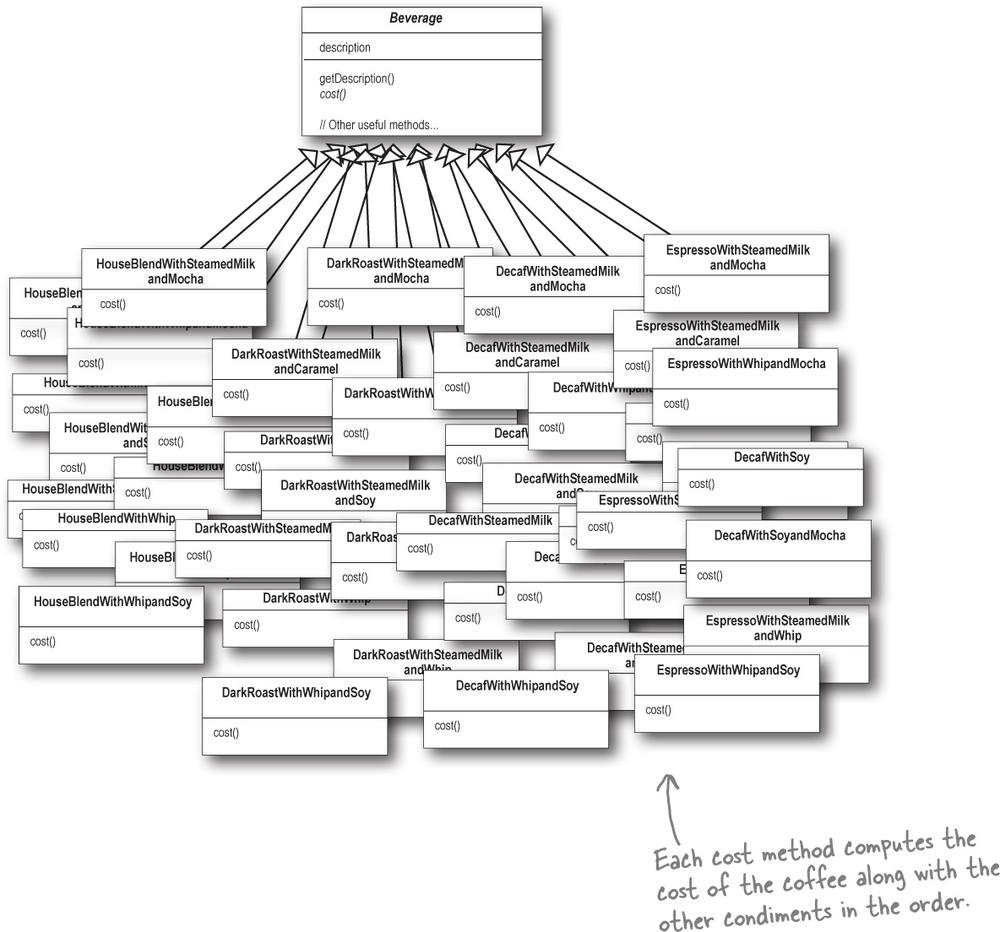
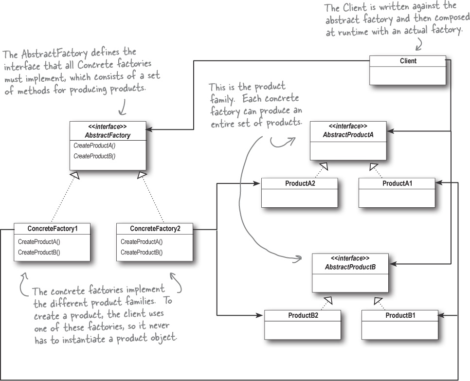

- [Head First Design Patterns](#head-first-design-patterns)
  - [Introduction to Design Patterns](#introduction-to-design-patterns)
  - [Chapter 1. First Design Pattern - Name will be introduced at the end](#chapter-1-first-design-pattern---name-will-be-introduced-at-the-end)
    - [Designing the Duck Behaviors](#designing-the-duck-behaviors)
    - [Integrating the Duck Behavior with Duck](#integrating-the-duck-behavior-with-duck)
    - [More Integration](#more-integration)
    - [The Big Picture on encapsulated behaviors](#the-big-picture-on-encapsulated-behaviors)
    - [HAS-A can be better than IS-A](#has-a-can-be-better-than-is-a)
    - [Applicability](#applicability)
    - [One more Example](#one-more-example)
  - [Chapter 2. The Observer Pattern: Keeping your Objects in the know](#chapter-2-the-observer-pattern-keeping-your-objects-in-the-know)
    - [Publisher + Subscriber = Observer Pattern](#publisher--subscriber--observer-pattern)
    - [The Observer Pattern defined](#the-observer-pattern-defined)
    - [The Observer Pattern defined: the class diagram](#the-observer-pattern-defined-the-class-diagram)
    - [The Power of Loose Coupling](#the-power-of-loose-coupling)
    - [Designing the Weather Station](#designing-the-weather-station)
    - [Implementing the Weather Station](#implementing-the-weather-station)
    - [Implementing the Subject interface in WeatherData](#implementing-the-subject-interface-in-weatherdata)
    - [Now, let’s build those display elements](#now-lets-build-those-display-elements)
    - [Test](#test)
    - [How Java's built-in Observer Pattern works](#how-javas-built-in-observer-pattern-works)
    - [Reworking the Weather Station with the built-in support](#reworking-the-weather-station-with-the-built-in-support)
    - [The dark side of java.util.Observable](#the-dark-side-of-javautilobservable)
    - [Bullet Point](#bullet-point)
    - [So, far](#so-far)
    - [One more Example](#one-more-example-1)
  - [Chapter 3. Decorator Pattern: Structural Design Pattern](#chapter-3-decorator-pattern-structural-design-pattern)
    - [Welcome to Starbuzz Coffee](#welcome-to-starbuzz-coffee)
    - [The Open-Closed Principle](#the-open-closed-principle)
    - [Meet the Decorator Pattern](#meet-the-decorator-pattern)
    - [The Decorator Pattern defined](#the-decorator-pattern-defined)
    - [Decorating our Beverages](#decorating-our-beverages)
    - [Some Confusion over Inheritance versus Composition](#some-confusion-over-inheritance-versus-composition)
    - [Writing the Starbuzz code](#writing-the-starbuzz-code)
    - [If interface was used ...](#if-interface-was-used-)
    - [Summary](#summary)
    - [Inheritance vs Composition](#inheritance-vs-composition)
    - [Diagram](#diagram)
  - [Chapter 4. The Factory Pattern: Baking the OO Goodness](#chapter-4-the-factory-pattern-baking-the-oo-goodness)
    - [Example - Pizza Shop](#example---pizza-shop)
    - [Encapsulating object creation](#encapsulating-object-creation)
    - [Reworking the PizzaStore class](#reworking-the-pizzastore-class)
    - [Franchising the pizza store](#franchising-the-pizza-store)
    - [But you’d like a little more quality control...](#but-youd-like-a-little-more-quality-control)
    - [A framework for the pizza store](#a-framework-for-the-pizza-store)
    - [Allowing the subclasses to decide](#allowing-the-subclasses-to-decide)
    - [Let’s make a PizzaStore](#lets-make-a-pizzastore)
    - [Let’s see how it works: ordering pizzas with the pizza factory method](#lets-see-how-it-works-ordering-pizzas-with-the-pizza-factory-method)
    - [Parallel Class Hierarchies](#parallel-class-hierarchies)
    - [The Dependency Inversion Principle](#the-dependency-inversion-principle)
    - [Building the ingredient factories](#building-the-ingredient-factories)
    - [Summary](#summary-1)
  - [Chapter 5. The Singleton Pattern: One of a Kind Objects](#chapter-5-the-singleton-pattern-one-of-a-kind-objects)
    - [The Little Singleton](#the-little-singleton)
    - [Optimization for multiple threads.](#optimization-for-multiple-threads)
  - [Chapter 6. The Command Pattern: Encapsulating Invocation](#chapter-6-the-command-pattern-encapsulating-invocation)
  - [Chapter 7. Adaptor and Facade (मुखौटा) Design Pattern](#chapter-7-adaptor-and-facade-मुखौटा-design-pattern)
    - [Adaptor Pattern](#adaptor-pattern)
    - [Object Adaptor and Class Adaptor](#object-adaptor-and-class-adaptor)
    - [Real-world Adaptors](#real-world-adaptors)
      - [New world Iterators](#new-world-iterators)
      - [Old world Enumerator](#old-world-enumerator)
    - [Comparision b/w similar looking pattern](#comparision-bw-similar-looking-pattern)
    - [Facade Pattern](#facade-pattern)
      - [The Principle of Least Knowledge](#the-principle-of-least-knowledge)
  - [Chapter 8i. The Builder Pattern](#chapter-8i-the-builder-pattern)
  - [Chapter 9i. The Bridge Pattern](#chapter-9i-the-bridge-pattern)
  - [Chapter 10i. The Chain of Responsibility Pattern](#chapter-10i-the-chain-of-responsibility-pattern)
  - [Chapter 11. The Proxy Pattern](#chapter-11-the-proxy-pattern)


# Head First Design Patterns

- Book - Head First Design Patterns (Eric Freeman et. al.)
- [Refactoring Guru](https://refactoring.guru/)

## Introduction to Design Patterns
- Why should I use design patterns ? 
  - Why not? You can leverage the knowledge and lessons learned from other developers who have faced similar design challenges and successfully navigated them.
- Functional or non-functional requirements often change over time in a project, and writing maintainable and extensible code is essential for software to thrive.
- Design patterns don’t go directly into your code, they first go into your BRAIN. Once you’ve loaded your brain with a good working knowledge of patterns, you can then start to apply them to your new designs, and rework your old code when you find it’s degrading into an inflexible mess of jungle spaghetti code.
- Patterns aren’t invented, they are discovered.
- Patterns provide a shared language that can maximize the value of your communication with other developers.
- Patterns are proven object-oriented experience.
- Good OO designs are reusable, extensible, and maintainable.
- Knowing the OO basics does not make you a good OO designer.

## Chapter 1. First Design Pattern - Name will be introduced at the end

- Will start with an example 
    <details>
    <summary> Simple SimUDuck App </summary>

    - `Duck` is a super class and all other class inherits the `Duck` superclass 
    ```java
    class Duck {
        void quack() 
        void swim()
        void display()
    }

    class MallardDuck extends Duck {
        void display() {
            log.info("Mallard duck - method override");
        }
    }

    class RedheadDuck extends Duck {
        void display() {
            log.info("ReadHead duck - method override");
        }
    }
    ```

    </details>

- But now we need the ducks to FLY 
  - How hard can this be ? - I'll simply add a `fly()` method in `Duck` class and that's all 
- But now something went wrong - Why are rubber flying ? 
  - You failed to notice that not *all* subclasses of `Duck` should fly

>[!NOTE] 
> A localized update to the code caused nonlocal side effects (flying rubber ducks)!

- What happened ? 
  - What you have thought was a great use of inheritance for the purpose of **reuse** hasn't turned out so well when it comes to maintenance 
- What If I override these method in the sub-classes ? 
  - No, don't even think that. What would you do when it comes to wooden ducks. They aren't suppose to be fly or quack..
- Ok, fine How about *interfaces* ?
    <details>
    <summary> Expermient with intefaces : Move fly and quack to an interface </summary>

    ```java
    // modified Duck class 
    public class Duck {
        public void swim() {}
        public void display() {}
    }

    public interface Flyable {
        void fly() {}
    }

    public interface Quackable {
        void quack() {}
    }

    public MallardDuck extends Duck implements Quackable {
        void quack() {
            log.info("Mallard duck quack");
        }
    }
    ```
    </details>

- Isn't this nice ? 
  - Nope, code reuse nahi hoga. Har duck ko manually fly aur quack ka behavior likhna padega, jo duplicate code aur maintenance problems create karega.
  - The above will become a maintenance nightmare for you

- Now what ? Summary till this point 
  - Can't use inheritance because not all subclasses have flying or quacking behavior
- Using interfaces like *Flyable* and *Quackable* solves the problem partially but creates maintenance nightware and no code resuability

- Our first lesson

>[!NOTE]
> Identify the aspects of you application that vary and separate them from what stays the same.
> Take what varies and encapsulate it so it won't affect rest of your code 

- Okay, time to pull out the Duck behavior out of `Duck` class
- We know that `fly` and `quack` are the parts of the `Duck` class that vary across ducks.
- To separate these behaviors from the `Duck` class, we’ll pull both methods out of the `Duck` class and create a new set of classes to represent each behavior.

### Designing the Duck Behaviors
- First we'll try to address the issue of not exposing implementation of `fly` and `quack` to each class and rather than we want to abstract this out from the type of Ducks
- Also, we'd like to keep thing flexible; how about if we can change the behavior of a duck at runtime. This is also in parallel to first point. If you have hardcoded implmentation in each subclass, changing it at runtime not possible

- From now on, the Duck behaviors will live in separate class - a class that implements a particular **behavior interface**.

>[!NOTE]
> Program to an interface, not an implementation 

<details>
<summary> What is diff b/w Programming to an implementation vs inteface/supertype</summary>

```java

// Programming to an Implementation 

Dog d = new Dog(); // Declaring variable as type 'Dog' forces us to code to a concrete implementation
d.bark();

// Programming to an interface

Animal animal = new Dog(); // polymorphism, method dispatch according to the type at runtime 
animal.makeSound();

// And even better, rather than hardcoding the instantiation of the subtype (like new Dog()) into the code, assign the concrete type 

a = getAnimal();
a.makeSound();

// We don’t know WHAT the actual animal subtype is... all we care about is that it knows how to respond to makeSound().

```
</details>


<details>
<summary> Behavior interfaces </summary>

```java
public interface FlyBehavior {
    void fly()
}


public class FlyWithWings implements FlyBehavior {
    void fly() {
        log.info("Fly with wings");
    }
}

public class FlyNoWay implements FlyBehavior {
    void fly() {
        log.info("Can't fly");
    }
}
```

</details>


- Ab yeh design ke sath: Fly aur Quack behaviors kisi aur type ke objects (like planes or robots) bhi reuse kar sakte hain, kyunki yeh behaviors ab Duck class se directly attached nahi hain.
- Aur sabse bada fayda: Agar hum ek naya behavior add karna chaahein (like FlyWithJetPack ya DanceWhileFlying), toh na purane behavior classes ko change karna padega, na hi Ducks ke code ko chhedna padega.
- Ekdum flexible aur mast reusable design ban gaya hai!


<details>
<summary> Question from book </summary>

Q: It feels a little weird to have a class that’s just a behavior. Aren’t classes supposed to represent things? Aren’t classes supposed to have both state AND behavior?

A: In an OO system, yes, classes represent things that generally have both state (instance variables) and methods. And in this case, the thing happens to be a behavior. But even a behavior can still have state and methods; a flying behavior might have instance variables representing the attributes for the flying (wing beats per minute, max altitude, and speed, etc.) behavior.

</details>


### Integrating the Duck Behavior with Duck 

- Ab Duck apne fly aur quack karne ka kaam khud nahi karega, balki yeh kaam alag behavior classes ko delegate karega. Matlab, Duck class ya uske subclass ke andar fly aur quack methods nahi honge; woh alag se define kiye behaviors ko use karega.
- First we'll add two instance variables to the `Duck` class called *flyBehavior* and *quackBehavior*

    


</details>


<details>
<summary> Integrating the Duck Behavior with Duck </summary>

```java
public class Duck 
    QuackBehavior quackBehavior;
    // delegate the handling of quack to object referenced by quackBehavior
    public void performQuack() {
        // In this part of the code we don’t care what kind of object it is, all we care about is that it knows how to quack()!
        quackBehavior.quack();
    }
}
```

</details>

### More Integration 

<details>
<summary> Integrating the Duck Behavior with Duck </summary>

```java

public class Duck {}

public class MallardDuck extends Duck {
    
    public MallardDuck () {
        quackBehavior = new Quack();
        flyBehavior = new FlyWithWings();
    }

    public void display() {

    }
}
```

</details>

- But wait a second. Didn't you say we should NOT program to an implementation ? But what we are doing in that constructor ? We're making a new instance of concrete Quack implementation class!
  - That is right.  Later we’ll have more patterns in our toolbox that can help us fix it.


<details>
<summary> Duck Class </summary>

```java

public class Duck {
    FlyBehavior flyBehavior;
    QuackBehavior quackBehavior;

    void swim()
    void display()

    void performQuack()
    void performFly()

    void setFlyBehavior()
    void setQuackBehavior()

}
```

</details>


### The Big Picture on encapsulated behaviors 


   

- Notice also that we’ve started to describe things a little differently. Instead of thinking of the duck behaviors as a set of behaviors, we’ll start thinking of them as a *family of algorithms*.

### HAS-A can be better than IS-A
- The HAS-A relationship is an interesting one: each duck has a FlyBehavior and a QuackBehavior to which it delegates flying and quacking.
- When you put two classes together like this you’re using composition. Instead of inheriting their behavior, the ducks get their behavior by being composed with the right behavior object.

>[!NOTE]
> This is an important technique; in fact, we’ve been using our third design principle. Favor composition over inheritance. 

- As you’ve seen, creating systems using composition gives you a lot more flexibility
- You just applied your first design pattern—the STRATEGY Pattern. That’s right, you used the Strategy Pattern to rework the SimUDuck app. Thanks to this pattern

>[!IMPORTANT]
> The Strategy Pattern defines a family of algorithms, encapsulates each one, and makes them interchangeable. Strategy lets the algorithm vary independently from clients that use it.
> Use THIS definition when you need to impress friends and influence key executives.

### Applicability 
- Use the Strategy pattern when you want to use different variants of an algorithm within an object and be able to switch from one algorithm to another during runtime.
- Use the Strategy when you have a lot of similar classes that only differ in the way they execute some behavior.
- Use the pattern to isolate the business logic of a class from the implementation details of algorithms that may not be as important in the context of that logic.
- Use the pattern when your class has a massive conditional statement that switches between different variants of the same algorithm.
- 
### One more Example
<details>
<summary> One more Example </summary>

```java      

// Strategy Interface
public interface PaymentStrategy {
    void pay(int amount);
}

// Concrete Strategy 1: Credit Card Payment
public class CreditCardPayment implements PaymentStrategy {
    private String cardNumber;

    public CreditCardPayment(String cardNumber) {
        this.cardNumber = cardNumber;
    }

    @Override
    public void pay(int amount) {
        System.out.println("Paid ₹" + amount + " using Credit Card (Card Number: " + cardNumber + ").");
    }
}

// Concrete Strategy 2: PayPal Payment
public class PayPalPayment implements PaymentStrategy {
    private String email;

    public PayPalPayment(String email) {
        this.email = email;
    }

    @Override
    public void pay(int amount) {
        System.out.println("Paid ₹" + amount + " using PayPal (Email: " + email + ").");
    }
}

// Concrete Strategy 3: UPI Payment
public class UpiPayment implements PaymentStrategy {
    private String upiId;

    public UpiPayment(String upiId) {
        this.upiId = upiId;
    }

    @Override
    public void pay(int amount) {
        System.out.println("Paid ₹" + amount + " using UPI (UPI ID: " + upiId + ").");
    }
}


```


```java
// Context Class
public class PaymentContext {
    private PaymentStrategy paymentStrategy;

    // Inject Strategy dynamically
    public void setPaymentStrategy(PaymentStrategy paymentStrategy) {
        this.paymentStrategy = paymentStrategy;
    }

    public void payAmount(int amount) {
        if (paymentStrategy == null) {
            throw new IllegalStateException("Payment strategy is not set!");
        }
        paymentStrategy.pay(amount);
    }
}

```

```java
public class StrategyPatternExample {
    public static void main(String[] args) {
        PaymentContext context = new PaymentContext();

        // Use Credit Card payment
        context.setPaymentStrategy(new CreditCardPayment("1234-5678-9012-3456"));
        context.payAmount(1500);

        // Use PayPal payment
        context.setPaymentStrategy(new PayPalPayment("user@example.com"));
        context.payAmount(2500);

        // Use UPI payment
        context.setPaymentStrategy(new UpiPayment("user@upi"));
        context.payAmount(1000);
    }
}

```
</details>

## Chapter 2. The Observer Pattern: Keeping your Objects in the know

### Publisher + Subscriber = Observer Pattern 
- If you understand newspaper subscriptions, you pretty much understand the Observer Pattern, only we call the publisher the SUBJECT and the subscribers the OBSERVERS.
- An Example
    <details>
    <summary> Weather Application </summary>
    - Multiple screens, each show temperature, humidity and pressure. In future more screen can be introduced and more variables to the screen 
    - Bad Design

    ```java      
    public void measurementsChanged() {
        float temp = getTemperature();
        float humidity = getHumidity();
        float pressure = getPressure();
        
        currentConditionDisplay.update(temp, humidity, pressure);
        statisticConditionDispaly.update(temp, humidity, pressure);
        forecastDisplay.update(temp, humidity, pressure);
    }
    ```

    - What is wrong ?
        - Coding to concrete implementation i.e `currentConditionDisplay`
        - Area of change i.e., more variables can be added to an display. We need to encapsulate this

    </details>

### The Observer Pattern defined

> [!NOTE]
> The Observer Pattern defines a one-to-many dependency between objects so that when one object changes state, all of its dependents are notified and updated automatically.
> The Observer Pattern defines a one-to-many relationship between a set of objects.
> When the state of one object changes, all of its dependents are notified.

### The Observer Pattern defined: the class diagram


- Q: How does dependence come into this?
  - Because the subject is the sole owner of that data, the observers are dependent on the subject to update them when the data changes. This leads to a cleaner OO design than allowing many objects to control the same data.

### The Power of Loose Coupling 
- With this lets introduce the concept of **Loose Coupling** 
  - When two objects are loosely coupled, they can interact, but have very little knowledge of each other.
  - Same is the case with *Subject* and *Observer* 
- The only thing the subject knows about an observer is that it implements a certain interface (the Observer interface). It doesn’t need to know the concrete class of the observer, what it does, or anything else about it.
  - We can add new observers at any time
  - We never need to modify the subject to add new type of observers
  - We can re-use both independent of each other
  - Changes to either will not affect the other

>[!IMPORTANT]
> Design Principle
> Strive for loosely coupled designs between objects that interact. 
> Loosely coupled designs allow us to build **flexible** OO systems that can handle change because they minimize the interdependency between objects.

### Designing the Weather Station


### Implementing the Weather Station

<details>
<summary> Interfaces </summary>

```java

public interface Subject {
    public void registerObserver(Observer o);
    public void removeObserver(Observer o);
    public void notifyObservers();
}

public interface Observer {
    public void update(float temp, float humidity, float pressure);
}

public inteface DisplayElement {
    public void display();
}

```

</details>


### Implementing the Subject interface in WeatherData

<details>
<summary> Implementing subject interface in weather data </summary>

```java
public class WeatherData implements Subject {
    private ArrayList<Observer> observers;
    private float temperature;
    private float humidity;
    private float pressure;

    public WeatherData() {
        observers = new ArrayList<Observer>();
    }

    public void registerObserver(Observer o) {
        observers.add(o);
    }

    public void removeObserver(Observer o) {
        int i = observers.indexOf(o);
        if (i >= 0) {
            observers.remove(i);
        }
    }

    public void notifyObservers() {
        for (Observer o: observers) {
            o.update(temperature, humidity, pressure);
        }
    }

    public void measurementsChanged() {
        notifyObservers();
    }

    public void setMeasurements(float temperature, float humidity, 
            float pressure) {
        this.temperature = temperature;
        this.humidity = humidity;
        this.pressure = pressure;
        measurementsChanged();
    }
}
```

</details>


### Now, let’s build those display elements

<details>
<summary> Current Condition Display </summary>

```java

public class CurrentConditionsDisplay implements Observer, DisplayElement {
    private float temperature;
    private float humidity;
    
    private Subject weatherDataBejneBala; 

    public CurrentConditionsDisplay(Subject weatherDataBejneBala) {
        this.weatherDataBejneBala = weatherDataBejneBala;
        weatherDataBejneBala.registerObserver(this);
    }

    public void update(float temperature, float humidity, float pressure) {
        this.temperature = temperature;
        this.humidity = humidity;
        display();
    }

    public void display() {

    }
}

```
Q: Why did you store a reference to the Subject? It doesn’t look like you use it again after the constructor.

A: True, but in the future we may want to un-register ourselves as an observer and it would be handy to already have a reference to the subject.

</details>

### Test 


<details>
<summary> Test WeatherStation </summary>

```java

public class WeatherStation {
    
    public static void main(String[] args) {
        WeatherData weatherDataBejneBala = new WeatherData();

        CurrentConditionsDisplay currentDisplay 
                = new CurrentConditionsDisplay(weatherDataBejneBala);

        weatherDataBejneBala.setMeasurements(11, 143, 28);

    }
}
```

</details>

### How Java's built-in Observer Pattern works 
- Java provides `Observer` interface and `Observable` class in `java.util.package`, these are quite similar to our `Subject` and `Observer` interfaces
- With this we can implement either a push or pull style of update to your observer. Till now in our `Subject` and `Observer` is based on push model, where `Subject` push all the data every time to each observer. But we might not require that all the time. May be some observer only require a subset and also they might want to pull data instead waiting for a push

    

- For an Object to become an observer...
  - Implement the Observer interface and call `addObserver()`. Likewise, to remove yourself as an observer, just call `deleteObserver()` 
- For the Observable to send notifications...
  - Extend the `java.util.Observable` superclass. From there it is two step process
  - You first must call the `setChanged()` method to signify that the state has changed in your object.
  - Then, call one of two `notifyObservers()` methods: 
    - `notifyObserver()`: Based on Pull model, or 
    - `notifyObservers(Object arg)` : Based on Push model  
    - On the observer side we have `update(Observable o, Object arg)`
- The `setChanged()` method is used to signify that the state has changed and that `notifyObservers()`, when it is called, should update its observers.

> [!IMPORTANT]
> If notifyObservers() is called without first calling setChanged(), the observers will NOT be notified.

<details>
<summary> Behind the scene </summary>

```java
setChanged() {
    changed = true;
}

notifyObservers(Object arg) {
    if (changed) {
        for every observer on the list {
            call update(this, arg)
        }
        changed = false
    }
}

notifyObserver() {
    notifyObservers(null);
}

```

</details>

- Why `setChanged()` method ? 
  - It gives you more flexibility in how to update observers by allowing you to optimize the notifications 
  - e.g., in our weather station, imagine if our measurements were so sensitive that the temperature readings were constantly fluctuating by a few tenths of a degree. That might cause the WeatherData object to send out notifications constantly. Instead, we might want to send out notifications only if the temperature changes more than half a degree and we could call setChanged() only after that happened.

### Reworking the Weather Station with the built-in support

<details>
<summary> First, let’s rework WeatherData to use java.util.Observable </summary>

```java

import java.util.Observable;

public class WeatherData extends Observable {
    private float temperature;
    private float humidity;
    private float pressure;

    public WeatherData() {}

    public void measurementChanged() {
        setChanged();
        notifyObservers();
    }

    public void setMeasurements(float temperature, float humidity,
            float pressure) {
        this.temperature = temperature;
        this.pressure = pressure;
        this.humidity = humidity;
        measurementChanged();
    }

    public float getTemperature() {
        return temperature;
    }

    public float getHumidity() {
        return humidity;
    }

    public float getPressure() {
        return pressure;
    }
}

```

</details>


<details>
<summary> Now, let’s rework the CurrentConditionsDisplay </summary>

```java
import java.util.Observable;
import java.util.Observer;

public class CurrentConditionsDisplay implements Observer, DisplayElement {
    Observable observable;

    private float temperature;
    private float pressure;

    public CurrentConditionsDisplay(Observable observable) {
        this.observalbe = observable;
        observable.addObserver(this);
    }

    public void update(Observable obs, Object arg) {
        if (arg instanceof WeatherData) {
            WeatherData weatherData = (WeatherData)obj;
            this.temperature = temperature;
            this.pressure = pressure;
            display();
        }
    }

    public void display() {
        log.info("Display the current screen");
    }
}
```

</details>

### The dark side of java.util.Observable
- As you’ve noticed, Observable is a class, not an interface, and worse, it doesn’t even implement an interface.
-  Unfortunately, the java.util.Observable implementation has a number of problems that limit its usefulness and reuse. That’s not to say it doesn’t provide some utility, but there are some large potholes to watch out for.

- Observable is a class
  - You already know from our principles this is a bad idea, but what harm does it really cause?
  - First, because Observable is a class, you have to subclass it. That means you can’t add on the Observable behavior to an existing class that already extends another superclass (In Java you can only extend to one class). This limits its reuse potential (and isn’t that why we are using patterns in the first place?).

### Bullet Point 

- The Observer Pattern defines a one-to-many relationship between objects.
- Subjects, or as we also know them, Observables, update Observers using a common interface.
- Observers are loosely coupled in that the Observable knows nothing about them, other than that they implement the Observer interface.
- You can push or pull data from the Observable when using the pattern (pull is considered more “correct”).
- Don’t depend on a specific order of notification for your Observers.
- Java has several implementations of the Observer Pattern, including the general purpose java.util.Observable.
- Watch out for issues with the java.util.Observable implementation.
- Don’t be afraid to create your own Observable implementation if needed.


### So, far

> [!IMPORTANT]
> Identify the aspects of your application that vary and separate them from what stays the same.
> 
> Program to an interface, not an implementation.
> 
> Favor composition over inheritance.


### One more Example

<details>
<summary> One more Example - Observer Pattern </summary>

```java

import java.util.*;

public interface Observer {
    void update(String stockName, double stockPrice);
}

```

```java
public interface Subject {
    void registerObserver(Observer observer);

    void removeObserver(Observer observer);

    void notifyObservers();
}
```

```java
import java.util.*;

public class Stock implements Subject {
    private String stockName;
    private double stockPrice;
    private List<Observer> observers; // List of registered observers

    public Stock(String stockName, double stockPrice) {
        this.stockName = stockName;
        this.stockPrice = stockPrice;
        this.observers = new ArrayList<>();
    }

    public void setStockPrice(double newPrice) {
        this.stockPrice = newPrice;
        System.out.println("Stock Price updated: " + stockName + " -> ₹" + stockPrice);
        notifyObservers(); // Notify all observers whenever price changes
    }

    @Override
    public void registerObserver(Observer observer) {
        observers.add(observer);
    }

    @Override
    public void removeObserver(Observer observer) {
        observers.remove(observer);
    }

    @Override
    public void notifyObservers() {
        for (Observer observer : observers) {
            observer.update(stockName, stockPrice);
        }
    }
}
```

```java
public class MobileAppNotifier implements Observer {
    private String user;

    public MobileAppNotifier(String user) {
        this.user = user;
    }

    @Override
    public void update(String stockName, double stockPrice) {
        System.out.println("[Mobile App] Hey " + user + ", stock price updated! " + stockName + ": ₹" + stockPrice);
    }
}
```

```java
public class DesktopNotifier implements Observer {
    private String machineName;

    public DesktopNotifier(String machineName) {
        this.machineName = machineName;
    }

    @Override
    public void update(String stockName, double stockPrice) {
        System.out.println("[Desktop Alert] On " + machineName + ", stock update: " + stockName + " -> ₹" + stockPrice);
    }
}
```

```java
public class EmailNotifier implements Observer {
    private String email;

    public EmailNotifier(String email) {
        this.email = email;
    }

    @Override
    public void update(String stockName, double stockPrice) {
        System.out.println("[Email Notification] Sent to " + email + ": " + stockName + " is now ₹" + stockPrice);
    }
}
```

```java
public class ObserverPatternExample {
    public static void main(String[] args) {
        // Create Subject
        Stock appleStock = new Stock("APPLE", 150);

        // Create Observers
        Observer mobileUser1 = new MobileAppNotifier("Investor1");
        Observer desktopNotifier = new DesktopNotifier("Workstation-101");
        Observer emailNotifier = new EmailNotifier("investor@example.com");

        // Register Observers
        appleStock.registerObserver(mobileUser1);
        appleStock.registerObserver(desktopNotifier);
        appleStock.registerObserver(emailNotifier);

        // Update stock price and see notifications
        appleStock.setStockPrice(155); // Price change #1
        appleStock.setStockPrice(160); // Price change #2

        // Remove an Observer
        appleStock.removeObserver(desktopNotifier);

        // Update stock price again
        appleStock.setStockPrice(165); // Price change #3
    }
}
```

</details>

## Chapter 3. Decorator Pattern: Structural Design Pattern

- Remember, power of extension at runtime is way more powerful than at compile time (i.e., subclass)

    

### Welcome to Starbuzz Coffee

- Starbuzz Coffee has made a name for itself as the fastest growing coffee shop around. If you’ve seen one on your local corner, look across the street; you’ll see another one. Because they’ve grown so quickly, they’re scrambling to update their ordering systems to match their beverage offerings.


- In addition to your coffee, you can also ask for several condiments like steamed milk, soy, and mocha (otherwise known as chocolate), and have it all topped off with whipped milk. Starbuzz charges a bit for each of these, so they really need to get them built into their order system.
- Here’s their first attempt...



- That is a maintenance nightmare
- What happens when the price of milk goes up? What do they do when they add a new caramel topping?

### The Open-Closed Principle 

>[!IMPORTANT]
> Classes should be open for extension, but closed for modification.
> we’re open. Feel free to extend our classes with any new behavior you like. If your needs or requirements change (and we know they will), just go ahead and make your own extensions.
> Sorry, we’re closed. That’s right, we spent a lot of time getting this code correct and bug free, so we can’t let you alter the existing code. It must remain closed to modification. 

- Our goal is to allow classes to be easily extended to incorporate new behavior without modifying existing code


### Meet the Decorator Pattern 
- Okay, we’ve seen that representing our beverage plus condiment pricing scheme with inheritance has not worked out very well—we get class explosions and rigid designs, or we add functionality to the base class that isn’t appropriate for some of the subclasses.
- So, here’s what we’ll do instead: we’ll start with a beverage and “decorate” it with the condiments at runtime. For example, if the customer wants a Dark Roast with Mocha and Whip, then we’ll:
  - Take a DarkRoast object
  - Decorate it with a Mocha object
  - Decorate it with a Whip object
  - Call the cost() method and rely on delegation to add on the condiment costs

- **How we'll achieve this ?**
  - Decorators have the same supertype as the objects they decorate.
  - You can use one or more decorators to wrap an object.
  - Given that the decorator has the same supertype as the object it decorates, we can pass around a decorated object in place of the original (wrapped) object.
  - The decorator adds its own behavior either before and/or after delegating to the object it decorates to do the rest of the job.

### The Decorator Pattern defined

>[!IMPORTANT]
> The Decorator Pattern attaches additional responsibilities to an object dynamically. Decorators provide a flexible alternative to subclassing for extending functionality.


### Decorating our Beverages


### Some Confusion over Inheritance versus Composition
- Why does `CondimentDecorator` extending `Beverage`, we discussed that inheritance should be avoided (tight coupling) ? 
  - True. I think the point is that it’s vital that the decorators have the same type as the objects they are going to decorate. So here we’re using inheritance to achieve the type matching, but we aren’t using inheritance to get behavior.
- Although we can still use interface instead of abstract class 


### Writing the Starbuzz code
<details>
<summary> Code </summary>

```java
public abstract class Beverage {
    String description = "Unknown Beverage";
    public enum Size { TALL, GRANDE, VENTI };
    Size size = Size.TALL;

    public String getDescription() {
        return description;
    }

    public abstract double cost();
    }

    public void setSize(Size size) {
        this.size = size;
    }

    public Size getSize() {
        return this.size;
    }
}

```

```java
public abstract class CondimentDecorator extends Beverage {
    public abstract String getDescription();
    public Beverage beverage;

    public Size getSize() {
        return beverage.getSize();
    }
}

public class Soy extends CondimentDecorator {
    public Soy(Beverage beverage) {
        this.beverage = beverage;
    }

    public String getDescription() {
        return beverage.getDescription() + ", Soy";
    }

    public float cost() {

        double cost = beverage.cost();
        if (beverage.getSize() == Size.TALL) {
            cost += 0.10;
        } else if (beverage.getSize() == Size.GRANDE) {
            cost += 0.15;
        } else if (beverage.getSize() == Size.VENTI) {
            cost += 0.20;
        }
        return cost;
    }
}
```

```java
public class Espresso extends Beverage {

    public Espresso() {
        description = "Espresso";
    }

    public double cost() {
        return 1.99;
    }
}

public class HouseBlend extends Beverage {

    public HouseBlend() {
        description = "HouseBlend";
    }

    public double cost() {
        return 1.99;
    }
}
```

```java

public class Mocha extends CondimentDecorator {
    Beverage beverage;

    public Mocha (Beverage beverage) {
        this.beverage = beverage;
    }

    public String getDescription() {
        return beverage.getDescription() + ", Mocha";
    }

    public double cost() {
        return beverage.cost() + 0.28;
    }
}
```

```java

public class StarbuzzCoffee {
    
    public static void main(String[] args) {
        Beverage beverage = new Espresso();

        Beverage beverage2 = new DarkRoast();

        beverage = new Mocha(beverage);
        beverage = new Mocha(beverage);
        beverage = new Whip(beverage);

    }
}
```
</details>


### If interface was used ...

<details>
<summary> Alternate world </summary>

```java
public interface Beverage {
    String getDescription();
    double cost(); 
}

public class Espresso implements Beverage {
    @Override
    public String getDescription() {
        return "Espresso";
    }

    @Override
    public double cost() {
        return 1.99;
    }
}

public class HouseBlend implements Beverage {
    @Override
    public String getDescription() {
        return "House Blend Coffee";
    }

    @Override
    public double cost() {
        return 0.89;
    }
}

```

```java
public interface BeverageDecorator extends Beverage {
    // No extra methods; just ensures type consistency
}

public class Milk implements BeverageDecorator {
    private final Beverage beverage;

    public Milk(Beverage beverage) {
        this.beverage = beverage; // Wrap the beverage
    }

    @Override
    public String getDescription() {
        return beverage.getDescription() + ", Milk";
    }

    @Override
    public double cost() {
        return beverage.cost() + 0.10;
    }
}

public class Mocha implements BeverageDecorator {
    private final Beverage beverage;

    public Mocha(Beverage beverage) {
        this.beverage = beverage; // Wrap the beverage
    }

    @Override
    public String getDescription() {
        return beverage.getDescription() + ", Mocha";
    }

    @Override
    public double cost() {
        return beverage.cost() + 0.20;
    }
}


```

```java
public class CoffeeShop {
    public static void main(String[] args) {
        // Start with Espresso
        Beverage beverage = new Espresso();
        System.out.println(beverage.getDescription() + " $" + beverage.cost());

        // Add Milk
        beverage = new Milk(beverage);
        System.out.println(beverage.getDescription() + " $" + beverage.cost());

        // Add Mocha
        beverage = new Mocha(beverage);
        System.out.println(beverage.getDescription() + " $" + beverage.cost());

        // Add another Mocha
        beverage = new Mocha(beverage);
        System.out.println(beverage.getDescription() + " $" + beverage.cost());
    }
}

```
</details>

### Summary

- Attaching new behaviours to object by placing these objects into a special **wrapper** objects that contain the behaviour
  - A wrapper is an object that can be linked with some target object. The wrapper contains the same set of methods as the target and delegates to it all requests it receives
- Attach responsibilities to an object dynamically, provides flexible alternative to subclassing for extending functionality
- Based on **open-closed principal**
  - class should remain open to extension and closed to modification
- Decorator have the **same supertype** as the object they decorate
  - Pass in decorated object in place of original object
  - Implement same **interface** or **abstract class** as the component they are going to decorate
  - Decorator adds its own behaviour either before or after delegating to the object it decorates to do the rest of the job
- Extending functionality by either **subclassing** (inheritance) or **composition**
- We are subclassing the same interface or abstract class to have the correct type (type matching), not to inherit its behaviour
  - behaviour comes in through **composition** of decorators with the base components as well as other decorators
- **Problems :** 
  - sometimes add a lot of small classes to a design, which makes it difficult for others to understand. For eg: if we saw the classes as wrappers around an InputStream life would be much easier
  - some code is dependent upon specific types, and when we start introducing decorators here bad things happen
  - complexity of code needed to instantiate the component

### Inheritance vs Composition
- Common : Work almost the same way
  - Composition : One object has a reference to another & delegate it some work
  - Inheritance : Object itself is able to do that work, inherting behaviour from it's superclass
- Diff : Through inhertance gets behaviour at compile time, gets whatever behaviour superclass gives us or that we override
  - Compiler analyzes the class hierarchy and determines the methods from the superclass and any overridden methods defined in the subclass
- Diff : Through composition we can mix and match decorators at runtime
  - Program creates instances of the composed objects and interacts with their methods based on the specific objects involved
  - Subclasses can have just one parent, in most languages 

### Diagram

<details>
<summary> Mermaid Diagram </summary>


</details>

## Chapter 4. The Factory Pattern: Baking the OO Goodness
- Creational Design Pattern 
- There is more to making objects than just using `new` operator 
- This concept may seem unconventional at the moment, but we will revisit it later. For now, consider this key principle as the foundation of the pattern: Instantiation should not always be a public activity, as it often leads to coupling issues.
- Remember when we said NO to program to an implementation, but if you notice using `new` is exactly we doing what we said not to do.
- So Yes, when you use `new` you are certainly instantiating a concrete class, so that’s definitely an implementation, not an interface. And it’s a good question; you’ve learned that tying your code to a concrete class can make it more fragile and less flexible.
- There are no issues with `new` but issues are with the our old friend **CHANGE**
- By coding to an interface, you know you can insulate yourself from a lot of changes that might happen to a system down the road. Why? If your code is written to an interface, then it will work with any new classes implementing that interface through polymorphism. So, in other words, your code will not be “closed for modification.” To extend it with new concrete types, you’ll have to reopen it.

### Example - Pizza Shop

<details>
<summary> Pizza </summary>

```java

Pizza orderPizza() {
    Pizza pizza = new Pizza(); // For flexibilty ideally we want this as interface / abstract class
    // But :) both can be init, only concrete type can be init using new
    pizza.prepare();
    pizza.bake();
    pizza.cut();
    pizza.box();
    return pizza;
}
```
- Next Step 

```java

Pizza orderPizza(String type) {
    Pizza pizza;

    if (type.equals("cheese")) {
        pizza = new CheesePizza();
    } else if (type.equals("greek")) {
        pizza = new GreekPizza();
    }

    pizza.prepare();
    pizza.bake();
    pizza.cut();
    pizza.box();
}
```

- But the pressure is on to add more pizza types or remove pizza
  - This will break the "CLOSED for MODIFICATION" 
</details>

### Encapsulating object creation


- We’ve got a name for this new object: we call it a *Factory*.
- Factories handle the details of object creation

<details>
<summary> SimplePizzaFactory </summary>

```java

public class SimplePizzaFactory {

    public Pizza createPizza(String type) {
        Pizza pizza = null;
        if (type.equals("cheese")) {
            pizza = new CheesePizza();
        } else if (type.equals("greek")) {
            pizza = new GreekPizza();
        }
        return pizza;
    }
}
```
</details>

- The above may seems like moving problem off to another object, isn't ? 
  - One thing to remember is that the SimplePizzaFactory may have many clients. We’ve only seen the orderPizza() method;  
  - So, by encapsulating the pizza creating in one class, we now have only one place to make modifications when the implementation changes.

### Reworking the PizzaStore class

<details>
<summary> SimplePizzaFactory  - Again </summary>

```java
public class PizzaStore {
    SimplePizzaFactory factory;

    public PizzaStore(SimplePizzaFactory factory) {
        this.factory = factory;
    }

    public Pizza orderPizza(String type) {
        Pizza pizza = factory.createPizza(type);
        pizza.prepare();
        pizza.bake();
        pizza.cut();
        pizza.box();

        return pizza;
    }
}
```
</details>


### Franchising the pizza store
- `NYPizzaFactory`, `ChicagoPizzaFactory`
    ```java
    NYPizzaFactory nyFactory = new NYPizzaFactory();
    PizzaStore nyStore = new PizzaStore(nyFactory);
    nyStore.orderPizza("Veggie");

    ChicagoPizzaFactory chicagoFactory = new ChicagoPizzaFactory();
    PizzaStore chicagoStore = new PizzaStore(chicagoFactory);
    chicagoStore.orderPizza("Veggie");

    ```

### But you’d like a little more quality control...
- So you test-marketed the SimpleFactory idea, and what you found was that the franchises were using your factory to create pizzas, but starting to employ their own home-grown procedures for the rest of the process: they’d bake things a little differently, they’d forget to cut the pizza and they’d use third-party boxes.
- Rethinking the problem a bit, you see that what you’d really like to do is create a framework that ties the store and the pizza creation together, yet still allows things to remain flexible.
- In our early code, before the SimplePizzaFactory, we had the pizza-making code tied to the PizzaStore, but it wasn’t flexible. So, how can we have our pizza and eat it too?

### A framework for the pizza store

<details>
<summary> PizzaStore </summary>

```java
public abstract class PizzaStore {

    public Pizza orderPizza(String type) {
        Pizza pizza;
        pizza = createPizza(type);

        pizza.prepare();
        pizza.bake();
        pizza.cut();
        pizza.box();

        return pizza;
    }

    abstract Pizza createPizza(String type);
}
```

</details>


- Now we’ve got a store waiting for subclasses; we’re going to have a subclass for each regional type (NYPizzaStore, ChicagoPizzaStore, CaliforniaPizzaStore) and each subclass is going to make the decision about what makes up a pizza


### Allowing the subclasses to decide


- `orderPizza()` is defined in the `abstract PizzaStore`, not the subclasses. So, the method has no idea which subclasses is actually running the code and making the pizza
- Now, to take this a little further, the orderPizza() method does a lot of things with a Pizza object (like prepare, bake, cut, box), but because Pizza is abstract, orderPizza() has no idea what real concrete classes are involved. In other words, it’s **decoupled!**
- When orderPizza() calls createPizza(), one of your subclasses will be called into action to create a pizza. Which kind of pizza will be made? Well, that’s decided by the choice of pizza store you order from, NYStylePizzaStore or ChicagoStylePizzaStore.
  

### Let’s make a PizzaStore

<details>
<summary> PizzaStore </summary>

```java

public abstract class PizzaStore {

    public Pizza orderPizza(String type) {
        Pizza pizza;
        pizza = createPizza(type);

        pizza.prepare();
        pizza.bake();
        pizza.cut();
        pizza.box();

        return pizza;
    }

    // All the responsibility for init Pizzas has been moved into a method that acts as factory
    abstract Pizza createPizza(String type);
}

// Subclass of PizzaStore handle object init for us in the creatPizza method
public class NYPizzaStore extends PizzaStore {

    Pizza createPizza(String item) {
        if (item.equals("cheese")) {
            return new NYStyleCheesePizza();
        } else if (item.equals("veggie")) {
            return new NYStyleVeggiePizza();
        } else {
            return null;
        }
    }
}
```

</details>

- A factory method handles object creation and encapsulates it in a subclass. This decouples the client code in the superclass from the object creation code in the subclass.

### Let’s see how it works: ordering pizzas with the pizza factory method

```java
PizzaStore nyPizzaStore = new NYPizzaStore();
nyPizzaStore.orderPizza("cheese");

```

### Parallel Class Hierarchies


>[!NOTE]
> The Factory Method Pattern defines an interface for creating an object, but lets subclasses decide which class to instantiate. Factory Method lets a class defer instantiation to subclasses.


Q: I’m still a bit confused about the difference between Simple Factory and Factory Method. They look very similar, except that in Factory Method, the class that returns the pizza is a subclass. Can you explain?

A: You’re right that the subclasses do look a lot like Simple Factory; however, think of Simple Factory as a one-shot deal, while with Factory Method you are creating a framework that lets the subclasses decide which implementation will be used. For example, the orderPizza() method in the Factory Method provides a general framework for creating pizzas that relies on a factory method to actually create the concrete classes that go into making a pizza. By subclassing the PizzaStore class, you decide what concrete products go into making the pizza that orderPizza() returns. Compare that with SimpleFactory, which gives you a way to encapsulate object creation, but doesn’t give you the flexibility of the Factory Method because there is no way to vary the products you’re creating.


### The Dependency Inversion Principle

- It should be pretty clear that reducing dependencies to concrete classes in our code is a “good thing.” 
- In fact, we’ve got an OO design principle that formalizes this notion; it even has a big, formal name: **Dependency Inversion Principle**

>[!IMPORTANT]
> Depend upon abstractions. Do not depend upon concrete classes.

- At first, this principle sounds a lot like “Program to an interface, not an implementation,” right? 
  - It is similar; however, the Dependency Inversion Principle makes an even stronger statement about abstraction. 
  - It suggests that our high-level components should not depend on our low-level components; rather, they should both depend on abstractions.
  - "high level" = PizzaStore because its behavior is defined in terms of pizzas
  - "low level" = Pizza 

- A few guidelines to help you follow the Principle...
  - No variable should hold a reference to a concrete class.
    - If you use new, you’ll be holding a reference to a concrete class. Use a factory to get around that!
  - No class should derive from a concrete class.
    - Always Derive from an abstraction, like an interface or an abstract class.
  - No method should override an implemented method of any of its base classes.
    - If you override an implemented method, then your base class wasn’t really an abstraction to start with. 
- So, Does this means when every time I do `new String()` in Java, I'm breaking the rule ?
  - Well Yes. But that is okay, why ? because `String` is very unlikely to change.
  - If, on the other hand, a class you write is likely to change, you have some good techniques like Factory Method to encapsulate that change.

### Building the ingredient factories
- For more details, check the folder '4-The-Factory-Pattern' in the repo




### Summary

- Encapsulate object creation and allows us to decouple our code from concrete types 
- Encapsulate behaviour of instantiations, area of frequent change -> client depend only on abstraction / interface
- `new` culprit : real culprit is our old friend **CHANGE**, and how change impacts our use of `new`
  - Instantiation is an activity that shouldn't always be done in public and can often leads to coupling problems
  - Coupling problems : when time comes for changes / extensions we have to reopen the code (instantiation) & examine what needs to be added (or deleted)
  - Moreover it voilates design principal which states that our code should be __**closed for modification**__
  - Coding to an interface, insulate ourselves from lot of changes that happens to a system down the road (decoupling high level components i.e abstract creator classes from the concrete implementations of lower level components i.e concrete products)
- Another design principal for the resque : __**identify the aspects that vary and separates them from what stays the same**__
  1. Creation code is moved out into another object (varies in future) that is going to be concerned with only creation of objects (i.e factory)
  2. Replace concrete instantiations with factory methods

1. **Simple Factory** : Not a design pattern but a programming idiom (reusable code snippets that solves common problems in an elegant and efficient ways)
  - Class which contain single method that is going to be concerned with only creation of objects (encapsulate all creation code in one object)
  - Not gives you flexibility to vary the products that you are creating (extending behaviour via inheritance or composition)
  - **Static factory** : simple factory + static method
    - pros, don't have to instantiate an object to make use of create method
    - cons, we can't subclass and change **behaviour** of the create method
  - **Factory method pattern** : allowing the subclasses to decide
  > **Decide :** creation of actual products is not decided by the subclasses at runtime but by the decision of the subclass that is used
  - Handles object creation & encapsulates it in a subclass (encapsulation)
  - Decouples the client code in the superclass from the object creation code in the subclass (decoupling)
  a. **The creator classes :** abstract factory method that the subclasses implements to produce products
  b. **The product classes :** factories produces products and product itself is an interface
  - Another perspective i.e factory method is a framework that encapsulates product knowledge into each creator
  - Both product and creator classes have parallel heirarchies where the abstract classes of both are extended by the concrete classes which knew about specific implementation
- **Dependency inversion principal :** __**depend on abstractions & do not depend on concrete classes**__
  - Helps in avoiding dependencies on concrete types and to strive for abstractions
  - High level components should not depend on low level components rather they should **both** depend on abstractions
    - High level component is a class with behaviour defined in terms of other low-level components
    ```mermaid
    graph TD;
    high-level-components --> abstraction;
    low-level-components --> abstraction;
    ```
  - Inversion : 
    - Top down dependency chart from high-level components to low-level components inverted itself, with both high-level & low-level modules now depending upon the abstractions
    - Inversion in thinking : both high-level components and low-level coomponents depend upon an abstraction
  - Rules for following dependency inversion principal :
    - No variable should hold reference to concrete class, use factory is we are using `new`
    - No class should derive from a concrete class, as it means that we are dependent on a concrete class
    - No method should override an implemented method of any of its base classes, as it means our base class wasn't really an abstraction to start with
  > **Every single java program ever written voilates these guidelines** but they have a good reason for doing so. Eg : if a class is never suppose to be change like `String` then it might be ok to init it always, but on other hand if you class change, you have some good technique like Factory Method to encapsulate the change
- **Abstract factory pattern**
  - Interface for creating families of related or dependent objects without having to depend on their concrete classes
  - Each method in an abstract factory looks like a factory method i.e subclasses override it to create some object
- Factory method relied on inheritance whereas abstract factory relies on object composition
- All factory patterns promotes loose coupling by reducing dependency of our application on concrete classes


## Chapter 5. The Singleton Pattern: One of a Kind Objects

>[!NOTE]
> The Singleton Pattern ensures a class has only one instance, and provides a global point of access to it.

- Singleton is a creational design pattern that lets you ensure that a class has only one instance, while providing a global access point to this instance.

### The Little Singleton
- Ensures : 
  1. Ensures class has only one instance
    - Taking class and letting it manage a single instance of itself
  2. Provides a global point of access to it
    - Query class and it will hand you back the single instance
  3. Singleton object is initialized only when it's requested for the first time (lazy initialization of resource-intensive objects) 
    ```java
    public class Singleton {
        private static Singleton uniqueInstance;

        private Singleton() {}

        public static Singleton getInstance() {
            if (uniqueInstance == null) {
                uniqueInstance = new Singleton();
            }
            return uniqueInstance;
        }
    }

    ```
    - BTW, Is above code thread safe ? Is this actually singleton in case if multiple threads calls Singleton.getInstance();
      - No it is not.

### Optimization for multiple threads.
1. Synchronized `getInstance()` method
   - Synchronizing a method can decrease performance by a factor of 100, so if a high-traffic part of your code begins using getInstance(), you may have to reconsider
   ```java

   public class Singleton {
     private static Singleton uniqueInstance;

     private Singleton() {}

     public static synchronized Singleton getInstance() {
         if (uniqueInstance == null) {
             uniqueInstance = new Singleton();
         }
         return uniqueInstance;
     }
   }
   ```
   - But in above code, we have no further need to synchronize this method once we’ve set the uniqueInstance variable. After the first time through, synchronization is totally unneeded overhead!
2. **Move to an eagerly created instance rather than a lazily created one**
- Static references to objects, always going to initialize instance in our code
- Rely on the JVM to create the unique instance of the Singleton when the class is loaded
- JVM guarantees that the instance would be created before any thread accesses the static `uniqueInstance` variable
    ```java
    public class Singleton {

    private static Singleton uniqueInstance = new Singleton();

    private Singleton() {}

    public static Singleton getInstance() {
        return uniqueInstance;
    }
    } 
    ```
1. **Double checking locking** to reduce use of synchronization in `getInstance()`
- Double-checked locking, we first check to see if an instance is created, and if not, THEN we synchronize over the class and again check if an instance got created in the meantime.
- Instance creation will never take place without synchronization
    ```java
    public class Singleton {
    // volatile force that NO optimization are applied to the variable
    // like storing it in register. This is to avoid the stale read and every
    // read to variable must go to memory and same for write and thus producing
    // as consistent view for every one

    private volatile static Singleton uniqueInstance;

    private Singleton() {}

    public static Singleton getInstance() {
        if (uniqueInstance == null) {
            synchronized (Singleton.class) {
                if (uniqueInstance == null) {
                    uniqueInstance = new Singleton();
                }
            }
        }
        return uniqueInstance;
    }
    }
    ```
- Identification : 
  - Singleton can be recognized by a static creation method, which returns the same cached object
- Problems with subclassing a Singleton
  1. Cannot extend class with private constructor
  2. All derived classes will share the same instance variable

- Home Work / Interview Question - Discuss why Singleton pattern is better than using global variables. List out the disadvantage.

>[!WARNING]
>It may be difficult to unit test the client code of the Singleton because many test frameworks rely on inheritance when producing mock objects. Since the constructor of the singleton class is private and overriding static methods is impossible in most languages, you will need to think of a creative way to mock the singleton. Or just don’t write the tests. Or don’t use the Singleton pattern.

## Chapter 6. The Command Pattern: Encapsulating Invocation
- 1. Encapsulate method invocation, 
  - Object invoking the computation doesn't need to worry about how to do things
  - Reuse them to implement undo in the code
- Command pattern
  - Separation of concern : decouple the requester of an action from the object that actually performs the action
  - Command object encapsulates a request to do something on a specific object (vendor specific) along with the object that needs to do it
  - Can also help in undoing an action
- Definition
  - Command pattern ensures class has only one instance and provides global point of access to it
  - Command object is a way to package a piece of computation
    - Specific receiver
    - Set of actions on specific receiver
    - Pass it around as a first-class object
  - Supports decoupling of the invoker of a request and the receiver of the request
- Null object
  - Useful when you don't have a meaningful object to return
  - Want to remove the responsibility for handling null from the client
- 2. Undo button
  - Whatever `execute()` method of Command object did last, `undo()` reverses it
    - Command interface will have two abstract methods namely `undo()` and `execute()`
  - Storing previous state into the Command object itself, used by the `undo()` method
- 3. Macro command
  - New kind of Command that executes other Command's
  - Decide dynamically which commands you want to go into the macro command, which results in more flexibility
- Command pattern needs a lot of Command classes (Lambda Expressions)
  - Two Command classes for each receiver class
  - Take out the bits of computation from inside the concrete Command implementations and use them directly instead (Lambda Expressions)
  - For lambda expressions to work : 
    - As long as the interface of the parameter we’re passing the lambda expression to has one (and only one!) method, 
    - And that method has a compatible signature with the lambda expression (arguments and return value)
  - Lambda expressions captures variables from the surrounding scope
  - Functional Interface : interface that has just one method, lambda expressions are meant to be used with functional interfaces
  - Lambda expressions is a replacement for a single method, not an entire object
    > [!NOTE]
    > **first class object** :   
    > i. entity that can be dynamically created, destroyed  
    > ii. passed to a function, returned as a value
- 4. Logging requests
  - Log all actions and recover after a crash by invoking those actions
- 5. Queuing of requests
  - Job Queues, Thread Pools, Schedulers
  - You add commands to the queue on one end, and on the other end sits a group of threads
  - Threads run the following script: they remove a command from the queue, call its execute() method, wait for the call to finish, then discard the command object and retrieve a new one.


## Chapter 7. Adaptor and Facade (मुखौटा) Design Pattern

### Adaptor Pattern


- Let say if you project is using an interface A from some vendor X; Now you are planning to shift to a vendor Y. But vendor Y has designed their interfaces different from vendor X
- Now you are not willing to change your code (and you can't change the vendors code)
- Here Adaptor comes into picture as a middleman
  - (Your code) -- request -- (Adaptor) - translated request -- (Vendor class)
  <details>
   <summary> Example in Java </summary>

    ```java


    public interface Duck {
        public void quack();
        public void fly();
    }

    public class MallardDuck implements Duck {
        public void quack() {
            log.info("Quack");
        }
        public void fly() {
            log.info("fly");
        }
    }


    public interface Turkey {
        public void gobble();
        public void fly();
    }

    public class WildTurkey implements Turkey {
        public void gobble() {
            log.info("gobble");
        }
        public void fly() {
            log.info("fly");
        }
    }
    ```

    - Implements the interface you're adapting to 
    
    ```java
    public class TurkeyAdaptor implements Duck {
        Turkey turkey;

        public TurkeyAdaptor(Turkey turkey) {
            this.turkey = turkey;
        }

        public void quack() {
            turkey.gobble();
        }

        public void fly() {
            for (int i = 0; i < 5; ++i) {
                turkey.fly();   
            }
        }
    }
    ```

    - Test 
    ```java
    public class DuckTestDrive {
        public static void main(String[] args) {
            MallardDuck duck = new MallardDuck();
            WildTurkey turkey = new WildTurkey();

            Duck turkeyInDressOfDuck = new TurkeyAdaptor(turkey);
            
            turkey.gobble();
            turkey.fly();

            testDuck(duck);
            testDuck(turkeyInDressOfDuck);
        }

        static void testDuck(Duck duck) {
            duck.quack();
            duck.fly();
        }
    }
    ```

  </details>


    > Definition: The Adapter Pattern converts the interface of a class into another interface the clients expect. Adapter lets classes work together that couldn’t otherwise because of incompatible interfaces.

- Adaptor is composed with the Adaptee 
- All request are delegated to the Adaptee
- Adaptor is full of good OO design principle; Uses object composition to wrap the adaptee with an altered interface. This allows us to use adaptor with any of the subclass of the adaptee 

### Object Adaptor and Class Adaptor 
- Class adaptor are not feasible in Java, because this needs multiple inheritance
- Object adaptor are based on the composition 
- The diff b/w two is 
  - In class adaptor you are commited to a one specific adaptee class; where as with object composition you can adapt any subclass of the adaptee because of composition(more flexible)
  - Btw what will happen in case of object adaptor, if subclass add some new behavior ? 

### Real-world Adaptors

#### New world Iterators

```java
public interface Iterator {
    hasNext()
    next()
    remove()
}
```

#### Old world Enumerator 

```java
public interface Enumeration {
    hasMoreElement();
    nextElement();
}
```

- Legacy code contains Enumeration 
- Goal; Target Interface: `Iterator`, Adaptor interface `Enumeration` 
    ```java
    public EnumerationIterator implements Iterator<Object> {

        Enumeration<?> enumeration;

        public EnumerationIterator(Enumeration<?> enumeration) {
            this.enumeration = enumeration;
        }

        public boolean hasNext() {
            return enumeration.hasMoreElements();
        }

        public Object next() {
            return enumeration.nextElement();
        }

        public void remove() {
            throw new UnsupportedOperationException();
        }
    }
    ```


### Comparision b/w similar looking pattern

| Pattern | Intent |
|----|---|
Decorator | Convert one interface into another
Adaptor | Doesn't alter interface, but adds resposibility 
Facade | Makes an interface simpler

### Facade Pattern
- Purpose is to simplifies an interface and decouple a client from a subsystem of components
  - (Complex subsystem) wrapped by an easy looking interface and simplify the interaction to the subsystem
- Facade Pattern allows you to decouple your client implementation from any one subsystem.
- Facade intent is to simplify, while an adaptor's is to convert the interface to something different
  <details>
  <summary> An HomeTheaterFacade </summary>

    ```java
    public class HomeTheaterFacade {
        Ampifier amp;
        Tuner tuner;
        DvdPlayer dvd;
        CdPlayer cd;
        Projector projector;
        TheaterLights lights;
        Screen screen;
        PopcornPopper popper;

        public HomeTheaterFacade(Ampifier amp,
                Tuner tuner,
                DvdPlayer dvd,
                CdPlayer cd,
                Projector projector,
                TheaterLights lights,
                Screen screen,
                PopcornPopper popper) {
            this.amp = amp;
            ...
        }


        public watchMovie(String movie) {
            log.info("Get ready..");
            popper.on();
            popper.pop();
            lights.dim(10);
            screen.down();
            projecter.on();
            projector.wideScreenMode();
            amp.on();
            amp.setDvd(dvd);
            ...
            dvd.play(movie);
        }

        public void endMovie() {
            *.off();
        }
    }
    ```
  - Time to watch movie 
    ```java
    public class HomeTheatherTestDrive {
        public static void main(String[] args) {
            HomeTheaterFacade homeTheater = new HomeTheaterFacade(amp, tuner, 
                    dvd, cd, projector, screen, lights, popper);
            homeTheater.watchMovie("");
            homeTheater.endMovie();
        }
    }

    ```

  </details>


    > The Facade Pattern provides a unified interface to a set of interfaces in a subsystem. Facade defines a higher-level interface that makes the subsystem easier to use.

- Facade is fairly straightforward; there are no mind-bending abstractions to get your head around. 
  - But that doesn’t make it any less powerful: the Facade Pattern allows us to avoid tight coupling between clients and subsystems

#### The Principle of Least Knowledge 
- Reduce the interactions b/w objects to just few close "friends"
    > Design Principle: Principle of Least Knowledge: talk only to your immediate friends.
- This principle prevents us from creating designs that have a large number of classes coupled together so that changes in one part of the system cascade to other parts
- When you build a lot of dependencies between many classes, you are building a fragile system that will be costly to maintain and complex for others to understand.


## Chapter 8i. The Builder Pattern 

## Chapter 9i. The Bridge Pattern

## Chapter 10i. The Chain of Responsibility Pattern 

## Chapter 11. The Proxy Pattern 