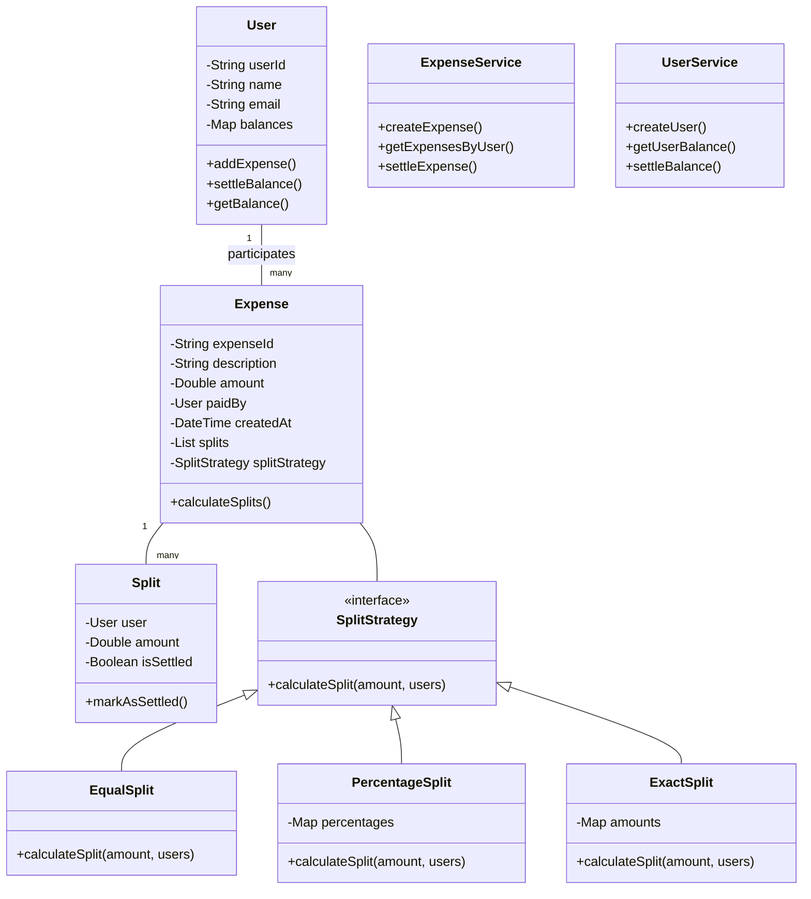

```mermaid
classDiagram
    class User {
        -String userId
        -String name
        -String email
        -Map<User, Double> balances
        +addExpense()
        +settleBalance()
        +getBalance()
    }

    class Expense {
        -String expenseId
        -String description
        -Double amount
        -User paidBy
        -DateTime createdAt
        -List<Split> splits
        -SplitStrategy splitStrategy
        +calculateSplits()
    }

    class Split {
        -User user
        -Double amount
        -Boolean isSettled
        +markAsSettled()
    }

    class SplitStrategy {
        <<interface>>
        +calculateSplit(amount, users)
    }

    class EqualSplit {
        +calculateSplit(amount, users)
    }

    class PercentageSplit {
        -Map<User, Double> percentages
        +calculateSplit(amount, users)
    }

    class ExactSplit {
        -Map<User, Double> amounts
        +calculateSplit(amount, users)
    }

    class ExpenseService {
        +createExpense()
        +getExpensesByUser()
        +settleExpense()
    }

    class UserService {
        +createUser()
        +getUserBalance()
        +settleBalance()
    }

    User "1" -- "many" Expense : participates
    Expense "1" -- "many" Split
    Expense -- SplitStrategy
    SplitStrategy <|-- EqualSplit
    SplitStrategy <|-- PercentageSplit
    SplitStrategy <|-- ExactSplit
```