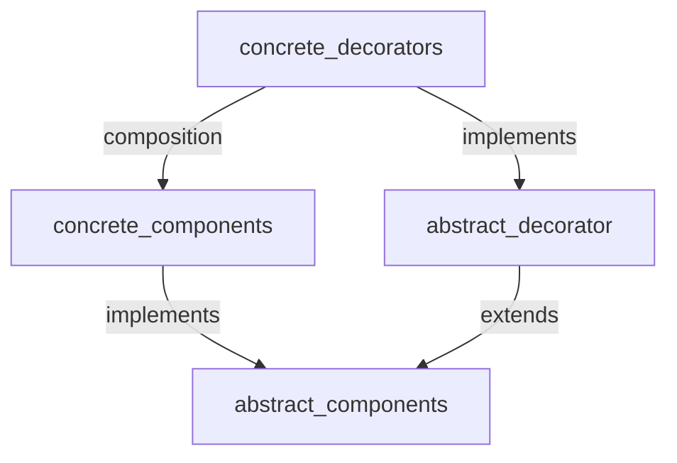

# Head First Design Patterns
## Decorator Pattern : Structural Design Pattern
- attaching new behaviours to object by placing these objects into a special **wrapper** objects that contain the behaviour
  - a wrapper is an object that can be linked with some target object. The wrapper contains the same set of methods as the target and delegates to it all requests it receives
- attach responsibilities to an object dynamically, provides flexible alternative to subclassing for extending functionality
- based on **open-closed principal**
  - class should remain open to extension and closed to modification
- decorator have the **same supertype** as the object they decorate
  - pass in decorated object in place of original object
  - implement same **interface** or **abstract class** as the component they are going to decorate
  - decorator adds its own behaviour either before or after delegating to the object it decorates to do the rest of the job
- extending functionality by either **subclassing** (inheritance) or **composition**
- we are subclassing the same interface or abstract class to have the correct type (type matching), not to inherit its behaviour
  - behaviour comes in through **composition** of decorators with the base components as well as other decorators
- **Problems :** 
  - sometimes add a lot of small classes to a design, which makes it difficult for others to understand. For eg: if we saw the classes as wrappers around an InputStream life would be much easier
  - some code is dependent upon specific types, and when we start introducing decorators here bad things happen
  - complexity of code needed to instantiate the component

### Inheritance vs Composition
- common : work almost the same way
  - composition : one object has a reference to another & delegate it some work
  - inheritance : object itself is able to do that work, inherting behaviour from it's superclass
- diff : through inhertance gets behaviour at compile time, gets whatever behaviour superclass gives us or that we override
  - compiler analyzes the class hierarchy and determines the methods from the superclass and any overridden methods defined in the subclass
- diff : through composition we can mix and match decorators at runtime
  - program creates instances of the composed objects and interacts with their methods based on the specific objects involved
  - subclasses can have just one parent, in most languages 

### Diagram


## Factory Design Pattern
- encapsulate behaviour of instantiations, area of frequent change -> client depend only on abstraction / interface
- `new` culprit : real culprit is **CHANGE**, and how change impacts our use of `new`
  - coding to an interface, insulate ourselves from lot of changes that happens to a system down the road (lower level implementations)
- identify the aspects that vary and separates them from what stays the same
  - creation code is moved out into another object (varies in future) that is going to be concerned with only creation of objects 
  - replace concrete instantiations with factory methods
- static factory
  - pros, don't have to instantiate an object to make use of create method
  - cons, we can't subclass and change **behaviour** of the create method
1. **simple factory**
  - class which contain single method that is going to be concerned with only creation of objects (encapsulate all creation code in one object)
  - not gives you flexibility to vary the products that you are creating
2. **factory method pattern**
  - lets class defer instantions to its subclasses (encapsulate all creation code in one method)
  - **the creator classes :** abstract factory method that the subclasses implements to produce products
  - **the product classes :** factories produces products and product itself is an interface
  - both creator and product classes both have abstract classes that are extended by concrete classes which knows specific implementation
- dependency inversion principal
  - depend on abstractions & do not depend on concrete classes
  - high level components should not depend on low level components rather they should **both** depend on abstractions
    - high level component is a class with behaviour defined in terms of other low-level components
    ```mermaid
    graph TD;
    high-level-components --> abstraction;
    low-level-components --> abstraction;
    ```
  - inversion : top down dependency chart from high-level-components to low-level-components inverted itself
  - factory method technique for adhering to dependency inversion principal
  - rules for following dependency inversion principal :
    - no variable should hold reference to concrete class
    - no class should derive from a concrete class
    - no method should override an implemented method of any of its base classes
3. **abstract factory pattern**
  - interface for creating families of related or dependent objects without specifying their concrete classes
  - each method in an abstract factory looks like a factory method i.e subclasses override it to create some object
- factory method and abstract factory pattern both encapsulate object creation and allows you to decouple your code from concrete types
- factory method relied on inheritance whereas abstract factory relies on object composition

### Dependency Inversion Principle (OO Principle)
> Depend upon abstractions. Do not depend upon concrete classes.
- Reduce dependency on the concrete classes
- This principle is even stronger than *Program to an interface, not an implementation* 
- A few guidelines can help you avoid OO designs that **violate** the DIP 
  - NO variable should hold a reference to a concrete class
    - If you are using `new` then use the *factory* to get around that!
  - NO class should derive from concrete class 
    - Always derive from interface or abstract class
  - NO method should override an implemented method of any of its base class
    - If you override, then your base class wasn't really an abstraction 

> If a class is never suppose to be change like `String` then it might be ok to init it always, but on other hand if you class change, you have some good technique like Factory Method to encapsulate the change 

## Singleton Design Pattern
- Ensures : 
  1. ensures class has only one instance
    - taking class and letting it manage a single instance of itself
  2. provides a global point of access to it
    - query class and it will hand you back the single instance
  3. singleton object is initialized only when it's requested for the first time (`lazy initialization` of resource-intensive objects) 
- Optimization for multiple threads (multi-threading) :
  1. synchronized `getInstance()` method
    - synchronizing a method can decrease performance by a factor of 100, so if a high-traffic part of your code begins using getInstance(), you may have to reconsider
  2. eagerly creating instance rather than lazily created one
    - static references to objects, always going to initialize instance in our code
    - rely on the JVM to create the unique instance of the Singleton when the class is loaded
    - JVM guarantees that the instance would be created before any thread accesses the static `uniqueInstance` variable
  3. `double checking locking` to reduce use of synchronization in `getInstance()`
    - double-checked locking, we first check to see if an instance is created, and if not, THEN we synchronize over the class and again check if an instance got created in the meantime.
    - instance creation will never take place without synchronization
- Identification : 
  - Singleton can be recognized by a static creation method, which returns the same cached object
- Problems with subclassing a Singleton
  1. cannot extend class with private constructor
  2. all derived classes will share the same instance variable

## Command Pattern
- 1. encapsulate method invocation, 
  - object invoking the computation doesn't need to worry about how to do things
  - reuse them to implement undo in the code
- command pattern
  - separation of concern : decouple the requester of an action from the object that actually performs the action
  - command object encapsulates a request to do something on a specific object (vendor specific) along with the object that needs to do it
  - can also help in undoing an action
- definition
  - command pattern ensures class has only one instance and provides global point of access to it
  - command object is a way to package a piece of computation
    - specific receiver
    - set of actions on specific receiver
    - pass it around as a first-class object
  - supports decoupling of the invoker of a request and the receiver of the request
- null object
  - useful when you don't have a meaningful object to return
  - want to remove the responsibility for handling null from the client
- 2. undo button
  - whatever `execute()` method of Command object did last, `undo()` reverses it
    - Command interface will have two abstract methods namely `undo()` and `execute()`
  - storing previous state into the Command object itself, used by the `undo()` method
- 3. macro command
  - new kind of Command that executes other Command's
  - decide dynamically which commands you want to go into the macro command, which results in more flexibility
- Command pattern needs a lot of Command classes (Lambda Expressions)
  - two Command classes for each receiver class
  - take out the bits of computation from inside the concrete Command implementations and use them directly instead (Lambda Expressions)
  - for lambda expressions to work : 
    - as long as the interface of the parameter we’re passing the lambda expression to has one (and only one!) method, 
    - and that method has a compatible signature with the lambda expression (arguments and return value)
  - lambda expressions captures variables from the surrounding scope
  - functional interface : interface that has just one method, lambda expressions are meant to be used with functional interfaces
  - lambda expressions is a replacement for a single method, not an entire object
> **first class object** :   
> i. entity that can be dynamically created, destroyed  
> ii. passed to a function, returned as a value
- 4. logging requests
  - log all actions and recover after a crash by invoking those actions
- 5. Queuing of requests
  - Job Queues, Thread Pools, Schedulers
  - you add commands to the queue on one end, and on the other end sits a group of threads
  - threads run the following script: they remove a command from the queue, call its execute() method, wait for the call to finish, then discard the command object and retrieve a new one.


