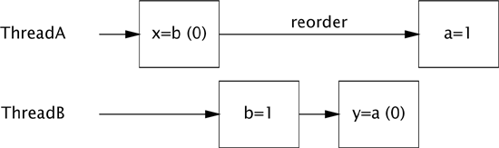
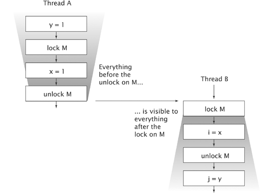

- [Java Concurrency in Practice](#java-concurrency-in-practice)
  - [Chapter 1. Introduction](#chapter-1-introduction)
    - [Benefits of Threads](#benefits-of-threads)
      - [Exploiting Multiple Processors](#exploiting-multiple-processors)
    - [Risks of Threads](#risks-of-threads)
      - [Safety Hazards](#safety-hazards)
      - [Liveness Hazards](#liveness-hazards)
      - [Performance Hazards](#performance-hazards)
  - [Chapter 2. Thread Safety](#chapter-2-thread-safety)
    - [What is Thread Safety?](#what-is-thread-safety)
      - [Example: A Stateless Servlet](#example-a-stateless-servlet)
    - [Atomicity](#atomicity)
      - [Example: Race Conditions in Lazy Initialization](#example-race-conditions-in-lazy-initialization)
      - [Compound Actions](#compound-actions)
      - [Java's builtin mechanism for ensuring atomicity.](#javas-builtin-mechanism-for-ensuring-atomicity)
    - [Locking](#locking)
      - [Intrinsic Locks](#intrinsic-locks)
      - [Reentracy](#reentracy)
    - [Guarding State with Locks](#guarding-state-with-locks)
    - [Liveness and Performance](#liveness-and-performance)
  - [Chapter 3. Sharing Objects](#chapter-3-sharing-objects)
    - [Visibility](#visibility)
      - [Stale Data](#stale-data)
      - [Nonatomic 64-bit Operations](#nonatomic-64-bit-operations)
      - [Locking and Visibility](#locking-and-visibility)
      - [Volatile Variables](#volatile-variables)
    - [Publication and Escape](#publication-and-escape)
    - [Thread Confinement](#thread-confinement)
      - [Stack Confinement](#stack-confinement)
      - [ThreadLocal](#threadlocal)
    - [Immutability](#immutability)
      - [Final Fields](#final-fields)
    - [Safe Publication](#safe-publication)
      - [Caching the Last Result Using a Volatile Reference to an Immutable Holder Object.](#caching-the-last-result-using-a-volatile-reference-to-an-immutable-holder-object)
      - [Safe Publication Idioms](#safe-publication-idioms)
    - [Summary](#summary)
  - [Chapter 4. Composing Objects](#chapter-4-composing-objects)
    - [Designing a Thread-safe Class](#designing-a-thread-safe-class)
      - [State-dependent Operations](#state-dependent-operations)
      - [State Ownership](#state-ownership)
      - [Instance Confinement](#instance-confinement)
      - [The Java Monitor Pattern](#the-java-monitor-pattern)
      - [Example: Tracking Fleet Vehicles](#example-tracking-fleet-vehicles)
      - [Example: Vehicle Tracker Using Delegation](#example-vehicle-tracker-using-delegation)
      - [When Delegation Fails](#when-delegation-fails)
    - [Publishing underlying state variables](#publishing-underlying-state-variables)
    - [Adding Functionality to Existing Thread-safe Classes](#adding-functionality-to-existing-thread-safe-classes)
      - [Client-side Locking](#client-side-locking)
  - [Chapter 5. Building Blocks](#chapter-5-building-blocks)
    - [Synchronized Collections](#synchronized-collections)
      - [Problems with Synchronized Collections](#problems-with-synchronized-collections)
      - [Iterators and ConcurrentModificationException](#iterators-and-concurrentmodificationexception)
      - [Hidden Iterators](#hidden-iterators)
    - [Concurrent collections](#concurrent-collections)
      - [ConcurrentHashMap](#concurrenthashmap)
      - [Additional Atomic Map Operations](#additional-atomic-map-operations)
      - [CopyOnWriteArrayList](#copyonwritearraylist)
    - [Blocking Queues \& The Producer-Consumer pattern](#blocking-queues--the-producer-consumer-pattern)
      - [Serial thread confinement](#serial-thread-confinement)
      - [Deques and work stealing](#deques-and-work-stealing)
    - [Blocking and interruptible methods](#blocking-and-interruptible-methods)
    - [Synchronizers](#synchronizers)
      - [Latches](#latches)
      - [FutureTask](#futuretask)
      - [Semaphores](#semaphores)
  - [Chapter 6. Task Execution](#chapter-6-task-execution)
    - [Executing Tasks in Threads](#executing-tasks-in-threads)
      - [Executing Tasks Sequentially](#executing-tasks-sequentially)
      - [Explicitly Creating Threads for Tasks](#explicitly-creating-threads-for-tasks)
      - [Disadvantages of Unbounded Thread Creation](#disadvantages-of-unbounded-thread-creation)
    - [The Executor Framework](#the-executor-framework)
      - [Execution Policies](#execution-policies)
      - [Thread Pools](#thread-pools)
      - [Executor Lifecycle](#executor-lifecycle)
      - [Delayed and Periodic Tasks](#delayed-and-periodic-tasks)
    - [Finding exploitable parallelism](#finding-exploitable-parallelism)
      - [Example](#example)
      - [Result-bearing tasks: Callable and Future](#result-bearing-tasks-callable-and-future)
    - [Example: page renderer with Future](#example-page-renderer-with-future)
    - [Limitations of parallelizing heterogeneous tasks](#limitations-of-parallelizing-heterogeneous-tasks)
    - [CompletionService: Executor meets BlockingQueue](#completionservice-executor-meets-blockingqueue)
    - [Placing time limits on tasks](#placing-time-limits-on-tasks)
    - [Example: a travel reservations portal](#example-a-travel-reservations-portal)
    - [Summary](#summary-1)
  - [Chapter 7. Cancellation and Shutdown](#chapter-7-cancellation-and-shutdown)
    - [Task Cancellation](#task-cancellation)
    - [Interruption](#interruption)
    - [Interruption Policy](#interruption-policy)
    - [Responding to Interruption](#responding-to-interruption)
    - [Example (Timed Run)](#example-timed-run)
      - [Scheduling an Interrupt on Borrowed Thread. *Don't do this*.](#scheduling-an-interrupt-on-borrowed-thread-dont-do-this)
      - [Interrupting a Task in a Dedicated Thread](#interrupting-a-task-in-a-dedicated-thread)
    - [Cancellation via `Future`](#cancellation-via-future)
    - [Dealing with Non-interruptible Blocking](#dealing-with-non-interruptible-blocking)
    - [Encapsulating nonstandard cancellation with `newtaskFor`](#encapsulating-nonstandard-cancellation-with-newtaskfor)
      - [Create CancellableTask Interface](#create-cancellabletask-interface)
      - [Create CancellingExecutor](#create-cancellingexecutor)
      - [Example](#example-1)
    - [Stopping a Thread-based Service](#stopping-a-thread-based-service)
      - [Java’s ExecutorService Approach](#javas-executorservice-approach)
      - [Example: A Logging Service](#example-a-logging-service)
      - [Producer-Consumer Logging Service with No Shutdown Support.](#producer-consumer-logging-service-with-no-shutdown-support)
      - [Poison Pills](#poison-pills)
      - [Limitations of Shutdownnow](#limitations-of-shutdownnow)
    - [Handling Abnormal Thread Termination (Theory heavy section, but worth)](#handling-abnormal-thread-termination-theory-heavy-section-but-worth)
      - [Uncaught Exception Handlers](#uncaught-exception-handlers)
    - [JVM Shutdown](#jvm-shutdown)
      - [Shutdown Hooks](#shutdown-hooks)
      - [Daemon Threads](#daemon-threads)
      - [Finalizers](#finalizers)
  - [Chapter 8. Applying Thread Pools](#chapter-8-applying-thread-pools)
    - [Implicit Couplings Between Tasks and Execution Policies](#implicit-couplings-between-tasks-and-execution-policies)
      - [Thread Starvation Deadlock](#thread-starvation-deadlock)
      - [Long Running Task](#long-running-task)
    - [Sizing Thread Pools](#sizing-thread-pools)
    - [Configuring `ThreadPoolExecutor`](#configuring-threadpoolexecutor)
      - [Thread Creation and Teardown](#thread-creation-and-teardown)
      - [Managing Queued Tasks](#managing-queued-tasks)
      - [Saturation Policies](#saturation-policies)
      - [Thread Factories](#thread-factories)
    - [Extending `ThreadPoolExecutor`](#extending-threadpoolexecutor)
    - [Parallelizing Recursive Algorithms](#parallelizing-recursive-algorithms)
      - [Example: A Puzzle Framework](#example-a-puzzle-framework)
    - [Summary](#summary-2)
  - [Chapter 9. GUI Applications](#chapter-9-gui-applications)
  - [Chapter 10. Avoiding Liveness Hazards](#chapter-10-avoiding-liveness-hazards)
    - [Deadlock](#deadlock)
      - [Lock-ordering Deadlocks](#lock-ordering-deadlocks)
      - [Dynamic Lock Order Deadlocks](#dynamic-lock-order-deadlocks)
      - [Deadlocks Between Cooperating Objects](#deadlocks-between-cooperating-objects)
      - [Open Calls](#open-calls)
  - [Advance Topics: Chapter 13 Explicity Locks](#advance-topics-chapter-13-explicity-locks)
    - [Locks and Reentrant Locks](#locks-and-reentrant-locks)
      - [Lock Interface](#lock-interface)
      - [Polled and Timed Lock Acquisition](#polled-and-timed-lock-acquisition)
      - [Interruptible Lock Acquisition](#interruptible-lock-acquisition)
      - [Non-block-structured Locking](#non-block-structured-locking)
    - [Peformance considerations](#peformance-considerations)
    - [Fairness](#fairness)
    - [Choosing between Synchronized and Reentrant Lock](#choosing-between-synchronized-and-reentrant-lock)
    - [Read-write locks](#read-write-locks)
    - [Summary](#summary-3)
    - [References](#references)
  - [Chapter 14. Buliding Custom Synchronizers](#chapter-14-buliding-custom-synchronizers)
    - [Managing State Dependence](#managing-state-dependence)
    - [Bounded Buffer that Balks When Preconditions are Not Met.](#bounded-buffer-that-balks-when-preconditions-are-not-met)
      - [Example: Crude Blocking by Polling and Sleeping](#example-crude-blocking-by-polling-and-sleeping)
      - [Condition Queues to the Rescue](#condition-queues-to-the-rescue)
    - [Using Condition Queues](#using-condition-queues)
      - [The Condition Predicate](#the-condition-predicate)
      - [Lock – Wait – Predicate ka 3-way Connection](#lock--wait--predicate-ka-3-way-connection)
      - [Waking Up Too Soon](#waking-up-too-soon)
  - [Chapter 16. The Java Memory Model](#chapter-16-the-java-memory-model)
    - [What is Memory Model and Why would I Want One ?](#what-is-memory-model-and-why-would-i-want-one-)
    - [Platform Memory Models](#platform-memory-models)
    - [Reordering](#reordering)
    - [Java Memory Model in 500 words or less](#java-memory-model-in-500-words-or-less)
    - [Piggybacking on synchronization](#piggybacking-on-synchronization)


# Java Concurrency in Practice

Book - Java Concurrency in Practice By Brian Goetz et. al.
The text in the book revolves around Java (pre-req) 

## Chapter 1. Introduction

- Writing correct programs is hard; writing correct concurrent programs is harder.
- So, why do we bother with concurrency? 
  - Threads are the easiest way to tap the computing power of multiprocessor systems

### Benefits of Threads
#### Exploiting Multiple Processors

### Risks of Threads
#### Safety Hazards
#### Liveness Hazards
#### Performance Hazards


## Chapter 2. Thread Safety
- Thread safety
    - at it's core, managing access to **shared mutable state**
    - **shared** : variable accessed by multiple threads
    - **mutable** : variable could change during it's lifetime
    - **state** : an object's state is the one that could affect it's externally visible behaviour
> [!NOTE] 
> Thread safety is a term applied to code but it's about state, could be applied to entire body of code that encapsulates it's state, that may be an object or entire program
- If multiple threads access the same mutable state variable without appropriate synchronization, your program is broken. There are three ways to fix it:
  1. **unshared** : Don't share the state variable across threads;
  2. **immutable** : Make the state variable immutable; or
  3. **synchronization** : Use synchronization whenever accessing the state variables 
>[!TIP] 
> Whenever more than one thread accesses a given state variable, and one of them might write to it, they all must coordinate their access to it using synchronization.
- Synchronization mechnaism's in java
    - `synchronized` keyword
    - Explicit locks
    - `volatile` variables
    - Atomic variables
- It is far easier to design a class to be thread-safe than to retrofit it for thread safety later.
- When designing thread-safe classes, good object-oriented techniques are our best friends
    - Encapsulation, 
    - Immutability, and 
    - Clear specification of invariants

### What is Thread Safety?
-  A class is thread-safe if it behaves correctly when accessed from multiple threads, regardless of the scheduling or interleaving of the execution of those threads by the runtime environment, and with no additional synchronization or other coordination on the part of the calling code
    -  **Correctness** : class conforms to it's specification
    -  **Specification** : defines invariants constraining an object's state and postconditions describing the effects of its operations

> [!NOTE]
>  **thread-safe class** encapsulate any needed synchronization so that clients need not provide their own 

>[!IMPORTANT]
> No set of operations performed sequentially or concurrently on instances of a thread-safe class can cause an instance to be in an invalid state (i.e correctness)

#### Example: A Stateless Servlet

- StatelessFactorizer is, like most servlets, stateless: it has no fields and references no fields from other classes
    ```java
    @ThreadSafe 
    public class StatelessFactorizer implements Servlet {
        public void service(ServletRequest req, ServletResponse resp) {
            BigInteger i = extractFromRequest(req);
            BigInteger[] factors = factor(i);
            encodeIntoResponse(resp, factors);
        }
    }
    ```
- Stateless objects are always thread-safe ? 
    - The transient state for a particular computation exists solely in local variables that are stored on the thread's stack and are accessible only to the executing thread.
    - One thread accessing a `StatelessFactorizer` cannot influence the result of another thread accessing the same `StatelessFactorizer`; because the two threads do not share state, it is as if they were accessing different instances.
- When servlets wants to remember things from one request to another thread safety requirements becomes an issue.

### Atomicity
- What happen when we add one element of state to what was a stateless object ? 
    ```java
    @NotThreadSafe 
    public class UnsafeCountingFactorizer implements Servlet {

        private int count = 0;
        public long getCount() {
            return count;
        }

        public void service(ServletRequest req, ServletResponse resp) {
            BigInteger i = extractFromRequest(req);
            BigInteger[] factors = factor(i);
            ++count;
            encodeIntoResponse(resp, factors);
        }
    }
    ```
- Unfortunately, `UnsafeCountingFactorizer` is not thread-safe, even though it would work just fine in a single-threaded environment. 
- It is susceptible to lost updates 
- While `++count`, may look like a single action because of compact syntax, it is not *atomic*, it is a set of three discrete operations: fetch the current value, add one to it, and write the new value back.
  - Example of *read-modify-write* 

- The possibility of incorrect results in the presence of unlucky timing is so important in concurrent programming that it has a name: a **race condition**.
>[!NOTE]
> A **race condition** occurs when the correctness of a computation depends on the relative timing or interleaving of multiple threads by the runtime; in other words, when getting the right answer relies on lucky timing.

- **check-then-act** :
    - Most common type of race condition, happens because of invalidation of observations
    - Potentially stale observation is used to make a decision (which becomes invalid by the time we acted on it)
    - Eg : You observe something to be true (file X doesn't exist) and then take action based on that observation (create X); but in fact the observation could have become invalid between the time you observed it and the time you acted on it (someone else created X in the meantime), causing a problem (unexpected exception, overwritten data, file corruption).

>[!WARNING]
> **Race Condition v/s Data Race**
> 
> - The term race condition is often confused with the related term data race, which arises when synchronization is not used to coordinate all access to a shared nonfinal field.
> - Not all race conditions are data races, and not all data races are race conditions, but they both can cause concurrent programs to fail in unpredictable ways. 

#### Example: Race Conditions in Lazy Initialization
- Lazy Initialization (specification required to ensure correctness in multi-threaded environment):
    1. defer initializing object until it is actually needed
    2. ensuring it is initialized only once
- Race Condition in Lazy Initialization. Don't do this.
    ```java
    @NotThreadSafe
    public class LazyInitRace {
        private ExpensiveObject instance = null;

        public ExpensiveObject getInstance() {
            if (instance == null) {
                instance = new ExpensiveObject();
            }
            return instance;
        }
    }
    ```
- `LazyInitRace` has race conditions that can undermine its correctness. 
    - Eg : Threads A and B execute `getInstance` at the same time. A and B both sees `instance` as `null`, callers of `getInstance` may receive two different results. This will lead to inconsistent state.
- Like most concurrency errors, race conditions don't always result in failure: some unlucky timing is also required. But race conditions can cause serious problems.

#### Compound Actions
- Sequences of operations that must be executed atomically in order to remain thread-safe.
- Both `LazyInitRace` and `UnsafeCountingFactorizer` contained a sequence of operations that needed to be atomic, or indivisible, relative to other operations on the same state.
- To avoid race conditions, there must be a way to prevent other threads from using a variable while we're in the **middle of modifying it**, so we can ensure that other threads can observe or modify the state only before we start or after we finish, but not in the middle.

>[!IMPORTANT]
> Operations A and B are atomic with respect to each other if, from the perspective of a thread executing A, when another thread executes B, either all of B has executed or none of it has. 

- An **atomic operation** is one that is atomic with respect to all operations, including itself, that operate on the same state.

#### Java's builtin mechanism for ensuring atomicity.

```java
import java.util.concurrent.atomic;

@ThreadSafe 
public class UnsafeCountingFactorizer implements Servlet {

    private final AtomicLong count = new AtomicLong(0);

    public long getCount() { count.get() };

    public void service(ServletRequest req, ServletResponse resp) {
        BigInteger i = extractFromRequest(req);
        BigInteger[] factors = factor(i);
        count.incrementAndGet();
        encodeIntoResponse(resp, factors);
    }
}
```

- The `java.util.concurrent.atomic` package contains atomic variable classes for effecting atomic state transitions on numbers and object references.
- By replacing the `long` counter with an `AtomicLong`, we ensure that all actions that access the counter state are atomic.

>[!NOTE]
> When a single element of state is added to a stateless class, the resulting class will be thread-safe if the state is entirely managed by a thread-safe object. In the previous example, single element of state is added i.e `count` which is entirely managed by thread-safe object i.e `AtomicLong`

### Locking

- [Q] We were able to add one state variable to our servlet while maintaining thread safety by using a thread-safe object to manage the entire state of the servlet. But if we want to add more state to our servlet, can we just add more thread-safe state variables?
    ```java

    @NotThreadSafe 
    public class UnsafeCachingFactorization implements Servlet {

        private final AtomicReference<BigInteger> lastNumber = 
                new AtomicReference<BigInteger>();
        private final AtomicReference<BigInteger>[] lastFactors = 
                new AtomicReference<BigInteger[]>();

        public void service(ServletRequest req, ServletRequest resp) {
            BigInteger i = extractFromRequest();
            if (i.equals(lastNumber.get())) {
                encodeIntoResponse(resp, lastFactors.get());
            } else {
                BigInteger[] factors = factor(i);
                lastNumber.set(i);
                lastFactors.set(factors);
                encodeIntoResponse(resp, factors);
            }
        }
    }
    ```

- Unfortunately, this approach does not work. Even though the atomic references are individually thread-safe, UnsafeCachingFactorizer has race conditions that could make it produce the wrong answer, why ?
  - When multiple variables participate in an invariant, they are not independent: the value of one constrains the allowed value(s) of the others. Thus when updating one, you must update the others in the same atomic operation.

>[!IMPORTANT]
> To preserve state consistency, update related state variables in a single atomic operation.

#### Intrinsic Locks
- Java provides a built-in locking mechanism for enforcing atomicity: the `synchronized` block. 
    ```java
    synchronized(lock) {
        // Access to modify shared state guarded by lock
    }
    ```
- A `synchronized` block has two parts: a reference to an object that will serve as the lock, and a block of code to be guarded by that lock.
-  A `synchronized` method is a shorthand for a `synchronized` block that spans an entire method body, and whose lock is the object on which the method is being invoked. 
-  Static `synchronized` methods use the `Class` object for the lock
-  Every Java object can implicitly act as a lock for purposes of synchronization;
-   The lock is automatically acquired by the executing thread before entering a `synchronized` block and automatically released when control exits the synchronized block, whether by the normal control path or by throwing an exception out of the block. 
- These built-in locks are called **intrinsic locks** or **monitor locks**
- Intrinsic locks in Java act as mutexes (or mutual exclusion locks), which means that at most one thread may own the lock.
  - When thread A attempts to acquire a lock held by thread B, A must wait, or block, until B releases it. If B never releases the lock, A waits forever.
  - Execute as a single, indivisible unit
    ```java

    @ThreadSafe
    public class SynchronizedFactorizer implements Servlet {

        @GuardedBy("this") private BigInteger lastNumber;
        @GuardedBy("this") private BigInteger[] lastFactors;

        public synchronized void service(ServletRequest req, 
                ServletResponse resp) {
            BigInteger i = extractFromRequest(req);
            if (i.equals(lastNumber)) {
                encodeIntoResponse(resp, lastFactors);
            } else {
                BigInteger[] factors = factor(i);
                lastNumber = i;
                lastFactors = factors;
                encodeIntoResponse(resp, factors);
            }
        }
    }
    ```
- The above will result in unacceptably poor responsiveness. This problem—which is a performance problem, not a thread safety problem (will fix later)

#### Reentracy
- When a thread requests a lock that is already held by another thread, the requesting thread blocks.
- But because intrinsic locks are reentrant, if a thread tries to acquire a lock that it already holds, the request succeeds.
>[!IMPORTANT]
> Reentrancy means that locks are acquired on a per-thread rather than per-invocation basis.
> 
> This differs from the default locking behavior for pthreads (POSIX threads) mutexes, which are granted on a per-invocation basis.
- Reentrancy is implemented by associating with each lock an acquisition count and an owning thread. 
    - When the count is zero, the lock is considered unheld.
    - When a thread acquires a previously unheld lock, the JVM records the owner and sets the acquisition count to one
    - If that same thread acquires the lock again, the count is incremented, and when the owning thread exits the `synchronized` block, the count is decremented. When the count reaches zero, the lock is released.
- Reentrancy facilitates encapsulation of locking behavior, and thus **simplifies the development of object-oriented concurrent code**.
    ```java

    public class Widget {
        public synchronized void doSomething() {
            ...
        }
    }

    public class LoggingWidget extends Widget {
        public synchronized void doSomething() {
            super.doSomething();
        }
    }
    ```
    - Without reentrant locks, the very natural-looking code, in which a subclass overrides a synchronized method and then calls the superclass method, would deadlock. Because the doSomething methods in Widget and LoggingWidget are both synchronized, each tries to acquire the lock on the Widget before proceeding. 
    - But if intrinsic locks were not reentrant, the call to `super.doSomething` would never be able to acquire the lock because it would be considered already held, and the thread would permanently stall waiting for a lock it can never acquire.

### Guarding State with Locks

- Locks enables serialized access to the code path they guard
- Compound actions on shared state, such as incrementing a hit counter (read-modify-write) or lazy init (check-then-act), must be atomic to avoid *race conditions*
- Synchronization using `synchronized` method : It is a common mistake to assume that synchronization needs to be used only when writing to shared variables; this is simply not true.  (will discuss later)
- Synchronization using explicit locks : For each mutable state variable that may be accessed by more than one thread, all accesses to that variable must be performed with the same lock held. In this case, we say that the **variable is guarded by that lock**.
    - Every shared, mutable variable should be guarded by exactly one lock. Make it clear to maintainers which lock that is.
    - When a variable is guarded by a lock—meaning that every access to that variable is performed with that lock held—you've ensured that only one thread at a time can access that variable. 

>[!TIP]
> Each object in Java has built-in intrinsic lock 
> 
> The fact that every object has a built-in lock is just a convenience so that you needn't explicitly create lock objects. 

- When a class has invariants that involve more than one state variable, there is an additional requirement: each variable participating in the invariant must be guarded by the same lock. 
    - This allows you to access or update them in a single atomic operation, preserving the invariant
- If synchronization is the cure for race conditions, why not just declare every method synchronized? 
  - It turns out that such indiscriminate application of synchronized might be either too much or too little synchronization.
  - Merely synchronizing every method, as Vector does, is not enough to render compound actions on a Vector atomic:
    ```java
    if (!vector.contains(element)) {
        vector.add(element)
    }
    ```
    - This attempt at a put-if-absent operation has a race condition, even though both contains and add are atomic. 
    - While synchronized methods can make individual operations atomic, additional locking is required when multiple operations are combined into a compound action.
  - Synchronizing every method can lead to performance or liveness problems

### Liveness and Performance
- Using `synchronized` method can hurt the liveness and performance
- Operations that do not impact the shared state and consume a lot of CPU cycles can be optimized by using fine-grained control over the synchronized block.
- At the same time, we don’t want a synchronization block to be so small that it breaks the isolation of the shared state or introduces additional overhead of acquiring & releasing locks.

    ```java

    @ThreadSafe
    public class CacheFactorizer implements Servlet {
        @GuardedBy("this") private BigInteger lastNumber;
        @GuardedBy("this") private BigInteger[] lastFactors;
        @GuardedBy("this") private long hits;
        @GuardedBy("this") private long cacheHits;

        public synchronized long getHits() {
            return hits;
        }
        public synchronized double getCacheHitRatio() {
            return (double) cacheHits / (double) hits;
        }

        public void service(ServletRequest req, ServletResponse resp) {
            BigInteger i = extraFromRequest(req);
            BigInteger[] factors = null;
            synchronized(this) {
                ++hits;
                if (i.equals(lastNumber)) {
                    ++cacheHits;
                    factors = lastFactors.clones();
                }
            }
            if (factors == null) {
                factors = factor(i);
                synchronized(this) {
                    lastNumber = i;
                    lastFactors = factors.clone();
                }
            }
            encodeIntoResponse(resp, factors);
        }
    }
    ```

- There is frequently a tension between simplicity and performance. When implementing a synchronization policy, resist the temptation to prematurely sacriflce simplicity (potentially compromising safety) for the sake of performance.
- Whenever you use locking, you should be aware of what the code in the block is doing and how likely it is to take a long time to execute. Holding a lock for a long time, either because you are doing something compute-intensive or because you execute a potentially blocking operation, introduces the **risk of liveness** or **performance** problems.
>[!IMPORTANT]
> Avoid holding locks during lengthy computations or operations at risk of not completing quickly such as network or console I/O.


## Chapter 3. Sharing Objects
- In chapter 2. we learned primarily about managing **access** to shared, mutable state.
  - We used `synchronized` to prevent multiple threads from accessing the same data at the same time.
- This chapter examines techniques for **sharing and publishing** objects so they can be safely accessed by multiple threads
- We have seen how `synchronized` blocks and methods can ensure that operations execute atomically, but it is a common misconception that `synchronized` is only about atomicity or demarcating “critical sections”. 
    - Synchronization also has another significant, and subtle, aspect: **memory visibility**. 
>[!IMPORTANT]
> We want not only to prevent one thread from modifying the state of an object when another is using it i.e **Atomicity**, but also to ensure that when a thread modifies the state of an object, other threads can actually see the changes that were made i.e **Memory Visibility**

### Visibility
- Visibility is subtle because the things that can go wrong are so counterintuitive.
-  In a single-threaded environment, if you write a value to a variable and later read that variable with no intervening writes, you can expect to get the same value back. 
   - But when the reads and writes occur in different threads, this is simply not the case
    ```java
    public class NoVisibility {
        private static boolean ready;
        private static int number;

        private static class ReaderThread extends Thread {
            public void run() {
                while (!ready) {
                    Thread.yield();
                }
                log.info(number);
            }
        }

        public static void main(String[] args) {
            new ReaderThread().start();
            number = 42;
            ready = true;
        }
    }
    ```

- `NoVisibility` could loop forever because the value of ready might never become visible to the reader thread. 
- Even more strangely, `NoVisibility` could print zero because the write to ready might be made visible to the reader thread before the write to `number`, a phenomenon known as **reordering**. 
    - This may seem like a broken design, but it is meant to allow JVMs to take full advantage of the performance of modern multiprocessor hardware. 
    - For example, in the absence of synchronization, the Java Memory Model permits the compiler to reorder operations and cache values in registers, and permits CPUs to reorder operations and cache values in processor-specific caches. 
- **Reordering :** There is no guarantee that operations in one thread will be performed in the order given by the program, as long as the reordering is not detectable from within that thread—even if the reordering is apparent to other threads.

> [!WARNING]
> Always use the proper synchronization whenever data is shared across threads.


#### Stale Data
- Last example shows insufficiently synchronized programs can cause surprising results: *stale data*
- Stale data can cause serious and confusing failures such as unexpected exceptions, corrupted data structures, inaccurate computations, and infinite loops.
- Reading data without synchronization is analogous to using the `READ_UNCOMMITTED` isolation level in a database, where you are willing to trade accuracy for performance.
> [!CAUTION]
> In the case of unsynchronized reads, we are trading away a greater degree of accuracy, since the visible value for a shared variable can be arbitrarily stale.
```java
@ThreadSafe
public class SyncInteger {
    @GuardedBy("this") private int value;

    public synchronized int get() {
        return value;
    }
    public synchronized void set(int value) {
        this.value = value;
    }
}
```
#### Nonatomic 64-bit Operations
- Safety guarantee provided by unsynchronized reads of a variable is called *out-of-thin-air* safety.
    - When a thread reads a variable without synchronization, it may see a stale value, but at least it sees a value that was actually placed there by some thread rather than some random value. 
- **Out-of-thin-air** safety applies to all variables, with one exception: 64-bit numeric variables (`double` and `long`) that are not declared volatile
>[!WARNING]
> The Java Memory Model requires fetch and store operations to be atomic, but for nonvolatile long and double variables, the JVM is permitted to treat a 64-bit read or write as two separate 32-bit operations. If the reads and writes occur in different threads, it is therefore possible to read a nonvolatile long and get back the high 32 bits of one value and the low 32 bits of another.
>
> When the Java Virtual Machine Specification was written, many widely used processor architectures could not efficiently provide atomic 64-bit arithmetic operations.
- Thus, even if you don't care about stale values, it is not safe to use shared mutable long and double variables in multithreaded programs unless they are declared volatile or guarded by a lock.

#### Locking and Visibility

>[!IMPORTANT]
> We can now give the other reason for the rule requiring all threads to synchronize on the same lock when accessing a shared mutable variable—to guarantee that values written by one thread are made visible to other threads. Otherwise, if a thread reads a variable without holding the appropriate lock, it might see a stale value.

- Locking is not just about mutual exclusion; it is also about **memory visibility**. To ensure that all threads see the most up-to-date values of shared mutable variables, the reading and writing threads must synchronize on a common lock.
    - *Intrinsic locking* can be used to guarantee that one thread sees the effects of another in a predictable manner.

> [!TIP]
> Everything thread A did *in or prior* to a synchronized block is visible to thread B when it executes a synchronized block guarded by the same lock.

#### Volatile Variables
- The Java language also provides an alternative, weaker form of synchronization, *volatile variables*, to ensure that updates to a variable are propagated predictably to other threads.
  
>[!NOTE]
>  1. **No Reordering** : When a field is declared `volatile`, the compiler and runtime are put on notice that this variable is shared and that operations on it should not be reordered with other memory operations
>
> 2. **No Caching**: Volatile variables are not cached in registers or in caches where they are hidden from other processors, so a read of a volatile variable always returns the most recent write by any thread.

- Yet accessing a `volatile` variable performs no locking and so cannot cause the executing thread to block, making `volatile` variables a **lighter-weight synchronization mechanism** than `synchronized`
    - Visibility effects of volatile variables extend beyond the value of the volatile variable itself.
    - When thread A writes to a volatile variable and subsequently thread B reads that same variable, the values of all variables that were visible to A prior to writing to the volatile variable become visible to B after reading the volatile variable.
    - So from a memory visibility perspective, writing a volatile variable is like exiting a synchronized block and reading a volatile variable is like entering a synchronized block. 

>[!WARNING]
> Use volatile variables only when they simplify implementing and verifying your synchronization policy; avoid using volatile variables when veryfing correctness would require subtle reasoning about visibility. 

- Volatile variables are convenient, but they have limitations
    - The semantics of volatile are not strong enough to make the increment operation (`count++`) atomic, unless you can guarantee that the variable is written only from a single thread.
    - Atomic variables do provide atomic *read-modify-write* support and can often be used as **“better volatile variables”**.
    **Eg :** For example, the semantics of volatile are not strong enough to make the increment operation (`count++`) atomic, unless you can guarantee that the variable is written only from a single thread.

>[!IMPORTANT]
> Locking can guarantee both visibility and atomicity; volatile variables can only guarantee visibility.

- Use volatile variable when all following criteria met:
  - Writes to the variable do not depend on its current value, or you can ensure that only a single thread ever updates the value;
  - The variable does not participate in invariants with other state variables; and
  - Locking is not required for any other reason while the variable is being accessed.

### Publication and Escape
- Publishing an object means making it available to code outside of its current scope, such as 
    - by storing a reference to it where other code can find it, 
    - returning it from a nonprivate method, or 
    - passing it to a method in another class.
- In many situations, we want to ensure that objects and their internals are not published. 
  - In other situations, we do want to publish an object for general use, but doing so in a thread-safe manner may require synchronization. 
- Publishing internal state variables can compromise encapsulation and make it more difficult to preserve invariants.
- Publishing objects before they are fully constructed can compromise thread safety. 
- An object that is published when it should not have been is said to have *escaped*.

> [!WARNING]
> Once an object escapes, you have to assume that another class or thread may, maliciously or carelessly, misuse it.

1. The most blatant form of publication is to store a reference in a public static field, where any class and thread could see it
    ```java
    public static Set<Secret> knownSecrets;
    
    public void initialize() {
        knownSecrets = new HashSet<Secret>();
    }
    ```
2. Publishing one object may indirectly publish others. 
    
    a. If you add a `Secret` to the published `knownSecrets` set, you've also published that `Secret`, because any code can iterate the `Set` and obtain a reference to the new `Secret`.
    b. Similarly, returning a reference from a nonprivate method also publishes the returned object. 
    
    **Eg :**  `UnsafeStates` publishes the supposedly `private` array of state abbreviations. In this case, the states array has escaped its intended scope, because what was supposed to be private state has been effectively made public.
    ```java
    class UnsafeStates {
        private String[] states = new String[] {
            "AK", "AL", ...
        };
        public String[] getState() {
            return states;
        }
    }
    ```

> [!NOTE]
> Any object that is reachable from a published object by following some chain of nonprivate field references and method calls has also been published.

3. Passing an object to an alien method (includes methods of other classes as well as overridable methods which are neither private nor final). 
   - Since you can't know what code will actually be invoked, you don't know that the alien method won't publish the object or retain a reference to it that might later be used from another thread.

4. Publish an inner class instance. Implicitly allowing the `this` reference to escape. !!! 💀 Don't do this 💀 !!!
    ```java
    public class ThisEscape {
        public ThisEscape(EventSource source) {
            source.registerListener(
                new EventListener() {
                    public void onEvent(Event e) {
                        doSomething(e);
                    }
                });
            )
        }
    }
    ```
    - When `ThisEscape` publishes the `EventListener`, it implicitly publishes the enclosing `ThisEscape` instance as well, because *inner class instances contain a hidden reference to the enclosing instance*.
    - An object is in a predictable, consistent state only after its constructor returns, so publishing an object from within its constructor can publish an *incompletely constructed object*. 
    - This is true even if the publication is the last statement in the constructor. If the `this` reference escapes during construction, the object is considered not properly constructed.

> [!TIP]
> Do not allow the this reference to escape during construction.

5. Start a thread from a constructor. 
    - When an object creates a thread from its constructor, it almost always shares its this reference with the new thread, either explicitly (by passing it to the constructor) or implicitly (because the `Thread` or `Runnable` is an inner class of the owning object).
    - The new thread might then be able to see the owning object before it is fully constructed. There's nothing wrong with creating a thread in a constructor, but it is best not to start the thread immediately.

- **Private Constructor and Public Factory :** If you are tempted to register an event listener or start a thread from a constructor, you can avoid the improper construction by using a private constructor and a public factory method, as shown in `SafeListener`
    ```java
    public class SafeListener {

        private final EventListener listener;

        private SafeListener() {
            listener = new EventListener() {
                public void onEvent(Event e) {
                    doSomething(e);
                }
            }
        }

        public static SafeListener newInstance(EventSource source) {
            SafeListener safe = new SafeListener();
            source.registerListener(source);
            return safe;
        }
    }
    ```

### Thread Confinement
- Accessing shared, mutable data requires using synchronization; one way to avoid this requirement is to not share. 
- If data is only accessed from a single thread, no synchronization is needed. This technique, **thread confinement**
- When an object is confined to a thread, such usage is automatically thread-safe even if the confined object itself is not 
- **Eg :** Thread confinement is commonly used in pooled JDBC `Connection` objects, as they are not thread-safe. A thread acquires a connection from the pool, processes a request synchronously, and returns it. The pool ensures the connection isn't shared with other threads during its usage, maintaining confinement.
  - The connection pool implementations provided by application servers are thread-safe; connection pools are necessarily accessed from multiple threads, so a non-thread-safe implementation would not make sense.
- Thread confinement is an element of program's design which must be enforced by its implementation. 
    - The language and core libraries provide mechanisms that can help in maintaining thread confinement : *local variables* and the `ThreadLocal` class.
    - But even with these, it is still the programmer's responsibility to ensure that thread-confined objects do not escape from their intended thread.

#### Stack Confinement
- Local variables are intrinsically confined to the executing thread.
- They exist on the executing thread's stack, which is not accessible to other threads.
- Stack confinement is a special case of thread confinement in which an object can only be reached through local variables.
- Stack confinement also called *within-thread* or *thread-local usage*
    ```java

    public int loadTheArk(Collection<Animal> candidates) {
        SortedSet<Animal> animals;
        int numPairs = 0;
        Animal candidate = null;

        animals = new TreeSet<Animal> (new SpeciesGenderComparator());
        animals.addAll(candidates);
        for (Animal a: animals) {
            if (candidate == null || !candidate.isPotentialMate(a)) {
                candidate = a;
            } else {
                ark.load(new AnimalPair(candidate, a));
                ++numPairs;
                candidate = null;
            }
        }
        return numPairs;
    }
    ```
    - However, if we were to publish a reference to the Set (or any of its internals), the confinement would be violated and the animals would escape.

#### ThreadLocal
- Thread-Local provides get and set accessormethods that maintain a separate copy of the value for each thread that uses it, so a get returns the most recent value passed to set from the currently executing thread. [ThreadLocal in Java](https://www.javacodegeeks.com/2020/12/threadlocal-in-java-example-program-and-tutorial.html?utm_source=chatgpt.com)

### Immutability
- The other end-run around the need to synchronize is to use immutable objects
- If an object's state cannot be modified, these risks and complexities simply go away.
- An immutable object is one whose state cannot be changed after construction.
- Immutable objects are inherently thread-safe; their invariants are established by the constructor
>[!NOTE]
> Immutable objects are always thread-safe.
- There is a difference between an object being immutable and the reference to it being immutable
#### Final Fields
- The `final` keyword, a more limited version of the `const` mechanism from C++
- Final fields can't be modified (although the objects they refer to can be modified if they are mutable), but they also have special semantics under the Java Memory Model
- Just as it is a good practice to make all fields private unless they need greater visibility [EJ Item 12], it is a good practice to make all fields final unless they need to be mutable.

### Safe Publication
- So far we have focused on ensuring that an object not be published, such as when it is supposed to be confined to a thread or within another object. 
- Of course, sometimes we do want to share objects across threads, and in this case we must do so safely.
    

#### Caching the Last Result Using a Volatile Reference to an Immutable Holder Object.
```java
@Immutable
Class OneValueCache {
    private final BigInteger lastNumber;
    private final BigInteger[] lastFactors;

    public OneValueCache(BigInteger i, BigInteger[] factors) {
        lastNumber = i
        lastFactors = Arrays.copyOf(factors, factors.length);
    }

    public BigInteger[] getFactors(BigInteger i) {
        if (lastNumber == null || !lastNumber.equals(i)) {
            return null;
        } else {
            return Arrays.copyOf(lastFactors, lastFactors.length);
        }
    }
}

@ThreadSafe 
public class VolatileCacheFactorizer implements Servlet {

    private volatile OneValueCache cache = 
            new OneValueCache(null, null);

    public void service(ServletRequest req, ServletResponse resp) {
        BigInteger i = extractFromRequest(req);
        BigIntger[] factors = cache.getFactors(i);

        if (factors == null) {
            factors = factor(i);
            cache = new OneValueCache(i, factors);
        }
        return factors;
    }
}
```

#### Safe Publication Idioms
- Objects that are mutable must be safely published, which usually entails synchronization by both the publishing and the consuming thread.
<details>
<summary> Example </summary>

```java
class UnsafePublishExample {
    // Shared mutable object (NOT safely published)
    private MutableObject mutableObject;

    public void publishObject() {
        mutableObject = new MutableObject(42); // Publisher thread initializes the object
    }

    public MutableObject getObject() {
        return mutableObject; // Consumer thread retrieves the object
    }
}

class MutableObject {
    private int value;

    public MutableObject(int value) {
        this.value = value; // Initialize the value
    }

    public int getValue() {
        return value;
    }
}


```

- Safe Publication 

```java
class SafePublishExample {
    private MutableObject mutableObject;
    private final Object lock = new Object();

    // Publisher thread
    public void publishObject(int value) {
        synchronized (lock) {
            mutableObject = new MutableObject(value); // Object is published safely
        }
    }

    // Consumer thread
    public MutableObject getObject() {
        synchronized (lock) {
            return mutableObject; // Access is synchronized
        }
    }
}

public class SafePublishDemo {
    public static void main(String[] args) {
        SafePublishExample example = new SafePublishExample();

        // Publisher thread
        new Thread(() -> example.publishObject(42)).start();

        // Consumer thread
        new Thread(() -> {
            MutableObject obj = example.getObject();
            if (obj != null) {
                System.out.println(obj.getValue()); // Safely reads the value
            }
        }).start();
    }
}

```
</details>


### Summary
The most useful policies for using and sharing objects in a concurrent program are:
- **Thread-confined**. A thread-confined object is owned exclusively by and confined to one thread, and can be modifled by its owning thread.
- **Shared read-only**. A shared read-only object can be accessed concurrently by multiple threads without additional synchronization, but cannot be modified by any thread. Shared read-only objects include immutable and effectively immutable objects.
- **Shared thread-safe**. A thread-safe object performs synchronization internally, so multiple threads can freely access it through its public interface without further synchronization.
- **Guarded**. A guarded object can be accessed only with a specific lock held. Guarded objects include those that are encapsulated within other thread-safe objects and published objects that are known to be guarded by a specific lock.


## Chapter 4. Composing Objects
- So far, we've covered the low-level basics of thread safety and synchronization
- But we don't want to have to analyze each memory access to ensure that our program is thread-safe; we want to be able to take thread-safe components and safely compose them into larger components or programs. 
- This chapter covers patterns for structuring classes that can make it easier to make them thread-safe and to maintain them without accidentally undermining their safety guarantees.

### Designing a Thread-safe Class
- Encapsulation makes it possible to determine that a class is thread-safe without having to examine the entire program.
- You cannot ensure thread safety without understanding an object's invariants and postconditions.

>[!IMPORTANT]
> The design process for a thread-safe class should include these three basic elements:
>
> Identify the variables that form the object's state;
>
> Identify the invariants that constrain the state variables;
>
> Establish a policy for managing concurrent access to the object's state.

- The synchronization policy defines how an object coordinates access to its state without violating its invariants or postconditions. 
    ```java
    @ThreadSafe 
    public final class Counter {
        @GuardedBy("this") private long value = 0;

        public synchronized long getValue() {
            return value;
        }

        public synchronized long increment() {
            if (value == Long.MAX_VALUE) {
                throw new IllegalStateException("counter overlfow");
            }
            return ++value;
        }
    }
    ```

>[!NOTE]
>Making a class thread-safe means ensuring that its invariants hold under concurrent access;

- Objects and variables have a *state space*: the range of possible states they can take on. The smaller this state space, the easier it is to reason about.
- By using final fields wherever practical, you make it simpler to analyze the possible states an object can be in. (In the extreme case, immutable objects can only be in a single state.)
- E.g.,  The state space of a long ranges from `Long.MIN_VALUE` to `Long.MAX_VALUE`, but `Counter` places constraints on value; negative values are not allowed.

####  State-dependent Operations
- Example: You cannot remove an item from an empty queue; a queue must be in the “nonempty” state before you can remove an element. Operations with state-based preconditions are called state-dependent
- In a single-threaded program, if a precondition does not hold, the operation has no choice but to fail. 
- But in a concurrent program, the precondition may become true later due to the action of another thread.
- The built-in mechanisms for efficiently waiting for a condition to become true: `wait` and `notify` are tightly bound to intrinsic locking, and can be difficult to use correctly.
- To create operations that wait for a precondition to become true before proceeding, it is often easier to use existing library classes, such as `BlockingQueue` or `Semaphore`, to provide the desired state-dependent behavior.

#### State Ownership
- Ownership is not embodied explicitly in the language, but is instead an element of class design. (Rust - hold my coffee)
  - Java Garbage Collection enabling less-than-precise thinking about ownership.
- In many cases, ownership and encapsulation go together—the object encapsulates the state it owns and owns the state it encapsulates.
- Ownership implies control, but once you publish a reference to a mutable object, you no longer have exclusive control;

#### Instance Confinement 
- Encapsulating data within an object confines access to the data to the object's methods, making it easier to ensure that the data is always accessed with the appropriate lock held.
    ```java
    @ThreadSafe
    public class PersonSet {
        @GuardedBy("this")
        private final Set<Person> mySet = new HashSet<Person>();

        public synchronized void addPerson(Person p) {
            mySet.add(p);
        }

        public synchronized boolean containsPerson(Person p) {
            return mySet.contains(p);
        }
    }
    ```
- The state of `PersonSet` is managed by a `HashSet`, which is not thread-safe. But because `mySet` is `private` and not allowed to escape, the HashSet is confined to the `PersonSet`.
- The only code paths that can access `mySet` are `addPerson` and `containsPerson`, and each of these acquires the lock on the `PersonSet`. 
- All its state is guarded by its intrinsic lock, making `PersonSet` thread-safe.
- Of course, it is still possible to violate confinement by publishing a supposedly confined object;

#### The Java Monitor Pattern
- Java's built-in (intrinsic) locks are sometimes called monitor locks or monitors. 
  - The Java monitor pattern is inspired by Hoare's work on monitors
- The Java monitor pattern is used by many library classes, such as `Vector` and `Hashtable`
- The Java monitor pattern is merely a convention; any lock object could be used to guard an object's state so long as it is used consistently

    ```java
    public class PrivateLock {
        private final Object myLock = new Object();
        @GuardedBy("myLock") Widget widget;

        void someMethod() {
            synchronized(myLock) {

            }
        }
    }
    ```
- There are advantages to using a private lock object instead of an object's intrinsic lock
- Making the lock object private encapsulates the lock so that client code cannot acquire it and thus avoiding liveness problems (if public then client code can also access lock and thus can cause liveness issues by acquiring it)

#### Example: Tracking Fleet Vehicles
- Let's build a slightly less trivial example: a **vehicle tracker** for dispatching fleet vehicles such as taxicabs, police cars, or delivery trucks.
- We'll build it first using the monitor pattern, and then see how to relax some of the encapsulation requirements while retaining thread safety.
- Each `vehicle` is identified by a `String` and has a location represented by (x, y)$ coordinates

```java
@ThreadSafe
public class MonitorVehicleTracker {
    @GuardedBy("this")
    private final Map<String, MutablePoint> locations;

    public MonitorVehicleTracker(Map<String, MutablePoint> locations) {
        this.locations = locations;
    }

    public synchronized Map<String, MutablePoint> getLocations() {
        return deepCopy(locations);
    }

    public synchronized MutablePoint getLocation(String id) {
        MutablePoint loc = locations.get(id);
        return loc == null ? null: new MutablePoint(loc);
    }

    public synchronized void setLocation(String id, int x, int y) {
        MutablePoint loc = locations.get(id);
        if (loc == null) {
            throw new IllegalArgumentException("No such ID: " + id);
        }
        loc.x = x;
        loc.y = y;
    }

    private static Map<String, MutablePoint> deepCopy(
            Map<String, MutablePoint> m) {
        Map<String, MutablePoint> result = 
                new HashMap<String, MutablePoint>();
        for (String id: m.keySet()) {
            result.put(id, new MutablePoint(m.get(id)));
        }
        return Collections.unmodifiableMap(result);
    }
}


@NotThreadSafe
public class MutablePoint {
    public int x, y;
    public MutablePoint() {
        x = 0;
        y = 0;
    }

    public MutablePoint(MutablePoint p) {
        this.x = p.x;
        this.y = p.y;
    }
}

// MutablePoint is not thread safe because: 
// 1. Public scope of int x and int y. Public fields allow uncontrolled access.
// 2. Copy constructor doesn’t ensure thread safety - MutablePoint p can 
//    be accessed by multiple threads

```

- This implementation maintains thread safety in part by copying mutable data before returning it to the client. 
  - This is usually not a performance issue, but could become one if the set of vehicles is very large.
- You might have observed that `deepCopy` is called from a `synchronized` method (`deepCopy` is `private`), the tracker's intrinsic lock is held for the duration of what might be a long-running copy operation, and this could degrade the responsiveness

>[!NOTE]
> Note that `deepCopy` can't just wrap the Map with an `unmodifiableMap`, because that protects only the collection from modification; it does not prevent callers from modifying the mutable objects stored in it. For the same reason, populating the `HashMap` in `deepCopy` via a copy constructor wouldn't work either, because only the references to the points would be copied, not the point objects themselves.

<details>
<summary> EXTRA: Deep Copy vs Shallow Copy - Java </summary>

Shallow Copy:
- Creates a new collection object, but the elements inside are still the same (shared references).
- Changes to the elements in one collection affect the other.

Deep Copy:
- Creates a new collection object, and also creates new copies of the elements inside it, ensuring complete independence.


Problem
- If you use `Collections.unmodifiableMap(map)`, it only makes the `Map` unmodifiable (e.g., you cannot add/remove items to/from it), but does not make the individual objects (values) stored in the Map immutable. Mutable objects can still be modified.

- Similarly, using a copy constructor like `new HashMap<>(originalMap)` only copies the references to the objects, not the actual objects themselves. It still points to the same underlying objects.

```java

import java.awt.Point;
import java.util.Collections;
import java.util.HashMap;
import java.util.Map;

public class DeepCopyExample {
    public static void main(String[] args) {
        // Original map with mutable Point objects
        Map<String, Point> originalMap = new HashMap<>();
        originalMap.put("A", new Point(1, 1));
        originalMap.put("B", new Point(2, 2));

        // Attempt 1: Unmodifiable map
        Map<String, Point> unmodifiableMap = Collections
                .unmodifiableMap(originalMap);

        // Attempt 2: Shallow copy using HashMap copy constructor
        Map<String, Point> shallowCopy = new HashMap<>(originalMap);

        // Modify the Point object in the original map
        originalMap.get("A").setLocation(5, 5);

        // Observe effects
        System.out.println("Original Map: " + originalMap);
        System.out.println("Unmodifiable Map: " + unmodifiableMap);
        System.out.println("Shallow Copy: " + shallowCopy);
    }
}


/** Ouput: 
 * 
 * Original Map: {A=java.awt.Point[x=5,y=5], B=java.awt.Point[x=2,y=2]}
 * Unmodifiable Map: {A=java.awt.Point[x=5,y=5], B=java.awt.Point[x=2,y=2]}
 * Shallow Copy: {A=java.awt.Point[x=5,y=5], B=java.awt.Point[x=2,y=2]}
 * /

```

- Solution: Deep Copy

```java
public static Map<String, Point> deepCopy(Map<String, Point> original) {
    Map<String, Point> deepCopy = new HashMap<>();
    for (Map.Entry<String, Point> entry : original.entrySet()) {
        // Create a new Point object for each entry
        deepCopy.put(entry.getKey(), new Point(entry.getValue()));
    }
    return deepCopy;
}
```

</details>


#### Example: Vehicle Tracker Using Delegation

Delegating Thread Safety to a `ConcurrentHashMap`

- The example does not use any explicit synchronization; 
  - All access to state is managed by `ConcurrentHashMap`, 
  - And all the keys and values of the `Map` are immutable.

```java

@Immutable 
public class ImmutablePoint {
    private final int x;
    private final int y; 

    public ImmutablePoint(int x, int y) {
        this.x = x;
        this.y = y;
    }

    public ImmutablePoint(ImmutablePoint p) {
        this(p.x, p.y);
    }

    public int getX() { 
        return x; 
    }
    public int getY() { 
        return y; 
    }
}

```

```java
@ThreadSafe
public class DelegatingVehicleTracker {
    
    private final ConcurrentMap<String, ImmutablePoint> locations;
    private final Map<String, ImmutablePoint> unmodifiableMap;
    
    public DelegatingVehicleTracker(Map<String, ImmutablePoint> points) {
        locations = new ConcurrentMap<String, ImmutablePoint>(points);
        unmodifidedMap = Collections.unmodifiedMap(locations);
    }

    public Map<String, ImmutablePoint> getLocations() {
        return unmodifiedMap;
    }

    public Point getLocation(String id) {
        return locations.get(id);
    }

    public void setLocation(String id, int x, int y) {
        if (locations.replace(id, new ImmutablePoint(x, y)) == null) {
            throw new IllegalArgumentException("invalid ID: " + id);
        }
    }
}
```
- `ImmutablePoint` is thread-safe because it is immutable. 
- Immutable values can be freely shared and published, so we no longer need to copy the locations when returning them.
- The delegating version returns an unmodifiable but “live” view of the vehicle locations, while the monitor version returned a snapshot of the locations
  - This means that if thread *A* calls `getLocations` and thread *B* later modifies the location of some of the points, those changes are reflected in the `Map` returned to thread *A*. As we remarked earlier, this can be a benefit (more up-to-date data) or a liability (potentially inconsistent view of the fleet), depending on your requirements.
- If an unchanging view of the fleet is required, getLocations could instead return a shallow copy of the locations map.
    ```java
    public Map<String, Point> getLocations() {
        return Collections.unmodifiableMap(
            new HashMap<String, Point>(locations)
        );
    }
    ```
    - Since the contents of the `Map` are immutable, only the structure of the `Map`, not the contents, must be copied

>[!IMPORTANT]
> The delegation examples so far delegate to a single, thread-safe state variable. 
> 
> We can also delegate thread safety to more than one underlying state variable as long as those underlying state variables are independent, meaning that the composite class does not impose any invariants involving the multiple state variables.

#### When Delegation Fails

```java
@NotThreadSafe
public class NumberRange {
    private final AtomicInteger lower = new AtomicInteger(0);
    private final AtomicInteger upper = new AtomicInteger(0);

    public void setLower(int i) {
        if (i > upper.get()) {
            throw new IllegalArgumentException("l < r");
        }
        lower.set(i);
    }

    public void setUpper(int i) {
        if (i < lower.get()) {
            throw new IllegalArgumentException("r > l");
        }
        upper.set(i);
    }

    public boolean inRange(int i) {
        return (i >= lower.get() && i <= upper.get());
    }
}
```

- `NumberRange` is not thread-safe;
- It does not preserve the invariant that constrains `lower` and `upper`. 
- The `setLower` and `setUpper` methods attempt to respect this invariant, but do so poorly.

>[!IMPORTANT]
> If a class is composed of multiple independent thread-safe state variables and has no operations that have any invalid state transitions, then it can delegate thread safety to the underlying state variables.

### Publishing underlying state variables
- Only if a class is thread-safe and doesn't participate in any class invariants can it be published outside its scope.

```java
@ThreadSafe 
public class SafePoint {
    @GuardedBy("this") private int x, y;

    private SafePoint(int[] a) {
        this(a[0], a[1]);
    }

    public SafePoint(SafePoint p) {
        this(p.get());
    }

    public synchronized int[] get() {
        return new int[] {x, y};
    }

    public synchronized void set(int x, int y) {
        this.x = x;
        this.y = y;
    }
}

```

- `SafePoint` provides a getter that retrieves both the `x` and `y` values at once by returning a two-element array. If we provided separate getters for `x` and `y`, then the values could change between the time one coordinate is retrieved and the other, resulting inconsistent state

```java

@ThreadSafe 
public class PublishingVehicleTracker {
    private final Map<String, SafePoint> locations;
    private final Map<String, SafePoint> unmodifiableMap;

    public PublishingVehicleTracker(Map<String, SafePoint> locations) {
        this.location = new ConcurrentHashMap<String, SafePoint>(locations);
        this.unmodifiableMap = Collecitons.unmodifiableMap(this.locations);
    }

    public Map<String, SafPoint> getLocations() {
        return this.unmodifableMap;
    }

    public SafePoint getLocation(String id) {
        return locations.get(id);
    }

    public void setLocation(String id, int x, int y) {
        if (!locations.containsKey(id)) {
            throw new IllegalArgumentException("invalid vehicle id" + id);
        }
        SafePoint p = locations.get(id)
        p.set(x, y);
    }
}

```

<details>
<summary> Java Unmodifiable Map </summary> 

- An unmodifiable map may still change - It is live view on a modifiable map, and changes in the backing map will be visible through the unmodifiable map. 
- The unmodifiable map only prevents modifications for those who only have the reference to the unmodifiable view

- Ref: https://stackoverflow.com/questions/22636575/unmodifiablemap-java-collections-vs-immutablemap-google

```java


Map<String, String> realMap = new HashMap<String, String>();
realMap.put("A", "B");

Map<String, String> unmodifiableMap = Collections.unmodifiableMap(realMap);

// This is not possible: It would throw an 
// UnsupportedOperationException
//unmodifiableMap.put("C", "D");

// This is still possible:
realMap.put("E", "F");

// The change in the "realMap" is now also visible
// in the "unmodifiableMap". So the unmodifiableMap
// has changed after it has been created.
unmodifiableMap.get("E"); // Will return "F". 

```

</details>

- `PublishingVehicleTracker` derives its thread safety from delegation to an underlying `ConcurrentHashMap`, but this time the contents of the Map are thread-safe mutable points rather than immutable ones.
- The `getLocation` method returns an unmodifiable copy of the underlying `Map`. Callers cannot add or remove vehicles, but could change the location of one of the vehicles by mutating the `SafePoint` values in the returned `Map`


### Adding Functionality to Existing Thread-safe Classes

```java

@ThreadSafe
public class BetterVector<E> extends Vector<E>  {
    public synchronized boolean putIfAbsent(E x) {
        boolean absent = !contains(x);
        if (absent) {
            add(x);
        }
        return absent;
    }
}
```

#### Client-side Locking

- Don't do this 
```java
@NotThreadSafe
public class ListHelper<E> {
    public List<E> list = Collections.synchronizedList(new ArrayList<>());

    public synchronized boolean putIfAbsent(E x) {
        boolean absent = !list.contains(x);
        if (absent) {
            list.add(x);
        }
        return absent;
    }
}
```

- Why wouldn't this work? 
  - After all, `putIfAbsent` is `synchronized`, right? 
  - The problem is that it synchronizes on the wrong lock. Whatever lock the `List` uses to guard its state, it sure isn't the lock on the `ListHelper`. 
  - `ListHelper` provides only the illusion of synchronization; the various list operations, while all `synchronized`, use different locks, which means that `putIfAbsent` is not atomic relative to other operations on the `List`
  - It’s like locking someone else’s door and expecting no robbery to happen in my own room.
  - So there is no guarantee that another thread won't modify the list while putIfAbsent is executing.

- After reading documentation 
```java
@ThreadSafe
public class ListHelper<E> {
    public List<E> list = Collections.synchronizedList(new ArrayList<>());

    public boolean putIfAbsent(E x) {
        synchronized(list) {
            boolean absent = !list.contains(x);
            if (absent) {
                list.add(x);
            }
            return absent;
        }
    }
}

```

- A general recommendation - Avoid above wherever possible. Later if policy change for `List` your code will stop working. Refrain your self from writing this kind of code

>[!IMPORTANT]
> Document a class's thread safety guarantees for its clients; document its synchronization policy for its maintainers.
>
> If you don't want to commit to supporting client-side locking, that's fine, but say so


## Chapter 5. Building Blocks

- The last chapter explored several techniques for constructing thread-safe classes, including delegating thread safety to existing thread-safe classes. 
- This chapter covers the most useful concurrent building blocks, especially those introduced in Java 5.0 and Java 6, and some patterns for using them to structure concurrent applications.

### Synchronized Collections
The `synchronized` wrapper classes created by the `Collections.synchronizedXxx` factory methods

#### Problems with Synchronized Collections
- The synchronized collections are thread-safe
  - But you may sometimes need to use additional client-side locking to guard compound actions. 
- Common compound actions on collections include iteration, navigation (finding an element after current), and conditional operations such as `putIfAbsent`  
- With a `synchronized` collection, these compound actions are still technically thread-safe even without client-side locking, but they may not **behave** as you might expect when other threads can concurrently modify the collection.

```java
public static Object getLast(Vector list) {
    int lastIndex = list.size() - 1;
    return list.get(lastIndex);
}

public static Object deleteLast(Vector list) {
    int lastIndex = list.size() - 1;
    list.remove(lastIndex);
}
```

- Two methods that operate on a `Vector`, `getLast` and `deleteLast`, both of which are check-then-act sequences. 

Correct way to do it:

```java
public static Object getLast(Vector list) {
    synchronized (list) {
        int lastIndex = list.size() - 1;
        return list.get(lastIndex);
    }
}

public static void deleteLast(Vector list) {
    synchronized (list) {
        int lastIndex = list.size() - 1;
        list.remove(lastIndex);
    }
}
```

- Traditional iteration could still produce an `ArrayIndexOutOfBounds` exception:

```java
for (int i = 0; i < vector.size(); i++)
    doSomething(vector.get(i));
```

- A way to handle this is to lock the list while iterating over it. This, however, prevents other threads from accessing it:

```java
synchronized (vector) {
    for (int i = 0; i < vector.size(); i++)
        doSomething(vector.get(i));
}
```


#### Iterators and ConcurrentModificationException
- Modern concurrent collections still have the problem with modification during iteration.
- If you iterate a concurrent list & a modification happens meanwhile, you will get a `ConcurrentModificationException`. Iterator follow *fail-fast* meaning that if they detect that the collection has changed since iteration began, they throw the unchecked exception
- The solution here is also to lock the collection while iterating it, but this introduces risks of deadlock.
- An alternative is to clone the collection & iterate the clone. The cloning operation will still need to be locked.

#### Hidden Iterators


```java
public class HiddenIterator {
    @GuardedBy("this")
    private final Set<Integer> set = new HashSet<Integer>();

    public synchronized void add(Integer i) {
        set.add(i);
    }

    public synchronized void remove(Integer i) {
        set.remove(i);
    }

    public void addTenThings() {
        Random r = new Random();
        for (int i = 0; i < 10; ++i) {
            add(r.nextInt());
        }
        System.out.println("DEBUG: " + set); // culprit line.. but why ?
    }
}

```

- Normally we tends to skip the checking the debugging part because we think what can go wrong there. And there we miss the important part
  - Although the real problem is that `HiddenIterator` is not thread-safe; the `HiddenIterator` lock should be acquired before using set in the `println` call, but debugging and logging code commonly neglect to do this.
  - Iteration could also be invoked when invoking the hashCode method, when passing the collection as a constructor to another object, etc.

### Concurrent collections
- The problem with synchronized collections is that throughput suffers due to their excessive synchronization.
- Use `ConcurrentHashMap` instead of a `synchronized` map and `CopyOnWriteArrayList` instead of a synchronized list.
- Additionally, the new `Queue` class is added along with its `BlockingQueue` derivative and `PriorityQueue`.
  - The blocking queue is very useful in producer-consumer designs.

#### ConcurrentHashMap
- This collection uses a sophisticated locking strategy, which improves performance and throughput compared to its synchronized map counterpart.
- It also doesn't throw a `ConcurrentModificationException` upon modification while iterating. Instead, it offers a weakly consistent iterator, which may or may not reflect modifications in the map. The iterators returned by `ConcurrentHashMap` are weakly consistent instead of fail-fast
  - It uses a finer-grained locking mechanism called *lock striping*
  - Arbitrarily many reading threads can access the map concurrently, readers can access the map concurrently with writers, and a limited number of writers can modify the map concurrently.
- Additionally, `size()` and `isEmpty()` are no longer strongly consistent, but are instead approximations.
  - More focus is on put and get

#### Additional Atomic Map Operations

- Since client-side locking is not supported in concurrent maps, commonly used compound actions (such as putIfAbsent) are explicitly implemented:

```java
public interface ConcurrentMap<K, V> extends Map<K, V> {
    // Insert into map only if no value is mapped from K
    V putIfAbsent(K key, V value);
    // Remove only if K is mapped to V
    boolean remove(K key, V value);
    // Replace value only if K is mapped to oldValue
    boolean replace(K key, V oldValue, V newValue);
    // Replace value only if K is mapped to some value
    V replace(K key, V newValue);
}
```

#### CopyOnWriteArrayList

- This is a concurrent replacement to synchronized list, which derives its thread-safety by relying on an effectively immutable object.
- Whenever modification happens in such an array list, the whole list is copied.
- Hence, when iterating such a list, the iterated collection will not change since the time the iterator was created, even if there are concurrent modifications.
- This, of course, has some additional cost due to the underlying copying. This class was designed for use-cases where iteration is more common than modification.


### Blocking Queues & The Producer-Consumer pattern
- Blocking queues support the operation a normal queue does, but they block on take() if the queue is empty and on put() if the queue is full.
- They are useful for implementing producer-consumer designs where there are a number of producers and a number of consumers as it allows producers and consumers to be decoupled from one another.
- The class library offers several implementations of this interface - `LinkedBlockingQueue` and `ArrayBlockingQueue` are standard concurrent FIFO queues. `PriorityBlockingQueue` allows elements to be ordered.
```java

public class FileCrawler implements Runnable {

    public void run() {
        try {
            crawl(root);
        } catch (InterruptedException e) {
            Thread.currentThread().interrupt();
        }
    }

    private void crawl(File file) throws InterruptedException {
        File[] entries = root.listFiles(fileFilter);
        if (entries != null) {
            for (File entry: entries) {
                if (entry.isDirectory()) {
                    crawl(entry);
                } else if (!alreadyIndexed(entry)) {
                    fileQueue.put(entry);
                }
            }
        }
    }
}

public class Indexer implements Runnable {

    private final BlockingQueue<File> queue;

    public Indexer(BlockingQueue<File> queue) {
        this.queue = queue;
    }

    public void run() {
        try {
            while (true) {
                indexFile(queue.take());
            } catch (InterruptedException e) {
                Thread.currentThread().interrupt();
            }
        }
    }
}


public static void startIndexing(File[] roots) {
    BlockingQueue<File> queue = new LinkedBlockingQueue<File>(BOUND);

    FileFilter filter = new FileFilter() {
        public boolean accept(File file) {
            return true;
        }
    }

    for (File root: roots) {
        new Thread(new FileCrawler(queue, filter, root)).start();
    }

    for (int i = 0; i < N_CONSUMERS; ++i) {
        new Thread(new Indexer(queue)).start();
    }
}
```

#### Serial thread confinement
- This is a technique, used by blocking queues, for transferring non-thread-safe objects in a thread-safe way between producer and consumer threads.
- What this means is that object ownership is confined to one thread.
- What a blocking queue does is it transfers ownership of a given object to a given thread by ensuring safe publication & by not using it anymore or making it available to other threads.
- As long as a thread doesn't use an object anymore after putting it in a queue, transfer will be thread-safe.


#### Deques and work stealing
- Two more classes are added - `Deque` and `BlockingDeque` which extend `Queue` and `BlockingQueue`.
- These are queues, which support taking work from both the tail and the head.
- They are used in a pattern, related to producer-consumer called work stealing.
- In this design, every worker has his own deque he takes work from. But if his deque is exhausted, a worker will "steal" work from the tail of the deque of another worker.
- This is often more scalable than a standard producer-consumer design as workers are working off their own work queue, instead of using a shared one.


### Blocking and interruptible methods


### Synchronizers
- A synchronizer is a class which manages control flow between multiple threads based on its own state. Blocking queues are an example of a synchronizers but there are more.
#### Latches
- A latch is a synchronizer which makes all threads waiting on it block until a given condition is met.
- Example use-cases:
  - A service is dependent on other services starting beforehand
  - A service is waiting on some resource to get initialized

- The most commonly used latch is the `CountDownLatch`. It allows you to enqueue N events you are waiting for to complete before proceeding.

```java

public class TestHarness {
    public long timeTasks(int nThreads, final Runnable task) 
            throws InterruptedException {
        final CountDownLatch startGate = new CountDownLatch(1);
        final CountDownLatch endGate = new CountDownLatch(nThreads);

        for (int i = 0; i < nThreads; ++i) {
            Thread t = new Thread() {
                public void run() {
                    try {
                        startGate.await();
                        try {
                            task.run();
                        } finally {
                            endGate.countDown();
                        }
                    } catch (InterruptedException ignored) {

                    }
                }
            };
            t.start();
        }
        long start = System.nanoTime();
        startGate.countDown();
        endGate.await();
        long end = System.nanoTime();
        return end - start;
    }
}

```


#### FutureTask
- A `FutureTask` is a synchronizer where a thread waits on the completion of a given task & safely receives the result from it.
- This is used when you want to start a lengthy task before you need the result from it & block on receiving the result (if not received already) when you need it.

```java
public class Preloader {
    private final FutureTask<ProductInfo> future = 
        new FutureTask<ProductInfo>(
            new Callable<ProductInfo>() {
                public ProductInfo call() throw DataLoadException {
                    return loadProductInfo();
                }
    });

    private final Thread thread = new Thread(future);

    public void start() {
        thread.start();
    }

    public ProductInfo get() throws DataLoadException, InterruptedException {
        try {
            return future.get();
        } catch (ExecutionException e) {
            Throwable cause = e.getCause();
            if (cause instanceof DataLoadException) {
                throw (DataLoadException) cause;
            } else {
                throw launderThrowable(cause);
            }
        }
    }
}
```

#### Semaphores

- A semaphore allows one to specify the maximum number of simultaneous threads accessing a given resource. 
- The semaphore works by giving out permits which can be returned when they are not used anymore.
- Whenever someone attempts to get a permit, but the maximum allowed permits are already given out, the operation blocks.
- Semaphores can be used to implement resource pools, such as a database connection pool.

```java
public class BoundedHashSet<T> {
    private final Set<T> set;
    private final Semaphore sem;

    public BoundedHashSet(int bound) {
        this.set = Collections.synchronizedSet(new HashSet<T>);
        sem = new Semaphore(bound);
    }

    public boolean add(T o) throws InterruptedException {
        sem.acquire();
        boolean wasAdded = false;
        try {
            wasAdded = set.add(o);
            return wasAdded;
        } finally {
            if (!wasAdded) 
                sem.release();
        }
    }

    public boolean remove(T o) {
        boolean wasRemoved = set.remove(o);
        if (wasRemoved) {
            sem.release();
        }
        return wasRemoved;
    }
}

```

## Chapter 6. Task Execution

From this chapter onwards we'll understand how to structure Concurrent Applications
- Most concurrent applications are organized around the execution of tasks: **abstract**, **discrete units** of work.
- Dividing the work of an application into tasks simplifies program organization, facilitates error recovery by providing natural transaction boundaries, and promotes concurrency by providing a natural structure for parallelizing work.

### Executing Tasks in Threads
- The first step in organizing a program around task execution is identifying sensible *task boundaries*.
- Ideally, tasks are independent activities: work that doesn't depend on the state, result, or side effects of other tasks.
- Independence facilitates concurrency, as independent tasks can be executed in parallel if there are adequate processing resources. 
- Choosing good task boundaries, coupled with a sensible task execution policy 
- Most server application offers a natural choice of task boundary
  - Individual client request
  - Using individual requests as task boundaries usually offers both independence and appropriate task sizing.
  - For example, the result of submitting a message to a mail server is not affected by the other messages being processed at the same time

#### Executing Tasks Sequentially
- The simplest is to execute tasks sequentially in a single thread.
    ```java
    class SingleThreadWebServer {
        public static void main(String[] args) throws IOException {
            ServerSocket socket = new ServerSocket(80);
            while (true) {
                Socket connection = socket.accept();
                handleRequest(connection);
            }
        }
    }
    ```
- `SingleThreadedWebServer` is simple and theoretically correct, but would perform poorly in production because it can handle only one request at a time
  - While the server is handling a request, new connections must wait until it finishes the current request and calls accept again. 
- In server applications, sequential processing rarely provides either good throughput or good responsiveness.

####  Explicitly Creating Threads for Tasks

- A more responsive approach is to create a new thread for servicing each request
    ```java
    class ThreadPerTaskWebServer {
        public static void main(String[] args) throws IOException {
            ServerSocket socket = new ServerSocket(80);
            while (true) {
                final Socket connection = socket.accept();
                Runnable task = new Runnable() {
                    public void run() {
                        handleRequest(connection);
                    }
                }
                new Thread(task).start();
            }
        }
    }
    ```

- The main thread still alternates between accepting an incoming connection and dispatching the request
- The difference is that for each connection, the main loop creates a new thread
- Three main consequences
  - Task processing is offloaded from the main thread, enabling the main loop to resume waiting for the next incoming connection more quickly.
  - Tasks can be processed in parallel, enabling multiple requests to be serviced simultaneously. May improve throughput if there are multiple processors, or if tasks need to block for any reason such as I/O completion, lock acquisition, or resource availability.
  - Task-handling code must be thread-safe, because it may be invoked concurrently for multiple tasks.

#### Disadvantages of Unbounded Thread Creation
- For production use, however, the thread-per-task approach has some practical drawbacks, especially when a large number of threads may be created:
- **Thread lifecycle overhead** Thread creation and teardown are not free. If requests are frequent and lightweight, as in most server applications, creating a new thread for each request can consume significant computing resources.
- **Resource consumption** Active threads consume system resources, especially memory. When there are more runnable threads than available processors, threads sit idle. If you have enough threads to keep all the CPUs busy, creating more threads won't help and may even hurt.
- **Stability** There is a limit on how many threads can be created. The limit varies by platform. When you hit this limit, the most likely result is an `OutOfMemoryError`. Trying to recover from such an error is very risky; it is far easier to structure your program to avoid hitting this limit.


### The Executor Framework
- Tasks are logical units of work, and threads are a mechanism by which tasks can run asynchronously.
- We have seen two approaches in previous section and both suffers
- In previous chapter 5, we've learned about the bounded queues to prevent overload of an application from running out of memory 
- Thread pool offers the same management for the threads
- The Java provides `Executor` framework under (`java.util.concurrent`) which is a flexible implementation for thread pool 
  - So, the primary abstraction for task execution in the Java class libraries are not `Thread`, but `Executor` 

    ```java
    public interface Executor {
        void execute(Runnable command);
    }
    ```
- The interface might looks simple, but it forms the basis of flexibility and powerful framework for asyn task executions
- It helps in decoupling the task submission from task execution, describe task with `Runnable` 
- The `Executor` implementation also provides lifecycle support and hooks for adding statistics gathering, monitoring and much more
- The design of `Executor` is based on producer and consumer
    - Producer: Produce the unit of work to be done
    - Consumer: Threads that execute the task 

    ```java

    class TaskExecutionWebServer {
        private static final int NTHREADS = 100;
        private static final Executor exec = 
                Executor.newFixedThreadPool(NTHREADS);

        public static void main(String[] args) throws IOException {
            ServerSocket socket = new ServerSocket(80);
            whlie (true) {
                final Socket connection = socket.accept();
                Runnable task = new Runnable() {
                    public void run() {
                        handleRequest(connection);
                    }
                }
            }
            exec.execute(task);
        }
    }
    ```

- We can easily modify to behave like thread per task server
    ```java
    public class ThreadPerTaskExecutor implements Executor {
        public void execute(Runnable r) {
            new Thread(r).start();
        }
    }
    ```

#### Execution Policies

The value of decoupling submission from execution is that it lets you easily specify, and subsequently change without great difficulty, the execution policy for a given class of tasks.

- In what thread will tasks be executed?
- How many tasks may execute concurrently?
- In what order should tasks be executed (FIFO, LIFO, priority order)?
- How many tasks may be queued pending execution?
- If a task has to be rejected because the system is overloaded, which task should be selected as the victim, and how should the application be notified?
- What actions should be taken before or after executing a task?


>[!NOTE]
> Execution policies are a resource management tool, and the optimal policy depends on the available computing resources and your quality-of-service requirements. 
>
> Separating the specification of execution policy from task submission makes it practical to select an execution policy at deployment time that is matched to the available hardware.


>[!WARNING]
> Whenever you see code of the form:
>
> `new Thread(runnable).start()`
>
> and you think you might at some point want a more flexible execution policy, seriously consider replacing it with the use of an Executor.

#### Thread Pools
- A thread pool, as its name suggests, manages a homogeneous pool of worker threads. 
- A thread pool is tightly bound to a work queue holding tasks waiting to be executed. Worker threads have a simple life: request the next task from the work queue, execute it, and go back to waiting for another task.
- Executing tasks in pool threads has a number of advantages 
  -  Reusing an existing thread instead of creating a new one amortizes thread creation and teardown costs over multiple requests
  - The latency associated with thread creation does not delay task execution
- You can create a thread pool by calling one of the static factory methods in `Executors`
  - **newFixedThreadPool** A fixed-size thread pool creates threads as tasks are submitted, up to the maximum pool size, and then attempts to keep the pool size constant (adding new threads if a thread dies due to an unexpected `Exception`).
  - **newCachedThreadPool** A cached thread pool has more flexibility to reap idle threads when the current size of the pool exceeds the demand for processing, and to add new threads when demand increases, but places no bounds on the size of the pool.
  - **newSingleThreadExecutor** A single-threaded executor creates a single worker thread to process tasks, replacing it if it dies unexpectedly. Tasks are guaranteed to be processed sequentially according to the order imposed by the task queue (FIFO, LIFO, priority order)
  - **newScheduledThreadPool**  A fixed-size thread pool that supports delayed and periodic task execution, similar to `Timer`.

####  Executor Lifecycle
- JVM can't exit until all the (nondaemon) threads have terminated, so failing to shut down an `Executor` could prevent the JVM from exiting.
- Task can be in any status - Running, Queued, completed
- In shutting down an application, there is a spectrum
  - Graceful shutdown (finish what you've started but don't accept any new work) 
  - Abrupt shutdown (turn off the power to the machine room)
- Since `Executor`s provide a service to applications, they should be able to be shut down as well, both gracefully and abruptly, and feed back information to the application about the status of tasks that were affected by the shutdown.

- To address the issue of execution service lifecycle, the `ExecutorService` interface extends `Executor`
    ```java 
    public interface ExecutorService extends Executor {
        void shutdown();
        List<Runnable> shutdownNow();
        boolean isShutdown();
        boolean isTerminated();
        boolean awaitTermination(long timeout, TimeUnit unit) throws
                InterruptedException;
        //.. and many more
    }
    ```

#### Delayed and Periodic Tasks 
- The `Timer` facility manages the execution of deferred (“run this task in 100 ms”) and periodic (“run this task every 10 ms”) tasks
  - However, `Timer` has some drawbacks, and `ScheduledThreadPoolExecutor` should be thought of as its replacement

### Finding exploitable parallelism
- This section covers developing a component with varying degrees of concurrency. It is an HTML page-rendering component.
  
#### Example

```java

public class SingleThreadRenderer {
    void renderPage(CharSequence source) {
        // part - 1
        renderText(source);


        // part - 2
        List<ImageData> imageData = new ArrayList<ImageData>();
        for (ImageInfo imageInfo: scanForImageInfo(source)) {
            imageData.add(imageInfo);
        }

        // part - 3
        for (ImageData data: imageData) {
            renderImage(image);
        }
    }
}
```
- The problem with this component is that there is an untapped concurrency opportunity - downloading image data can be made in parallel to text rendering.
  - Later, we'll move part-2 in to thread

#### Result-bearing tasks: Callable and Future


- Executor supports executing `Runnables` which are a fairly basic task abstraction. Some use-cases require result-bearing tasks, for example.
- For these use-cases, prefer using a `Callable`, which supports returning values and throwing exceptions. 
- `Future`, on the other hand, represents the lifecycle of a task & allows you to inspect whether the task was cancelled, has completed, cancel it explicitly, etc.
- If you simply execute `get` on the `Future`, then you are blocking until the result has been computed.

- `Callable` and `Future` 
    ```java
    public interface Callable<V> {
        V call() throws Exception;
    }

    public interface Future<V> {
        boolean cancel(boolean mayInterruptIfRunning);
        boolean isCancelled();
        boolean isDone();
        V get() throws InterruptedException, ExecutionException, CancellationException;
        V get(long timeout, TimeUnit unit) throws InterruptedException, ExecutionException, CancellationException, TimeoutException;
    }
    ```

- The executor framework supports submitting futures via the submit method.
- You could also explicitly instantiate a `FutureTask` & execute it (as it implements `Runnable`).
- Finally, you can create a `FutureTask` from a `Callable`:

    ```java
    protected <T> RunnableFuture<T> newTaskFor(Callable<T> task) {
        return new RunnableFuture<T> (task);
    }
    ```

<details>
<summary>Extras</summary>

```java

import java.util.concurrency.*;

public class ExecutorSubmitExample {
    public static void main(Stirng[] args) throws Exception {
        ExecutorService service = Executors.newFixedThreadPool(2);

        // submit takes CAllable
        Future<Integer> future = executore.submit(() -> {
            Thread.sleep(1000);
            return 42;
        });

        Integer ans = future.get();
        executor.shutdown();
    }
}

```

```java
import java.util.concurrent.*;

public class FutureTaskExample {
    public static void main(String[] args) throws Exception {
        Callable<Integer> task = (() -> {
            Thread.sleep(1000);
            return 42;
        });

        FutureTask<Integer> futureTask = new FutureTask<>(task);

        Thread thread = new Thread(futureTask);
        thread.start();

    }
}
```

https://docs.oracle.com/javase/8/docs/api/java/util/concurrent/FutureTask.html

https://docs.oracle.com/javase/8/docs/api/java/lang/Thread.html


</details>

- Submitting a `Runnable` or a `Callable` to an `Executor` constitutes safe publication.
  - This means that when a task is submitted to an `ExecutorService`, all variables that were visible to the thread that submitted the task will also be visible to the worker thread that executes it.
  - In the case of an `ExecutorService`:
  - The `submit()` method places the task in a thread-safe queue.
  - A worker thread retrieves the task from the queue and executes it.
  - This guarantees happens-before relationships, ensuring visibility of the task’s state.


### Example: page renderer with Future

```java

public class FutureRenderer {
    private final ExecutorService executor = Executors.newFixedThreadPool(2);

    void renderPage(CharSequence source) {
        final List<ImageInfo> imageInfos = scanForImageInfo(source);

        Callable<List<ImageData>> task = new Callable<List<ImageData>>() {
            public List<ImageData> call() {
                List<ImageData> imageData = new ArrayList<ImageData>();
                for (ImageInfo imageInfo: imageInfos) {
                    imageData.add(imageInfo.downloadImage());
                }
                return imageData;
            }
        };

        Future<List<ImageInfo>> future = executor.submit(task);

        renderText(source);

        try {
            List<ImageData> imageData = future.get();
            for (ImageData data: imageData) {
                renderImage(data);
            }
        } catch (InterruptedException e) {
            // Re-assert the thread’s interrupted status
            Thread.currentThread().interrupt();
            // We don’t need the result, so cancel the task too
            future.cancel(true);
        } catch (ExecutorException e) {
           ...
        }
    }
}
```

- Why `Thread.currentThread().interrupt()` inside the `catch` ? 
  - When you catch the `InterruptedException` and swallow it, you essentially prevent any higher-level methods/thread groups from noticing the interrupt. Which may cause problems.
  - By calling `Thread.currentThread().interrupt()`, you set the interrupt flag of the thread, so higher-level interrupt handlers will notice it and can handle it appropriately.

> [!NOTE]
> Only code that implements a thread's interruption policy may swallow an interruption request. General-purpose task and library code should never swallow interruption requests.

### Limitations of parallelizing heterogeneous tasks

- Trying to parallelize sequential heterogeneous (very different) tasks can be tricky to do & yield not much improvement in the end. Since there are two very distinct tasks at hand (rendering text & downloading images), trying to parallelize this to more than two threads is tricky.
  - Agar ek task bohot fast aur dusra bohot slow hai, to parallelization ka zyada fayda nahi hoga.
- Additionally, if task A takes ten times as much time as task B, then the overall performance improvement is not great. In the previous example, the overall improvement might not be great as text rendering can be very fast, while image download can be disproportionately slower.

> [!IMPORTANT]
> Best parallelization tab hoti hai jab same type ke kaam saath-saath chalaye jayein (homogeneous tasks).


### CompletionService: Executor meets BlockingQueue

- The `CompletionService` combines the functionality of an executor and a blocking queue.
- You can submit tasks for execution to the service & retrieve them in a queue-like manner as they are completed.
    
    ```java
    public class Renderer {
        private final ExecutorService executor;

        Renderer(ExecutorService executor) {
            this.executor = executor;
        }

        void renderPage(CharSequence source) {
            List<ImageInfo> info = scanForImageInfo(source);
            CompletionService<ImageInfo> completionService 
                = new ExecutorCompletionService<ImageInfo> (executor);
            
            for (final ImageInfo imageInfo: info) {
                completionService.submit(new Callable<ImageInfo> {
                    public ImageData call() {
                        return imageInfo.downloadImage();
                    }
                });
            }

            renderText(source);

            try {
                for (int t = 0; n = info.size(); t < n; ++t) {
                    Future<ImageData> f = completionService.take();
                    ImageData imageData = f.get();
                    renderImage(imageData);
                }
            } catch (InterruptedException e) {
                Thead.currentThread().interrupt();
            } catch (ExecutionException e) {
                ...
            }
        }
    }
    ```

### Placing time limits on tasks

- Sometimes, you might want to timeout if a task doesn't complete in a given time interval.
- This can also be achieved via `Future`'s get method \w time-related parameters.
- If a timed get completes with a `TimeoutException`, you can cancel the task via the future. If it completes on time, normal execution continues.
- In the scenario below, there is some ad being downloaded from an external vendor, but if it is not loaded on time, a default ad is shown:

    ```java
    Page renderPageWithAd() throws InterruptedException {
        long endNanos = System.nanoTime() + TIME_BUDGET;

        Future<Ad> f = exec.submit(new FetchAdTask());

        Page page = renderPageBody();
        Ad ad;
        try {
            long timeLeft = endNanos - System.nanoTime();
            ad = f.get(timeLeft, NANOSECOND);
        } catch (ExecutionException e) {
            ad = DEFAULT_AD;
        } catch (TimeoutException e) {
            ad = DEFAULT_AD;
            f.cancel(true);
        }
        page.setAd(ad);
        return page;
    }
    ``` 

### Example: a travel reservations portal

- In this example, the time-budgeting solution is generalized to a set of tasks (rather than a single task). (previous example)
- A travel reservations portal shown bids from various companies to a user, who has input a travel date (e.g. Booking.com).
- Depending on the company, fetching the bid might be very slow.
- Fetching a bid from one company is independent from fetching from another so that task can be easily & effectively parallelized.
- Rather than letting the response time for the page be driven by the slowest bid response, you could display only the information available within a given time budget.
- This solution leverages `invokeAll` which allows you to submit a set of tasks at once (rather than submitting them one at a time & appending the Future in some list).
- The returned collection from `invokeAll` has the same order as the input collection of tasks, allowing you to associate a task to a future.
- 
    ```java
    private class QuoteTask implements Callable<TravelQuote> {
        private final TravelCompany company;
        private final TravelInfo travelInfo;
        ...

        public TravelQuote call() throws Exception { 
            return company.solicitQuote(travelInfo);
        }
    }

    public List<TravelQuote> getRankedTravelQuotes(
            TravelInfo travelInfo, Set<TravelCompany> companies,
            Comparator<TravelQuote> ranking, long time, Timeout unit) throws InterruptedException {
        
        List<QuoteTask> tasks = new ArrayList<QuoteTask>();
        for (TravelCompany company: companies) {
            tasks.add(new QuoteTask(company, travelInfo));
        }

        // every taks will only run for time (unit)
        List<Future<TravelQuote>> futures = exec.invokeAll(tasks, time, unit);
        List<TravelQuote> quotes = new ArrayList<TravelQuote>(tasks.size());

        Iterator<QuoteTask> taskIter = tasks.iterator();
        for (Future<TravelQuote> future: futures) {
            QuoteTask task = taskIter.next();
            try {
                quotes.add(future.get());
            } catch (ExecutionException e) {
                quotes.add(task.getFailureQuote(e.getCause()));
            } catch (CancellationException e) {
                quotes.add(task.getTimeoutQuote(e));
            }
        }
        Collections.sort(quotes, ranking);
        return quotes;
    }
    ```


### Summary
- Structuring applications around the execution of tasks can simplify development and facilitate concurrency.
- Java ka `Executor` framework ek high-level threading API hai jo tumhe task submission aur execution ke beech ka connection loose (decouple) karne deta hai. Matlab
  - Execution policy configurable hai, jisme tum fixed thread pool, cached thread pool, scheduled
  - Tum bas tasks submit karo, framework khud decide karega ki kaise aur kab execute karna hai.
  - Thread creation, management aur scheduling ka tension tumhe nahi lena padega.
- Whenever you find yourself creating threads to perform tasks, consider using an `Executor` instead.
- To maximize the benefit of decomposing an application into tasks, you must identify sensible task boundaries.
- In some applications, the obvious task boundaries work well, whereas in others some analysis may be required to uncover finer-grained exploitable parallelism


## Chapter 7. Cancellation and Shutdown 
- This chapter focuses on how to cancel and interrupt threads and tasks when needed
- It is easy to start tasks and threads. Most of the time we allow them to decide when to stop by letting them run to completion. 
- Sometimes, however, we want to stop tasks or threads earlier than they would on their own, perhaps because the user cancelled an operation or the application needs to shut down quickly.
- Tasks & threads in java are stopped cooperatively - you can't force a task to stop execution, you can just kindly ask it to. It is up to the task to interpret that request & acknowledge it.
- The cooperative approach is required because we rarely want a task, thread, or service to stop immediately, since that could leave shared data structures in an inconsistent state. 
- This provides greater flexibility, since the task code itself is usually better able to assess the cleanup required than is the code requesting cancellation.
- A task that wants to be cancellable must have a cancellation policy that specifies the “how”, “when”, and “what” of cancellation—how other code can request cancellation, when the task checks whether cancellation has been requested, and what actions the task takes in response to a cancellation request.
- Consider the real-world example of stopping payment on a check. Banks have rules about how to submit a stop-payment request, what responsiveness guarantees it makes in processing such requests, and what procedures it follows when payment is actually stopped (such as notifying the other bank involved in the transaction and assessing a fee against the payor's account). Taken together, these procedures and guarantees comprise the cancellation policy for check payment.

### Task Cancellation
- An activity is cancellable if external code can move it to completion before its normal completion
- Why you might want to cancel a task:
  - User-requested (e.g. user clicks the "Cancel" button)
  - Shutdown - the application is requested to shutdown
  - Errors - e.g. the disk is full & you want to cancel all tasks which write to it
  - Application events - You stop concurrent tasks running when one of the tasks finds the solution you're looking for
  - Time-limited activities - e.g. you want to execute something for 5s and return results.

- An example cancellation policy is to set a boolean flag cancelled:

    ```java
    @ThreadSafe 
    public class PrimeGenerator implements Runnable {
        @GuardedBy("this")
        private final List<BigInteger> primes = new ArrayList<BigInteger>();
        private volatile boolean cancelled;

        public void run() {
            BigInteger p = BigInteger.ONE;
            while (!cancelled) {
                p = p.nextProbablePrime();
                synchronized (this) {
                    primes.add(p);
                }
            }
        }

        public void cancel() {
            cancelled = true;
        }

        public synchronized List<BigInteger> get() {
            return new ArrayList<BigInteger>(primes);
        }
    }
    ```

- There is no safe way to preemptively force a thread or task in Java to stop execution.
  - `Thread.stop()` Deprecated Hai
  - `Thread.interrupt()` Safe Hai, Par Guarantee Nahi Hai
    - `Thread.interrupt()` ek thread ko signal bhejta hai, par yeh forcefully stop nahi karta.
    - Thread self-check karega (`isInterrupted()` ya `InterruptedException` handle karega) aur phir khud exit karega agar proper handling likhi ho.

### Interruption 

- The cancellation policy via a `boolean` flag might not work properly in certain scenarios. 
- For example, if a thread is blocked on a `BlockingQueue::take` and the producers have stopped putting work into the queue, the task will hang forever.
- Example of this problem 
    ```java
    class BrokenPrimeProblem extends Thread {
        private final BlockingQueue<BigInteger> queue; 
        private volatile boolean cancelled = false; 

        BrokenPrimeProblem(BlockingQueue<BigInteger> queue) {
            this.queue = queue;
        }

        public void run() {
            try {
                BigIntger p = BigIntger.ONE;

                while (!cancelled) {
                    // since it is blocking queue. q.put() is a blocking
                    // operation if queue is full .. so careful
                    queue.put(p = p.nextProbablePrime());
                } catch (InterruptedException consumed) { }
            }
        }

        public void cancel() {
            cancelled = true;
        }
    }


    void consumesPrimes() throws InterruptedException {
        BlockingQueue<BigInteger> primes = ...;
        BrokenPrimeProblem producer = new BrokenPrimeProblem(primes);

        producer.start(); // extends thread
        try {
            while (needMorePrime()) {
                consume(primes.take());
            }
        } finally {
            producer.cancel();
        }
    }
    ```


- If thread is already blocked, then it cannot serve the cancel request
  - So above is not the right way
- An alternative way to handle interruption is by relying the `Thread` class' `isInterrupted()` status.
- Thread interrupt API 
    ```java
    public class Thread {
        public void interrupt() {..}
        public boolean isInterrupted() {..}
        public static boolean interrupted() {..}
    }
    ```
- Calling `interrupt` doesn't necessarily stop the target thread from doing its work. It merely delivers the message that interruption has been requested.

> [!NOTE]
> Interruption is usually the most sensible way to implement cancellation.

- Good example of interruption for the PrimeProducer:
    ```java
    class PrimeProducer extends Thread {

        private final BlockingQueue<BigInteger> queue; 

        PrimeProducer(BlockingQueue<BigInteger> queue) {
            this.queue = queue;
        }

        public void run() {
            try {
                BigInteger p = BigIntger.ONE;
                while (!Thread.currentThread().isInterrupted()) {
                    queue.put(p = p.nextProbablePrime());
                }
            } catch (InterruptedException consumed) {

            }
        }

        public void cancel() {
            interrupt();
        }
    }
    ```

### Interruption Policy 

- Tasks should have cancellation policy and Threads should have an interruption policy 

    <details>
    <summary> Example for the above statement </summary> 

    - Task cancellation poilcy 

    ```java

    import java.util.concurrent.*; 


    public class TaskCancellationExample {
        public static void main(String[] args) throws InterruptedException {
            ExecutorService executor = Executors.newSingleThreadExecutor();

            Callable<Integer> task = () -> {
                try {
                    for (int i = 0; i < 10; ++i) {
                        System.out.println("Task running..." + i);
                        Thread.sleep(10);
                    } 
                } catch (InterruptedException e) {
                    System.out.println("Task was interrupted!");
                    return -1;
                }
                return 10;
            };

            Future<Integer> future = executor.submit(task);

            Thread.sleep(3000);
            System.out.println("Ab hoga task cancel");
            future.cancel(true);

            executor.shutdown();
        }
    }
    ```

    - Thread Interruption Policy 

    ```java

    public class ThreadInterruptionExample {
        public static void main(String[] args) throws InterruptedException {
            Thread workerThread = new Thread(() -> {
                while (!Thread.currentThread().isInterrupted()) {
                    try {
                        System.out.prinln("working..");
                        Thread.sleep(1000);
                    } catch (InterruptedException e) {
                        System.out.println("Thread interrupted! Cleaning up..");
                        break;
                    }
                }
            });

            workerThread.start();
            Thread.sleep(3000);
            System.out.println("Ab thread interrupt hoga");
            workerThread.interrupt();

            workerThread.join(); // es thread ke exit ka wait
            System.out.println("Thread has exited.");
        }

    }

    ```

    </details>

- An interrupt policy demands how a thread interprets an interrupt request
- It is important to distinguish between how tasks and threads should react to interruption
  - A single interrupt request may havemore than one desired recipient
  - Interrupting a worker thread in a thread pool can mean both “cancel the current task” and “shut down the worker thread”.
- The most sensible interruption policy is some form of service-level cancellation - exit as quickly as possible, clean up if necessary, notify interested entities, etc
- Code that doesn't owns the thread should be careful to preserve the interrupted status of the thread so that the owning code can eventuallly act on it, even if the “guest” code acts on the interruption as well
  - If you are house-sitting for someone, you don't throw out the mail that comes while they're away—you save it and let them deal with it when they get back, even if you do read their magazines.
  - An example of a thread you don't own is a task executing in a thread pool. The task doesn't own the thread it is running on, the thread pool does.
  - This is why most blocking library methods (`Thread.sleep()`, `Thread.wait()`, `join()`)  simply throw `InterruptedException` in response to an interrupt. 
  - They will never execute in a thread they own, so they implement the most reasonable cancellation policy for task or library code: get out of the way as quickly as possible and communicate the interruption back to the caller so that code higher up on the call stack can take further action.
- The most sensible action for clients of such classes would be not handle the exception and let it propagate to the caller. Alternatively, if you want to handle it and do some clean up, make sure to set the current thread's `interrupted` status.

### Responding to Interruption
- Propagate the exception (possibliy after some task-specific cleanup), making your method an **interruptible blocking method**
  - Easy by using `throws InterruptedException` 
  - In case if you can't (perhaps because you task is defined by a `Runnable`), you need to find another way to preserve the interruption request
  - The standard way of doing it is: restore interruption status
  - What you should **not do** is swallow the `InterruptedException` by catching it and doing nothing in the `catch` block, unless your code is actually implementing the interruption policy for a thread
- Restore the interruption status so that code higher up on the call stack can deal with it
    ```java
    public Task getNextTask(BlockingQueue<Task> queue) {
        boolean interrupted = false;
        try {
            while (true) {
                try {
                    return queue.take();
                } catch (InterruptedException e) {
                    interrupted = true;
                }
            }
        } finally {
            if (interrupted) {
                Thread.currentThread().interrupt();
            }
        }
    }
    ```

### Example (Timed Run)
- Many problems can take forever to solve (e.g., enumerate all the prime numbers); 
  - for others, the answer might be found reasonably quickly but also might take forever
- Being able to say “*spend up to ten minutes looking for the answer*” or “*enumerate all the answers you can in ten minutes*” can be useful in these situations.

- In the below example, we cancel the task after a second. While the `PrimeGenerator` might take somewhat longer than a second to stop , it will eventually notice the interrupt and stop, allowing thread to terminate. 
- But another aspect of executing a task is that you want to find out if the task is throws an exception 
- If `PrimeGenerator` throws an unchecked exception before the timeout expires, it will probably go un-noticed (silent, because bo exception new thread mai hi consume ho jayega), since prime generator runs in a separate thread (`new Thread(generator).start();`) that does not explicitly handle exceptions.
- [Stack Overflow Reference](https://stackoverflow.com/questions/6662539/java-thread-exceptions?utm_source=chatgpt.com)
- [Java Doc](https://docs.oracle.com/javase/7/docs/api/java/lang/Thread.UncaughtExceptionHandler.html) :  If a thread has not had its `UncaughtExceptionHandler` explicitly set, then its ThreadGroup object acts as its `UncaughtExceptionHandler`. If the ThreadGroup object has no special requirements for dealing with the exception, it can forward the invocation to the default uncaught exception handler.

    ```java
    List<BigInteger> aSecondOfPrime() throws InterruptedException  {
        PrimeGenerator generator = new PrimeGenerator();
        new Thread(generator).start(); // Task ek naye thread me start ho gaya
        try {
            SECONDS.sleep(1); // 1 sec wait karega
        } finally {
            generator.cancel(); // phir generator ko cancel kr dega
        }
        return generator.get();
    }
    ```

    ```java
    @ThreadSafe 
    public class PrimeGenerator implements Runnable {
        @GuardedBy("this")
        private final List<BigInteger> primes = new ArrayList<BigInteger>();
        private volatile boolean cancelled;

        public void run() {
            BigInteger p = BigInteger.ONE;
            while (!cancelled) {
                p = p.nextProbablePrime();
                synchronized (this) {
                    primes.add(p);
                }
            }
        }

        public void cancel() {
            cancelled = true;
        }

        public synchronized List<BigInteger> get() {
            return new ArrayList<BigInteger>(primes);
        }
    }
    ```
- The above approach has issues
  - Delayed Cancellation Response:
    - The `PrimeGenerator` checks the `cancelled` flag only between generating successive prime numbers. If the prime number generation is computationally intensive, there could be a delay in recognizing the cancellation reqeust, leading to a slower shutdown than intended

#### Scheduling an Interrupt on Borrowed Thread. *Don't do this*.
- The below example shows an attempt at running an arbitrary `Runnable` for a given amount of time. 
    ```java

    private static final ScheduledExecutorService cancelExec = ...;

    public static void timedRun(Runnable r, 
            long timeout, TimeUnit unit) {
        final Thread taskThread = Thread.currentThread();
        cancelExec.schedule(new Runnable() {
            public void run() {
                taskThread.interrupt();`
            }
        }, timeout, unit);
        r.run();
    }
    ```
- It runs the task in the calling thread and schedules a cancellation task to interrupt it after a given time interval. 
- This addresses the problem of unchecked exceptions thrown from the task since they can be caught by the caller of `timedRun`
- This method schedules an interrupt for the thread executing `timedRun` after the given timeout . However, this approach has significant drawbacks:
- This is an appealing simple approach, but it violates the rules: **you should know a thread's interruption policy before interrupting it**. Since `timedRun` can be called from an arbitrary thread, it cannot know the calling thread's interruption policy. Issues: 
  - **[Uncertain Interruption Timing](https://stackoverflow.com/questions/33272581/why-should-we-not-schedule-an-interrupt-on-a-borrowed-thread?utm_source=chatgpt.com)**:
    - If the task `r.run()` completes before the timeout, the schedules interrupt may occur after `timedRun` has returned. Consequently, the thread might be performing unrelated operations when it's interrupted, leading to unpredictable behavior 

<details>
<summary> Stackoverflow reference </summary>

The timeout means that taskThread has an allotted time interval to run the task before it gets interrupted. The cancellation task is the dedicated task that does the interrupting (on a separate thread).

Dangers here are:

- The code is interrupting a thread rather than cancelling a task. The thread being interrupted might be part of a thread pool and could have finished the task already and be in the middle of some entirely different task.
- The task being interrupted might not use the interruption appropriately as an indicator to finish up its work, or if could be doing something like blocking I/O where it can't check the interrupt status, so there's no assurance in general that the timeout is effective.


- Problems:
Unknown Interruption Policy:

timedRun kisi bhi thread se call ho sakta hai, lekin us thread ka interruption policy kya hai yeh nahi pata. Agar kisi thread ko interrupt nahi karna chahiye tha, phir bhi ho gaya toh unexpected behavior ho sakta hai.
Delayed Interrupt Issue:

Agar task time se pehle complete ho gaya, toh bhi scheduled interrupt baad me fire ho sakta hai. Matlab, jab yeh interrupt trigger hoga, tab shayad kuch aur kaam ho raha ho, jo disrupt ho sakta hai.
Thread Pool Issue:

Agar yeh kisi thread pool wale thread pe run ho raha hai, toh interrupt flag set ho sakta hai, jo baad wale tasks ko bhi affect karega.


Better Approach using ExecutorService

</details>

- Futher, if the task is not reponsive to interruption, `timedRun` will not return until the task finishes, which may be long after the desired time-out(or even not at all).
- A timed run service that doesn't return after the specified time is likely to be irritating to its callers


#### Interrupting a Task in a Dedicated Thread
- The below addresses the exception-handling problem of `aSecondOfPrimes` and the problems with the previous attempt.
  
    ```java
    public static void timedRun(final Runnable r, 
        long timeout, TimeUnit unit) throws InterruptedException {
    
    class RethrowableTask implements Runnable {
        private volatile Throwable t;
        public void run() {
            try {
                r.run();
            } catch (Throwable t) {
                this.t = t;
            }
        }

        void rethrow() {
            if (t != null) {
                throw launderThrowable(t);
            }
        }
    }

    RethrowableTask task = new RethrowableTask();
    final Thread taskThread = new Thread(task);
    taskThread.start();
    cancelExec.schedule(new Runnable() {
        public void run() {
            taskThread.interrupt();
        }
    }, timeout, unit);
    taskThread.join(unit.toMillis(timeout));
    task.rethrow();
    }
    ```

- But flaws ab bhi hai
- Baise es approach ne Kaise solve kiya exception handling issue ? 
  - Separate Execution Policy: 
    - Pehle jo method thi `aSecondOfPrimes`, usme task current thread me hi run hota tha, aur agar exception aata tha toh silently ignore ho jata tha kyunki wo ek alag thread me run ho raha tha.
    - Iss version me RethrowableTask ek volatile Throwable (t) maintain karta hai, jo exception ko safely capture karta hai.
    - Thread ko interrupt karne ka kaam ab bhi scheduled hai, lekin task apni execution policy maintain karta hai.
    - rethrow() method ensure karta hai ki agar koi exception aya toh wo launderThrowable(t); ke through caller thread me rethrow ho jayega


### Cancellation via `Future`
- We have already used an abstraction for managing the LCM of a task, dealing with exceptions, and facilitating cancellation - `Future`.
- Following the general principal that it is better to use existing library classes than to roll your own, let's build `timedRun` using `Future` and the task execution Framework

- `ExecutorService.submit` returns a `Future` describing the task.
- `Future` has a `cancel` method that takes a `boolean` argument, `mayInterruptIfRunning`, and returns a value indicating whether the cancellation attempt was successful. This tells you only whether it was able to deliver the interruption, not whether the task detected and acted on it..
- When `mayInterruptIfRunning` is `true` and the task is currently running in some thread, then that thread is interrupted. 
- Setting this argument to `false` means "don't run this task if it hasn't started yet", and should be used for tasks that are no designed to handle interruption 
- Since, you shouldn't interrupt a thread unless you know its interruption policy, when is it OK to call `cancel` with an argument of `true` ? 
- The task execution threads created by standard `Executors` implementations implement an interruption policy that lets tasks be cancelled using interruption, so it is safe to set `mayInterruptIfRunning` when cancelling tasks throw their `Future`s when they are running in a standard `Executor`
- You should not interrupt a pool thread directly when attempting to cancel a task, because you won't know what task is running when the interrupt request is delivered - do this only throw the task's `Future`
- This is yet another reason to code tasks to treat interruption as a cancellation request: then they can be cancelled through their `Future`s

- In below example - `timeRun` that submits the task to an `ExecutorService` and retrieves the result with a timed `Future.get`
- If `get` terminates with a `TimeoutException`, the task is cancelled via its `Future`
- ReThrow the exception, so that caller can deal with the exception better

```java
public static void timedRun(Runnable r,
        long timeout, TimeUnit unit) throws InterruptedException {
    
    Future<?> task = taskExec.submit(r);

    try {
        task.get(timeout, unit);
    } catch (TimeoutException e) {
        // task will be cancelled below
    } catch (ExecutionException e) {
        // exception throw in task; rethrow
        throw launderThrowable(e.getCause());
    } finally {
        // harm-less if task already completed
        task.cancel(true); // interrupt if running
    }
}
```

### Dealing with Non-interruptible Blocking
- Many blocking library methods respond to interruption by returning early and throwing `InterruptedException`, which makes it easier to build tasks that are responsive to cancellation.
- However, not all blocking methods or blocking mechanisms are responsive to interruption; if a thread is blocked performing synchronous socket I/O or waiting to acquire an intrinsic lock, interruption has no effect other than setting the thread's interrupted status.
- **Synchronous socket I/O in java.io**
  - The common form of blocking I/O in server applications is reading or writing to a socket.
  - Unfortunately, the read and write methods in `InputStream` and `OutputStream` are not responsive to interruption, but closing the underlying socket makes any threads blocked in read or write throw a `SocketException`.
  - **Synchronous I/O in java.nio**
    - Interrupting a thread waiting on an `InterruptibleChannel` causes it to throw `ClosedByInterruptException` and close the channel (and also causes all other threads blocked on the channel to throw `ClosedByInterruptException`).
    - Closing an `InterruptibleChannel` causes threads blocked on channel operations to throw `AsynchronousCloseException`
    - Most standard `Channel`s implement `InterruptibleChannel`.
- **Asynchronous I/O with Selector** 
  - If a thread is blocked in `Selector.select` (in `java.nio.channels`), calling close or wakeup causes it to return prematurely.
- **Lock acquisition**. If a thread is blocked waiting for an intrinsic lock, there is nothing you can do to stop it short of ensuring that it eventually acquires the lock and makes enough progress that you can get its attention some other way. However, the explicit `Lock` classes offer the `lockInterruptibly` method, which allows you to wait for a lock and still be responsive to interrupts.

### Encapsulating nonstandard cancellation with `newtaskFor`

- Jab ek `Callable` ko `ExecutorService` me submit kiya jata hai, to `submit()` ek `Future` return karta hai, jo task ko cancel karne ke liye use hota hai. 
- Agar hume custom cancellation behavior chahiye (jaise logging, statistics ya kisi aise resource ko clean up karna jo sirf interrupt se free nahi hota), to hum apna `Future.cancel()` override kar sakte hain.
  - In the below example, we override the `interrupt()` method in which we are closing the socket

- Agar hume yeh pattern `ExecutorService` ke saath use karna ho to hum ek custom `CancellableTask` bana sakte hain jo `Callable` ko extend kare aur ek custom `Future` return kare.

    ```java
    public class ReaderThread extends Threads {
        private final Socket socket;
        private final InputStream in;

        public ReaderThread(Socket socket) throws IOException {
            this.socket = socket;
            this.in = socket.getInputStream();
        }

        public void interrupt() {
            try {
                socket.close();
            } catch (IOException ignored) {

            } 
            finally {
                super.interrupt();

            }
        }

        public void run() {
            try {
                byte[] buf = new byte[BUFZ];
                while (true) {
                    int count = in.read(buf);
                    if (count < 0) {
                        break;
                    } else if (count > 0) {
                        processBuf(buf, count);
                    }
                }
            } catch (IOException e) {

            }
        }
    }

    ```

#### Create CancellableTask Interface


```java
import java.util.concurrent.*;

public interface CancellableTask<T> extends Callable<T> {
    void cancel(); // Custom cancellation logic
    RunnableFuture<T> newTask(); // Creates a custom Future
}

public abstract class SocketTask<T> implements CancellableTask<T> {

    @GuardedBy("this") private final Socket socket;
    
    public SocketTask(Socket socket) {
        this.socket = socket;
    }

    @Override
    public void cancel() {
        try {
            socket.close(); // Ensure socket cleanup on cancel
        } catch (IOException ignored) {
        }
    }

    @Override
    public RunnableFuture<T> newTask() {
        return new FutureTask<T>(this) { // this is of SocketTask
            @Override
            public boolean cancel(boolean mayInterruptIfRunning) {
                try {
                    SocketTask.this.cancel(); // Call custom cancellation
                } finally {
                    return super.cancel(mayInterruptIfRunning);
                }
            }
        };
    }
}
```
- In above example, we have used `SocketTask.this.cancel()` 
  - Jab hum `new FutureTask<T>() {}` likhte hain, to hum anonymous inner class bana rahe hote hain jo `FutureTask<T>` extend karti hai.
  - ``` java
        public FutureTask(Callable<T> callable) { 
            // Internally stores callable reference
        }
    ```
  - inner class ke context me outer class ke method ko refer karne ke aise hi likhan padta hai
  - Agar `this.cancel()` likhoge to yeh `FutureTask` ka `cancel()` call kr dega
  - Esley explicitly bataya hai ki `SocketTask` ke cancel ko call karo
  
#### Create CancellingExecutor

```java
import java.util.concurrent.*;

@ThreadSafe
public class CancellingExecutor extends ThreadPoolExecutor {
    public CancellingExecutor(int corePoolSize, int maximumPoolSize, 
        long keepAliveTime, TimeUnit unit, BlockingQueue<Runnable> workQueue) {
        super(corePoolSize, maximumPoolSize, keepAliveTime, unit, workQueue);
    }

    @Override
    protected <T> RunnableFuture<T> newTaskFor(Callable<T> callable) {
        // if callable is cancellableTask type, then return newTask()'s overrided
        // RunnablleFuture<T>
        if (callable instanceof CancellableTask) {
            return ((CancellableTask<T>) callable).newTask();
        } else {
            
            return super.newTaskFor(callable);
        }
    }
}
```

- Yeh `ThreadPoolExecutor` ka ek custom version hai jo `newTaskFor()` override karta hai taki har `CancellableTask` apna custom `Future` return kare.


#### Example 
<details>
<summary> Problem Statement </summary>

- Maan lo ek server application bana rahe hain jo multiple clients se socket connection handle karega.
- Har client ke liye ek task submit hota hai jo socket se data read karta hai.
- Hume kabhi kabhi particular client ka task cancel karna pad sakta hai.
- Normal ThreadPoolExecutor me cancel() call karna socket close nahi karega!
- Isiliye hume custom cancellation logic chahiye jo socket close kare.


Solution: CancellableTask + SocketTask + CancellingExecutor ka use karenge.


```java

public class SocketServer {
    private final ExecutorService service = new CancellingExecutor (
        5, 10, 60, TimeUnit.SECONDS, new LinkedBlockingQueue<>()
    );

    public void startServer(int port) throws IOException {
        ServerSocket serverSocket = new ServerSocket(port);

        while (true) {
            Socket clientSocket = serverSocket.accept();

            Future<?> taskFuture = executor.submit(
                new ClientSocketTask(clientSocket);
            );

            executor.schedule(() -> {
                System.out.println("Cancelling client task..");
                taskFuture.cancel(true);
            }, 5, TimeUnit.SECONDS);
        }
    }

    public void main(String[] args) {
        new SocketServer().startServer(8000);
    }
}

```


```java
class ClientSocketTask extends SocketTask<Void> {
    public ClientSocketTask(Socket socket) {
        super(socket);
    }

    @Override
    public Void call() {
        try (InputStream in = socket.getInputStream()) {
            byte[] buffer = new byte[1024];

            while (!Thread.currentThread().isInterrupted()) {
                int bytesRead = in.read(buffer);
                if (byteRead < 0) {
                    break;
                }
                System.out.println("Received: " + new String(buffer, 0, bytesRead));
            }
        } catch (IOException e) {
            System.out.println("Client task interrupted: " + e.getMessage());
        }
        return null;
    }
}
```

</details>


### Stopping a Thread-based Service
- Stopping a Thread-based Service ka matlab hai ki hum ek service ko gracefully shutdown kaise karen jo multiple threads own karti ho.
- Jab ek application multiple threads ya thread pool use karti hai, to unhe abruptly stop nahi kar sakte, warna:
  - Incomplete tasks (Kaam adhura reh sakta hai).
  - Corrupt state (Koi shared resource inconsistent ho sakta hai).
  - Deadlocks or Resource Leaks (Agar thread kisi resource ko hold kar raha hai aur bina proper release ke terminate ho gaya).
- Solutions:
  - Thread ko forcefully stop nahi karna chahiye (Java me stop() method deprecated hai).
  - Instead, thread ko politely request karein ki wo khud band ho jaye.
- Service owns worker threads, so service should handle their shutdown.
- Application owns the service, so application should call service's shutdown method, not directly stop threads.
- Thread ownership is NOT transitive:
    Application → Service → Worker Threads
    ✅ Application should stop Service
    ✅ Service should stop Worker Threads
    ❌ Application should NOT stop Worker Threads directly

#### Java’s ExecutorService Approach
- Java ka `ExecutorService` ek lifecycle control API deta hai jo worker threads ko properly stop karne ke liye hai.
  - `shutdown()`: Politely requests threads to finish their work & then exit.
  - `shutdownNow()`: Attempts to stop running threads immediately, but no guarantee. 


    ```java
    import java.util.concurrent.*;

    public class LoggingService {
        private final ExecutorService executor 
                = Executors.newFixedThreadPool(3);
        private volatile boolean isRunning = true; // Flag to track service status

        public void logMessage(String message) {
            if (!isRunning) {
                throw new IllegalStateException("Logging service is shut down!");
            }

            executor.submit(() -> {
                System.out.println(Thread.currentThread().getName() + " - Logging: " + message);
            });
        }

        // Graceful shutdown
        public void shutdown() {
            isRunning = false;
            executor.shutdown();
            try {
                if (!executor.awaitTermination(5, TimeUnit.SECONDS)) {
                    System.out.println("Forcing shutdown...");
                    executor.shutdownNow();
                }
            } catch (InterruptedException e) {
                executor.shutdownNow();
            }
        }
    }
    ```

#### Example: A Logging Service
- Most server applications use logging, which can be as simple as inserting println statements into the code. 
- Stream classes like PrintWriter are thread-safe, so this simple approach would require no explicit synchronization
- However, inline logging can have some performance costs in highvolume applications
- Another alternative is have the log call queue the log message for processing by another thread.
- If you are logging multiple lines as part of a single log message, you may need to use additional client-side locking to prevent undesirable interleaving of output from multiple threads. 
- If two threads logged multiline stack traces to the same stream with one println call per line, the results would be interleaved unpredictably, and could easily look like one large but meaningless stack trace.

#### Producer-Consumer Logging Service with No Shutdown Support.

```java
public class LogWriter {
    private final BlockingQueue<String> queue;
    private final LoggerThread logger;

    public LogWriter(Writer writer) {
        this.queue = new LinkedBlockingQueue<String> (CAPACITY);
        this.logger = new LoggerThread(writer);
    }

    public void log(String msg) throws InterruptedException {
        queue.put(msg);
    }

    private class LoggerThread extends Thread {
        private final PrintWriter writer;

        public void run() {
            try {
                while(true) {
                    writer.println(queue.take());
                }
            } catch (InterruptedException ingore) {

            } finally {
                writer.close();
            }
        }
    }
}


```

- For a service like LogWriter to be useful in production, we need a way to terminate the logger thread so it does not prevent the JVM from shutting down normally.
- Stopping the logger thread is easy enough, since it repeatedly calls take, which is responsive to interruption; 
- if the logger thread is modified to exit on catching InterruptedException, then interrupting the logger thread stops the service.
- However, simply making the logger thread exit is not a very satisfying shutdown mechanism. Such an abrupt shutdown discards log messages that might be waiting to be written to the log, but, more importantly, threads blocked in log because the queue is full will never become unblocked.
- Cancelling a producerconsumer activity requires cancelling both the producers and the consumers.
- Interrupting the logger thread deals with the consumer, but because the producers in this case are not dedicated threads, cancelling them is harder.
- Another approach to shutting down `LogWriter` would be to set a “shutdown requested” flag to prevent further messages from being submitted
    ```java
    public void log(String msg) throws InterruptedException {
        if (!shutdownRequested) {
            queue.put(msg);
        }
        else {
            throw new IllegalStateException("logger is shutdow");
        }
    }
    ```
- The consumer could then drain the queue upon being notified that shutdown has been requested, writing out any pending messages and unblocking any producers blocked in log.
- However, this approach has race conditions that make it unreliable. 
- The implementation of log is a check-then-act sequence: producers could observe that the service has not yet been shut down but still queue messages after the shutdown, again with the risk that the producer might get blocked in log and never become unblocked
- There are tricks that reduce the likelihood of this (like having the consumer wait several seconds before declaring the queue drained), but these do not change the fundamental problem, merely the likelihood that it will cause a failure.
- The way to provide reliable shutdown for LogWriter is to fix the race condition, which means making the submission of a new log message atomic.
- But we don't want to hold a lock while trying to enqueue the message, since put could block.
-  Instead, we can atomically check for shutdown and conditionally increment a counter to “reserve” the right to submit a message, as shown in LogService
    ```java
    public class LogService {
        private final BlockingQueue<Sring> queue;
        private final LoggerThread loggerThread;
        private final PrintWriter writer;

        @GuardedBy("this") private boolean isShutdown;
        @GuardedBy("this") private int reservations;

        public void start() {
            loggerThread.start();
        }

        public void stop() {
            synchronized(this) {isShutdown = true; }
            loggerThread.interrupt();
        }

        public void log(String msg) throws InterruptedException {
            synchronized(this) {
                if (isShutdown) {
                    throw new IllegalStateException("");
                }
                ++reservations;
            }
            queue.put(msg);
        }

        public class LoggerThread extends Thread {
            public void run() {
                try {
                    while (true) {
                        try {
                            synchronized (LogService.this) {
                                if (isShutdown && reservation == 0) {
                                    break;
                                }
                            }
                            String msg = queue.take();
                            synchronized (LogService.this) {
                                --reservations;
                            }

                            writer.println(msg);
                            
                        } catch (InterruptedException e) {
                            /* retry */
                        }
                    }
                } finally {
                    writer.close();
                }
            }
        }
    }
    ```

- The two different termination options offer a tradeoff between safety and responsiveness: 
    - Abrupt termination is faster but riskier because tasks may be interrupted in the middle of execution, 
    - And normal termination is slower but safer because the ExecutorService does not shut down until all queued tasks are processed.  

- Simple programs can get away with starting and shutting down a global ExecutorService from main.
- More sophisticated programs are likely to encapsulate an `ExecutorService` behind a higher-level service that provides its own lifecycle methods, such as the variant of LogService


#### Poison Pills
- Another way to convince a producer-consumer service to shut down is with a poison pill: a recognizable object placed on the queue that means “when you get this, stop.” 
- With a FIFO queue, poison pills ensure that consumers finish the work on their queue before shutting down, since any work submitted prior to submitting the poison pill will be retrieved before the pill;
- Producers should not submit any work after putting a poison pill on the queue.
- But it has lot of limitations (not discussing here) but this section was just FYI


#### Limitations of Shutdownnow
- When an `ExecutorService` is shut down abruptly with `shutdownNow`, it attempts to cancel the tasks currently in progress and returns a list of tasks that were submitted but never started so that they can be logged or saved for later processing
- The `Runnable` objects returned by shutdownNow might not be the same objects that were submitted to the `ExecutorService`: they might be wrapped instances of the submitted tasks.
- However, there is no general way to find out which tasks started but did not complete. This means that there is no way of knowing the state of the tasks in progress at shutdown time unless the tasks themselves perform some sort of checkpointing.
- To know which tasks have not completed, you need to know not only which tasks didn't start, but also which tasks were in progress when the executor was shut down.

### Handling Abnormal Thread Termination (Theory heavy section, but worth)
- It is obvious when a single-threaded console application terminates due to an uncaught exception—the program stops running and produces a stack trace that is very different from typical program output.
- Failure of a thread in a concurrent application is not always so obvious. The stack trace may be printed on the console, but no one may be watching the console
- Also, when a thread fails, the application may appear to continue to work, so its failure could go unnoticed. 
- Fortunately, there are means of both detecting and preventing threads from “leaking” from an application.

- The leading cause of premature thread death is `RuntimeException`.
  - Because these exceptions indicate a programming error or other unrecoverable problem, they are generally not caught. Instead they propagate all the way up the stack, at which point the default behavior is to print a stack trace on the console and let the thread terminate.
- The consequences of abnormal thread death range from benign to disastrous, depending on the thread's role in the application. 
- Losing a thread from a thread pool can have performance consequences, but an application that runs well with a 50-thread pool will probably run fine with a 49-thread pool too. 
  - But losing the event dispatch thread in a GUI application would be quite noticeable—the application would stop processing events and the GUI would freeze.
- Just about any code can throw a `RuntimeException`. Whenever you call another method, you are taking a leap of faith that it will return normally or throw one of the checked exceptions its signature declares. The less familiar you are with the code being called, the more skeptical you should be about its behavior.
- Task-processing threads such as the worker threads in a thread pool or the Swing event dispatch thread spend their whole life calling unknown code through an abstraction barrier like `Runnable`, and these threads should be very skeptical that the code they call will be well behaved.
- It would be very bad if a service like the Swing event thread failed just because some poorly written event handler threw a `NullPointerException`.
- Accordingly, these facilities should call tasks within a `try-catch` block that catches unchecked exceptions, or within a `try-finally` block to ensure that if the thread exits abnormally the framework is informed of this and can take corrective action. This is one of the few times when you might want to consider catching `RuntimeException`—when you are calling unknown, untrusted code through an abstraction such as `Runnable`.
- There is some controversy over the safety of this technique; when a thread throws an unchecked exception, the entire application may possibly be compromised. But the alternative—shutting down the entire application—is usually not practical.

    ```java
    public void run() {
        Throwable thrown = null;
        try {
            while (!isInterruped()) {
                runTask(getTaskFromWorkQueue());
            } catch (Throwable e) {
                thrown = e;
            } finally {
                threadExited(this, thrown);
            }
        }
    }
    ```
- Above, illustrates a way to structure a worker thread within a thread pool. If a task throws an unchecked exception, it allows the thread to die, but not before notifying the framework that the thread has died. 
- The framework may then replace the worker thread with a new thread, or may choose not to because the thread pool is being shut down or there are already enough worker threads to meet current demand. 
- `ThreadPoolExecutor` and Swing use this technique to ensure that a poorly behaved task doesn't prevent subsequent tasks from executing
- If you are writing a worker thread class that executes submitted tasks, or calling untrusted external code (such as dynamically loaded plugins), use one of these approaches to prevent a poorly written task or plugin from taking down the thread that happens to call it.

#### Uncaught Exception Handlers
- The previous section offered a proactive approach to the problem of unchecked exceptions. 
- The `Thread` API also provides the `UncaughtExceptionHandler` facility, which lets you detect when a thread dies due to an uncaught exception.
- The two approaches are complementary: taken together, they provide defense-indepth against thread leakage.
- When a thread exits due to an uncaught exception, the JVM reports this event to an application-provided `UncaughtExceptionHandler`, if no handler exists, the default behavior is to print the stack trace to System.err.
    ```java
    public interface UncaughtExceptionHandler {
        void uncaughtException(Thread t, Throwable e);
    }
    ```
- What the handler should do with an uncaught exception depends on your quality-of-service requirements.
- The most common response is to write an error message and stack trace to the application log
    ```java
    public class UEHLogger implements Thread.UncaughtExceptionHandler {
        public void uncaughtException(Thread t, Throwable e) {
            Logger logger = Logger.getAnonymousLogger();
            logger.log(LEVEL.SEVERE, "Thread terminated with exception" + t.getName(), e);
        }
    }
    ```
- In long-running applications, always use uncaught exception handlers for all threads that at least log the exception.
- To set an `UncaughtExceptionHandler` for pool threads, provide a `ThreadFactory` to the `ThreadPoolExecutor` constructor

### JVM Shutdown 
- The JVM can shut down in either an orderly or abrupt manner
- An orderly shutdown is initiated when the last "normal" (nondaemon) thread terminates, 
  - someone calls `System.exit` 
  - platform-specific means (such as sending `SIGINT` or hitting `Ctrl+c`)
- While this is the standard and preferred way for the JVM to shut down, it can also be shut down abruptly by calling `Runtime.halt` or by killing the JVM proces through the operating system (such as seding `SIGKILL`)

#### Shutdown Hooks
- In an orderly shutdown, the JVM first starts all registered shutdown hooks. 
- Shutdown hooks are unstarted threads that are registered with `Runtime.addShutdownHook`. The JVM makes no guarantees on the order in which shutodwn hooks are started
- If any application threads(daemon or non-daemon) are still running at shutdown time, they continue to run concurrently with the shutdown process 
- When all shutdown hooks have completed, the JVM may choose to run finalizers if `runFinalizersOnExit` is `true`, and then halts.
- The JVM makes no attempt to stop or interrupt any application threads that are still running at shudown time; they are abruptly terminated when the JVM eventually halts. 
- If the shutdown hooks or finalizers don't complete, then the orderly shutdown process "hangs" and the JVM must be shutdown abruptly
- In an abrupt shutdown, the JVM is not required to do anything other than halt the JVM; **shutdown hooks will not run**
- Shutdown hooks should be **thread-safe**;
- They must use synchronization when accessing shared data and should be careful to avoid deadlock, just like any other concurrent code.
- Further, they should not make assumptions about the state of the application (such as whether other services have shutdown already or normal threads have completed) or about why the JVM is shutting down, and must therefore be coded exteremely defensively
- Finally they should exit as quickly as possible, since their existence delays JVM termination at a time when the user may be expecting the JVM to terminate quickly
- Shutdown hooks can be used for service or application cleanup, such as deleting temporary files or cleaning up resources that are not automatically cleaned up by the OS (e.g., `LogService` could register a shutdown hook from its `start` method to ensure the log file is closed on exit)
- Because shutdown hooks all run concurrently, closing the log file could cause trouble for other shutdown hooks who want to use the logger. 
  - To avoid this problem shutdown hooks should not rely on service that can be shutdown by the application or other shutdown hooks.
  - One way to accomplish this is to use a single shutdown hook for all serivces, rather than one for each service, and have it call a series of shutdown actions. This ensures that shutdown actions excecute sequentially in a single thread, thus avoiding the possiblity of race conditions or deadlocks between shutdown actions
    ```java
    public void start() {
        Runtime.getRuntime().addShutdownHook(new Thread() {
            public void run() {
                try {
                    LogService.this.stop();
                } catch (InterruptedException ignore) {

                }
            }
        })
    }
    ```
#### Daemon Threads
- Sometimes you want to create a thread that performs some helper function but you don't want the existence of this thread to prevent the JVM from shutting down. This is what daemon threads are for.
- Threads are divided into two parts
  - Normal threads
  - Daemon threads
- When the JVM starts up, all the threads it creates (such as garbage collector and other housekeeping threads) are daemon threads, except the main thread. 
- When a new thread is created, it inherits the daemon status of thread that created it, so by default any threads created by the main thread are also normal threads
- Normal threads and daemon threads differ only in what happens when they exit
- When a thread exits, the JVM performs an inventory of running threads, and if the only threads that are left are daemon threads, it initiates an orderly shutdown
- When the JVM halts, any remaining daemon threads are abandoned - `finally` blocks are not executed, stacks are not unwound - the JVM just exists
- Daemon threads should be used sparingly - few processing activities can be safely abandoned at any time with no cleanup. 
- In particular, it is dangerous to use daemon threads for task that might perform any sort of I/O
- Daemon threads are best saved for "housekeeping" tasks, such as background thread that periodically removes expired entries from an in-memory cachee

> Dameon threads are not a good substitute for properly managing lifecycle of services within an application 

#### Finalizers
- The garbage collector does a good job of reclaiming memory resources when they are no longer needed, but some resources, such as file or socket handles, must be explicitly returned to the operating system when no longer needed. 
- To assit in this, the garbage collector treats object that have a nontrivial `finalize` method specially: after they are reclaimed by the collector, `finalize` is called so that persistent resources can be released
- Since finalizers can run in a thread managed by the JVM, any state accessed by a finalizer will be accessed by more than one thread and therefore must be accessed with synchronization.
- Finalizers offer no guarantees on when or even if they run, and they impose a significant performance cost on objects with non-trivial finalizers.
- They are also extremely difficult to write correctly
- In most cases, the combination of `finally` blocks and explicity `close` methods does a better job of resource management than fianlizers; the solve exception is when you need to manage object that hold resources acquired by native methods
- So, summary is - Avoid fianlizers
  
    ```java
    class Resource {
        public Resource() {
            System.out.println("Resource acquired!");
        }

        @Override
        protected void finalize() throws Throwable {
            try {
                System.out.println("Finalizer called! Cleaning up resource...");
            } finally {
                super.finalize();
            }
        }
    }

    public class FinalizerExample {
        public static void main(String[] args) {
            Resource res = new Resource();

            res = null;

            System.gc();

            try {
                Thread.sleep(1000);
            } catch (InterruptedException e) {
                e.printStackTrace();
            }

            System.out.println("End of program");
        }
    }

    /**
     * output: 
     * Resource acquired!
     * Finalizer called! Cleaning up resource...
     * End of program
     */
    ```

## Chapter 8. Applying Thread Pools

### Implicit Couplings Between Tasks and Execution Policies
- We claimed earlier that the Executor framework decouples task submission from task execution.
  - Lekin yeh kehna thoda zyada bol diya gaya hai, kyunki har task har execution policy ke saath compatible nahi hota.
  - Kuch tasks ko specific execution policies ki zarurat hoti hai, jaise ki time-sensitive tasks ya sequential execution wale tasks
  - Isliye, jab hum Executor framework ka use karte hain, toh humein yeh samajhna zaroori hai ki kaunsa task kaunsi execution policy ke saath sahi se kaam karega.
- While using the Thread Pool:
  - **Dependent Tasks:** Agar ek task doosre task ke result ya timing par depend karta hai aur dono ko same thread pool me submit kiya jata hai, to deadlock ka risk hota hai. 
  - **Thread Confinement Exploiting Tasks:** Kuch tasks aise hote hain jo ek hi thread me chalne par safely execute hote hain, jaise ki single-threaded executors me. Agar inhe multi-threaded pool me daala jaye, to thread safety issues aa sakte hain.
  - **Response-Time-Sensitive Tasks:** Aise tasks jo jaldi response dene chahte hain, unhe agar long-running tasks ke saath chhote thread pool me daala jaye, to response time slow ho sakta hai, jo user experience ko kharab kar sakta hai.
  - **ThreadLocal Variables Use Karne Wale Tasks:** ThreadLocal variables har thread ke liye alag values rakhte hain. Thread pools threads ko reuse karte hain, to agar ThreadLocal variables ka sahi se manage nahi kiya gaya, to purani values naye tasks me leak ho sakti hain, jo unexpected behavior ya memory leaks ka kaaran ban sakti hain. [​Is it dangerous to use ThreadLocal in ExecutorService ?](https://stackoverflow.com/questions/54726017/is-it-dangerous-to-use-threadlocal-with-executorservice)

#### Thread Starvation Deadlock 
- Thread Starvation Deadlock tab hota hai jab ek thread pool mein ek task doosre task ka intezaar karta hai, lekin woh doosra task execute nahi ho pata kyunki saare threads pehle se hi busy hote hain. This is called thread starvation deadlock.
- Agar thread pool ke threads aapas mein ek doosre ka intezaar karte rahte hain, to yeh deadlock ki situation banata hai. Isliye, jab dependent tasks ko execute karte hain, to ensure karna chahiye ki thread pool ka size itna bada ho ki saare tasks ko execute kar sakein aur deadlock na ho. 
- The below sample, will always deadlock. We are creating a `new SingleThreadExecutor()` and then we are submitting two tasks (footer & header) which will sit up in the queue, but the thread (only thread) is waiting on header.get() and header task is waiting in queue to get the thread to execute.

    ```java
    public class ThreadDeadlock {
        // single thread executor create kr rahe hai
        ExecutorService exec = Executor.newSingleThreadExecutor();

        public class RenderPageTask implements Callable<String> {
            public void call() throws Exception {
                Future<String> header, footer;

                header = exec.submit(new LoadFileTask("header.html"));
                footer = exec.submit(new LoadFileTask("footer.html"));

                String page = renderBody();
                // will deadlock -- task waiting for result of subtask 
                return header.get() + page + footer.get();
            }
        }
    }
    ```

> Whenever you submit to an Executor tasks that are not independent, be aware of the possibility of thread starvation deadlock, and document any pool sizing or configuration constraints in the code or configuration file where the Executor is configured.

#### Long Running Task 
- Thread pools can have responsiveness problems if tasks can block for extended periods of time, even if deadlock is not a possibility. 
- A thread pool can become clogged with long-running tasks, increasing the service time even for short tasks. 
- If task > thread pool size, then responsiveness will suffer
- One techinque to mitigate this
  - Use timed resources wait instead of unbounded waits
  - Most blocking method in the platform libraries comes in both untimed and time version, such as `Thread.join()`, `BlockingQueue.put()`, `CountDownLatch.await()` and `Selector.select`
  - If the wait times out, you can mark the task as failed and abort it or requeue it for execution later
  - This guarantees that each task eventually makes progress towards either successful or failed completion, freeing up threads for tasks that might complete more quickly. 

### Sizing Thread Pools
- The ideal size for a thread pool depends on the types of tasks that will be submitted and the characteristics of the deployment system. 
- Thread pool sizes should rarely be hard-coded; instead pool sizes should be provided by a configuration mechanism or computed dynamically by consulting `Runtime.availableProcessors`.
- Sizing thread pools is not an exact science, but fortunately you need only avoid the extremes of “too big” and “too small”.
  - If a thread pool is too big, then threads compete for scarce CPU and memory resources, resulting in higher memory usage and possible resource exhaustion. 
  - If it is too small, throughput suffers as processors go unused despite available work.
- To size a thread pool properly, you need to understand your computing environment, your resource budget, and the nature of your tasks.
  - How many processors does the deployment system have? 
  - How much memory? 
  - Do tasks perform mostly computation, I/O, or some combination? 
  - Do they require a scarce resource, such as a JDBC connection? 
- If you have different categories of tasks with very different behaviors, consider using multiple thread pools so each can be tuned according to its workload

$$
N_{cpu} = number\ of\ CPUs 
$$
$$
U_{cpu} = target\ CPU\ utilization\, 0 \leq U_{cpu} \leq 1
$$
$$
\frac{W}{C} = ratio\ of\ wait\ time\ to\ compute\ time
$$

$$
N_{threads} = N_{cpu} * U_{cpu} * (1 + \frac{W}{C})
$$
- Calculating pool size constraints for these types of resources is easier: just add up how much of that resource each task requires and divide that into the total quantity available. The result will be an upper bound on the pool size.
  - Because CPU cycles are not the only resource you might want to manage using thread pools. Other resources that can contribute to sizing constraints are memory, file handles, socket handles, and database connections. 

### Configuring `ThreadPoolExecutor`
- `ThreadPoolExecutor` provides the base implementation for the executors returned by the `newCachedThreadPool`, `newFixedThreadPool`, and `newScheduled-ThreadExecutor` factories in Executors
- `ThreadPoolExecutor` is a flexible, robust pool implementation that allows a variety of customizations.
- If the default execution policy does not meet your needs, you can instantiate a `ThreadPoolExecutor` through its constructor and customize it as you see fit

    <details>
    <summary> CustomThreadPoolExample </summary> 

    ```java
    import java.util.concurrent.*;

    public class CustomThreadPoolExample {
        public static void main(String[] args) {
            // Core and maximum pool sizes (more details in the next section)
            int corePoolSize = 5;
            int maximumPoolSize = 10;
            // Time that excess idle threads will wait for new tasks before terminating
            long keepAliveTime = 5000;
            TimeUnit unit = TimeUnit.MILLISECONDS;
            // Task queue with a capacity of 100
            BlockingQueue<Runnable> workQueue = new ArrayBlockingQueue<>(100);
            // Default thread factory
            ThreadFactory threadFactory = Executors.defaultThreadFactory();
            // Handler for tasks that cannot be executed
            RejectedExecutionHandler handler = new ThreadPoolExecutor.AbortPolicy();

            // Create the ThreadPoolExecutor
            ThreadPoolExecutor executor = new ThreadPoolExecutor(
                corePoolSize,
                maximumPoolSize,
                keepAliveTime,
                unit,
                workQueue,
                threadFactory,
                handler
            );

            // Submit tasks to the executor
            for (int i = 0; i < 20; i++) {
                executor.execute(new Task("Task " + i));
            }

            // Shutdown the executor
            executor.shutdown();
        }
    }

    class Task implements Runnable {
        private String name;

        public Task(String name) {
            this.name = name;
        }

        @Override
        public void run() {
            System.out.println(name + " is being executed by " + Thread.currentThread().getName());
            try {
                // Simulate some work
                Thread.sleep(2000);
            } catch (InterruptedException e) {
                e.printStackTrace();
            }
        }
    }

    ```

    </details>

#### Thread Creation and Teardown
- The core pool size, maximum pool size, and keep-alive time govern thread creation and teardown
- The core size is the target size; the implementation attempts to maintain the pool at this size even when there are no tasks to execute, and will not create more threads than this unless the work queue is full
- The maximum pool size is the upper bound on how many pool threads can be active at once.
- A thread that has been idle for longer than the keep-alive time becomes a candidate for reaping and can be terminated if the current pool size exceeds the core size.
- Whena `ThreadPoolExecutor` is initially created, the core threads are not started immediately but instead as tasks are submitted, unless you call `prestartAllCoreThreads`.

> [!TIP] 
> Developers are sometimes tempted to set the core size to zero so that the worker threads will eventually be torn down and therefore won't prevent the JVM from exiting, but this can cause some strange-seeming behavior in thread pools that don't use a `SynchronousQueue` for their work queue (as `newCachedThreadPool does`). If the pool is already at the core size, `ThreadPoolExecutor` creates a new thread only if the work queue is full. 
> 
> So tasks submitted to a thread pool with a work queue that has any capacity and a core size of zero will not execute until the queue fills up, which is usually not what is desired.
>
> Later, Java introduced `allowCoreThreadTimeOut` allows you to request that all pool threads be able to time out; enable this feature with a core size of zero if you want a bounded thread pool with a bounded work queue but still have all the threads torn down when there is no work to do.
>

- General constructor for `ThreadPoolExecutor`
    ```java
    public ThreadPoolExecutor(int corePoolSize,
            int maximumPoolSize,
            long keepAliveTime,
            TimeUnit unit,
            BlockingQueue<Runnable> workQueue,
            ThreadFactory threadFactory,
            RejectedExecutionHandler handler) {
                ...
            }
    ```
- By tuning the core pool size and keep-alive times, you can encourage the pool to reclaim resources used by otherwise idle threads, making them available for more useful work. (Like everything else, this is a tradeoff: reaping idle threads incurs additional latency due to thread creation if threads must later be created when demand increases.)
- The `newFixedThreadPool` factory sets both the core pool size and the maximum pool size to the requested pool size, creating the effect of infinite timeout; 
- The `newCachedThreadPool` factory sets the maximum pool size to `Integer.MAX_VALUE` and the core pool size to zero with a timeout of one minute, creating the effect of an infinitely expandable thread pool that will contract again when demand decreases.

#### Managing Queued Tasks
- Bounded thread pools limit the number of tasks that can be executed concurrently. (The single-threaded executors are a notable special case: they guarantee that no tasks will execute concurrently, offering the possibility of achieving thread safety through thread confinement.)
  - Unbounded thread creation could lead to instability
  - But bounding pool is also not a proper fix to this instability - If the arrival rate for new requests exceeds the rate at which they can be handled, requests will still queue up. With a thread pool, they wait in a queue of `Runnable`s managed by the Executor instead of queueing up as threads contending for the CPU
    - Representing a waiting task with a Runnable and a list node is certainly a lot cheaper than with a thread, but the risk of resource exhaustion still remains if clients can throw requests at the server faster than it can handle them.

> [!NOTE] 
> 
> Requests often arrive in bursts even when the average request rate is fairly stable
>
> Queues can help smooth out transient bursts of tasks, but if tasks continue to arrive too quickly you will eventually have to throttle the arrival rate to avoid running out of memory
>
> Even before you run out of memory, response time will get progressively worse as the task queue grows.


- This is analogous to flow control in communications networks: you may be willing to buffer a certain amount of data, but eventually you need to find a way to get the other side to stop sending you data, or throw the excess data on the floor and hope the sender retransmits it when you're not so busy.
- `ThreadPoolExecutor` allows you to supply a `BlockingQueue` to hold tasks awaiting execution
- There are three basic approaches to task queueing:
  - unbounded queue
  - bounded queue
  - synchronous hand-off
- The default for `newFixedThreadPool` and `newSingleThreadExecutor` is to use an unbounded `LinkedBlockingQueue`.
  - Tasks will queue up if all worker threads are busy, but the queue could grow without bound if the tasks keep arriving faster than they can be executed.
- A more stable resource management strategy is to use a bounded queue, such as an `ArrayBlockingQueue` or a bounded `LinkedBlockingQueue` or `Priority-BlockingQueue`
- Bounded queues help prevent resource exhaustion but introduce the question of what to do with new tasks when the queue is full. 
- There are a number of possible *saturation policies* for addressing this problem;
- With a bounded work queue, the queue size and pool size must be tuned together. A large queue coupled with a small pool can help reduce memory usage, CPU usage, and context switching, at the cost of potentially constraining throughput.
- For very large or unbounded pools, you can also bypass queueing entirely and instead hand off tasks directly from producers to worker threads using a `SynchronousQueue`.
  -  A `SynchronousQueue` is not really a queue at all, but a mechanism for managing handoffs between threads. In order to put an element on a `SynchronousQueue`, another thread must already be waiting to accept the handoff
  -   If no thread is waiting but the current pool size is less than the maximum, `Thread-PoolExecutor` creates a new thread; otherwise the task is rejected according to the saturation policy.
  -   Using a direct handoff is more efficient because the task can be handed right to the thread that will execute it, rather than first placing it on a queue and then having the worker thread fetch it from the queue.
- `SynchronousQueue` is a practical choice only if the pool is unbounded or if rejecting excess tasks is acceptable. The `newCachedThreadPool` factory uses a `SynchronousQueue`.

> [!NOTE] 
> Using a FIFO queue like `LinkedBlockingQueue` or `ArrayBlockingQueue` causes tasks to be started in the order in which they arrived. 
> 
> For more control over task execution order, you can use a `PriorityBlockingQueue`, which orders tasks according to priority. 
> 
> Priority can be defined by natural order (if tasks implement `Comparable`) or by a `Comparator`.
>
> The `newCachedThreadPool` factory is a good default choice for an `Executor`, providing better queuing performance than a fixed thread pool
>
> A fixed size thread pool is a good choice when you need to limit the number of concurrent tasks for resource-management purposes, as in a server application that accepts requests from network clients and would otherwise be vulnerable to overload.

- This performance difference comes from the use of `SynchronousQueue` instead of `LinkedBlocking-Queue`. `SynchronousQueue` was replaced in Java 6 with a new nonblocking algorithm that improved throughput in `Executor` benchmarks by a factor of three over the Java 5.0 `SynchronousQueue` implementation
- Bounding either the thread pool or the work queue is suitable only when tasks are independent. With tasks that depend on other tasks, bounded thread pools or queues can cause thread starvation deadlock; instead, use an unbounded pool configuration like `newCachedThreadPool`
  - An alternative configuration for tasks that submit other tasks and wait for their results is to use a bounded thread pool, a `SynchronousQueue` as the work queue, and the caller-runs saturation policy.

#### Saturation Policies
- In Java's ThreadPoolExecutor, when the work queue reaches its capacity, the saturation policy determines how the executor handles additional tasks. 
- You can customize this behavior by using the `setRejectedExecutionHandler` method to set a specific rejection policy
- Java provides several built-in implementations of the `RejectedExecutionHandler` interface, each offering a different strategy for managing tasks when the executor is saturated
- **AbortPolicy (Default):**
  - Behavior: Throws a `RejectedExecutionException` when a task cannot be accepted for execution. This is the default policy.
  - Use Case: When it's critical to know that a task has been rejected, allowing the application to handle the exception appropriately.
    ```java
    ThreadPoolExecutor executor = new ThreadPoolExecutor(
        corePoolSize, maximumPoolSize, keepAliveTime,   timeUnit, workQueue, 
        new ThreadPoolExecutor.AbortPolicy());
    ```
- **CallerRunsPolicy:**
  - The caller-runs policy implements a form of throttling that neither discards tasks nor throws an exception, but instead tries to slow down the flow of new tasks by pushing some of the work back to the caller.
  - Behavior: Instead of discarding the task or throwing an exception, the calling thread executes the task itself. This approach slows down the task submission rate, providing a simple feedback mechanism. Ab esse hoga yeh ki caller thread jo call kar raha hai bahi slow ho jayega, ab bo kuch naya accept hi nahi karega. Yeh sab esley taaki ThreadPool jo abhi busy hai unhe existing work ko finish karne ke time mil jaye
  - The main thread would also not be calling accept during this time, so incoming requests will queue up in the TCP layer instead of in the application. 
  - If the overload persisted, eventually the TCP layer would decide it has queued enough connection requests and begin discarding connection requests as well. 
  - As the server becomes overloaded, the overload is gradually pushed outward—from the pool threads to the work queue to the application to the TCP layer, and eventually to the client—enabling more graceful degradation under load. LOL
- **DiscardPolicy:**
  - Behavior: Silently discards the newly submitted task when the executor is saturated, without any notification.
  - Use Case: Suitable when task loss is acceptable and you prefer to discard excess tasks without raising errors.
- **DiscardOldestPolicy:**
  - Discards the oldest unhandled request and attempts to resubmit the new task. If the work queue is a priority queue, this policy discards the highest-priority element, which may not be desirable.
  - Useful when it's more important to process recent tasks, and older tasks can be safely discarded.

    <details>
    <summary> Implementing a Custom Rejection Policy </summary>

    ```java

    import java.util.concurrent.RejectedExecutionHandler;
    import java.util.concurrent.ThreadPoolExecutor;

    public class CustomRejectionHandler implements RejectedExecutionHandler {
        @Override
        public void rejectedExecution(Runnable r, ThreadPoolExecutor executor) {
            ...
        }
    }
    ```

    </details>


    <details>
    <summary> Blocking Task Submission When Queue Is Full: Throttle Task Submission </summary>

    - Java's `ThreadPoolExecutor` does not provide a built-in saturation policy that blocks task submission when the work queue is full. 
    - However, you can achieve this behavior by using a `Semaphore` to limit the rate of task submission.
    ```java

    import java.util.concurrent.*;

    public class BoundedExecutor {
        public final ExecutorService executor;
        public final Semaphore semaphore;

        public BoundedExecutor(int poolSize, int queueCapacity) {
            this.executor = new ThreadPoolExecutor(
                poolSize, poolSize, 0L, TimeUnit.MILLISECONDS,
                new LinkedBlockingQueue<>(queueCapacity)
            );
            // thread = poolSize and queue Size (total survivers)
            this.semaphore = new Semaphore(poolSize + queueCapacity);
        }

        public void submitTask(final Runnable task) throws InterruptedException {
            semaphore.acquire();

            try {
                executor.execute(() -> {
                    try {
                        task.run();
                    } finally {
                        semaphore.release();
                    }
                });
            } catch (RejectedExecutionException e) {
                // this may look like double release.. but not
                // remember in last section we read.. that if task submission
                // fails, then we get RejectedExecutionException
                semaphore.release();
                throw e;
            }
        }

        public void shutdown() {
            executor.shutdown();
        }
    }
    ```

    </details>

#### Thread Factories

- Whenever thread pools needs to **create** a thread, it does so through a *thread factory* 
- The default Thread Factory creates a new, nondaemon thread with no special configuration 
- Specifying a thread factory allows you to customize the configuration of pool threads
- `ThreadFactory` has a single method, `newThread`, that is called whenever a thread pool needs to create a new thread
    ```java
    public interface ThreadFactory {
        Thread newThread(Runnable r);
    }
    ```
- There a number of reason to use a custom thread factory 
  - maybe you just want to give pool threads more meaningful names to simplify interpreting thread dumps and error logs.
  - might want to specify an UncaughtExceptionHandler for pool threads

    <details>
    <summary> MyThreadFactory and MyThreadApp </summary>

    ```java
    public class MyThreadFactory implements ThreadFactory {
        private final String poolName;

        public MyThreadFactory(String poolName) {
            this.poolName = poolName;
        }

        public Thread newThread(Runnable r) {
            return new MyAppThread(runnable, poolName);
        }
    }
    ```

    ```java
    public class MyAppThread extends Thread {
        public static final String DEFAULT_NAME = "MyAppThread";
        private static volatile boolean debugLifecycle = false;
        private static final AtomicInteger created = new AtomicInteger();
        private static final AtomicInteger alive = new AtomicInterger();

        private static final Logger log = Logger.getAnnonymousLogger();

        public MyAppThread(Runnable r) {
            this(r, DEFAULT_NAME);
        }

        public MyAppThread(Runnable runnable, String name) {
            super(runnable, name + "-" + created.incrementAndGet());
            setUncauaghtExceptionHandler(
                new Thread.UncaughtExceptionHandler() {
                    public void uncaughtException(Thread t, Throwable e) {
                        log.log(Level.SEVERE, "UNCAUGHT in thread " + t.getName(), e);
                    }
                }
            )
        }

        public void run() {
            boolean debug = debugLifeCycle;
            if (debug) {
                log.log(Leve.FINE, "CREATED " + getName());
            }
            try {
                alive.incrementAndGet();
                super.run();
            } finally {
                alive.decrementAndGet();
                if (debug) {
                    log.log(Level.FINE, "Exiting " + getName());
                }
            }
        }

        public static int getThreadsCreated() {
            return created.get();
        }

        public static int getThreadAlive() {
            return alive.get();
        }


    }
    ```

    </details>

- Most of the options passed to the `ThreadPoolExecutor` constructors can also be modified after construction via setters (such as the core thread pool size, maximum thread pool size, keep-alive time, thread factory, and rejected execution handler).
    ```java
    ExecutorService exec = Executors.newCacheThreadPool();
    if (exec instanceof ThreadPoolExecutor) {
        ((ThreadPoolExecutor) exec).setCorePoolSize(10);
    } else {
        throw new AssertionError("Oops, bad assumption");
    }
    ```
- Java mein Executors class ka `newSingleThreadExecutor()` method ek aisa `ExecutorService` return karta hai jo internally ek single-threaded thread pool hota hai. 
- Lekin yeh ek "unconfigurable" wrapper ke saath aata hai, jisse hum pool ke configurations (jaise thread count) ko badal nahi sakte. 
- Yeh design isliye hai taaki yeh ensure ho sake ki tasks ek ke baad ek, sequentially execute ho, aur koi bhi concurrent execution na ho. 
- Agar yeh unconfigurable na hota, toh galti se pool size badalne par yeh sequential execution ka behavior toot sakta tha.
- Agar tumhare paas ek existing `ExecutorService` hai aur tum chahte ho ki uski configurations ko lock kar diya jaye taaki koi bhi usme changes na kar sake, toh tum `Executors.unconfigurableExecutorService(existingExecutorService)` method ka use kar sakte ho. 
  - Yeh method existing executor ko ek aise wrapper mein daal deta hai jo sirf `ExecutorService` ke methods expose karta hai, aur kisi bhi additional configuration methods ko hide kar deta hai. 
    <details> 
    <summary> UnconfigurableExecutorExample </summary>
    
    ```java
    import java.util.concurrent.ExecutorService;
    import java.util.concurrent.Executors;
    import java.util.concurrent.ThreadPoolExecutor;

    public class UnconfigurableExecutorExample {
        public static void main(String[] args) {
            // Pehle ek fixed thread pool banate hain
            ExecutorService configurableExecutor =
                    Executors.newFixedThreadPool(5);

            // Ab isse unconfigurable bana dete hain
            ExecutorService unconfigurableExecutor =
                    Executors.unconfigurableExecutorService(configurableExecutor);

            // Ab hum unconfigurableExecutor ka upyog tasks submit 
            // karne ke liye kar sakte hain
            unconfigurableExecutor.submit(() -> {
                System.out.println("Task chal raha hai...");
            });

            // Agar hum unconfigurableExecutor ko ThreadPoolExecutor mein cast 
            // karne ki koshish karte hain
            // to ClassCastException aayega, kyunki yeh ab sirf ExecutorService 
            // ke methods ko expose karta hai
            try {
                ThreadPoolExecutor pool = 
                        (ThreadPoolExecutor) unconfigurableExecutor;
                pool.setCorePoolSize(10); // Yeh line exception throw karegi
            } catch (ClassCastException e) {
                System.out.println("Cannot cast to ThreadPoolExecutor: " 
                        + e.getMessage());
            }

            unconfigurableExecutor.shutdown();
        }
    }

    ```
    </details>

### Extending `ThreadPoolExecutor`
- Java ke `ThreadPoolExecutor` class mein kuch special methods hote hain jinhe "hooks" kaha jata hai.
- Inhe override karke hum thread pool ke behavior ko customize kar sakte hain. 
  - Ye hooks hain: `beforeExecute`, `afterExecute`, aur `terminated`.
  - `beforeExecute(Thread t, Runnable r):`
    - Yeh method har task ke execution se pehle call hota hai. Isko logging, monitoring ya kisi bhi pre-processing ke liye use kar sakte hain.
  - `afterExecute(Runnable r, Throwable t):`
    - execution ke baad call hota hai, chahe task successfully complete ho ya exception throw kare.
  - `terminated():`
    - Yeh method tab call hota hai jab thread pool completely shutdown ho jata hai, yaani saare tasks finish ho chuke hote hain aur saare worker threads terminate ho chuke hote hain. Isko hum resources ko release karne, final logging ya statistics ko summarize karne ke liye kar sakte hain.

<details>
<summary> Hooks in ThreadPoolExecutor </summary>

```java
import java.util.concurrent.*;
import java.util.concurrent.atomic.AtomicLong;
import java.util.logging.Logger;

public class TimingThreadPool extends ThreadPoolExecutor {
    private final Logger log = Logger.getLogger("TimingThreadPool");
    private final AtomicLong numTasks = new AtomicLong();
    private final AtomicLong totalTime = new AtomicLong();

    // for each thread, uska apna ek alag instance hoga startTime ka
    // separate copy (bina synchronization ka use kr sakte hai)
    // Example in java - SimpleDateFormat - yeh thread safe nahi hota 

    private final ThreadLocal<Long> startTime = new ThreadLocal<>();

    public TimingThreadPool(int corePoolSize, int maximumPoolSize, 
            long keepAliveTime, TimeUnit unit, BlockingQueue<Runnable> workQueue) {
        super(corePoolSize, maximumPoolSize, keepAliveTime, unit, workQueue);
    }

    @Override
    protected void beforeExecute(Thread t, Runnable r) {
        super.beforeExecute(t, r);
        log.fine(String.format("Thread %s: start %s", t, r));
        startTime.set(System.nanoTime());
    }

    @Override
    protected void afterExecute(Runnable r, Throwable t) {
        try {
            long endTime = System.nanoTime();
            long taskTime = endTime - startTime.get();
            numTasks.incrementAndGet();
            totalTime.addAndGet(taskTime);
            log.fine(String.format("Thread %s: end %s, time=%dns", t, r, taskTime));
        } finally {
            super.afterExecute(r, t);
        }
    }

    @Override
    protected void terminated() {
        try {
            log.info(String.format("Terminated: avg time=%dns", totalTime.get() / numTasks.get()));
        } finally {
            super.terminated();
        }
    }
}

```

</details>

### Parallelizing Recursive Algorithms
- Loops whose bodies contain nontrivial computation or perform potentially blocking I/O are frequently good candidates for parallelization, as long as the iterations are independent.
- If we have a loop whose iterations are independent and we don't need to wait for all of them to complete before proceeding, we can use an `Executor` to transform a sequential loop into a parallel one, as shown in `processSequentially` and `processInParallel`
    ```java
    void processSequentially(List<Element> elements) {
        for (Element e: elements) {
            process(e);
        }
    }

    void processInParallel(Executor exec, List<Element> elements) {
        for (final Element e: elements) {
            exec.executor(new Runnable() {
                public void run() {
                    process(e);
                }
            })
        }
    }
    ```
- Loop parallelization can also be applied to some recursive designs; there are often sequential loops within the recursive algorithm that can be parallelized in the same manner
    <details>
    <summary> Loop Parallelization </summary>

    ```java
    public <T> void sequentialRecursive(List<Node<T>> nodes, 
            Collection<T> results) {
        for (Node<T> n: nodes) {
            results.add(n.compute());
            sequentialRecursive(n.getChildren(), results);
        }
    }

    // notice how we shifted to final 
    public <T> void parallelRecursive(final Executor exec,
            List<Node<T>> nodes,
            final Collection<T> results) {
        for (final Node<T> n : nodes) {
            // making call to the n.compute parallel
            exec.executor(new Runnable() {
                public void run() {
                    // since add can be called by concurrent thread,
                    // results must be thread safe for add method
                    results.add(n.compute());
                }
            });
            // still sequential
            parallelRecursive(exec, n.getChildren(), results);
        }
    }

    public<T> Collection<T> getParallelResults(List<Node<T>> nodes) 
            throws InterruptedException {
        ExecutorService exec = Executors.newCacheThreadPool();
        Queue<T> resultQueue = new ConcurrentLinkedQueue<T>();
        parallelRecursive(exec, nodes, resultQueue);
        exec.shutdown();
        exec.awaitTermination(Long.MAX_VALUE, TimeUnit.SECONDS);
        return resultQueue;
    }
    ```

    </details>

#### Example: A Puzzle Framework
- An appealing application of this technique is solving puzzles that involve finding a sequence of transformations from some initial state to reach a goal state, such as the familiar “sliding block puzzles”,
- See http://www.puzzleworld.org/SlidingBlockPuzzles
- We define "puzzle" as a combination of an initial position, a goal position, and a set of rules that determine a valid move 

    <details>
    <summary> A Puzzle Framework </summary> 

    ```java
    public interface Puzzle<P, M> {
        P initialPosition();
        boolean isGoal(P position);
        Set<M> legalMoves(P position);
        P move(P position, M move);
    }

    @Immutable 
    static class Node<P, M> {
        final P pos;
        final M move;
        final Node<P, M> prev;

        Node (P pos, M move, Node<P, M> prev) {
            ...
        }

        List<M> asMoveList() {
            List<M> solution = new LinkedList<M>();
            for (Node<P, M> n = this; n.move != null; n = n.prev) {
                solution.add(0, n.move)
            }


            return solution;
        }
    }

    // Result-bearing Latch Used by ConcurrentPuzzleSolver.
    @ThreadSafe
    public class ValueLatch<T> {
        @Guardedby("this") private T value = null;
        private final CountDownLatch done = new CountDownLatch();

        public boolean isSet() {
            return (done.getCount() == 0);
        }

        public synchronized void setValue(T newValue) {
            if (!isSet()) {
                value = newValue;
                done.countDown();
            }
        }

        public T getValue() throws InterruptedException {
            done.await();
            synchronized(this) {
                return value;
            }
        }
    }

    public class ConcurrentPuzzleSolver<P, M> {
        private final Puzzle<P, M> puzzle;
        private final ExecutorService executor;
        private final ConcurrentMap<P, Boolean> seen;
        final ValueLatch<Node<P, M>> solution = new ValueLatch<>();

        public ConcurrentPuzzleSolver(Puzzle<P, M> puzzle) {
            this.puzzle = puzzle;
            this.exec = Executor.newCachedThreadPool():
            this.seen = new ConcurrentThreadPool<>();
        }

        public List<M> solve() throws InterruptedException {
            try {
                P pos = puzzle.initialPosition();
                exec.execute(newTask(pos, null, null));
                Node<P, M> solnNode = solution.getValue();
                return (solnNode == null) ? null: solnNode.asMoveList();
            } finally {
                exec.shutdown();
            }
        }

        protected Runnable newTask(P p, M m, Node<P, M> n) {
            return new SolveTask(p, m, n);
        }
    }


    class SolverTask extends Node<P, M> implements Runnable {
        SolverTask(P pos, M move, Node<P, M> prev) {
            super(pos, move, prev);
        }

        public void run() {
            if (solution.isSet() || seen.putIfAbsent(pos, true) != null) {
                return;
                // already solved or seen in past
            }
            if (puzzle.isGoal(pos)) {
                solutions.setValue(this);
            } else {
                for (M move: puzzle.legalMoves(pos)) {
                    exec.execute(newTask(puzzle.move(pos, move), move, this));
                }
            }
        }
    }
    ```

    </details>


### Summary
- The Executor framework is a powerful and flexible framework for concurrently executing tasks. It offers a number of tuning options, such as policies for creating and tearing down threads, handling queued tasks, and what to do with excess tasks, and provides several hooks for extending its behavior


## Chapter 9. GUI Applications 
- Skipping to the end

## Chapter 10. Avoiding Liveness Hazards
- There is often a tension between safety and liveness
- Hum locks use karte hai jisse code thread safe ho, par agar sahi se na use karo to deadlock ho sakte hai
- Similarly, we use thread pools and semaphores to bound resource consumption, but failure to understand the activities being bounded can cause resource deadlocks. 
- Java applications do not recover from deadlock, so it is worthwhile to ensure that your design precludes the conditions that could cause it
- This chapter explores some of the causes of liveness failures and what can be done to prevent them.

### Deadlock
- Deadlock is illustrated by the classic, if somewhat unsanitary, “dining philosophers” problem.
  - Five philosophers go out for Chinese food and are seated at a circular table. There are five chopsticks (not five pairs), one placed between each pair of diners
  - The philosophers alternate between thinking and eating.
  - Each needs to acquire two chopsticks for long enough to eat, but can then put the chopsticks back and return to thinking.
- When a thread holds a lock forever, other threads attempting to acquire that lock will block forever waiting. 
- When thread A holds lock L and tries to acquire lock M, but at the same time thread B holds M and tries to acquire L, both threads will wait forever.
  - This situation is the simplest case of deadlock (or deadly embrace), where multiple threads wait forever due to a cyclic locking dependency. 
- Database systems are designed to detect and recover from deadlock.
  - A transaction may acquire many locks, and locks are held until the transaction commits
  - So it is quite possible, and in fact not uncommon, for two transactions to deadlock. 
  - Without intervention, they would wait forever. But the database server is not going to let this happen.
  - When it detects that a set of transactions is deadlocked (which it does by searching the is-waiting-for graph for cycles), it picks a victim and aborts that transaction
  - The JVM is not nearly as helpful in resolving deadlocks as database servers are. When a set of Java threads deadlock, that's the end of the game - those threads are permanently out of commission.
- Like many other concurrency hazards, deadlocks rarely manifest themselves immediately
- The fact that a class has a potential deadlock doesn't mean that it ever will deadlock, just that it can. When deadlocks do manifest themselves, it is often at the worst possible time—under heavy production load.

#### Lock-ordering Deadlocks

- Example: Simplest example 
    ```java
    // warniing: deadlock prone

    public class LeftRightDeadlock {
        private final Object left = new Object();
        private final Object right = new Object();

        public void leftRight() {
            synchronized(left) {
                synchronized(right) {
                    doSomething();
                }
            }
        }

        public void rightLeft() {
            synchronized(right) {
                synchronized(left) {
                    doSomething();
                }
            }
        }
    }
    ```

#### Dynamic Lock Order Deadlocks
- Dynamic Lock-ordering Deadlock. Don't do this.

    ```java
    public void tranferMoney(Account fromAccount,
            Account toAccount,
            DollarAmount amount) throws InsufficientFundsException {
        synchronized (fromAccount) {
            synchronized (toAccount) {
                if (fromAccount.getBalance().compareTo(amount) < 0) {
                    throw new InsufficientFundsException();
                } else {
                    fromAccount.debit(amount);
                    toAccount.credit(amount);
                }
            }
        }
    }
    ```
- The above looks harmless, isn't ? Take a pause, and think...
    <details>
    <summary> Spoiler : How can transferMoney dealock ?</summary>

    - It may appear as if all the threads acquire their locks in the same order, but in fact the lock order depends on the order of arguments passed to `transferMoney` (that's why example named as dynamic), and these in turn might depend on external inputs
    -  Deadlock can occur if two threads call transferMoney at the same time, one transferring from X to Y, and the other doing the opposite:
    -  Since the order of arguments is out of our control, to fix the problem we must induce an ordering on the locks and acquire them according to the induced ordering consistently throughout the application.
    -  One way to induce an ordering on objects is to use System.identityHashCode, which returns the value that would be returned by Object.hashCode.
    -  In the rare case that two objects have the same hash code, we must use an arbitrary means of ordering the lock acquisitions, and this reintroduces the possibility of deadlock
    -  To prevent inconsistent lock ordering in this case, a third “tie breaking” lock is used.
  
    ```java
    private static final Object tieLock = new Object();

    public void transferMoney(Account fromAcct, Account toAcct,
            DollarAmount amount) throws InsufficientFundsException {
        class Helper {
            public void transfer() throws InsufficientFundsException {
                if (fromAcct.getBalance().compareTo(amount) < 0)
                    throw new InsufficientFundsException();
                else {
                    fromAcct.debit(amount);
                    toAcct.credit(amount);
                }
            }
        }
        int fromHash = System.identityHashCode(fromAcct);
        int toHash = System.identityHashCode(toAcct);

        if (fromHash < toHash) {
            synchronized (fromAcct) {
                synchronized (toAcct) {
                    new Helper().transfer();
                }
            }
        } else if (fromHash > toHash) {
            synchronized (toAcct) {
                synchronized (fromAcct) {
                    new Helper().transfer();
                }
            }
        } else {
            synchronized (tieLock) {
                synchronized (fromAcct) {
                    synchronized (toAcct) {
                        new Helper().transfer();
                    }
                }
            }
        }
    }

    ```
    - If Account has a unique, immutable, comparable key such as an account number, inducing a lock ordering is even easier: order objects by their key, thus eliminating the need for the tie-breaking lock.
    - You may think we're overstating the risk of deadlock because locks are usually held only briefly, but deadlocks are a serious problem in real systems
    - A production application may perform billions of lock acquire-release cycles per day. Only one of those needs to be timed just wrong to bring the application to deadlock, and even a thorough load-testing regimen may not disclose all latent deadlocks.
    </details>


#### Deadlocks Between Cooperating Objects
- Acquiring multiple locks can sometimes lead to subtle deadlock situations, especially when locks are acquired in different orders across interacting classes
- 
    <details>
    <summary> Lock-ordering Deadlock Between Cooperating Objects. Don't do this. </summary>

    ```java
    class Taxi {
        @GuardedBy("this") private Point location, destination;
        private final Dispatcher dispatcher;

        public Taxi(Dispatcher dispatcher) {
            this.dispatcher = dispatcher;
        }

        public synchronized Point getLocation() {
            return location;
        }

        public synchronized void setLocation(Point location) {
            this.location = location;
            if (location.equals(destination)) {
                dispatcher.notifyAvailable(this);
            }
        }
    }


    class Dispatcher {
        @GuardedBy("this") private final Set<Taxi> taxis;
        @GuardedBy("this") private final Set<Taxi> availableTaxis;

        public Dispatcher() {
            taxis = new HashSet<Taxi>();
            availableTaxis = new HashSet<Taxi>();
        }

        public synchronized void notifyAvailable(Taxi taxi) {
            availableTaxis.add(taxi);
        }

        public synchronized Image getImage() {
            Image image = new Image();
            for (Taxi t: taxis) {
                image.drawMarker(t.getLocation());
            }
            return image;
        }
    }
    ```
    </details>

- Potential deadlock sequence:
  - A thread invokes `setLocation` on a `Taxi` instance, acquiring the taxi's intrinsic lock. Within this method, it calls `notifyAvailable` on the `Dispatcher`, attempting to acquire the dispatcher's lock.
  - Simultaneously, another thread calls `getImage` on the `Dispatcher`, acquiring the dispatcher's lock and, during its execution, attempts to acquire the locks of individual `Taxi` instances to retrieve their locations.
  - This circular waiting leads to both threads being blocked indefinitely

> [!NOTE]
> Invoking an alien method with a lock held is asking for liveness trouble. The alien method might acquire other locks (risking deadlock) or block for an unexpectedly long time, stalling other threads that need the lock you hold.
#### Open Calls

```java
class Taxi {
    @GuardedBy("this") private Point location, destination;
    private final Dispatcher dispatcher;

    public Taxi(Dispatcher dispatcher) {
        this.dispatcher = dispatcher;
    }

    public synchronized Point getLocation() {
        return location;
    }

    public synchronized void setLocation(Point location) {
        this.location = location;
        if (location.equals(destination)) {
            dispatcher.notifyAvailable(this);
        }
    }
}

class Dispatcher {
    @GuardedBy("this") private final Set<Taxi> taxis;
    @GuardedBy("this") private final Set<Taxi> availableTaxis;

    public Dispatcher() {
        taxis = new HashSet<Taxi>();
        availableTaxis = new HashSet<Taxi>();
    }

    public synchronized void notifyAvailable(Taxi taxi) {
        availableTaxis.add(taxi);
    }

    public synchronized Image getImage() {
        Image image = new Image();
        for (Taxi t: taxis) {
            image.drawMarker(t.getLocation());
        }
        return image;
    }
}
```


## Advance Topics: Chapter 13 Explicity Locks 
Chapters 13 to 16 cover advanced topics. The term 'advanced' shouldn't be mistaken for 'difficult'. It simply means you need to have your basics clear before moving on to these topics.

### Locks and Reentrant Locks
- Reentrant lock is not replacement for intrinsic locking, but rather an alternative with advanced features for when intrinsic locking proves too limited.

#### Lock Interface
- Lock Interface
    ```java
    public interface Lock {
        void lock();
        void lockInterruptibly() throws InterruptedException;
        boolean tryLock();
        boolean tryLock(long timeOut, TimeUnit unit) 
                throws InterruptedException;
        void unlock();
        Condition newCondition();
    }
    ```
- `ReentrantLock` implements `Lock`, providing the same mutual exclusion and memory-visibility guarantees as `synchronized`
- Acquiring a `ReentrantLock` has the same memory semantics as entering a `synchronized` block, and releasing a `ReentrantLock` has the same memory semantics as exiting a `synchronized` block. 
- `ReentrantLock` supports all of the lock-acquisition modes defined by `Lock`, providing more flexibility for dealing with lock unavailability than does `synchronized`.
- Why create a new locking mechanism that is so similar to intrinsic locking?
  - Intrinsic locking works fine in most situations but has some functional limitations—it is not possible to interrupt a thread waiting to acquire a lock, or to attempt to acquire a lock without being willing to wait for it forever.
  - Intrinsic locks also must be released in the same block of code in which they are acquired; this simplifies coding and interacts nicely with exception handling, but makes non-blockstructured locking disciplines impossible.
  - None of these are reasons to abandon `synchronized`, but in some cases a more flexible locking mechanism offers better liveness or performance.
- This idiomis somewhat more complicated than using intrinsic locks: the lock must be released in a `finally` block. Otherwise, the lock would never be released if the guarded code were to throw an exception

>[!WARNING]
> You should always consider the effect of exceptions when using any form of locking, including intrinsic locking
>
> Failing to use finally to release a Lock is a ticking time bomb
>
> When it goes off, you will have a hard time tracking down its origin as there will be no record of where or when the Lock should have been released
>

- This is one reason not to use `ReentrantLock` as a blanket substitute for synchronized: it is more “dangerous” because it doesn't automatically clean up the lock when control leaves the guarded block. 

    ```java
    Lock lock = new ReentrantLock();
    lock.lock();
    try {

    } finally {
        lock.unlock();
    }
    ``` 

#### Polled and Timed Lock Acquisition
- The timed and polled lock-acqusition modes provided by `tryLock` allow more sophisticated error recovery than unconditional acquisition.
- With intrinsic locks, a deadlock is fatal—the only way to recover is to restart the application, and the only defense is to construct your program so that inconsistent lock ordering is impossible. 
  - Timed and polled locking offer another option: **probabalistic deadlock avoidance.**
- Using timed or polled lock acquisition (`tryLock`) lets you regain control if you cannot acquire all the required locks, release the ones you did acquire, and try again (or at least log the failure and do something else)
- With intrinsic locks, there is no way to cancel a lock acquisition once it is started, so intrinsic locks put the ability to implement time-budgeted activities at risk.
- The timed `tryLock` makes it practical to incorporate exclusive locking into such a time-limited activity.

#### Interruptible Lock Acquisition
- Just as timed lock acquisition allows exclusive locking to be used within timelimited activities, interruptible lock acquisition allows locking to be used within cancellable activities
    ```java
    public boolean transferMoney(Account fromAccount,
            Account toAccount,
            DollarAmount amount,
            long timeout,
            TimeUnit unit) throws InsufficientFundsException, InterruptedException {
        long fixedDelay = ...;
        long ranMod = ...;
        long stopTime = ...;

        while (true) {
            if (fromAccount.lock.tryLock()) {
                try {
                    if (toAccount.lock.tryLock()) {
                        try {
                            if (fromAccount.getBalance().compareTo(amount) < 0) {
                                throw new InsufficientFundException();
                            } else {
                                fromAccount.debit(amount);
                                toAccount.debit(amount);
                                return true;
                            }
                        } finally {
                            toAccount.lock.unlock();
                        }
                    }
                } finally {
                    fromAccount.lock.unlock();
                }
            }
            if (System.nanoTime() > stopTime) {
                return false;
            }
            NANOSECONDS.sleep(fixedDealy + rnd.nextLong() % randMod);
        }
    }
    ```

- The canonical structure of interruptible lock acquisition is slightly more complicated than normal lock acquisition, as two try blocks are needed. 
  - "Canonical" ka matlab hota hai standard ya recommended structure. Jaise har kaam karne ka ek best-practice way hota hai.
  - Problem kya hai interruptible lock mein?
    - Jab hum `lock.lockInterruptibly()` use karte ho, to:
      - Ye method `InterruptedException` throw kar sakta hai.
      - Toh hume 2 try blocks chahiye:
        - Ek try block lock ke around (jisme exception handle ho)
        - Ek try-finally block critical section + unlock ke liye
        ```java
        try {
            lock.lockInterruptibly();
            try {

            } finally {
                lock.unlock();
            }
        } catch (InterruptedException e) {
            Thread.currentThread().interrupt();
        }
        ```
  - Interruptible Lock Acquisition ka kya matlab hai?
    - Agar aap chahte ho ki thread ko lock ka wait karte interrupt kar sakte hai
    - Normal jab him simple `.lock()` karte hai to usko nahi interrupt kr sakte
  
#### Non-block-structured Locking
- In Java, every object has an intrinsic lock (also known as a monitor lock). When a thread enters a synchronized block or method, it acquires this lock. The key characteristics are:
  - **Block-Structured:** The lock is acquired at the beginning of the block and automatically released at the end, even if an exception occurs. This ensures that locks are not accidentally left unreleased, which could lead to deadlocks.
  - **Single Ownership**: Only one thread can hold the lock at a time. Other threads attempting to acquire the same lock will block until it's released.
- Reducing lock granularity can enhance scalability. 
- **Hand-over-Hand Locking (Lock Coupling)**
  - Hand-over-hand locking is a technique used in concurrent data structures, like linked lists, to allow multiple threads to operate safely and efficiently. Here's how it works:
  - **Per-Node Locking:** Each node in the data structure has its own lock. This allows threads to lock only the parts of the structure they are working on, reducing contention.
  - **Sequential Locking:** When traversing the structure, a thread locks the current node and then the next node before releasing the lock on the current node. This ensures that the structure remains consistent during traversal and modification.
  - **Improved Concurrency:** By locking only the necessary parts of the structure, multiple threads can operate on different parts simultaneously, improving performance.

### Peformance considerations
### Fairness
- Fair Lock : Threads acquire the lock in the order they requested it, ensuring a first-come, first-served behavior.
  - Low risk of starvation
- Unfair Lock : Threads can "barge" in and acquire the lock even if other threads are waiting.
  - High risk of starvation 
  - Performance might improve 
- Both `Reentrant` and `Semaphore` offers a choice of two *fairness* options: create a *nonfair* lock(default) or *fair* lock 
  - Nonfair ReentrantLocks do not go out of their way to promote barging—they simply don't prevent a thread from barging if it shows up at the right time.
    - Maltab jo dikh gaya usko lock assign ho jayega..aisa kuch nahi hai ki jisne sabse jyada wait kiya..ya jo pehle queue mai tha. Yeh system actively unfair nahi hai, lekin fairness ko enforce bhi nahi karta.
  - With a fair lock, a newly requesting thread is queued if the lock is held by another thread or if threads are queued waiting for the lock; with a nonfair lock, the thread is queued only if the lock is currently held
- The polled `tryLock` always barges, even for fair locks.
- Wouldn't we want all locks to be fair? After all, fairness is good and unfairness is bad, right? (Just ask your kids.) 
- When it comes to locking, though, fairness has a significant performance cost because of the overhead of suspending and resuming threads

>[!IMPORTANT] 
> The polled `tryLock` always barges, even for fair locks.

- Wouldn't we want all locks to be fair? After all, fairness is good and unfairness is bad, right? (Just ask your kids.) 
  - Lekin locking ke case mein, fairness ka ek bada performance cost hota hai — thread ko roko, resume karo, ye sab mehenga padta hai system ko.
  - Isiliye zyada tar cases mein, perfect fairness ki zarurat nahi hoti.
  - Bas itna guarantee mil jaye ki jo thread wait kar raha hai, kabhi na kabhi lock mil hi jayega, toh kaafi hai.
     - Isko bolte hain "statistical fairness", aur ye cheap hai aur kaafi acha kaam karta hai.
  - Some algorithms rely on fair queueing to ensure their correctness, but these are unusual. 
  - Aksar, non-fair locks zyada fast hote hain, aur unka use karna better hota hai overall performance ke liye.
  
- Es book mai ek performance test run kiya — jismein HashMap ko wrap kiya tha ReentrantLock ke saath —
  - ek baar fair lock use karke, aur doosri baar non-fair lock ke saath.
  - Fair lock ne performance mein lagbhag 100x slow down dikhaya!
  - Fair locks bahut costly hote hain, unless you really need strict ordering.

- Ek or example 
  - Q: Barging waale (non-fair) locks fair locks se itne fast kyun hote hain jab zyada threads ek saath lock maang rahe ho?
    - Chalo ek example se samjhte hain:
    - Thread A ke paas lock hai.
    - Thread B aata hai aur bolta hai "mujhe bhi chahiye".
    - Kyunki lock busy hai, B ko sula diya jata hai (suspend).
    - Jab A apna kaam karke lock release karta hai, B ko jagaya jata hai.
    - Lekin jagne mein thoda time lagta hai (OS wakeup delay). Isi beech agar Thread C aata hai, toh chances hain ki:
    - C turant lock le lega, kaam karega, chhod bhi dega — aur B abhi bhi uth raha hoga. 
    - Result:
      - B ko lock milta hi milta, koi nuksaan nahi
      - C ne jaldi kaam nipta liya, toh system ka overall performance better ho gaya.
      - Win-win situation.
  - Fair locks kab kaam aate hain?
    - Jab lock ka kaam time-consuming ho.
    - Ya jab threads lock maangte hi nahi bar-bar.
    - Aise cases mein barging ka fayda nahi hota, toh fair lock bhi theek kaam karta hai.
  - Intrinsic Locks (i.e., synchronized):
    - Java ka default locking (synchronized) ya ReentrantLock: Fairness guarantee nahi dete.
    - Bas "eventually sabko mil jayega" waali statistical fairness dete hain.
    - JVM ko strictly fair banane ki koi requirement nahi hai — aur koi bhi real-world JVM fair locking follow nahi karti.
    - ReentrantLock ne koi naya unfairness nahi laaya — bas openly dikhaya ki system already aisa hi behave karta tha.
  - TL; DR:
    - Barging fast hota hai kyunki sleeping thread ko uthne mein time lagta hai, aur naye thread turant lock le sakte hain.
    - Fair locks slow hain kyunki sabko line se dena padta hai.
    - Java locking fair dikhte hain, but andar se mostly barging hi hota hai.

Yeh test chala 4-core Opteron machine pe, Solaris OS ke saath.
- `tryLock()` is a non-blocking, polled method. It tries to acquire the lock immediately and does not wait.
  - "Barging" means a thread acquires the lock ignoring the queue of waiting threads.
- Even if a `ReentrantLock` is created as fair, calling `tryLock()` will not honor the fairness.
- If the lock happens to be available when `tryLock()` is called, the calling thread will acquire it immediately, even if other threads have been waiting longer. 
    ```java
    ReentrantLock lock = new ReentrantLock(true); // fair lock

    // Thread A has been waiting for the lock...
    // Thread B comes in and calls tryLock()

    if (lock.tryLock()) {
        // Thread B acquires the lock even though A is waiting
    }
    ```


### Choosing between Synchronized and Reentrant Lock 
- `ReentrantLock` provides the same locking and memory semantics as intrinsic locking, as well as additional features such as timed lock waits, interruptible lock wait, fairness, and the ability to implement non-block-structured locking 
- The performance of `ReentrantLock` appears to dominate that of intrinsic locking 
- Intrinsic locks still have signifcant advantages over explicit locks
- Intrinsic locks (`synchronized` blocks/methods) are simpler and less error-prone, making them suitable for most use cases. 
- However, `ReentrantLock` offers advanced features not available with intrinsic locks, such as:​
  - Ability to interrupt threads waiting on the lock
  - Non-blocking attempts to acquire the lock (`tryLock()`)
  - Ability to acquire the lock with a timeout
- These features make ReentrantLock a powerful tool for complex synchronization scenarios. However, it's crucial to use it carefully, as forgetting to release the lock can lead to deadlocks and other concurrency issues
- Anyway these details keep changing from version to version. thus, better to looks at some performance test whitepapers if required.

    ```java
    import java.util.concurrent.locks.ReentrantLock;

    public class AutoCloseableLock implements AutoCloseable {
        private final ReentrantLock lock;

        public AutoCloseableLock(ReentrantLock lock) {
            this.lock = lock;
            this.lock.lock();
        }

        @Override
        public void close() {
            lock.unlock();
        }
    }

    ReentrantLock lock = new ReentrantLock();

    try (AutoCloseableLock ignored = new AutoCloseableLock(lock)) {
        // Critical section
        // The lock is automatically released at the end of this block
    }
    ```

### Read-write locks 

- `ReentrantLock` implements a standard mutual-exclusion lock: at most one thread at a time can hold a `ReentrantLock`. 
- But mutual exclusion is frequently a stronger locking discipline than needed to preserve data integrity, and thus limits concurrency more than necessary. 
- Mutual exclusion is a conservative locking strategy that prevents writer/writer and writer/reader overlap, but also prevents reader/reader overlap. 
- In many cases, data structures are “read-mostly”—they are mutable and are sometimes modified, but most accesses involve only reading
- In these cases, it would be nice to relax the locking requirements to allow multiple readers to access the data structure at once.
- As long as each thread is guaranteed an up-to-date view of the data and no other thread modifies the data while the readers are viewing it, there will be no problems
- This is what read-write locks allow: a resource can be accessed by multiple readers or a single writer at a time, but not both.
- The locking strategy implemented by read-write locks allows multiple simultaneous readers but only a single writer. 
    ```java
    public interface ReadWriteLock {
        Lock readLock();
        Lock writeLock();
    }
    ```
- **Release preference**. When a writer releases the write lock and both readers and writers are queued up, who should be given preference—readers, writers, or whoever asked first?
- **Reader barging**. If the lock is held by readers but there are waiting writers, should newly arriving readers be granted immediate access, or should they wait behind the writers? Allowing readers to barge ahead of writers enhances concurrency but runs the risk of starving writers.
- **Reentrancy.** Are the read and write locks reentrant?
- **Downgrading.** If a thread holds the write lock, can it acquire the read lock without releasing the write lock? This would let a writer “downgrade” to a read lock without letting other writers modify the guarded resource in the meantime.
- **Upgrading**. Can a read lock be upgraded to a write lock in preference to other waiting readers or writers? Most read-write lock implementations do not support upgrading, because without an explicit upgrade operation it is deadlock-prone. (If two readers simultaneously attempt to upgrade to a write lock, neither will release the read lock.)
- `ReentrantReadWriteLock` provides reentrant locking semantics for both locks. Like `ReentrantLock`, a `ReentrantReadWriteLock` can be constructed as nonfair (the default) or fair. 
- With a fair lock, preference is given to the thread that has been waiting the longest; if the lock is held by readers and a thread requests the write lock, no more readers are allowed to acquire the read lock until the writer has been serviced and releases the write lock. With a nonfair lock, the order in which threads are granted access is unspecified. Downgrading from writer to reader is permitted; upgrading from reader to writer is not (attempting to do so results in deadlock).
- Like `ReentrantLock`, thewrite lock in `ReentrantReadWriteLock` has a unique owner and can be released only by the thread that acquired it
- For ReadLock, JVM keep track also of which threads have been granted the read locks

    ```java
    public class ReadWriteMap<K, V> {
        private final Map<K, V> map;
        private final ReadWriteLock lock = new ReentrantReadWriteLock();
        private final Lock r = lock.readLock();
        private final Lock w = lock.writeLock();

        public ReadWriteMap(Map<K, V> map) {
            this.map = map;
        }

        // same for remove(), putAll(), clear();
        public V put (K key, V value) {
            w.lock();
            try {
                return map.put(key, value);
            } finally {
                w.unlock();
            }
        }

        // same forother read-only operation 
        public V get(Object key) {
            r.lock();
            try {
                return map.get(key);
            } finally {
                r.unlock();
            }
        }
    }

    ```

### Summary 
- Explicit `Lock`s offer an extended feature set compared to intrinsic locking, including greater flexibility in dealing with lock unavailability and greater control over queueing behavior
- But `ReentrantLock` is not a blanket substitute for `synchronized`; use it only when you need features that `synchronized` lacks.
- Read-write locks allow multiple readers to access a guarded object concurrently, offering the potential for improved scalability when accessing read-mostly data structures.

### References 

- [Are Locks AutoCloseable?](https://stackoverflow.com/questions/6965731/are-locks-autocloseable#:~:text=No%2C%20neither%20the%20Lock%20interface,try%2Dwith%2Dresource%20syntax.)
  - Short answer: No
- [Java : Does wait() release lock from synchronized block](https://stackoverflow.com/questions/13249835/java-does-wait-release-lock-from-synchronized-block)
  - Short answer: Yes
  - Little more detail: Thread on wait call -> WAITING STATE -- (notify) -- BLOCKED -- (fight for the lock) --> ACQUIRE LOCK (RUNNABLE STATE)

## Chapter 14. Buliding Custom Synchronizers
- The class libraries include a number of state-dependent classes—those having operations with state-based preconditions—such as `FutureTask`, `Semaphore`, and `BlockingQueue`
  - Jaise ki agar queue full hai or add karna hai to wait kare, agar queue empty hai or remove karna hai to wait kare, task se result retrieve karna hai to task ke finish hone ka wait kare
- Now what happen if library classes do not provide functionality you need 
  - You should be able to build your own synchronizers using the low-level mechanism provided by the language and libraries, including intrinsic *condition queue*, explicit `Condition` objects and the `AbstractQueueSynchronizer` framework 
- Es chapter mai hum yahi options explore karenge - Or khud se state dependence implement karenge 

### Managing State Dependence
- In a single-threaded program, if a state-based precondition (like “the connection pool is nonempty”) does not hold when a method is called, it will never become true. 
  - Therefore, classes in sequential programs can be coded to fail when their preconditions do not hold.
- State-dependent methods on concurrent objects can sometimes get away with failing when their preconditions are not met, but there is often a better alternative: wait for the precondition to become true.
- State-dependent operations that *block* until the operation can proceed are more convenient and less error-prone than those that simply fail
- We first show how state dependence might be (painfully) tackled using polling and sleeping.
    > [!IMPORTANT]
    > The state variables that make up the precondition must be guarded by the object's lock, so that they can remain constant while the precondition is tested.
    > 
    > But if the precondition does not hold, the lock must be released so another thread can modify the object state - otherwise pre-condition will never become true
    >
    > The lock must then be reacquired before testing the precondition again.
    >

- Bounded buffers such as `ArrayBlockingQueue` are commonly used in producer-consumer design
- A bounded buffer provides *put* and *take* operations, each of which has preconditions: you cannot take an element from an empty buffer, nor put an element into a full buffer.
- State dependent operations can deal with precondition failure 
  - by throwing an exception 
  - or returning an error status (making it the caller's problem), 
  - or by blocking until the object transitions to the right state.
    ```java
    @ThreadSafe
    public abstract class BaseBoundedBuffer<V> {
        @GuardedBy("this") private final V[] buf;
        @GuardedBy("this") private int tail;
        @GuardedBy("this") private int head;
        @GuardedBy("this") private int count;

        protected BaseBoundedBuffer(int capacity) {
            this.buf = (V[]) new Object[capacity];
        }

        protected synchronized final void doPut(V v) {
            buf[tail] = v;
            if (++tail == buf.length) {
                tail = 0;
            }
            ++count;
        }

        protected synchronized final V doTake() {
            V v = buf[head];
            buf[head] = null;
            if (++head == buf.length) {
                head = 0;
            }
            --count;
            return v;
        }

        public synchronized final boolean isFull() {
            return (count == buf.length);
        }

        public synchronized final boolean isEmpty() {
            return (count == 0);
        }
    }
    ```

### Bounded Buffer that Balks When Preconditions are Not Met.
- `GrumpyBoundedBuffer` is a crude first attempt at implementing a bounded buffer. 
- The put and take methods are synchronized to ensure exclusive access to the buffer state, since both employ check-then-act logic in accessing the buffer.
- While this approach is easy enough to implement, it is annoying to use. 
- The simplification in implementing the buffer (forcing the caller to manage the state dependence) is more than made up for by the substantial complication in using it, since now the caller must be prepared to catch exceptions and possibly retry for every buffer operation
- Pushing the state dependence back to the caller also makes it nearly impossible to do things like preserve FIFO ordering; by forcing the caller to retry, you lose the information of who arrived first.
    ```java
    @ThreadSafe
    public class GrumpyBoundedBuffer<V> extends BaseBoundedBuffer<V> {
        public GrumpyBoundedBuffer(int size) {
            super(size);
        }

        // notice under synchronized 
        public synchronized void put(V v) throws BufferFullException {
            if (isFull()) {
                throw new BufferFullException();
            }
            doPut(v);
        }

        public synchronized V take() throws BufferEmptyException {
            if (isEmpty()) {
                throws new BufferEmptyException();
            }
            return doTake();
        }
    }
    ```
- Client Logic 
    ```java
    while (true) {
        try {
            V item = buffer.take();
            break;
        } catch (BufferEmptyException e) {
            Thread.sleep(SLEEP_GRANULARITY);
        }
    }
    ```

- A variant of this approach is to return an error value when the buffer is in the wrong state. 
  - This is a minor improvement in that it doesn't abuse the exception mechanism by throwing an exception that really means “sorry, try again”
  - But it does not address the fundamental problem: that callers must deal with precondition failures themselves
- `Queue` offers both of these options— `poll` returns `null` if the queue is empty, and remove throws an exception—but Queue is not intended for use in producer-consumer designs
- `BlockingQueue`, whose operations block until the queue is in the right state to proceed, is a better choice when producers and consumers will execute concurrently.
- The client code is not the only way to implement the retry logic 
  - The caller could retry the take immediately, without sleeping—an approach known as busy waiting or spin waiting. This could consume quite a lot of CPU time if the buffer state does not change for a while
  - On the other hand, if the caller decides to `sleep` so as not to consume so much CPU time, it could easily “oversleep” if the buffer state changes shortly after the call to `sleep`
  - So the client code is left with the choice between the poor CPU usage of spinning and the poor responsiveness of sleeping. Somewhere between busy waiting and sleeping would be calling Thread.yield in each iteration, which is a hint to the scheduler that this would be a reasonable time to let another thread run

#### Example: Crude Blocking by Polling and Sleeping
- `SleepyBoundedBuffer` attempts to spare callers the inconvenience of implementing the retry logic on each call by encapsulating the same crude “poll and sleep” retry mechanism within the put and take operations. 
    ```java
    @ThreadSafe
    public class SleepyBoundedBuffer<V> extends BaseBoundedBuffer<V> {
        public SleepyBoundedBuffer(int size) {
            super(size);
        }

        public void put(V v) throws InterruptedException {
            while (true) {
                synchronized (this) {
                    if (!isFull()) {
                        doPut(v);
                        return;
                    }
                }
                Thread.sleep(SLEEP_GRANULARITY);
            }
        }

        public void V take() throws InterruptedException {
            while (true) {
                synchronized (this) {
                    if (!isEmpty()) {
                        return doTake();
                    }
                }
                Thread.sleep(SLEEP_GRANULARITY);
            }
        }
    }
    ```
- Once the thread wakes up, it reacquires the lock and tries again, alternating between sleeping and testing the state condition until the operation can proceed.
- It is usually a bad idea for a thread to go to sleep or otherwise block with a lock held, but in this case is even worse because the desired condition (buffer is full/empty) can never become true if the lock is not released!
- From the perspective of the caller, this works nicely—if the operation can proceed immediately, it does, and otherwise it blocks—and the caller need not deal with the mechanics of failure and retry. 
- Choosing the sleep granularity is a tradeoff between responsiveness and CPU usage
- `SleepyBoundedBuffer` also creates another requirement for the caller—dealing with `InterruptedException`
- When a method blocks waiting for a condition to become true, the polite thing to do is to provide a cancellation mechanism

> [!TIP]
>
> These attempts to synthesize a blocking operation from polling and sleeping were fairly painful. It would be nice to have a way of suspending a thread but ensuring that it is awakened promptly when a certain condition (such as the buffer being no longer full) becomes true. This is exactly what condition queues do.

#### Condition Queues to the Rescue
- Condition queues are like the “toast is ready” bell on your toaster.
  - If you are listening for it, you are notified promptly when your toast is ready and can drop what you are doing (or not, maybe you want to finish the newspaper first) and get your toast
- Condition queue ka matlab hota hai ek aisi jagah jahan kuch threads ruk kar kisi condition ke true hone ka intezaar karte hain.
- Jaise normal queue mein data items hote hain, waise condition queue mein threads hote hain jo kisi condition ke pura hone ka wait kar rahe hote hain.

> [!TIP]
>
> A condition queue gets its name because it gives a group of threads—called the wait set—a way to wait for a specific condition to become true
>
> Unlike typical queues in which the elements are data items, the elements of a condition queue are the threads waiting for the condition.

- Just as each Java object can act as a lock, each object can also act as a condition queue, and the `wait`, `notify`, and `notifyAll` methods in Object constitute the API for intrinsic condition queues.

- Java ka har object do kaam kar sakta hai:
  - Lock ka kaam kar sakta hai 
  - Condition queue ka kaam bhi kar sakta hai (jisme wait, notify, notifyAll methods use hote hain).
- Lekin in methods ko use karne ke liye ek zaroori condition hai:
- Agar tum kisi object par wait ya notify lagana chahte ho, to tumhare paas us object ka lock hona chahiye.

- Lock aur Condition Queue ka relation kya hai?
  - Jab tak tumhare paas lock nahi hai, tum object ki state ko safely check nahi kar sakte, aur kisi thread ko notify bhi nahi kar sakte.
  - Matlab:
    - Tum tabhi kisi condition ka wait kar sakte ho jab tum us object ki current state ko dekh sako.
    - Aur tabhi kisi thread ko jaga sakte ho jab tum state ko change kar sako.
- `wait()` exactly kya karta hai?
  - Tumhara thread lock chhod deta hai.
  - Thread OS ke through sleep (ruk) jata hai.
  - Isse doosre threads ko lock mil jata hai, aur wo object ke state ko change kar sakte hain.
  - Jab thread dobara wake hota hai (notify hone par), to wo phir se lock leke kaam shuru karta hai.
- Normally, `wait()`/`notifyAll()` wali condition queues fair nahi hoti — matlab jo thread pehle aaya, zaroori nahi wo pehle wake ho.
- Lekin agar tum explicit Conditions ka use karo (jaise `ReentrantLock.newCondition()`), to tum fair ya non-fair dono choose kar sakte ho.

<details>
<summary> Eaxmple se samje ? </summary> 
- Jab hum synchronized + wait/notify use karte hain, to woh intrinsic lock aur intrinsic condition queue use karta hai — ye by default non-fair hoti hai.
- Agar tum ReentrantLock ka use karo, to tum explicitly Condition bana sakte ho.
- Ek shared buffer jisme ek hi item store ho sakta hai (producer ek item daalega, consumer lega).

```java
import java.util.concurrent.locks.*;

public class SingleItemBuffer<V> {
    // true = fair
    private final Lock lock = new ReentrantLock(true);
    private final Condition nonEmpty = lock.newCondition();
    private final Condition notFull = lock.newCondition();

    private V item;
    private boolean available = false;

    // Producer method
    public void put(V v) throws InterruptedException {
        lock.lock();
        try {
            while (available) {
                notFull.await();
            }
            item = v;
            available = true;
            notEmpty.singnal();
        } finally {
            lock.unlock();
        }
    }

    pubic V take() throws InterruptedException {
        lock.lock();
        try {
            while (!available) {
                nonEmpty.await();
            }
            available = false;
            notFull.signal();
            return item;
        } finally {
            lock.unloack();
        }
    }
}
```

</details>

```java
@ThreadSafe
public class BoundedBuffer<V> extends BaseBoundedBuffer<V> {
    public BoundedBuffer(int size) {
        super(size);
    }

    // Blocks until: not-full
    public synchronized void put(V v) throws InterruptedException {
        while (isFull()) {
            wait();
        }
        doPut(v);
        notifyAll();
    }

    // Blocks until: non-empty
    public synchronized V take() throws InterruptedException {
        while (isEmpty()) {
            wait();
        }
        V v = doTake();
        notifyAll();
        return v;
    }
}
```
- `BoundedBuffer` is finally good enough to use
- A production version should also include timed versions of `put` and `take`, so that blocking operations can time out if they cannot complete within a time budget. 

### Using Condition Queues
- Condition queues ka use karne se hum aise classes bana sakte hain jo system ke state ke upar depend karte hain 
  - Ye powerful toh hai, lekin galat use karna bahut easy hai — kyunki compiler ya JVM tumhe rokta nahi hai agar tum `wait` aur `notify` ka galat use karo.
- Isliye jab possible ho toh ready-made classes ka use karna better hai, jaise:
  - `LinkedBlockingQueue`, `CountDownLatch`, `Semaphore`, `FutureTask`

#### The Condition Predicate
- The Condition Predicate – Kya hota hai?
  - Condition queue ka core idea hota hai: Tum kis condition ka wait kar rahe ho?
    - Isko kehte hain condition predicate.
- Angreize mai bole to - *The condition predicate is the precondition that makes an operation state-dependent in the first place.* 

> [!IMPORTANT]
> Document the condition predicate(s) associated with a condition queue and the operations that wait on them.

> [!TIP]
>
> Ye ek boolean condition hoti hai jo batati hai ki thread kaam kare ya ruk jaaye.
>

- Example se samjho: Bounded Buffer
  - Buffer mein 2 operation hote hain: `put(item)` or `take()`
  - Condition Predicate kya hai yahan?
    - `take()` ka condition predicate: buffer is not empty (agar empty hai toh ruk jao, `wait()` karo)
    - `put()` ka condition predicate: buffer is not full (agar full hai toh ruk jao, `wait()` karo)
- Ye condition predicate kaam karte hain class ke state variables se jaise `count`, `bufferSize`, etc.

#### Lock – Wait – Predicate ka 3-way Connection
- Har `wait()` call ke pehle tumhe 3 cheezein ensure karni hoti hain:
  - Tum lock hold karo (same object ka jisme wait kar rahe ho).
  - Tum condition predicate check karo (state variable se).
  - Agar predicate false hai, toh `wait()` karo. 
- Yeh sab ek hi object pe hona chahiye, taaki consistency bani rahe.
- Flow kya hota hai?
  - Maan lo `take()` call hua:
    - Lock lo buffer pe.
    - Dekho kya buffer empty hai (predicate check).
    - Agar empty hai, toh `wait()` karo (lock chhod ke ruk jao).
    - Jab koi put() karega, toh notify() hoga.
    - Thread wake hoke lock dubara lega, predicate check karega. 
    - Agar ab predicate true hai, toh item nikaal lega.
    > [!IMPORTANT]
    > 
    > Note: Wake hone ke baad thread ko koi priority nahi milti. Lock ke liye sab barabar se race karte hain.

#### Waking Up Too Soon
- Jab thread `wait()` se wapas aata hai, toh kya condition ab true hai?
  - Nahi. Yeh zaroori nahi hai ki jis condition ka thread wait kar raha tha, wo abhi sach ho.
- Kyun `wait()` ke baad bhi condition false ho sakti hai?
  - Ek hi condition queue pe multiple condition predicates ho sakte hain.
    - Jaise: ek bounded buffer mein,
      - `put()` wait karega jab buffer full ho — condition: "not full"
      - `take()` wait karega jab buffer empty ho — condition: "not empty"
      - Dono alag conditions hain, par same queue pe wait kar rahe hain.
  - Jab `notifyAll()` call hota hai:
    - Har waiting thread uth jaata hai.
    - Par har thread ko apna condition predicate check karna padta hai, kyunki notify kisi bhi reason se hua ho sakta hai.
  - Aisa bhi ho sakta hai:
    - Jab `notifyAll()` hua, tab condition true thi.
    - Lekin jab tumhara thread wapas lock leke `wait()` se return kare, tab tak koi aur thread state change kar chuka ho.
- For all these reasons, when you wake up from wait you must test the condition predicate again, and go back to waiting (or fail) if it is not yet true. Since you can wake up repeatedly without your condition predicate being true, you must therefore always call wait from within a loop,

- Canonical Form (Sabse sahi, accepted, standard, ya recommended way) for State-dependent Methods.
- Yeh niche bala template yad rakh lo, yahi standard (canonical) hai
    ```java
    void stateDependentMethod() throws InterruptedException {
        // hamesa lock lo
        synchronized (lock) {
            // hamesa ek predicate rakho
            while (!conditionPredicate()) {
                // wait ko hamesa while loop mai hi call karo, kya pata
                // kab hi jag jana pade...kya hi pata
                // .......esley Bhagwan ko yad karte raho
                lock.wait();
                // Har baar wait() se return hone ke baad, condition check dobara karo.
            }
        }
    }
    ```

## Chapter 16. The Java Memory Model
- Higher-level design issues such as safe publication, specification of, and adherence to synchronization policies derive their safety from the JMM
- Understanding JMM makes it easier to use these mechanisms effectively

### What is Memory Model and Why would I Want One ?
- Suppose one thread assigns a value to `aVariable` : `aVariable=3;`
    - A memory model addresses the question **“Under what conditions does a thread that reads aVariable see the value 3?”**

- But why this question ?
    - In the absence of synchronization, there are a number of reasons a thread might not immediately—or ever—see the results of an operation in another thread
    - Some of the possible reasons :
        - Compilers may generate instructions in a different order than the “obvious” one suggested by the source code;
        - Compiler may store variables in registers instead of in memory;
        - Processors may execute instructions in parallel or out of order;
        - Values stored in processor-local caches may not be visible to other processors
        - Caches may vary the order in which writes to variables are committed to main memory;

> [!NOTE]
> - In single-threaded environment, all these tricks played on our program by the environment are hidden from us. But why ?
> - Java Language Specification requires the JVM to maintain __with-inthread as-if-serial semantics__ i.e as long as the program has the same result as it it were executed in program order in a strictly sequential environment, all these games are permissible

- Now, for processor manufacturers it is getting harder to increase clock rates economically, then only possibility left is hardware parallelism and that comes with it's own overheads
- Illusion of sequentiality cannot be maintained without significant performance cost in multithreaded environment
    - When multiple threads share data they have to coordinate their activities using synchronization
    - JVM relies on the program to identify such instances by using synchronization

> [!IMPORTANT]
> JMM specifies the minimal guarantees the JVM must make about when writes to variables become visible to other threads

### Platform Memory Models
- In a shared-memory multiprocessor architecture, each processor has its own cache that is periodically reconciled with main memory
- Processor architectures provide varying degrees of cache coherence
- Cache coherence ensures that:
    - All processors see a consistent view of memory
    - A read from a memory location returns the most recent write
- Ensuring that every processor knows what every other processor is doing at all times is expensive. So we can relax this memory-coherency guarantee to improve performance.
    - An architecture's memory model tells programs what guarantees they can expect from the memory system, and specifies the special instructions required (called **memory barriers or fences**) to get the additional memory coordination guarantees required when sharing data.

> [!IMPORTANT]
> - In order to shield Java developer from the differences between memory models across architectures, Java provides it's own memory model which acts as an abstraction.
>  - JVM deals with the differences between the JMM and the underlying platform's memory model by inserting memory barriers at the appropriate places.

> [!NOTE]
> Java programs only need to identify when shared state is being accessed, through the proper use of synchronization and need not deal with memory barriers directly

### Reordering
- What is reordering ?
    - Various reasons why operations might be delayed or appear to execute out of order can all be grouped into the general category of reordering
- Few reasons
    - Scheduler interleaving operations so as to cause incorrect results in insufficient synchronized program (often termed as race conditions and atomicity failures)
    - JMM permit actions to appear to execute in different orders from the perspective of different threads
- **PossibleReordering**
```java
public class PossibleReordering {
    static int x = 0, y = 0;
    static int a = 0, b = 0;
    public static void main(String[] args) throws InterruptedException {
        Thread one = new Thread(new Runnable() {
            public void run() {
                a = 1;
                x = b;
            }
        });
        Thread other = new Thread(new Runnable() {
            public void run() {
                b = 1;
                y = a;
            }
        });
        one.start(); other.start();
        one.join(); other.join();
        System.out.println("(" + x + "," + y + ")");
    }
}
```

* PossibleReordering could print (1,0) or (0, 1) or (1, 1) : Thread A could run to completion before B starts, B could run to completion before A starts or their actions could be interleaved
* But it could also print (0, 0) : Actions in each thread has do dataflow dependence on each other, and accordingly can be executed out of order. Even if they are executed in order, the timing by which caches are flushed to main memory can make it appear from the perspective of B that the assignments in A occurred in the opposite order.

    

> [!NOTE]
> - It is difficult to reason about ordering in the absense of synchronization; but it is easier to ensure that program use synchronization appropriately. 
> - Synchronization inhibits the compiler, runtime and hardware from reordering memory operations in ways that would voilate the visibility guarantees provided by the JMM.

### Java Memory Model in 500 words or less
- JMM defines partial ordering called happens-before on all actions within the program
- In the absence of a happens-before ordering between two operations, the JVM is free to re-order them as it pleases
- Actions :
    1. Reads and Writes to variables
    2. Locks and Unlocks of monitors
    3. Start and Joining with threads
- Data Race (redefined in terms of happens-before) : occurs when a variable is read by more than one thread, and written by atleast one thread, but the reads and writes are not ordered by happens-before
- Correctly synchronized programs exhibits sequential consistency i.e all actions within the program appear to happen in a fixed, global order
- Rules for **happens-before** :
    - **Program order rule** : Each action in thread happens-before every action in that thread that comes later in the program later.
    - **Monitor lock rule** : An unlock on a monitor lock happens-before every subsequent lock on that same monitor lock.
    - **Volatile variable rule** : A write to a volatile field happens-before every subsequent read of that same field.
    - **Thread start rule** : A call to Thread.start on a thread happens-before every action in the started thread.
    - **Thread termination rule** : Any action in a thread happens-before any other thread detects that thread has terminated, either by successfully return from `Thread.join` or by `Thread.isAlive` returning false.
    - **Interruption rule** : A thread calling interrupt on another thread happens-before the interrupted thread detects the interrupt.
    - **Finalizer rule** : The end of a constructor for an object happens-before the start of the finalizer for that object.

> [!NOTE]
> - A finalizer is a special method named finalize() that is called by the garbage collector before an object is reclaimed (destroyed) to perform cleanup operations.
> - Can be overridden in a class to perform cleanup (e.g., releasing resources), but explicit resource management (e.g., using try-with-resources or close()) is preferred.
> - No guarantee when or if it will be called, as it depends on the garbage collector.

- **Transitivity** : If A happens-before B, and B happens-before C, then A happens-before C. 

- Even though actions are only partially ordered, synchronization actions i.e lock acquisition and release and read and writes of volatile variables are totally ordered, which ensures ordering among multiple threads
- Describe happens-before in terms of "subsequent" lock acquisitions and reads of volatile variables
    - Partial ordering ensures that actions within a single thread follow program order, providing intra-thread consistency.
    - Synchronization actions (locks and volatile variables) establish happens-before relationships, ensuring ordering across threads.
    - Synchronization actions are totally ordered, creating a global order that all threads agree on, which ensures consistent and predictable behavior in concurrent programs.
- Link intra-thread order with inter-thread order using synchronization actions and volatile variables i.e establishing happens-before relation between the actions in the two threads.


> [!NOTE]
> 
> Totally Ordered
> - Acquisition and Release of `Lock` : The JMM ensures that all lock acquisitions and releases on the same lock are totally ordered. For example, if Thread A releases a lock and Thread B acquires it, this order is globally consistent across all threads.
> - Reads and Writes to `volatile` variables : The JMM guarantees that all threads see a single, consistent order of all volatile read/write operations. For instance, if Thread A writes to a volatile variable and Thread B reads it, the write happens-before the read, and all threads agree on the sequence of these operations.

### Piggybacking on synchronization
- It uses an existing happens-before ordering that was created for some other reason to ensure the visibility of object X, rather than creating a happens-before ordering specifically for publishing X.
- This entails combining the program order for happens-before with one of the other ordering rules (usually the monitor lock or volatile variable rule) to order accesses to a variable not otherwise guarded by a lock.

> [!WARNING]
> This technique is very sensitive to the order in which statements occur and is therefore quite fragile; it is an advanced technique that should be reserved for squeezing the last drop of performance out of the most performance-critical classes like ReentrantLock.
