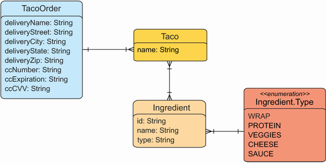

- [Spring in Actions By Craig Walls](#spring-in-actions-by-craig-walls)
  - [Chapter 1. Getting Started with Spring](#chapter-1-getting-started-with-spring)
    - [What is Spring ?](#what-is-spring-)
    - [History](#history)
    - [Init a Spring application](#init-a-spring-application)
    - [Writing a Spring Application](#writing-a-spring-application)
      - [Handling web requests](#handling-web-requests)
      - [Defining the view](#defining-the-view)
      - [Testing the controller](#testing-the-controller)
      - [Building and running the application](#building-and-running-the-application)
      - [Getting to know Spring Boot DevTools](#getting-to-know-spring-boot-devtools)
    - [Spring landscape](#spring-landscape)
      - [Core Spring framework](#core-spring-framework)
      - [Spring Boot](#spring-boot)
      - [Spring Data](#spring-data)
      - [Spring Security](#spring-security)
      - [Spring cloud](#spring-cloud)
      - [Spring Native](#spring-native)
  - [Chapter 2. Developing web applications](#chapter-2-developing-web-applications)
    - [Topics to cover](#topics-to-cover)
    - [Displaying information](#displaying-information)
      - [Domain](#domain)
    - [Annotations Used](#annotations-used)
    - [Designing the View](#designing-the-view)
    - [Processing form submission](#processing-form-submission)

# Spring in Actions By Craig Walls

## Chapter 1. Getting Started with Spring 
<p align="left">
  
  <br>
  <i>Cherry blossoms bloom, a pink sky's embrace,
Spring whispers in Japan, a fleeting grace</i>
</p>


### What is Spring ?
- Application comprises of many components
- Each component owns some functionality and coordinate with the other components to get the job done
- Spring offers containers/Application context 
  - Container creates and manage the application components
  - These components (or beans) are wired together inside the context to make complete application 
  - The act of wiring together these beans is based on pattern known as *dependency injection (DI)*
- Rather than have components create and maintain LCM of other beans they depends on a DI based application relies on a separate entity i.e., container
  - Achieved using i) Constructor args ii) Property accessor methods 
- On top of container Spring offers a full portfolio of related libraries 
  - Web frameworks
  - Variety of data persitent options
  - Security framework
  - Runtime monitoring
  - Microservice support 
  - Reactive programming model 
- You can consider Spring boot as *frameworkless* framework 
  - Benefit of developing with Spring is that you can focus on code that meets the requirements of the application, rather than satisfying the demand of the farmework
  - The code for framework will remain only a small fraction of codebase
### History
- How would you guide Spring application context (container) to wire beans together ? 
  - By providing configuration through xml files 
    <details> 
    <summary> The xml files defines the relationship between beans. An example below, where `productService` depends on `inventoryService` </summary>

    ```xml
    <bean id="inventoryService"
      class="com.example.InventoryService" />
 
    <bean id="productService"
        class="com.example.ProductService" >
    <constructor-arg ref="inventoryService" />
    </bean>
    ```
    </details>

    <details>
    <summary>Apart from xml file, Java-based configuration is more common. An example (equivalent to the xml)</summary>

    ```java
    @Configuration      // <--- indicates that this a configuration file 
    public class ServiceConfiguration {
        @Bean // <---  Tells that object this method returns should be added as bean in the context 
        public InventoryService inventoryService() {
            return new InventoryService();
        }
        @Bean
        public ProductService productService() {
            return new ProductService(inventoryService());
        }
    }
    ```
    </details>
  - There are pros and cons of both the approaches
  - Although Spring also offers *autowiring* and *component scaning* for automatic configuration 
    - With component scanning Spring can automatically discover components from the application classpath and create them as beans
    - With autowiring, Spring automatically injects the components with the other beans that they depends on

### Init a Spring application 
- Using **Spring Initializr**. 
  ```java 
    package com.souravsh.taco;

    import org.springframework.boot.SpringApplication;
    import org.springframework.boot.autoconfigure.SpringBootApplication;

    @SpringBootApplication
    public class TacoApplication {

        public static void main(String[] args) {
            SpringApplication.run(TacoApplication.class, args);
        }

    }
  ```
- `@SpringBootApplication` is a composite annotation that combines 
  - `@SpringBootConfiguration` 
    - Designate the class a configuration class (annotation is special case of `@Configuration` annotation)
  - `@EnableAutoConfiguration` 
    - Enables automatic configuration 
  - `@ComponentScan` 
    - Allows you to use/declare classes using `@Component`, `@Controller` and `@Service`
  - The static method `SprigApplication.run` performs the actual bootstrapping of the application, creating Spring context 

### Writing a Spring Application 

#### Handling web requests
- Spring comes with a powerful web framework known as Spring MVC
  - Controller is the class that handles requests and responds with information
  - In case of browser facing application, a controller responds by optionally populating model data and passing the request on to a view to produce HTML that returned to the browser

#### Defining the view
<details>
<summary>Under `/resources/template/<view_name>.html`</summary>

```html
<!DOCTYPE html>
<html xmlns="http://www.w3.org/1999/xhtml"
    xmlns:th="http://www.thymeleaf.org">
<head>
    <title>Taco Cloud</title>
</head>

<body>
    <h1>Welcome to...</h1>
    
</body>
</html>
```
</details>

#### Testing the controller

<details>
<summary> Home Controller testing </summary>

```java

@WebMvcTest(HomeController.class)
public class HomeControllerTest {

    @Autowired
    private MockMvc mockMvc;

    @Test
    public void testHomePage() throws Exception {
        mockMvc.perform(get("/"))
                .andExpect(status().isOk())
                .andExpect(view().name("home"))
                .andExpect(content().string(containsString("Welcome to...")));
    }
}

```

</details>

#### Building and running the application
```bash
./mvnw package
./mvnw test 
```
- As application starts, Tomcat started on port(s): 8080(http), which means that you're ready to point your web browser at the home page 
- Spring boot's autoconfiguration library automatically performs
  - Configures the beans in the context to enable MVC
  - Configures the embedded Tomcat server in the context
  
#### Getting to know Spring Boot DevTools
- Automatic application restart when code changes
- Automatic browser refresh when browser-destined resources
- Automatic disabling of template caches

### Spring landscape 
#### Core Spring framework
- Provides foundation for container/context and DI framework
- Spring MVC (Spring web framework)
  - Controller class (to handle web requests)
  - Also you can used to create REST APIs that produce non-HTML output
- Reactive style programming
- Spring WebFlux (Chapter 3)
#### Spring Boot
- Starter dependencies + autoconfiguration
- Actuator - provides runtime insights into the inner working
  - Metrics
  - Thread dumping 
  - Application health
  - Application properties
#### Spring Data
- Spring data is capable of working with several kinds of databases, including Mongo, JPA, Neo4j
#### Spring Security 
- Authentication, Authorization and API security 
#### Spring cloud
#### Spring Native 


## Chapter 2. Developing web applications

<p align="left">
  
  <br>
  <i>In Shimla's spring, where apple blossoms bloom so bright,
I long for those days, lost in petals' gentle light.</i>
</p>

### Topics to cover
In this chapter
- Presenting model data in the browser
- Processing and validating form input
- Choosing a view template library


### Displaying information
- In Spring web applications, 
  - It's a controller job to fetch and process the data
  - View's job is to render the data into the HTML 
- An example of Taco Cloud application
  - A domain class that defines the properties of Taco ingredient
  - A Spring MVC controller class that fetch and pass it to the view
  - A view template that renders a list of ingridients in the user's browser

#### Domain


<details>
<summary>Defining taco ingredients</summary>

```java

import lombok.Data;

@Data
public class Ingredient {
    private final String id;
    private final String name;
    private final Type type;

    public enum Type {
        WRAP, PROTEIN, VEGGIES, CHEESE
    }
}

```

</details>

<details>
<summary>Defining Taco Design</summary>

```java

import lombok.Data;

@Data
public class Taco {
    private String name;
    private List<Ingridient> ingredients;
}

```

</details>


<details>
<summary>Defining Taco order </summary>

```java

@Data
public class TacoOrder {
    private String deliveryName;
    private String deliveryStreet;
    private String deliveryCity;
    private String deliveryState;
    private String deliveryZip;
    private String ccNumber;
    private String ccExpiration;
    private String ccCVV;
    private List<Taco> tacos = new ArrayList<>();
    
    public void addTaco(Taco taco) {
        tacos.add(taco);
    }
}

```

</details>


<details>
<summary>Spring controller class </summary>

```java


@Slf4j
@Controller
@RequestMapping("/design")
@SessionAttributes("tacoOrder") 
public class DesignTacoController {
    @ModelAttributes
    public void addIngredientsToModel(Model model) {
        List<Ingredient> ingredients = Arrays.asList(
            new Ingredient("FLTO", "Flour Tortilla", Type.WRAP),
            new Ingredient("COTO", "Corn Tortilla", Type.WRAP),
            new Ingredient("GRBF", "Ground Beef", Type.PROTEIN),
            new Ingredient("CARN", "Carnitas", Type.PROTEIN),
            new Ingredient("TMTO", "Diced Tomatoes", Type.VEGGIES),
            new Ingredient("LETC", "Lettuce", Type.VEGGIES),
            new Ingredient("CHED", "Cheddar", Type.CHEESE),
            new Ingredient("JACK", "Monterrey Jack", Type.CHEESE),
            new Ingredient("SLSA", "Salsa", Type.SAUCE),
            new Ingredient("SRCR", "Sour Cream", Type.SAUCE)
        );
    
        Type[] types = Ingredient.Type.values();
        for (Type type : types) {
            model.addAttribute(type.toString().toLowerCase(),
                    filterByType(ingredients, type));
        }
    }

    @ModelAttribute(name = "tacoOrder")
    public TacoOrder order() {
        return new TacoOrder();
    }

    @ModelAttribute(name = "taco")
    public Taco taco() {
        return new Taco();
    }

    @GetMapping 
    public String showDesignForm() {
        return "design"; // <--  this is the logical name of view which 
                        // will be rendered (/resources/template/design.html)
    }

    private Iterable<Ingredient> filterByType(List<Ingredient> ingredients, 
            Type type) {
        return ingredients.stream()
                .filter(x -> x.getType()
                .equals(type))
                .collect(Collectors.toList());
    }
}
```
</details>

### Annotations Used

- `@Controller` 
  - Marks this class as candidate for component scanning, so that Spring will discover it as bean
  - This class is now a MVC controller, which intercept HTTP request
- `@ModelAttribute` 
  - What is Model ? 
    - An object that convey the message between controller and view 
  - What does annotation do and where to use ? 
    - Provides the access to the `model`. Thus, you can add attributes to the `model` which then are accessible to the views or other methods in the controller
        ```java
        // Example 1. Method level 

        // Any object added to the Model will be accessible in all the view 
        // templates that are handled by the controller.
        @ModelAttribute
        public void addAttributes(Model model) {
            model.addAttribute("attributeName", attributeValue);
        }

        // Example 2. Parameter level 
        // binds form data from the request to the method parameters
        @PostMapping
        public String submitForm(@ModelAttribute User user) {

        }
        ```
- `@RequestMapping` 
  - When applied at the class level, tells what kind of HTTP request this controller will handle
- `@SessionAttributes("tacoOrder")` 
  - Extends the lifecycle of an object till the end of **session** (instead end of request)
  - Annotation tells Spring MVC that `TacoOrder` object should be stored in the session 
  - This ensure that object is persisted across requests, instead of being recreated with every request
  - E.g. When a user starts designing tacos, the `TacoOrder` is created and stored in the session. 
  - This allows the `TacoOrder` object to be available for all subsequent requests (within the same session), such as when the user adds multiple tacos to their order.
  - If this annotation is not used then any object added to the `model` will be local to the current request 
    - Lifecycle of objec is limit by the current request. Once view is sent and rendered, the model attribute is discarded
- `@GetMapping` the class level `@RequestMapping` is refined with the `@GetMapping` annotation that adorns the `showDesignForm` method 
- `@Valid` 
   - Constraint defined on the `Taco` object
        ```java
        @Data
        public class Taco {
            @NotNull
            @Size(min=5, message="Name must be atleast 5 character long")
            private String name;
            
            @NotNull
            @Size(min=1, message="Must choose on ingredient")
            private List<Ingredient> ingredient;
        }
        ```
    - When you use `@Valid`, then `Taco` object is checked against all those constraints
        ```java
        public String processTaco(@Valid Taco taco, Errors errors, 
                @ModelAttribute TacoOrder tacoOrder) {
        ```
    - Error handling - If the object fails validation, an `Errors` or `BindingResult` (if included) object will contain the validation errors 


### Designing the View 
- Controller after processing pass the control to the view
- View libraries such as
  - JavaServerPages (JSP)
  - Thymeleaf 
  - FreeMarker
  - Moustache
  - Groovy based templates
- Most of the view libraries are designed to be decoupled from any type of web framework
  - This mean view libraries are unware of the webframework
  - This adds up the requirement of converter which can make webframwork talk with view library in the language which they understands.
  - Controller adds the data into the model and Spring MVC transfer that data into request attribute 
    - Eg. if Spring MVC puts a user object into the model, it will be copied to a request attribute. In a Thymeleaf template, you might access it like this:
        ```html
        <p th:text="${user.name}"> User's name will go here </p>
        ```
    - Therefore, before Spring handover the request over to a view, it copies the model data into request attributes that Thymeleaf and other view-templating options have ready access to
- Spring autoconfiguration when sees a view libray it creates the beans that support Thymeleaf view for Spring MVC


### Processing form submission 


