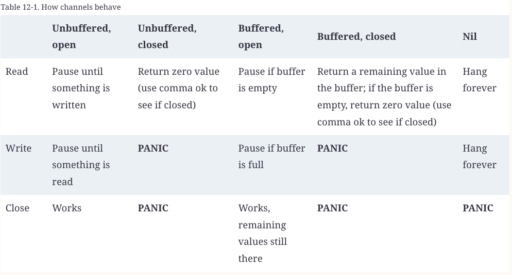

- [Resources](#resources)
- [Chapter 1 - Introduction to GoLang](#chapter-1---introduction-to-golang)
- [Chapter 2 - Basics](#chapter-2---basics)
- [Chapter 3 : Composite Types in GoLang](#chapter-3--composite-types-in-golang)
  - [Array](#array)
  - [Slices](#slices)
  - [Maps](#maps)
  - [Struct in Go](#struct-in-go)
- [Chapter 4 : Blocks, Shadows, and Control Structure](#chapter-4--blocks-shadows-and-control-structure)
  - [Blocks](#blocks)
  - [Shadowing variable](#shadowing-variable)
  - [If](#if)
  - [for, four ways](#for-four-ways)
  - [Switch](#switch)
  - [goto](#goto)
- [Chapter 5 : Functions](#chapter-5--functions)
  - [Functions in Go](#functions-in-go)
  - [Example of use of Go function as value](#example-of-use-of-go-function-as-value)
  - [Function type declaration](#function-type-declaration)
  - [Anonymous function](#anonymous-function)
  - [Go is CALL BY VALUE](#go-is-call-by-value)
- [Chapter 6 : Pointers in GO](#chapter-6--pointers-in-go)
  - [Pointer](#pointer)
  - [Pointers indicate Mutable Parameters](#pointers-indicate-mutable-parameters)
- [Chapter 7 : Type, Methods, and Interfaces](#chapter-7--type-methods-and-interfaces)
  - [Pointer receivers and value receivers](#pointer-receivers-and-value-receivers)
  - [Code you method for `nil` Instances](#code-you-method-for-nil-instances)
  - [Methods are function too](#methods-are-function-too)
  - [Function Vs Method](#function-vs-method)
  - [Type declarations aren't inheritance](#type-declarations-arent-inheritance)
  - [Types Are Executable Documentation](#types-are-executable-documentation)
  - [iota Is for Enumerations - Sometimes](#iota-is-for-enumerations---sometimes)
  - [Embedded fields](#embedded-fields)
  - [Embedding is not Inheritance](#embedding-is-not-inheritance)
  - [Short to Inteface](#short-to-inteface)
  - [Interface are Type-Safe Duck Typing](#interface-are-type-safe-duck-typing)
  - [Decorator pattern](#decorator-pattern)
  - [Embeddings and Interfaces](#embeddings-and-interfaces)
  - [Accept Interfaces, Return Structs](#accept-interfaces-return-structs)
  - [Interfaces and nil](#interfaces-and-nil)
  - [Interfaces Are Comparable](#interfaces-are-comparable)
  - [Type Assertion and Type Switches](#type-assertion-and-type-switches)
  - [Function Type are Bridge to Interfaces](#function-type-are-bridge-to-interfaces)
  - [Implicit Interface makes Dependency Injection Easier](#implicit-interface-makes-dependency-injection-easier)
- [Chapter 8 : Generics](#chapter-8--generics)
  - [One approach (will not use)](#one-approach-will-not-use)
  - [Introducing Generic in GO](#introducing-generic-in-go)
  - [Generic Functions Abstract Algorithms](#generic-functions-abstract-algorithms)
  - [Generic and Interfaces](#generic-and-interfaces)
  - [Use Type terms to specify Operators](#use-type-terms-to-specify-operators)
  - [Combining Generic Functions with Generic Data Structures](#combining-generic-functions-with-generic-data-structures)
  - [More on Comparable](#more-on-comparable)
  - [Things that are left out in Go Generics](#things-that-are-left-out-in-go-generics)
  - [Summary points](#summary-points)
- [Chapter 9 : Errors](#chapter-9--errors)
- [Chapter 10 : Modules, Packages And Imports](#chapter-10--modules-packages-and-imports)
- [Chapter 11 : Concurrency in Go](#chapter-11--concurrency-in-go)
  - [Basic](#basic)
  - [Five Stages of Go programmers](#five-stages-of-go-programmers)
  - [Go Routines](#go-routines)
  - [Channels](#channels)
    - [Reading, Writing and Buffering](#reading-writing-and-buffering)
    - [Using for-range and Channels](#using-for-range-and-channels)
    - [Closing a channel](#closing-a-channel)
    - [Channels makes Go concurrency model different](#channels-makes-go-concurrency-model-different)
    - [Understanding How channels behave ?](#understanding-how-channels-behave-)
- [Chapter 12 : The Standard Library](#chapter-12--the-standard-library)
- [Chapter 13 : The Context](#chapter-13--the-context)
- [Chapter 14 : Writing tests](#chapter-14--writing-tests)
- [Chapter 15 : Here Be Dragrons: Reflect, Unsafe and Cgo](#chapter-15--here-be-dragrons-reflect-unsafe-and-cgo)
  

## Resources
[Oreilley book - Learning GO by Jon Bodner](https://go.dev/doc/effective_go)
- Total of 16 Chapters : 12 hour of reading 
## Chapter 1 - Introduction to GoLang

- Go projects are called as modules
- `go mod init <module-name>`
    - Marks the folder as go module 
    - Contains specification of the dependencies
    - Every module has go.mod file (running go mod init create this file)
        - Should not edit the file directly use `go get` or `go mod tidy`

- Build the project
    - `go build -o <name-of-build>` 
    - `./<name-of-build>`
    - Default value for name-of-build is same as module name 

- Automatically fix the whitespaces in your code
    - `go fmt ./...` : Apply command to all the files `.` and all the subdirectories `..`

- `go vet`
    - Detects whether a value exits for each paceholder ?
    - e.g `fmt.Printf("Hello, %s!\n")`
    - ```bash
        got vet ./..
        fmt.Printf format %s reads arg #1, but call has 0 args
      ``` 

## Chapter 2 - Basics
- Pre declared Type
    - types built into the language
    - booleans, integers, floats and strings

- Zero value in Go (to avoid the mistakes of C/C++)
    - assign default zero value to any variable that is declared but not assigned a value
    - zero values 
        - Boolean : false
        - String : empty string

- Literals
    1. Integer literal : sequence of numbers
    2. Floating-point literal : decimal point to indicate fractional portion, optionally have exponent specified with the letter e and a positive or negative number
    3. Rune-literal(single quotes) : numeric & backslash escaped rune literals
    4. Interpreted string literal(double quotes) : contains zero or more rune literals, interpret rune literals
    5. Raw string literal(backquotes) : can contain any character except a backquote 

- Strings in Go are immutable 
    - You can reassign the value of a string variable, but you cannot change the value of the string that is assigned to it.

- Literal in Go are untyped
  - Literal has no type on its own but does have a default type that is used when no other type can be inferred
  - Literal can be used with any variable whose type is compatible with that literal
  - Untyped literals are constants that do not have a specific type until they are used in a **context** that requires a specific type.
  - **Context** : assignment to variable, type expected by the context (expression or function argument)
    ```go
    // 10 is an int literal which get assigned to float64
    var x float64 = 10
    // 4 is an int literal which get assigned to float64
    var y float64 = 200.3 * 4
    ```
> [!CAUTION]
> - size limitation exists, cannot write numeric literals that are larger than any integer can hold
> - **cannot assign**
>   1. literal string to a variable with a numeric type
>   2. literal number to a string variable
>   3. literal float to an int variable (but int literal can be assigned to float variable)

- Explicit Type Conversion
  - __Automatic type promotion__ between numeric literals is not allowed in go
  - we must use __type conversion__ when 
    - variable types do not match
    - different sized integers / floats needs to interact
    ```go
    // illegal
    var i = 20
	var f float32 = i
    // legal
    var i = 20
	var f float32 = float32(i)
    ```

- `var` Vs `:=`
    ```go
    var x int = 10
    var x = 10

    // zero-value 
    var x int 

    // same type
    var x, y int = 10, 20 
    var x, y int

    // different type
    var x, y = 10, "hello"

    // declaration list : wrapping multiple variables
    var (
        x int
        y int = 20
        z = 30
        d, e = 40, "hello"
        f, g string 
    )

    ```
    - Go also supports __short declaration & assignment format__
        - When you are **within a function**, you can use `:=` operator to replace a `var` declaration that uses type inference 

        ```go
        // var x = 10
        x := 10

        // declare multiple variables at once
        // var x, y = 10, "hello"
        x, y := 10, "hello"
        ```     
> [!CAUTION]
> illegal to use outside the function.

> [!TIP]
> - Don't declare variables outside of the function i.e __package block__ (most of the time you should only declare inside the methods)
>   - Issues ?
>        - Complicate data flow analysis
>        - Subtle bugs (var whose value changes)
>        - Difficult to track the changes made to it 
>    - In which scenario can use ?
>        - Immutable variable


- Constants in Go are a way to give names to literals. There is no way in Go to declare that a variable is immutable.

- Another Go requirement is that every declared local variable must be read. It is a compile-time error to declare a local variable and to not read its value.
    - The Go compiler won’t stop you from creating unread package-level variables. This is one more reason you should avoid creating package-level variables.
    - Unused constants perhaps surprisingly, the Go compiler allows you to create unread constants with const. This is because constants in Go are calculated at compile time and cannot have any side effects. This makes them easy to eliminate: if a constant isn’t used, it is simply not included in the compiled binary.

- Variables in idiomatic go uses `camelCase` not `snake_case`
- Go uses the case of the **first letter** in the name of package-level declaration to determine if the item is accessible outside the package
  - Constants in go are **not** written in all uppercase letters, with words separated by underscores

> [!TIP]
> __The smaller the scope for a variable the shorter the name that's used for it__
> Benefits
> - Eliminate repeatitive typing, keeping your code shorter
> - Serve as a check on how complicated your code is. If you find it hard to keep track of your short-named variables, then your code block is likely doing too much.

## Chapter 3 : Composite Types in GoLang

### Array 
    
```go
var x = [3]int{10, 20, 30}
// using array literal to initialize an array, replace number of elements with ...
var x = [...]int{10, 20, 30}
fmt.Println(x == y) // prints true
```

- Go only supports one-dimensional arrays, but you can simulate multidimensional arrays : Go lack true matrix support
    ```go
    var x [2][3]int 
    ```
    - example declares x to be an array of length 2 whose type is an array of ints of length 3

- Can't read or write past the end of an array or negative index
    - If constant literal index, it is a compile-time error
    - If variable index, it compiles but fails at runtime with a panic

- Don't use array unless you know the exact length you need ahead of time

- Arrays - Too Rigid to Use Directly ? Go consider size of the array to be part of the type of the array
    - Cannot use a variable to specify the size of an array because types must be resolved at the compile time, not at the runtime
    - Can't use type conversion to directly convert arrays of different sizes to identical types
    - Can't write a function that works with arrays of any size 
    - Can't assign arrays of different sizes to the same variable
  
- If there are too many limitations, then why it's present in the language ?
    - To provide the backing store for slices, which are one of the most useful features of Go

### Slices
- Length of the slice is not part of its type, it can grow as needed
- Allows us to write single function that processes slices of any type
- Slice literal : `[]int{10, 20, 30}`
- Zero length slice vs `nil`
  ```go
    // nil
    // zero value of the slice, assigned if no value is no other value is assigned
    var data []int

    // zero length slice
    var x = []int{} // length = 0, capacity = 0
  ```  
- A slice is the first type that isn't **comparable**, except comparing a slice with `nil`
    - `slices.Equal` function : 
        - takes two slices and returns true/false
        - checks slices of same length & all elements equals
        - requires elements to be __comparable__
    - `slices.EqualFunc` function : 
        - lets you pass function to determine equality
        - not require elements to be __comparable__
    ```go
    var x []int
    fmt.Println(x == nil) // prints true

    x := []int{1, 2, 3, 4}
    y := []int{1, 2, 3, 4}
    z := []int{1, 2, 3, 4, 5, 5}
    s := []string{"a", "b", "c"}
    fmt.Println(slices.Equal(x, y)) //print true
    fmt.Println(slices.Equal(x, z)) //print false
    fmt.Println(slices.Equal(x, s))  // does not compile
    ```
- len
  - Built-in function 
  - Returns number of consecutive memory location that have been a value
  - len of nil slice is zero
  ```go
  var x []int
  fmt.Println(len(x) == 0) // returns true
  ```
> [!NOTE]
> len is a special function which supports var of type array, slices, maps, strings, channel types, but returns compile-time error on passing var of any other type

- append
  - Go is call-by-value language, passing slice to append function actually passes copy of the slice to the function
  - Assign the returned slice back to the variable in the calling function
    ```go
    var x []int
    // appending to an zero length slice
    x = append(x, 10)

    // appending one slice to another
    y := []int{20, 30, 40}
    x = append(x, y...)
    ```

- capacity
    - Number of consecutive memory locations reserved, can be larger than length
    - Expansion of slice backing array on appends : each value added to slice via append, increases it's length by one and when length equals the capacity, the append function in the Go runtime allocates a new backing array for the slice with a larger capacity
    - If #element in `slice == capacity`, then copy to new location 

> [!TIP]
> **Go Runtime**
> - [Understanding the Go runtime](https://golab.io/talks/understanding-the-go-runtime)
> - Go runtime is compiled into every Go binary
> - Go compiler convert code into super fast binary ( by including runtime )
> - Makes Go programs easy to distribute & avoid compatibility issues between runtime & the program
> - Go runtime provides
>    - Memory allocation
>    - Garbage collection 
>    - concurrency support
>    - Networking
>    - Buildin types/functions
> - Overheads with new memory allocation
>   1. Allocating new memory
>   2. Copying from old memory to new
>   3. Garbage collection of the old memory

- Make
    - Via make we can create empty slice that has a length & capacity specified
    - Capacity is optional, equal to length if not supplied
    - Useful when we know length of slice beforehand

    ```go
     // intialized with zero value of int type : x[0] .. x[4] = 0
     // len == capacity == 5
     x := make([]int, 5)
     fmt.Println(x) // [0, 0, 0, 0, 0]

     // len = 5, capacity = 10 (init)
     x := make([]int, 2, 10)
     // append always increases the length of the slice
     x = append(x, 10) 
     fmt.Println(x) // [0, 0, 10]
     
     // zero length slice cannot be used for indexing but can be used for appending values to it
     x := make([]int, 0, 10) 
     x = append(x, 5, 6, 7, 8)
     // [5, 6, 7, 8] 
    ```

    - capacity < length 
      - if numerical literals or constants then compile-time error
      - if variable then panic at runtime

- Emptying a Slice `clear`
    - :sunglasses: sets all of the slice's elements to their zero value & length remains unchanged
    ```go
    s := []string{"first", "second", "third"}
    clear(s)
    ```

- Declaring slice
  - 🏁 Minimize the number of times the slice needs to grow (expansion has overheads)
    ```go
    var data []int

    // 1. empty slice literal / zero length slice
    var x = []int{}
    // creates slice with zero length & zero capacity
    fmt.Println(len(x), cap(x)) // 0 0
    // comparing with nil returns false
    fmt.Println(x == nil) // false
    
    // 2. with default values
    data := []int{2, 4, 6, 8}

    // 3. know length of the slice but not know the values
    data = make([]int, 5)

    // 4. zero length and non-zero capacity with make
    // - reduces expansion overhead
    // - append will work correctly
    data = make([]int, 0, 5)
    ```

- Slicing Slices (subslices)
    - Slice expression : 
      - Starting and ending offset separated with colon ':'
      - Ending offset is one past the last position to include
      - Example : `s[0:5]`
    
    ```go
    x := []string {"a", "b", "c", "d"}
    y := x[:2]
    z := x[1:]
    /*
    x : [a b c d]
    y : [a b]
    z : [b c d]
    */
    ```
    - No copying, shared memory : changing element has side-effects on all slices sharing memory
> [!CAUTION]
> **Slicing slices is not recommended**
> - Whenever we take a slice from another slice, subslice capacity is set to the capacity of the orignal slice minus the starting offset of the subslice within the original slice
> - Means that elements beyond the end of slice including unused capacity is shared by both slices
> - Never use append with a subslice or make sure that append doesn't cause an overwrite in the parent slice by using a full slice expression
    - Full slice expression / Three part slice expression : 
      - Includes a third part which indicates the last position in the parent slice's capacity that's available for the subslice
      - Trying to append beyond the mentioned capacity will result in allocation of new memory
      - Example : `x[:2:2]`
    
- Copy of slices
  - `copy` function copies as many values as it can from source to destination, limited by whichever slice is smaller
  - Returns the number of elements copied
  - Also copy a subset of a slice by subslicing using slice expression
    ```go
        x := []int{1, 2, 3, 4}
        y := make([]int, 4)
        num := copy(y, x) // destination, source ; returns #element copied
    ```

- Converting arrays to slices
    - From array use slice expression to convert it into slice
    - Slice from an array has same memory-sharing properties as taking a slice from a slice
    ```go
    xArray := [4]int{5, 6, 7, 8}
    xSlice := xArray[:]
    ```

- Converting slices to arrays
    - Type conversion is required to make an array from a slice
    - This is copying, no memory sharing
    - Size must be specified at the compile time, thus you can't use `[...]` in a slice to array type conversion
    ```go
    xSlice := []int{1, 2, 3, 4}
    xArray := [4]int(xSlice)

    smallArray := [2]int(xSlice)
    xSlice[0] = 0
    fmt.Println(xSlice)
    fmt.Println(xArray)
    fmt.Println(smallArray)

    /* output : 
     * [10 2 3 4]   
     * [1 2 3 4]
     * [1 2]
     * /
    ```

    - While size of array can be small that the slice, but it can't be larger that the slice size(i.e length not capacity), else you code will panic at runtime as compiler cannot detect it

- Strings and Runes and Bytes
    - Go uses __sequences of bytes__ to represent the string
    - These bytes don't have to be in particular character encoding, but several Go library functions (and for-range loop) assumes that a string is composed of UTF-8 encoded code points
    - Code point : unique numerical assigned to unicode character

    ```go
    var s string = "hello there"
    var b byte = s[6] // 116 i.e UTF-8 value of lowercase t 

    var s2 string = s[4: 7] 
    ```

    ```go
    var s string = "Hello 🌞"
    var s2 string = s[4:7] // This will not show the emoji, instead [4: 10] will show 
    var s3 string = s[:5]
    var s4 string = s[6:]
    // length of s is not 5(Hello) + 1(space) + 1(emoji), but instead
    // 5 + 1 + 4 = 
    ```
    - String in Go are immutables, thus no side-effects while creating slices (no memory sharing)
    > There is a problem : UTF-8 ( can be 1-4 bytes ) for non-English letters it can be > 1 bytes, thus we might end up reading it partially
    - Only use slicing & indexing syntax with strings when you are sure that each character is only take upto 1 byte

    - Runes & Bytes
        - single rune or byte can be converted to a string
        ```go
        var a rune    = 'x'
        var s string  = string(a)
        var b byte    = 'y'
        var s2 string = string(b)
        ```
        - string can be considered as an array, converted back & forth to a slice of bytes or a slice of runes using type conversion
        - rune is an alias for the `int32` type, therefore the size of a rune is 4 bytes (32 bits) & represents a single unicode code point
        ```go
        var s string = "Hello, 🌞"
        var bs []byte = []byte(s)
        var rs []rune = []rune(s)
        fmt.Println(bs) // [72 101 108 108 111 44 32 240 159 140 158]
        fmt.Println(rs) // [72 101 108 108 111 44 32 127774]
        ```
> [!NOTE]
>  - UTF-32 : store four bytes for each code point
>  - UTF-16 : use one or two 16-bit sequences to represent each code point
>  - UTF-8  : occupies single byte for all letters, puncutations & numbers in english, can extend to 4 bytes for unicode code points

> [!TIP]
> Use functions from `strings` & `unicode/utf8` packages in standard library for extracting **substring** & **code points** from string
 
### Maps
- `map[keyType]valueType`
- Maps are not comparable, but we can check if they are equal to `nil` using `==` operator
> [!NOTE]
> - Key for a map must be a **comparable** type
> - Therefore it cannot use a slice or a map as the key for the map
- `nil` map
  - `var nilMap map[string]int`
  - The zero value for map is `nil`. A `nil` map has a length 0.
  - Attempting to read a `nil` map always returns the zero value for the map's value type, but attempting to write to a `nil` map causes a panic
- Creating map using literals
    - Empty map literal : `totalWins := map[string]int{}`
    - The above is not same as `nil` map. It has a length of 0, but you can read and write to a map assigned an empty map literal
- Non empty map literal looks like
    - Comma sepates each key-value pair in the map, __even on the last line__
    ```go
    teams := map[string][]string {
        "abc": []string{
                    "def", 
                    "ghij", 
                    "klm"
                },
        "cde": []string{
                    "afads",
                    "afaf"
                },
    }
    ```
- `make` to create a map with a default size
    - Know number of key-value pairs but don't know the exact values
    ```go
    ages := make(map[int][]string, 10)
    ```

- Reading and Writing a map
    ```go
        totalWins := map[string]int{}
        totalWins["abc"] = 1
        totalWins["def"] = 2
        fmt.Println(totalWins["abc"])
        totalWins["abc"]++
    ```
- The comma ok Idiom
    - How to check if a key is present in map ? as map returns zero value if you ask for the value associated with the key that's not in the map
    ```go
    m := map[string]int {
        "hello" : 5,
        "world" : 0,
    }
    v, ok := m["hello"] // value and Ok (boolean) : if true, then key is present, else no
    fmt.Println(v, ok)
    ```
- Deleting from Maps / Emptying a map
    - Cleared map has its length set to zero, whereas in slice it's length remains unchanged
    ```go
    m := map[string]int {
        "hello", 5,
        "world", 10,
    }
    delete(m, "hello")
    clear(m) // clears the map 
    ```
- Comparing the maps
    - `maps.Equal` & `maps.EqualFunc` functions are used for comparing the maps
    ```go
        m := map[string]int{
            "hello": 5,
            "world": 10,
        }
        n := map[string]int{
            "world": 10,
            "hello": 5,
        }
        fmt.Println(maps.Equal(m, n)) // prints true
    ```
- Using Maps as Sets
    - Go doesn't include a set, but you can use map to simulate some of its feature
    ```go
    intSet := map[int]bool{}
    vals := []int{5, 10, 2, 4, ...}
    for _, v := range vals {
        intSet[v] = true
    }
    fmt.Println(len(vals), len(intSet))
    ```

### Struct in Go
- Way to pass data from function to function
- Group related data together by defining a struct
- Unlike map literals, no comma separate the fields in a struct declaration
```go
type person struct {
    name string
    age int
    pet string
}

var fred person // declare variable on struct

bob := person{} // literal, zero struct

// 1. provide all the values + order need to same
julia := person {
    "Julia",
    40,
    "cat",
}

// 2. More flexible
beth := person {
    age: 30,
    name: "Beth",
}

fmt.Println(bob.name)
bob.name = "new Name of Bob"

```
- Struct type defined within a function can only be used within that function
- A zero value struct has every field set to the field's zero value
- Allows type conversion from one struct to another only if the fields of both structs have the same name, type and order

- Comparing structs
    - Struct entirely composed of comparable types are comparable, no magic method to redefine equality and make `==` or `!=` work for incompatible structs
    - Go doesn't allow comparing two struct of different types

- Anonymous structs
    - Variables implements a struct type without giving struct type a name
    - Helpful in unmarshaling(de-serialization) and marshaling (serialization) data 
    - Also used for writing tests
    ```go
    pet := struct {
        name string
        kind string
    } {
        name : "Fido",
        kind: "dog",
    }
    ```

## Chapter 4 : Blocks, Shadows, and Control Structure

### Blocks
- **variables declaration**
    1. outside of functions : package block
    2. parameters to function
    3. local variables within functions
- each place where declration occurs is called a **block**
  - **package block :** variables, constants, types & functions declared outside of any functions 
  - **file block :** `import` statement to define names for other packages that are valid for the file
  - parameters to a function are in a block
  - set of braces `{}` defines another block
  - control structures in Go defines blocks of their own
> [!Tip]
> **Universe Block**
> - Go is a small language with only 25 keywords
> - Built-in types (like `int` & `string`), constants (like `true` & `false`), functions (like `make` or `close`) are not present in the list
> - Go considers these predeclared identifiers and defines them in universe block
> - They can be shadowed in other scopes
> ```go
>     fmt.Println(true)
>     true := 10
>     fmt.Println(true)
> ```
- **access**
  - identifier defined in any outer block can be accessed from within any inner block

### Shadowing variable
- shadowing variable is a variable that has the same name as a variable in containing block
```go
    func main() {
        x := 10
        if x > 5 {
            fmt.Println(x)
            x := 5
            fmt.Println(x)
        }
        if x > 5 {
            x, y := 5, 20
            fmt.Println(x, y)
        }
        fmt.Println(x)
    }

    // Output
    // 10
    // 5
    // 5 20 
    // 10

```
> [!NOTE] 
> Not all variables on the lefthand side of `:=` have to be new, it will work as long as there is atleast one new variable on the lefthand side

> [!CAUTION]
> - Make sure that we don't unintentially shadow variables from an outer scope using `:=`
> - Ensure that we don't shadow a package import
> ```go
> func main() {
>     x := 10
>     fmt.Println(x)
>     fmt := "oops"
>     fmt.Println(fmt)
> }
> ```

### If 
```go
n := rand.Intn(10)
if n == 0 {
    fmt.Println()
} else if n > 5 {

} else {

}
```
- Any variable declared within the brace of an `if` or `else` statement exists only within that block (scoped to the condition & to the `if` `else` block)
    - In below code section `n` is only limited to scope of `if/else` and after that it is undefined
    - Shadow rules are applicable for the declared variable `n`
    ```go
    if n := rand.Intn(10); n == 0 {
        fmt.Println(n) // 10
    } else if n > 5 {

    }
    fmt.Println(n) // out of scope 
    ```
> [!TIP]
> Use this feature for defining a new variable that is scoped to the if/else statements, anything else would be confusing

### for, four ways
- `for` is the only looping keyword in the language
- A C-style `for`
    ```go
    for i := 0; i < 10; i++ {
        fmt.Println(i)
    }

    // initialization based on the value calculated before the loop
    i := 0
    for ; i < 10; i++ {
        fmt.Println(i)
    }

    // complicated increment rule inside the loop
    for i := 0; i < 10; {
        fmt.Println(i)
        if i % 2 == 0 {
            i++
        } else {
            i += 2
        }

    }
    ```
- A condition-only `for` (`while` loop in Go)
  - leave off both the initialization & the increment in a `for` statement
  - do not include a semicolon `;` 
    ```go
    i := 1
    for i < 100 {

    }
    ```
- An infinite `for` (`while true` or `for true` in Go)
    - `for` loop that loops forever
    ```go
    package main
    import "fmt"
    func main() {
        for {
            fmt.Println("hello")
        }
    }
    ```
    - get out of an infinite `for` loop using the `break` keyword
    - `continue` keyword skips over the rest of the `for` loop body & proceeds directly to the next iteration
> [!TIP]
> `for` loop block containing only `if-else` can be translated to series of short `if` blocks with `continue` to make code easier to read & understand

- `for-range` loop
    - For iterating over the elements in some of Go's built-in types
    - Can use used to iterate over strings, arrays, slices, maps (built-in compound types)
    - Gets two loop variables, first is the position(arrays, slices, string) / key(maps) in the data structure being iterated & second is the value at that position
    ```go
    envs := []int{2, 4, 5, 8, 10} // declaring slice using slice literal
    for i, v := range envs { // for-range loop
        fmt.Println(i, v)
    }

    // using `_` to hide the returned value
    for _, v := range envs {
        ...
    }

    // leave off the second variable if just wanted key and don't want the value
    // usecase : iterating over the map being used as a set
    uniqueNames := map[string]bool{"Fred": true, "Raul": true, "Wilma": true}
    for k := range uniqueNames {
        fmt.Println(k)
    }
    ```

- Iterating over maps

    ```go
    m := map[string]int {
        "a": 1,
        "c": 3,
        "b": 2
    }

    for i := 0; i < 3; i++ {
        fmt.Println("Loop", i)
        for k, v := range m {
            fmt.Println(k, v)
        }
    }
    /*
        Loop 0
        c 3
        b 2
        a 1
        Loop 1
        a 1
        c 3
        b 2
        Loop 2
        b 2
        a 1
        c 3
    */
    ```
  - Why different order ? security feature
      - Save from **Hash DoS** attack where hacker sends specially crafted data with keys that all hash to the same bucket, which will slow down server if maps always hash items to the exact same values
      - Writing code based on assumption of order is not safe and can break at wierd time
    
- Iterating over strings
    - String were made out of bytes
    - But `for-range` iterates over the `runes`, not the `bytes`, first variable holds the number of bytes from the beginning of the string while type of the second variable is rune (type `int32`)
    ```
    samples := []string{"hello", "apple_ɸ!"} // assume pi as actual pi symbol 

    for _, sample := range samples {
        for i, r := range sample {
            fmt.Println(i, r, string(r))
        }
        fmt.Println()
    }
    ```
    - The `for-range` value is a copy
      - Modifying the value of variable will not modify the value in the compound type
      - Since Go 1.22, the default behavior is to create a new __index__ and __value__ variable on each iteration through the for loop


- Labelling your for statements
    - used when you have nested `for` loops and want to exit or skip over an iterator of an outer loop
    ```go
    func main() {
        samples := []string{"hello", "world"}

    outer:
        for _, sample := range samples {
            for i, r := range sample {
                fmt.Println(i, r, string(r)) // index, rune, conversion of rune to string (character)
                if r == 'l' {
                    continue outer
                }
            }
            fmt.Println()
        }
    }

    // output:  helworl 
    ```

### Switch
- Don't put parentheses around the value compared
- Declare a variable that's scoped to all branches
- Don't put braces around the contents of the `case` clauses
  - Multiple lines inside the case clause, are considered to be part of the same block
  - Any variable declared within the case clause's block is only visible within that block
- By default, cases in `switch` statements in Go don't fallthrough (`break` statement at end of every `case` statement not required)
- An empty case clause's block means nothing happens
- Only switch on the types that are comparable ( with `==` operator)
```go
words := []string{"a", "cow", "smile"}
for _, word := range words {
    switch size := len(word); size {
        case 1, 2, 3, 4:
            fmt.Println("shorter")
        case 5:
            wordLen := len(word)
            fmt.Println(word, " is exaclty of lenght", wordLen)
        case 6, 7, 8, 9: // empty case - nothing happens
        default:
            fmt.Println(word, " is a long word!")
    }
}
```

- Check below : break works as == break from the case not the for loop
    ```go
    func main() {
        for i := 0; i < 10; i++ {
            switch i {
            case 0, 2, 4, 6:
                fmt.Println(i, "is even")
            case 3:
                fmt.Println(i, "is divisible by 3 but not 2")
            case 7:
                fmt.Println("exit the loop!")
                break
            default:
                fmt.Println(i, "is boring")
            }
        }
    }
    ```
    ```text
    0 is even
    1 is boring
    2 is even
    3 is divisible by 3 but not 2
    4 is even
    5 is boring
    6 is even
    exit the loop!
    8 is boring
    9 is boring
    ```

- Blank Switches
> [!TIP]
> favour blank switch statements over if/else chains only when we have multiple related cases
    
```go
words := []string{"go", "there", "is", "a", "playground"}
for _, word := range words {
    switch wordLen := len(word) {
        case wordLen < 5:
            fmt.Println("less than 5")
        case wordLen > 10:
            fmt.Println("greater than 10")
        default:
            fmt.Println(word)
    }
}
```
```go
switch {
    case a == 2:
        fmt.Println("a", 2)
}

```

### goto
- `goto` statement specifies a labelled line of code and execution jumps to it
- Limitations imposed by Go language, forbits jumps that
  1. skip over variable declarations
  2. go into an inner or parallel block
- Always try very hard to avoid using `goto`
```go
func main() {
    a := rand.Intn(10)
    for a < 100 {
        if a%5 == 0 {
            goto done
        }
        a = a*2 + 1
    }
    fmt.Println("do something when the loop completes normally")
done:
    fmt.Println("do complicated stuff no matter why we left the loop")
    fmt.Println(a)
}
``` 

## Chapter 5 : Functions
### Functions in Go
```go
func div(num int, deno int) int {
    if deno == 0 {
        return 0
    }
    return num / deno;
}

func div(num, deno int) int {
    ...
}
```
- Go doesn't supports **named** and **optional** input parameters. You must use struct to the same
```go

type MyFuncOpts struct {
    FirstName string
    LastName string
    Age      int 
}

func myFunc(opts MyFuncOpts) error {

}

func main() {
    MyFunc(MyFuncOpts{
        LastName : "Sharma",
        Age : 10
    })
}
```

- Variadic Input Parameters and Slices

```go
func addTo(base int, vals ...int) []int {
    out := make([]int, 0, len(vals))
    for _, v := range vals {
        out = append(out, base + v)
    }
    return out
}

// must put ... after literals, slices

func main() {
    fmt.Println(addTo(3))
    fmt.Println(addTo(3, 4))
    fmt.Println(addTo(3, 2, 3, 4, 5, 5, 5))
    a := []int{4, 3} 
    fmt.Println(addTo(3, a...))
    fmt.Println(addTo(3, []int{1, 2, 3, 4}...))
}

```

- Multiple value return from a method (different feature from other lang)
```go
func divAndRemainder(num, denom int) (int, int, error) {
    if denom == 0 {
        return 0, 0, errors.New("can't divide by zero");
    }
    return num / denom, num % denom, nil
}

// must assign each value to a variable

func main() {
    result, remainder, error := divAndRemainder(5, 2)
    if error != nil {
        fmt.Println(error)
        os.Exit(1)
    }
    fmt.Println(result, remainder)
    // you can also ignore return value by using _
}
```

- Named return value (must be within parenthesis, even if single)
```go
// these variables becomes the pre-declared variable within the scope of 
// method and makes code more intuitive/readable compare to just return type
func divAndRemainder(num, denom int) (result int, remainder int, err error) {
    if denom == 0 {
        err = errors.New("cannot divide by zero")
        return result, remainder, err
    }
    result, remainder = num/denom, num%denom
    return result, remainder, err
}
```
- Function in Go are values 
- The default value for function variable is `nil`
- Attempting to run a method with `nil` value results in a panic 
```go
func f1 (a string) int {
    return len(a)
}

func f2 (a string) int {
    total := 0
    for _, v := range a {
        total += int(v)
    }
    return total
}

func main() {
    var myFuncVariable func(string) int
    myFuncVariable = f1
    result := myFuncVariable("hello")
}
```
### Example of use of Go function as value
```go
func add(i, j int) int { return i + j}
func sub(i, j int) int {return i - j}
func mult(i, j int) int {return i * j}
func div(i, j int ) int {return i / j}

var opMap = map[string]func(int, int) int {
    "+" : add,
    "-" : sub,
    "*" : mult,
    "/" : div,
}

func main() {
    expression := [][]string {
        {"2", "+", "3"},
        {"3", "-", "2"},
    }

    for _, expression := range expressions {
        if len(expression) != 3 {
            fmt.Println("Invalid expression ", expression);
            continue
        }
        p1, err := strconv.Atoi(expression[0])
        if err != nil {
            fmt.Println(err)
            continue
        }
        op := expression[1]
        opFunc, ok := opMap[op]
        if !ok {
            fmt.Println("unsupported operator : ", op)
            continue
        }
        p2, err := strconv.Atoi(expression[1])
        if err != nil {
            fmt.Println(err)
            continue
        }
        result := opFunc(p1, p2)
        fmt.Println(result)
    }

}

```

### Function type declaration
```go
// helps you name and refer this better / documentation
type opFuncType func(int, int) int

var opMap = map[string] opFuncType {
    ...
}
```

### Anonymous function
```go
func main() {
    f := func(j int) {
        fmt.Println("printing ", j, "from inside f")
    }
    for i := 0; i < 5; i++ {
        f(i)
    }
}

// Another way
func main() {
    for i := 0; i < 5; i++ {
        f := func(j int) {
            fmt.Println("printing ", j, "from inside f")
        }(i)
    }
}

// Since you can declare variables at the package scope, you can also declare package scope
// variable that are assigned anonymous function

var (
    add = func (i, j int) int {return i + j}
    sub = func (i, j int) int {return i - j}
)

func main() {
    x := add(2, 3)
    fmt.Println("x ", x)
    changeAdd()
    y := add(2, 3)
    fmt.Println("y ", y)
}

// unlike a normal function definition, you can assign a new value to a package-level anonymous function

func changeAdd() {
    add = func (i, j int) int {return i + i + j + j}
}
```

> Note that package level anonymous functions must be immutable in nature (recommended)

- Closures
    - Functions declared inside functions are special; they are **closures**
    - Inside function are able to access and modify variables declared in the outer function
    ```go
    func main() {
        a := 20
        f := func() {
            fmt.Println(a)
            a = 30 // if done a := 30, then it is shadowing (new variable)
        }
        f()
        fmt.Println(a)
    }
    ```

- Use case of closures ? or these mini-functions ?
    - Limits a function scope (only to outer function)
    - If a function is going to be called from only one other function, but its called multiple time, you can use inner function to hide the called function

- Passing Functions as Parameters
    - Use case ? - Popular one - Sort method
    - Middlewares
    - Function taking function as input : Higher order function (in Haskell)
    ```go
    type Person struct {
        FirstName string
        LastName string
        Age int
    }

    people := []People {
        {"Chintan", "Seth", 30},
        {"Ronak", "Ladhar", 32},
        {"Sourav", "Sharma", 28},
    }

    fmt.Println(people)

    sort.Slice(people, func(i, j int) bool {
        return people[i].LastName < people[j].LastName
    })

    sort.Slice(people, func(i, j int) bool {
        return people[i].Age < people[j].Age
    })
    ```

- Returning method from the method 
```go
func makeMult(base int) func(int) int {
    return func(factor int) int {
        return base * factor
    }
}

func main() {
    twoBase := makeMult(2)
    threeBase := makeMult(3)

}
```

- Defer
    - Go also uses closures to implement resource cleanup, via the `defer` keyword
    - Programs often creates temporary resources, like file or network connections, that need to be cleanup
    - This cleanup has to happen, no matter how much exit points a function has, or whether a function completes successfully or not 
    - In Go, cleanup code is attached to the function with the `defer` keyword
    > The defer keyword in Go delays the execution of a function until the surrounding function exits
    ```go
    import (
        "io"
        "log"
        "os"
    )
    func main() {
        if len(os.Args) < 2 {
            log.Fatal("no file specified")
        }
        f, err := os.Open(os.Args[1])
        if err != nil {
            log.Fatal("err := ", err)
        }
        defer f.Close()
        data := make([]byte, 2048)
        for {
            count, err := f.Read(data)
            os.Stdout.Write(data[:count])
            if err != nil {
                if err != io.EOF {
                    log.Fatal(err)
                }
                break
            }
        }
    }
    ```
    ```go
    func deferExample() int {
        a := 10
        defer func(val int) {
            fmt.Println("first:", val)
        }(a)
        a = 20
        defer func(val int) {
            fmt.Println("second", a)
        }(a)
        
        // You can supply a function that return value to a defer, but there's no way to read those values (use named)
        defer func() int {
            return 2
        }()

        a = 30
        fmt.Println("a", a)
        return a
    }

    // Because Go doesn't allow unused variable, returning the closer from the function means that the program will not compile if the function is not called.

    func getFile(name string) (*os.File, func(), error) {
        file, err := os.Open(name)
        if err != nil {
            return nil, nil, err
        }
        return file, func() {
            file.Close()
        }, nil
    }

    func main() {
        f, closer, err = getFile(os.Args[1])
        if err != nil {
            log.Fatal(err)
        }
        defer closer() // note the parenthesis after closer
    }
    ```

### Go is CALL BY VALUE
- Go always makes a copy of the value of the variable, when passed for a parameter to a function
```go
type person struct {
    age int
    name string
}

func modifyFails(i int, s string, p person) {
    i = i * 2
    s = "changed"
    p.name = "bob"
}

func main() {
    p := person{}
    s := "alice"
    i := 3
    modifyFails(i, s, p) // no changes to i, s, p after call

}
```
- Modify the Map and Slice 
```go   
func modMap(m map[int]string) {
    m[2] = "hello"
    m[3] = "dummy"
    delete(m, 1)
}
func modSlice(s []int) {
    for k, v := range s {
        s[k] = v * 2
    }
    s = append(s, 10) // can't lengthen the slice
}

func main() {
    m := map[int]string {
        1 : "one",
        2 : "two",
    }
    modMap(m)
    fmt.Println(m) // map[2:hello 3:dummy]

    s := []int{1, 2, 3}
    modSlice(s)
    fmt.Println(s) // [2 4 6]
}

- Slices and Maps are different that other type, why ? because they are implemented using pointer
```
> Every type in Go is a value type. It's just that something the value is a pointer
> Call by value is the reason, Go limited support for constants (since variable are passed by value)


## Chapter 6 : Pointers in GO
### Pointer
- A pointer is a variable that holds the location in memory where a value is stored
- Pointer sizes are fixed, no matter what type they are pointing (typically 4-byte, or sometime 8-byte)
```go
var x int32 = 10
var y bool = true
pointerX := &x
pointerY := &y
var pointerZ *string
```
- The zero value of a pointer is nil (unlike `NULL` in C, `nil` is not another name for 0; you can't convert it back and forth with a number). `nil` is an untyped indentifier that represent the lack of a value for certain type

> Nil is value defined in universe block, it can be shadowed. Never name a variable or function nil

- Unlike C, **NO** pointer arithmetic is allowed in Go :(
- Memory management pain is also gone, since Go has a garbage collector

```go
x := "hello"
pointerToX := &x
```

- The `*` is the *indirection* operator. 
```go
x := 10
pointerToX := &x
fmt.Println(pointerToX) // print a memory address
fmt.Println(*pointerToX) // print 10
z := 5 + *pointerToX
fmt.Println(z)
```

- If dereference a `nil` pointer, then code will panic at runtime
```go
x := 10
var pointerToX *int
pointerToX = &x

var x = new(int) // new creates a pointer variable, with 0 value
fmt.Println(x == nil)
fmt.Println(*x) // 0
```
- You can't use `&` with the primitive literal(number, booleans, and string) or a constant because they don't have memory addresses; they exist only at compile time.


```go
type person struct {
FirstName  string
MiddleName *string
LastName   string
}

p := person{
FirstName:  "Pat",
MiddleName: "Perry", // This line won't compile
LastName:   "Peterson",
}

// so ? 

func makePointer[T any](t T) *T{
    return &t
}

p := person{
FirstName:  "Pat",
MiddleName: makePointer("Perry"), // This works
LastName:   "Peterson",
}

// Why above work ? remember copy-as-value ? The parameter address is returned back
```

### Pointers indicate Mutable Parameters
> MIT’s course on Software Construction sums up the reasons: “[I]mmutable types are safer from bugs, easier to understand, and more ready for change. Mutability makes it harder to understand what your program is doing, and much harder to enforce contracts.
- Go : Choice b/w value and parameter types addresses the issue
- 
- Since Go is a call-by-value language, the values passed to functions are copies. 
- For nonpointer types like primitives, structs, and arrays, this means that the called function cannot modify the original. 
- Copy == data’s immutability is guaranteed
- If a pointer is passed to a function, the function gets a copy of the pointer. This still points to the original data, which means original data can be modified by the called function
```go

func failedToUpdate(g *int) {
    x := 10
    g = &x
}

func update(g *int) {
    *g = 20
}
func main() {
    var f *int // f is nil
    failedToUpdate(f)
    fmt.Println(f) // f is nil 
    x := 10
    f = &x
    update(f)
    fmt.Println(x) // x is 20
}

```
## Chapter 7 : Type, Methods, and Interfaces

- Go allows you to attach method to the types
```go
type Person struct {
    FirstName string
    LastName string
    Age int
}
```
- Use any primitive type or compound type literal to define a concrete type
- Go allows declaring a type at any block level 
```go
type Score int
type Converter func(string)Score
type TeamScores map[string]Score
```


- Method on user defined type
- Method definition looks similar to function declarations, with one addition: the receiver specification
    - Method = Func + Receiver Specification
- The reciver specification = [ Struct | Named Type ]
- Method allows you define/attach behavior to a specific type (OOPs)
- Example : 
```go
type Person struct {
    FirstName string
    LastName string
    Age int
}

func (p Person) String() string {
    return fmt.Sprintf("%s %s, age %d", p.FirstName, p.LastName, p.Age)
}

p := Person {
    FirstName : "Sourav",
    LastName : "Sharma",
    Age : 24
}

output := p.String()
```

- Diff b/w func and Method ? 
    - Method can be defined at package block level, while function can be defined inside any block
- Just like function, method names cannot be overloaded
    - This is different from other Object Oriented Languages


### Pointer receivers and value receivers 
- If you method modify the receiver, you must use a pointer receiver
- If your method needs to handle `nil` instances, then it must use a pointer receiver
- If you method doesn't modify the receiver, you can use a value receiver
> A common practice in Go is to use pointer receiver all the time, whether modify or not modify (consistent) (:surprise why ?)
- Example
```go
type Counter struct {
    total int
    lastUpdated time.Time
}

func (c *Counter) Increment() {
    c.total++
    c.lastUpdate = time.Now()
}

func (c Counter) String() string {
    return fmt.Sprintf("total : %d, last updated : %v", c.total, c.lastUpdate)
}

```

- If you call a value receiver on a pointer variable e.g. `c.String()`, where `c` is a pointer type variable and method `String()` is value receiver, Go automatically dereference the pointer when calling the method
    - `c.String()` -> `(*c).String()`
    ```go
        c := &Counter{}
        fmt.Println(c.String())
        c.Increment()
        fmt.Println(c.String())
     ```
- If you call a pointer receiver on a value type e.g. `c.Increment()`, where `c` is a value type variable and method `Increment()` is a pointer receiver, Go automatically takes the address of the local variable when calling the method.
    - `c.Increment()` -> `(&c).Increment()`
    ```go
    var c Counter
    fmt.Println(c.String())
    c.Increment()
    fmt.Println(c.String())
    ```

> If your code call a value receiver method with a pointer instance whose value is `nil`, your code will compile, but will panic at runtime

- Rules of passing value to functions still apply (copy)
```go
func doUpdateWrong(c Counter) {
    c.Increment()
    fmt.Println("in doing update wrong", c.String());
}

func doUpdateRight(c *Counter) {
    c.Increment()
    fmt.Println("in doing update right", c.String());
}

func main() {
    var c Counter
    doUpdateWrong(c)
    fmt.Println("in main: ", c.String())
    doUpdateRight(c)
    fmt.Println("in main: ", c.String())
}

/* Output:
in doUpdateWrong: total: 1, last updated: 2009-11-10 23:00:00 +0000 UTC
    m=+0.000000001
in main: total: 0, last updated: 0001-01-01 00:00:00 +0000 UTC
in doUpdateRight: total: 1, last updated: 2009-11-10 23:00:00 +0000 UTC
    m=+0.000000001
in main: total: 1, last updated: 2009-11-10 23:00:00 +0000 UTC m=+0.000000001
*/
```

- Go considers both pointer and value receiver methods to be in the method set for a pointer instance.
- For a value instance, only the value receiver methods are in the method set.


### Code you method for `nil` Instances

- What happen when you call a method on `nil`.
    - If it's a method with value receiver, then you'll get a panic, since there is no value pointed by the pointer
    - If it's a method with pointer receiver, it can work if the method is written to handle the possibility of a `nil` instance


```go
type Tree struct {
    val int
    left, right *Tree
}

func (itr *Tree) Insert(val int) *Tree {
    if itr == nil {
        return &Tree{val: val}
    }
    if val < itr.val {
        itr.left = itr.left.Insert(val)
    } else if val > itr.val {
        itr.right = itr.right.Insert(val)
    }
    return itr;
}

func (itr *Tree) Contains(val int) bool {
    switch {
        case itr == nil:
            return false
        case val < itr.val:
            return itr.left.Contains(val)
        case val > itr.val:
            return itr.right.Contains(val)
        default:
            return true
    }
}

func main() {
    var it *IntTree
    it = it.Insert(5)
    it = it.Insert(3)
    it = it.Insert(10)
    it = it.Insert(2)
    fmt.Println(it.Contains(2))  // true
    fmt.Println(it.Contains(12)) // false
}

```

- But remember, that pointer receivers are same as pointer function instance, which means both variables point to the same object, but if you make changes to the receiver variable that doesn't make any changes to the original.
- You can’t write a pointer receiver method that handles nil and makes the original pointer non-nil.


### Methods are function too

```go

type Adder struct {
    start int
}

func (a Adder) AddTo(val int) int {
    return a.start + val
}

myAdder := Adder{start: 10}
fmt.Println(myAdder.AddTo(5)) // 15

f1 := Adder.AddTo

fmt.Println(f1(10)) // 20

// A method value is like a closure, since it can access the values in the fields of the instance from which it was created

f2 := Adder.AddTo
fmt.Println(f2(myAdder, 15)) // 25

```

### Function Vs Method
- If logic depends only on the input parameter, it should be a function
- Anytime your logic depends on values that are configured at startup or changed while your program is running, those value should be store in a struct, and that logic should be implemented as a method


### Type declarations aren't inheritance

- A type on a type - But this is not a inheritance
```go
type HighScore Score
type Employee Person
```
- You can't assign an instance of type HighScore to Score, or vice versa

### Types Are Executable Documentation 
- They make code more clear when you should declare a user-defined type based on other built-in types or one user-defined type that's based on another 
- It's clearer for someone reading a parameter of type `Percentage` than of type `int`

### iota Is for Enumerations - Sometimes
- Similar to `enum`, which allow you to specify that a type can only have a limited set of values
- Go doesn't have `enumeration` type. Instead it has `iota`, which lets you assign an increasing value to a set of constant.

- When using `iota`, the best practice is to first define a type on `int` that will represent all the values:
```go
type MailCategory int
const (
    Uncategorized MailCategory = iota
    Personal
    Spam
    Social
    Advertisement
)
```
- Note that only `Uncategorized` constant has type defined i.e., `MailCategory` and its value set to `iota`
- Every subsequent line has neither the *type* and nor the *value* assigned to it. 
- Go compiler repeats the same for each line i.e., append `MailCategory = iota` 
- The value of `iota` increment for each constant defined in the const block, starting with `0`
- Only use `iota` when you know that constant doesn't have a true value. The value `0..n` are only for internal purpose 
- If your constant take some value, the you should not use `iota`

```go
type BitField int

const (
    Field1 BitField = 1 << iota // assigned 1
    Field2                      // assigned 2
    Field3                      // assigned 4
    Field4                      // assigned 8
)
```
- But be careful with the above code.

### Embedded fields
```go

type Employee struct {
    Name string
    ID   string
}

func (e Employee) Description() string {
    return fmt.Sprintf("%s (%s)", e.Name, e.ID);
}


type Manager struct {
    Employee // Embedded field
    Reports []Employee
}

func (m Manager) FindNewEmployee() []Employee {
    // do business logic
}

m := Manager {
    Employee :Employee {
        Name: "adumbc",
        ID: "1234",
    }
    Reports: []Employee{},
}

fmt.Println(m.ID)
fmt.Println(m.Description())
```

- The above is example of *embedded field*. The Manager struct contains Employee, but with no name
- This makes `Employee` an *embedded field*
- Any fields or method defined on an embedded field are *promoted* to the containing structure and can be direclty invoked on that
> You can embed any type within a struct, not just a struct. This promotes method on embedded type to the containing struct

```go

type Inner struct {
    X int
}
type Outer struct {
    Inner
    X int
}

o := Outer {
    Inner : Inner{
        X : 10,
    },
    X : 20,
}

fmt.Println("outer : ", o.X)
fmt.Println("inner : ", o.Inner.X)

```
### Embedding is not Inheritance
- Very rare to find this kind of thing in other langs
- This also might look you like inheritance, but NO
    - You can't assign a variable of type `Manager` to a variable of type `Employee`
    ```go
    var eFail Employee = m // compilation error!
    var eOK Employee = m.Employee // OK
    ```

- Go has no dynamic dispatch for concrete types
    - The methods on embedded field have no idea they are embedded, which means there is no dynamic dispatch can't be done as there is lack of knowledge
    ```go
    type Inner struct {
        A int
    }

    func (i Inner) IntPrinter(val int) String {
        return fmt.Sprintf("Inner : %d", val)
    }

    func (i Inner) Doube() String {
        return i.IntPrinter(i.A * 2)
    }


    type Outer struct {
        Inner
        S string
    }

    func (o Outer) IntPrinter(val int) String {
        return fmt.Sprintf("Outer : %d", val)
    }

    func main() {
        o := Outer {
            Inner : Inner {
                A : 10,
            },
            S : "hello",
        }
        fmt.Println(o.Double()) // prints Inner: 20
    }
    ```
### Short to Inteface
- Most popular feature of GO (real star of GO)
- By convention interface names end with `er`
```go

type Counter struct {
    total int
    lastUpdated time.Time
}

func (c *Counter) Increment() {
    c.total++
    c.lastUpdate = time.Now()
}

func (c Counter) String() string {
    return fmt.Sprintf("total : %d, last updated : %v", c.total, c.lastUpdate)
}


// --- 

// from fmt package (Stringer interface)
type Stringer inteface {
    String() string
}

type Incrementer interface {
    Increment();
}


var myStringer fmt.Stringer
var myIncrementer Incrementer

pointedCounter := &Counter{}
valueCounter := Counter{}

myStringer = pointerCounter // ok
myStringer = valueCounter // ok

myIncrementer = pointerCounter // ok
myIncrementer = valueCounter // compile-time error!

```

### Interface are Type-Safe Duck Typing
- Interface in Go looks similar to other language but with one diff
- Note in the above `Counter` and `Incrementer`. There is no where in the `Counter` (a concrete type) struct we have specified that this *implements* the interface
- If the method set for concrete type contains all the method in the method set for an interface, the concrete type implements the interface
- This implicit behavior make interfaces most interesting!!
    - Enables type safety and decoupling 
    - Bridge the functionality in both static and dynamic language
    - Allows you to swap implementation as needed

> Duck Typing - "if it walks like a duck and quacks like a duck, it's a duck" - Used a lot in dynamic typed language like Python, Ruby, and Javascript that don't have interfaces.  The concept is that you can pass an instance of a type as a parameter to a function as long as the function can find a method to invoke that it expects:

- Python
```python
class Logic:
    def process(self, data):
        # business logic

def program(logic):
    # get data from somewhere
    logic.process(data)

logicToUse = Logic()
program(logicToUse)
```

- Java
```java
public interface Logic {
    String process(String data);
}

public class LogicImpl implements Logic {
    public String process(String data) {
       // business logic ...
    }
}


public class Client {
    private final Logic logic;
    public Client(Logic logic) {
        this.logic = logic;
    }
    public void program() {
        this.logic.process(data);
    }
}

private static void main(String[] args) {
    Logic logic = new LogicImpl();
    Client client = new Client(logic);
    client.program();
}

```

```go
type LogicProvider struct {}
func (lp LogicProvider) Process (data string) string {
    // business logic
}

type Logic interface {
    Process(data string) string
}

type Client struct {
    L Logic
}
func (c Client) Program() {
    c.L.Process(data)
}

main() {
    c := Client {
        L : LogicProvider{},
    }
    c.Program()
}

```


> Interfaces specify what callers need. The client code defines the interface to specify what functionality it requires.

### Decorator pattern
- Common in go to write factory methods 
    - IN: An instance of a interface 
    - OUT: return another type that implement the same interface


```go
func process(r io.Reader) error

r, err := os.Open(fileName)
if err != nil {
    return err
} 
defer f.Close()
return process(r)

```

- Wrapper 

```go
r, err := os.Open(fileName)
if err != nil {
    return err
}
defer r.Close()
gz, err := gzip.NewReader(r)
if err != nil {
    return err
}
defer gz.Close()
return process(gz)

```

- It’s perfectly fine for a type that meets an interface to specify additional methods that aren’t part of the interface. 
    - Use case ?
        - One set of client (say) may not care about those methods, but other do
        - e.g. `io.File` *type* also meets the `io.Writer` *interface* 


### Embeddings and Interfaces

- Embeddings is not only for `structs`
- You can embed an interface in an interface

```go
type Reader interface {
    Read(p []byte) (n int, err error)
}

type Closer interface {
    Close() error 
}

type ReadCloser interface {
    Reader
    Closer
}

```
- Later we will also see that we can embed an interface in a struct


### Accept Interfaces, Return Structs

- Means ? 
    - Business logic invoked by your functions should be invoked via intefaces
    - But the output of your function should be *concrete* type

- Interfaces makes your code more flexibile (independent of implementation) 

- Why return concrete ? 
    - When a concrete type is returned by a function, new methods and fields and methods are ignored
    - Not true for interfaces
        - Adding a new method to interface means that all existing implementations of that interface must be updated
    - Avoids backward compatiabitity issues


> Write separate factory method for each concrete type

- In some situation, it's unavoidable and you have no choice but to return an interface 
    - Erros are an exception to this rule 
    - This bears some cost to the garbage collection, since returning struct avoids the heap allocation
    - However, when invoking a function with the parameter of interface type, a heap allocation occurs for each interface parameter
    - 


### Interfaces and nil

- `nil` : Zero value for
    - pointer type 
    - Inteface type  (but not as simple as it was for concrete type)

- Understanding how Go implements inteface
    - a struct with two fields
        - 1 : value
        - 2 : type of value
    - As long as type field(2) is non-nil, interface is non-nil
    - In order for an interface to be considered as `nil`, both the type and value must be `nil` 
    ```go
    var pointerCounter *Counter 
    fmt.Println(pointerCounter == nil) // true

    var incrementer Incrementer 
    fmt.Println(incrementer == nil) // true

    incrementer = pointerCounter
    fmt.Println(incrementer == nil) // false
    ```
    - `nil` indicates : whether you can invoke method on it or not
    - If interface is `nil` + method invoke = panic 
    - Allowed: You can have concrete type still `nil`, but note code can still panic if those method not handle `nil`

### Interfaces Are Comparable
- If type and values are equal -> interfaces are equal
```go

type Doubler interface {
    Double()
}

type DoubleInt int 

func (d *DoubleInt) Double() {
    *d = *d * 2
}

type DoubleIntSlice []int

func (d DbouleIntSlice) Double() {
    for i := range d {
        d[i] = d[i] * 2
    }
}

func DoublerComparator(d1, d2 Doubler) {
    fmt.Println(d1 == d2)
}

var di DoubleInt = 10
var di2 DoubleInt = 10
var dis = DoubleIntSlice{1, 2, 3}
var dis2 = DoubleIntSlice{1, 2, 3}

DoubleComparator(&di, &di2) // false : type match, but you are comparing pointer, not values
DoubleComparator(&di, dis) // false : type not match
DoubleComparator(dis, dis2) // compile, but run time panic (slices are not comparable)

// Also we aware that they key of map must be comparable, so a map can be defined
// to have an key as interface

m := map[Doubler]int{}

```

> `Interface{}` isn't special case syntax. An empty interface type simply state that type can store any value whose type implements zero or more methods. This just happens to to match every type in Go


- Go added `any` as type alias for `interface{}`. Because an empty inteface doesn't tells you anything about the value it represent.
- One common use of `any` is a placeholder for data of uncertain schema that's read from external store

```go
data := map[string]any{}
content, err := os.ReadFile("testdata/sample.json")
if err != nil {
    return err
}
json.Unmarshal(content, &data)

```
- But avoid using `any` and stay with the strict type 
- When you store a value in an empty interface, how to read that ? 
    - Type assertions and Type switches

### Type Assertion and Type Switches

- A type assertion names the concrete type that implements the interface 

```go
type MyInt int 

func main() {
    var i any
    var mine MyInt = 20
    i = mine
    i2 := i.(MyInt)
    fmt.Println(i2 + 1)

    i2 := i.(string) // code will panic

    // To avoid panic use comma ok idiom

    i2, ok = i.(int)
    if !ok {
        return fmt.Errorf("unexpected type for %v", i)
    }
    fmt.Println(i2)
}
```

- A type assertion is different from type conversion. 
    - Type conversion changes a value to the new 
    - Assertion reveals the value stored in the interface
    - All type assertions are checked at runtime, so must use comma ok idiom
    - When an interface could be one of the multiple possible types, use a `type` switch instead
    ```go
    func doThings(i any) {
        switch j := i.(type) {
            case nil:
            case int:
            case MyInt:
            case io.Reader:
            case string:
                // j is type of string
            case bool, rune:
                // j is type of any
            default:    
                // no idea, so j is of type any
        }
    }
    ```

> While getting the concrete implementation from the interface variable might seems handy, you should use these technique infrequently

- Use case ? 
    - To check if the concrete type behind the interface, implements some other inteface 
    - This allows you to specify the optional interface 

    - ex. Standard library use this technique to allow more efficient copy
    ```go
    func copyBuffer(dst Writer, src Reader, buf[] byte) (written int64, err error) {
        if wt, ok := src.(WriterTo); ok {
            return wt.WriteTo(dst)
        }
        if rt, ok := dst.(ReadFrom); ok {
            return rt.ReadFrom(src)
        }
    }

    ```

- Type switch statement
    - Ability to differentiate b/w multiple implementation of an interface
      that requires different processing
    ```go
    func walkTree(t *treeNode) (int, error) {
        switch val := t.val.(type) {
            case nil: 
                return 0, errors.New("invalid expression")
            case number:
                return int(val), nil
            case operator:
                left, err := walkTree(t.lchild)
                if err != nil {
                    return 0, nil
                }
                right, err := walkTree(t.rchild) 
                if err != nil {
                    return 0, nil
                }
            default: 
                return 0, errors.New("unknown node type")
        }
    }

### Function Type are Bridge to Interfaces
- You see we define method on a struct (user defined type)
- What if we have user defined type with an underlying type `int`, `string` ? 
    - One POV - `int` and `string` are also holding some sort of state, and business logic inside method interact with the state
- Go allows to define method on any *user-defined* type 
- Is it a flaw ?
    - Not actually
    - This is very helpful in some cases 
    - They allow function to implement interfaces 
        - Most common use is **HTTP Hanlder**
        - An HTTP handler process an HTTP server request defined via an interface
    ```go
    type Handler interface {
        ServerHTTP(http.ResponseWriter, *http.Request) 
    }

    // by using type conversion to `http.HandlerFunc`, any function that has same signature
    // can be used as http.Handler

    type HandlerFunc func(http.ResponseWriter, *http.Request) 

    func (f HandlerFunc) ServeHTTP(w http.ResponseWriter, r *http.Request) {
        f(w, r)
    }
    ```
- When to use 
    - Inteface VS
    - function/method specify an input param as function type 
- If your single function is likely to depend on many other functions or other state that's not specified in the input paramter, use interface parameter and define a function type to bridge a function to their interface
- If simple function like `sort.Slice` then parameter of a function type is good choice

### Implicit Interface makes Dependency Injection Easier
- Software enginerres talks about *decoupling* code, so that changes effect the least code
- One of the technique to achive decoupling is *dependency injection* 
- Dependency injection is the concept that your code should explicitly specify the functionality it needs to perform its task
> Dependency injection might be pain in other languages, but GO do it easily without any libraries

- Example of Implicit Interfaces to compose application via dependency injection
    ```go
    // logger
    func LogOutput(message string) {
        fmt.Println(message)
    }
    // data store
    type SimpleDataStore struct {
        userData map[string]string
    }

    func (sds SimpleDataStore) UserNameForID(userID string) (string, bool) {
        name, ok := std.userData[userID]
        return name, ok
    }

    // factory method to create instance of SDS

    func NewSimpleDataStore() SimpleDataStore {
        return SimpleDataStore {
            userData : map[string] string {
                "1": "Red",
                "2": "Green",
                "3": "Blue"
            }
        }
    }

    // some business logic
    // looks up the user and say hello/bye
    // You also want your business logic to log when invoked, so it depends on a logger
    // However, you don't want to force it to depend on `LogOutput` or 
    // `SimpleDataStore`, because you might want to use different logger or data
    // store 

    // Business logic interface, on what it depends
    type DataStore interface {
        UserNameForID(userID string) (string, bool)
    }

    type Logger interface {
        Log(message string)
    }

    // to make you LogOutput function meet this inteface, you define a function type with a method on it

    type LoggerAdapter func(messsage string)

    func (lg LoggerAdapter) Log(message string) {
        lg(message)
    }

    // Dependency defined, now lets look at the bussiness logic

    // simple business logic 
    type SimpleLogic struct {
        l Logger
        ds DataStore
    }

    func (sl SimpleLogic) SayHello(userID string) (string, error) {
        sl.l.Log("in sayHello for " + userID)
        name, ok := sl.ds.UserNameForID(userID)
        if !ok {
            return "", errors.New("unknown user")
        }
        return "Hello, " + name, nil
    }

    func (sl SimpleLogic) SayGoodBye(userID string) (string, error) {
        sl.l.Log("in SayGoodBye for " + userID)
        name, ok := sl.ds.UserNameForID(userID)
        if !ok {
            return "", errors.New("unknown user")
        }
        return "Goodbye, " + name, nil
    }

    ``` 

- Note that in `SimpleLogic` nothing is defined about the concrete types, so there is no dependency on them
- There is no problem if you later swap in some new implementation
- Thus provider and interface are separate
- So this makes it different from *explicit interface* in language like Java
    - Even though Java uses interface to decouple the implementation from the inteface
    - Explicit intefaces is one which binds client and provider together

- Example contd. : Let say a single endpoint you define `/hello`, which say hello to the person


```go
type Logic interface {
    SayHello(userID string) (string, error)
}

// Note that in above, SayHello method is available to you SimpleLogic struct,
// but once again, the concrete type is not aware of the inteface
// Further more the other method on SimpleLogic, SayGoodBy, is not in the above inteface
// because you controller doesn't care about this 
// The above interace is owned by client, so it's method set is customized to the need of
// client code

type Controller struct {
    l Logger
    logic Logic 
}


func (c Controller) SayHello(w http.ResponseWriter, r *http.Request) {
    c.l.Logger("In SayHello")
    userID := r.URL.Query().Get("user_id") // assuming simple for now
    message, err := c.logic.SayHello(userID)
    if err != nil {
        w.WriteHeader(http.StatusBadRequest)
        w.Write([]byte(err.Errors()))
        return
    }
    w.Write([]byte(message))
}

// factory function for controller

func NewController(l Logger, logic Logic) Controller {
    return Controller {
        l: l,
        logic: logic,
    }
}

// finally

func main() {
    l := LoggerAdapter(LogOutput)
    ds := NewSimpleDataStore()
    logic := NewSimpleLogic(l, ds)
    c := NewController(l, logic)
    http.HandleFunc("/hello", c.SayHello)
    http.ListenAndServe(":8000", nil)
}
```


## Chapter 8 : Generics

- Don't repeat, reuse a data structure (because it is hard to sync between duplicate code)
- Generics reduce repetitive code and increase type safety

### One approach (will not use)

```go

type Orderable interface {
    // Order returns:
    // a value < 0 when the Orderable is less than the supplied value,
    // a value > 0 when the Orderable is greater than the supplied value,
    // and 0 when the two values are equal.
    Order(any) int
}

type Tree struct {
    val Orderable
    left, right *Tree
}

func (t *Tree) Insert(val Orderable) *Tree {
    if t == nil {
        return &Tree{val: val}
    }
    switch comp := val.Order(t.val); {
    case comp < 0:
        t.left = t.left.Insert(val)
    case comp > 0:
        t.right = t.right.Insert(val)
    }
    return t
}


type OrderableInt int

func (oi OrderableInt) Order(val any) int {
    return int(oi - val.(OrderableInt))
}


func main() {
    var it *Tree
    it = it.Insert(OrderableInt(5))
    it = it.Insert(OrderableInt(3))
    // etc...
}


type OrderableString string

func (os OrderableString) Order(val any) int {
    return strings.Compare(string(os), val.(string))
}

var it *Tree
it = it.Insert(OrderableInt(5))
it = it.Insert(OrderableString("nope"))

// The above will compile (type matches), but at run time it will panic (two different type )
```

### Introducing Generic in GO

```go
type Stack[T any] struct {
    vals []T
}

func (s *Stack[T]) Push(val T) {
    s.vals = appends(s.vals, val)
}

func (s *Stack[T]) Pop() (T, bool) {
    if len(s.vals) == 0 {
        var zero T // default 0 value of type 'T'
        return zero, false
    }
    top := s.vals[len(s.vals) - 1]
    s.vals := s.vals[:len(s.vals) - 1]
    return top, true
}

func main() {
    var intStack Stack[int]
    intStack.Push(10)
    intStack.Push(20)
    intStack.Push(30)
    v, ok := intStack.Pop()
    fmt.Println(v, ok)

    intStack.Push("nope") // compile time failure
}


// Add one more method 

func (s Stack[T]) Contains(val T) bool {
    for _, v := range s {
        if v == val {
            return true
        }
    }
    return false
}

// Above func Contains will not compile
// invalid operation: v == val (type parameter T is not comparable with ==)

// Comparable inteface

type Stack[T comparable] struct {
    vals []T
}

func main() {
    var s Stack[int]
    s.Push(10)
    s.Push(20)
    fmt.Println(s.Contains(10))
}
```

### Generic Functions Abstract Algorithms

- Generic makes it easy
- Map and Reduce

```go

func Map[T1, T2 any] (s []T1, f func(T1) T2) []T2 {
    r := make([]T2, len(s))
    for i, v := range s {
        r[i] = f(v)
    }
    return r
}


func Reduce[T1, T2 any] (s []T1, initializer T2, f func(T2, T1) T2) T2 {
    r := initializer
    for i, v := range s {
        r = f(r, v)
    }
    return r
}

func Filter[T any] (s []T, f func(T) bool) []T {
    var r[]T
    for _, v := range s {
        if f(v) {
            r = append(r, v)
        }
    }
    return r
}

words := []string{"One", "Potato", "Two", "Potato"}
filtered := Filter(words, func(s string) bool {
    return s != "Potato"
})
fmt.Println(filtered)
lengths := Map(filtered, func(s string) int {
    return len(s)
})
fmt.Println(lengths)
sum := Reduce(lengths, 0, func(acc int, val int) int {
    return acc + val
})
fmt.Println(sum)

```

### Generic and Interfaces

- You can use any interface as a type constraint, not just `any` and `Comparable` 
- For example : You wanted to make a type that holds any two values of the same type, as long as they implements `fmt.Stringer`. Generic makes it possible to enforce this at compile time 

```go
type Pair[T fmt.Stringer] struct {
    Val1 T
    Val2 T
}
```

- You can also create interfaces that have type parameters 
- Eg. Interface with a method that compare against a value of specified type and return a `float64` 
    - Also embeds `fmt.Stringer`
    - `Differ` is an interface for type that 
        - Implement `fmt.Stringer` (have a `String()` method)
        - Have a `Diff` method that takes a value of same type `T` and returns a `float64`
    ```go
    type Differ[T any] interface {
        fmt.Stringer
        Diff(T) float64
    }
    ```

- Using types in a function
- `FindCloser` is a function that takes two `Pairs` instances (`pair1`, `pair2`)
- `T` is a type parameter that must satisfy `Differ[T]` interface

- The `Pair` instance must have a value of a type that implements the `Differ` interface
```go
// T type must implement interface Differ and that too taking T
func FindCloser[T Differ[T]] (pair1, pair2 Pair[T]) Pair[T] {
    // pair1.Val1 is of type T, since type t is asked to implement Differ, 
    // which means they have Diff method defined 
    d1 := pair1.Val1.Diff(pair1.Val2)

    d2 := pair2.Val1.Diff(pair2.Val2)
    if d1 < d2 {
        return pair1
    }
    return pair2
}
```

- Example
```go
type MyType struct {
    Value float64
}

func (m MyType) String() string {
    return fmt.Sprintf("%f", m.Value)
}

func (m MyType) Diff(other MyType) float64 {
    return math.Abs(m.Value - other.Value)
}


func main() {
    p1 := Pair[MyType]{Val1: MyType{Value: 1.0}, Val2: MyType{Value: 2.0}}
    p2 := Pair[MyType]{Val1: MyType{Value: 5.0}, Val2: MyType{Value: 8.0}}
    closer := FindCloser(p1, p2)
    fmt.Println(closer)
}

```

### Use Type terms to specify Operators

- Exampe: `divAndRemainder` function works fine with `int`, but using it with other integer type requires type casting
- And what about the cases like `uint` - which allow you to store larger value than `int`
- If you want to write a generic version of `divAndRemainder`, you need a way to specify that you can use `\` and `%` 
- Go generics do that with a *type element*, which is composed of one of type 

```go
type Integer inteface {
    int | int8 | int16 | int32 | int64 | uint | uint8 | uint16 | uint32 | uint64 | uintptr
}
```

> Note that interface with type element are valid only as tyep constraint. It is compile time error to use them as type for a variable, field, return value or parameter

```go

func divAndRemainder[T Integer] (num, denom T) (T, T, error) {
    if denom == 0 {
        return 0, 0, errors.New("cannot be divided by zero")
    }
    return num / denom, num % denom, nil
}
```
- By default, type terms match exactly; Below example with fail with `MyInt does not satisfy Integer (possibly missing ~ for int in Integer)`
```go
type MyInt int
var myA MyInt = 10
var myB MyInt = 20
fmt.Println(divAndRemainder(myA, myB)) 

```

- The error text gives a hint for how to solve this problem. If you want a type term to be valid for any type that has the type term as its underlying type, put a ~ before the type term. Fix 
```go
type Integer interface {
    ~int | ~int8 | ~int16 | ~int32 | ~int64 |
        ~uint | ~uint8 | ~uint16 | ~uint32 | ~uint64 | ~uintptr
}
```

### Combining Generic Functions with Generic Data Structures

- Example of tree that work for any concrete type
- Tree needs a comparator (generic function that compares two types)

```go
type OrderableFunc [T any] func (t1, t2 T) int 


type Node[T any] struct {
    val T
    left, right *Node[T]
}

type Tree[T any] struct {
    f OrderableFunc[T]
    root *Node[T]
}

func NewTree[T any] (f OrderableFunc[T]) *Tree[T] {
    return &Tree[T] {
        f: f,
    }
}

func (t *Tree[T]) Add(v T) {
    t.root = t.root.Add(t.f, v)
}

func (t *Tree[T]) Contains(v T) bool {
    return t.root.Contains(t.f, v)
}

func (n *Node[T]) Add(f OrderableFunc[T], v T) *Node[T] {
    if n == nil {
        return &Node[T]{val : v}
    }
    switch r := f(v, n.val); {
    case r <= 1:
        n.left = n.left.Add(f, v)
    case r >= 1:
        n.right = n.right.Add(f, v)
    }
    return n
}

func (n *Node[T]) Contains(f OrderableFunc[T], v T) boolean {
    if n == nil {
        return false
    }
    switch r := f(v, n.val); {
        case r <= -1:
            return n.left.Contains(f, v)
        case r >= 1:
            return n.right.Contains(f, v)
    }
    return true
}


// Sample


type Person struct {
    Name string,
    Age int,
}

func OrderPeople(p1, p2 Person) int {
    out := cmp.Compare(p1.Name, p2.Name)
    if out == 0 {
        out = cmp.Compare(p1.Age, p2.Age)
    }
    return out
}

// or Methods are function too

func (p Person) Order(other Person) int {
    out := cmp.Compare(p.Name, other.Name)
    if out == 0 {
        out = cmp.Compare(p.Age, other.Age)
    }
    return out
}

t1 := NewTree(Person.Order)
t2 := NewTree(OrderPeople)

```

### More on Comparable 
- Interfaces are comparable in GO 
  - But do it careful when using `==` and `!=`. If the underlying types of the interface are not comparable, you code panic at the runtime 
  
- Example 
```go

type Thinger inteface {
    Thing()
}

type ThingerInt int 

func (t ThingerInt) Thing() {
    fmt.Println("ThingInt:", t)
}

type ThingerSlice int 

func (t ThingerSlice) Thing() {
    fmt.Println("ThingSlice:", t)
}

func Compare[T comparable] (t1, t2 T) {
    if t1 == t2 {
        fmt.Println("equal!")
    }
}

var a int = 10 
var b int = 10
Comparable(a, b) // prints true 


var a2 ThingInt = 30 
var b2 ThingInt = 30 

Comparable(a2, b2) // print true

var a3 ThingerSlice = []int{1, 2, 3}
var b3 ThingerSlice = []int{1, 2, 3}

Comparer(a3, b3) // compile fails: "ThingerSlice does not satisfy comparable"


var a4 Thinger = a2
var b4 Thinger = b2
Comparer(a4, b4) // prints true


a4 = a3
b4 = b3
Comparer(a4, b4) // compiles, panics at runtime 

// panic: runtime error: comparing uncomparable type main.ThingerSlice 
```


### Things that are left out in Go Generics 
- No operator overlaoding unlike Cpp
- Go also doesn't have function or method overlaoding
- Unfortunate 

```go
type functionalSlice[T any] []T

// This will not work in GO 
func (fs functionalSlice[T]) Map[E any](f func(T) E) functionalSlice[E] {
    out := make(functionalSlice[E], len(fs))
    for i, v := range fs {
        out[i] = f(v)
    }
    return out 
} 

// This will not work in GO 
func (fs functionalSlice[T]) Reduce[E any](start E, f func(E, T) E) E {
    out := start 
    for _, v := range fs {
        out = f(out, v)
    }
    return out
}


// Salt on wounds 

var numStrings = functionalSlice[string]{"1", "2", "3"}
sum := numStrings.Map(func(s string) int {
    v, _ := strconv.Atoi(s)
    return v
}).Reduce(0, func(acc int, cur int) int {
    return acc + cur
})


```

- Go also not have variadic type parameters 
- Other features that are left out 
  - Specialization 
  - Currying 
  - Metaprogramming 

### Summary points

- Changing a function with an interface parameter into a function with a generic type parameter might lead to runtime lookups causing a slowdown. The current Go compiler, when using generics, generates unique functions for different underlying types. However, all pointer types share a single generated function, and additional runtime lookups are added to differentiate between the different types passed into shared generated functions. This, in turn, causes a slowdown in performance. See "Idiomatic Go and Generics."
- 


## Chapter 9 : Errors 


## Chapter 10 : Modules, Packages And Imports 


## Chapter 11 : Concurrency in Go
> Concurrency is not parallelism 

### Basic
  - Breaking up a single process into multiple components and specifying how these component safely share data
  - Most languages provide concurreny via a library using os level threads and share data by attempting to acquire lock 
  - Go is different. Go uses CSP (Communication Sequential Processes) - By Tony Hoare, 1978

### Five Stages of Go programmers
- This is amazing; I’m going to put everything in goroutines!
- My program isn’t any faster. I’m adding buffers to my channels.
- My channels are blocking and I’m getting deadlocks. I’m going to use buffered channels with really big buffers.
- My channels are still blocking. I’m going to use mutexes.
- Forget it, I’m giving up on concurrency.

- Common myths/assumption by programmers
  - Concurrent programs run faster - Not the case always
- If program taking small time for execution then don't use concurrency

### Go Routines
- Go routines are lightweight threads, managed by Go runtime 
- Go rutime creates a number of threads and launches a single Go routine to run your program
- All the goroutines created by your program are assigned to these threads automatically by the Go runtime scheduler
- Benefits ?
  - Faster creation compare to native system threads
  - Faster switching b/w threads
  - Stack size flexibility (memory efficient) - start with small stack size, then grow later
  - Better scheduling 
    - The scheduler works with the network poller, helps in detecting when a go routine can be unscheduled because is is blocking I/O

- Go program can spawn hundred, thousands, even tens of thousands of thread
- A go routine is launched by placing `go` keyword before the function invocation
  - You can pass parameter just like any other function, but the value return by functions are ignored

### Channels
- Go routine communicate using *channels*. 
- Channels in go are 
  - built-in types
  - reference type 
  - zero value is `nil` 
- Creating using `make` function; `chan` is the keyword
  - `ch := make(chan int)` 

#### Reading, Writing and Buffering

- ```go
    a := <-ch // read the value from channel to a
    ch <- b // write the value in b to ch
  ```
- Note that each value is only read once from the channel
- Go routines rarely read and write through the same channel 
- Read only channels - `ch <-chan int`; arrow before `chan` keyword
- Write only channels - `ch chan<- int`; arrow after `chan` keyword

- Unbuffered Channels
  - If already a value in channel, writer needs to wait until someone read the value
  - If no value to read, reader need to wait until someone write the value
  - Passing unbuffered channel to `len` or `cap` returns 0;
- Buffered Channels
  - `ch := make(chan int, x)`; x is the capacity of the buffer
  - I can buffer `x` and no blocking to write until I have space in buffer
- Read more on when to use buffer vs unbuffered 
  - [Know When to Use Buffered and Unbuffered Channels](https://learning.oreilly.com/library/view/learning-go-2nd/9781098139285/ch12.html#buffered_unbuffered)]
  
#### Using for-range and Channels
- ```go
    for v := range(ch) {
        fmt.Println(v)
    }
    ```
- Go routine will pause until there is no value in the channel

#### Closing a channel
- `close(ch)`
- Once a channel is close any attempt to write will cause Panic 🫨
- But attempt to read will be success (if there are values they will be read in same sequence)
  - Else if no value then zero value for channel type will be returned
  - But how will the zero value that is written vs the zero value that is returned becuase that channel is closed ?
    - use the comman ok idiom syntax
    - `v, ok := <-ch` 
    - if `ok` is `true` then channel is still open
  
- Who takes the responsibility of closing the channel ?
  - The go routine which is writing to the channel 
  - Note that closing is only requried, when there is some infinite wait like for loop example in previous sub-section 
  - Since channel is another variable, Go runtime can detect channels that are no longer referenced and garbage collect them

#### Channels makes Go concurrency model different
- Channels make easier to reason about the go concurrency 
- Unlike other languages which relies on global shared state to communicate b/w threads 
- This mutable shared state makes it hard to understand how data flows through a program, which in turns makes it hard to understand whether two threads are independent or dependent
- An example
    ```go
    func process(val int) int {
        ...
    }
    func processConcurrently(Vals []int) int {
        in := make(chan int, 5)
        out := make(chan int, 5)
        for i := 0; i < 5; i++ {
            go func() {
                for val := range in {
                    out <- process(val)
                }
            }
        }
    }
    ```

#### Understanding How channels behave ?
- 


## Chapter 12 : The Standard Library 


## Chapter 13 : The Context 


## Chapter 14 : Writing tests


## Chapter 15 : Here Be Dragrons: Reflect, Unsafe and Cgo