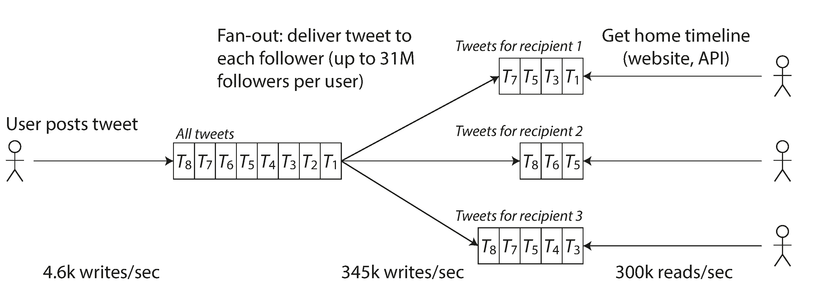
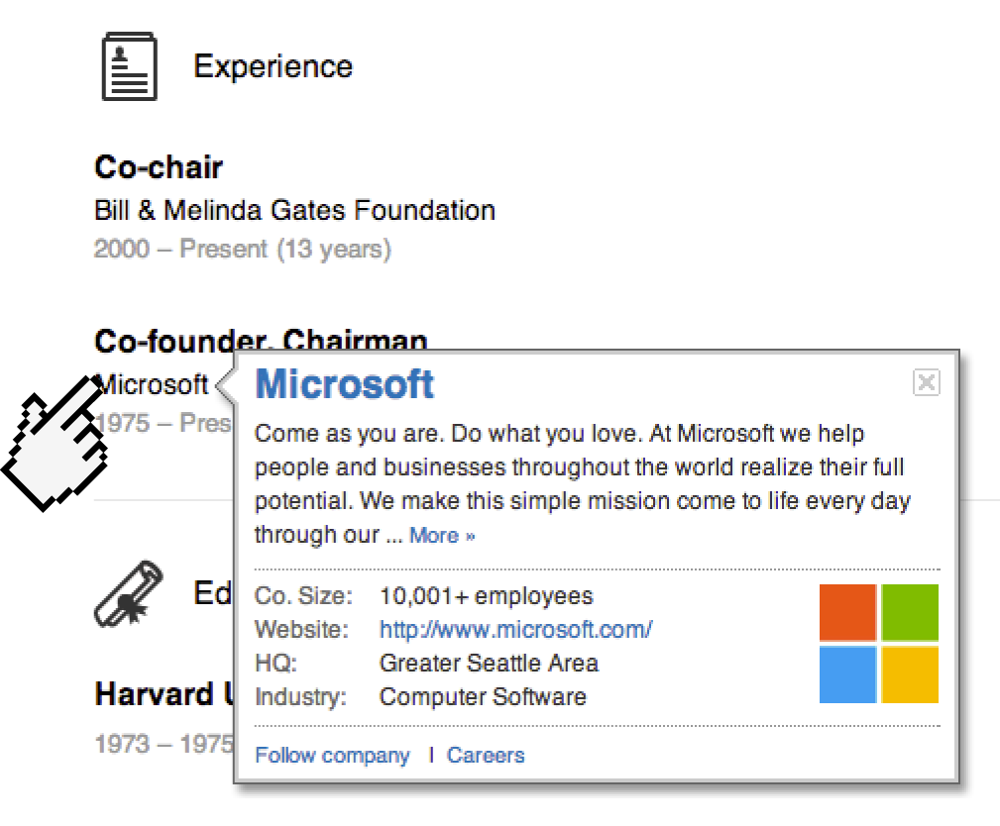
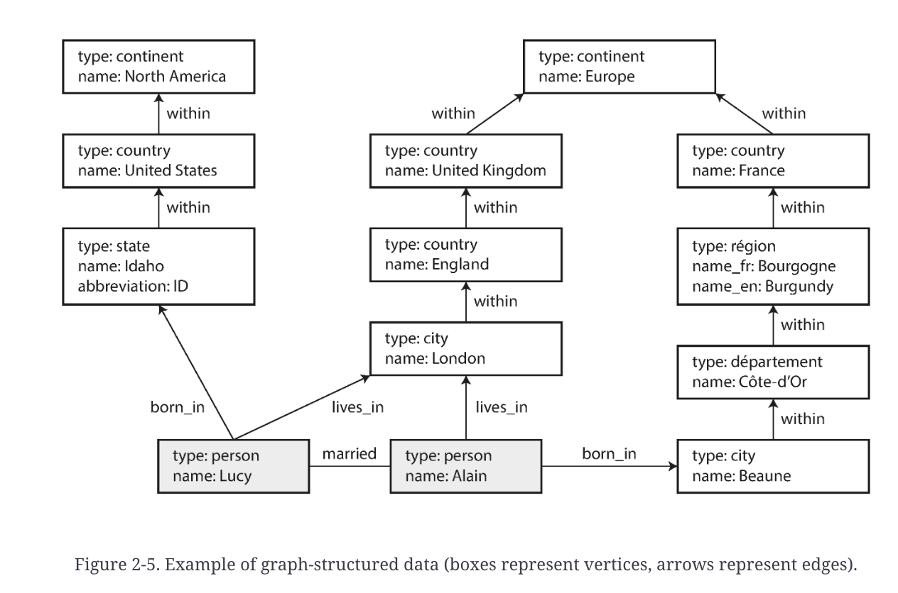

- [Designing Data Intensive Applications](#designing-data-intensive-applications)
  - [Resources](#resources)
  - [Plethora of buzzwords relating to storage and processing of data](#plethora-of-buzzwords-relating-to-storage-and-processing-of-data)
  - [Preface](#preface)
- [Part 1. Foundation of Data Systems \[Chapter 1 - Chapter 4\]](#part-1-foundation-of-data-systems-chapter-1---chapter-4)
  - [Chapter 1 : Reliable, Scalable, and Maintainable Applications](#chapter-1--reliable-scalable-and-maintainable-applications)
    - [Reliability](#reliability)
    - [Scalability](#scalability)
    - [Performance](#performance)
    - [Maintainability](#maintainability)
  - [Chapter 2. Data Models and Query Language](#chapter-2-data-models-and-query-language)
    - [Data models](#data-models)
    - [The Object-Relational Mismatch](#the-object-relational-mismatch)
    - [Many-to-One and Many-To-Many relationships](#many-to-one-and-many-to-many-relationships)
    - [Relational Vs Document database Today ?](#relational-vs-document-database-today-)
    - [Which data model leads to simpler application code?](#which-data-model-leads-to-simpler-application-code)
    - [Graph-Like Data Models](#graph-like-data-models)
      - [Property Graphs](#property-graphs)
    - [Cypher Query Language](#cypher-query-language)
    - [Graph Queries in SQL](#graph-queries-in-sql)
    - [Triple-Store and SPARQL](#triple-store-and-sparql)
    - [Summary](#summary)
  - [Chapter 3. Storage and Retrievals](#chapter-3-storage-and-retrievals)
    - [Hash Indexes](#hash-indexes)

## Designing Data Intensive Applications

### Resources

- Author : Martin Kleppmann
- 20 hours of reading (600+ pages book)
[Oreilly Link](https://learning.oreilly.com/library/view/designing-data-intensive-applications/)

### Plethora of buzzwords relating to storage and processing of data
- NoSQL! Big Data! Web-scale! Sharding! Eventual consistency! ACID! CAP theorem! Cloud services! MapReduce! Real-time!

### Preface
- Data intensive 
    - Data as primary challenged - quantity/complexity/changing-nature
    - Store data : Database
    - Expensive opr results : Cache
    - Search by keywords : Search indexes
    - Send msg to another process : Stream processing
    - Accumulated data : batch processing
- Compute intensive 
    - CPU cycles are the bottleneck

- Why read ?
    - If you are Software Engineer/Architect
        - Must have technically accurate and precise understanding of tech 
        - Trade-offs;
    - What about rapid change in tech ?
        - Basic principle remains true 

- Goals ?
    - Navigate the diverse and fast-changing landscape of technologies for **processing** and **storing data**
    - Not just *how*, but also *why* they work that way, and *what* question we need to ask 

- Gains ?
    - Good intuition for what your systems are doing under hood
    - Can reason about their behavior 
    - Good design decision
    - Track down problems that can happen

- Who should read ?
    - If you develop applications that have backend
    - SE, SA and Technical Managers(who loves to code)

- Prereq ?
    - Basic Network/OS
    - Basic relational database

## Part 1. Foundation of Data Systems [Chapter 1 - Chapter 4]

### Chapter 1 : Reliable, Scalable, and Maintainable Applications
> No such hard boundary b/w databases, queues, caches, etc. because now most tools are coming up with multiple features. Thus we will keep these three under single umbrella
#### Reliability
- Tolerating hardware & software faults
    - Redundant components ? 
        - When one component dies, the redundant component can take its place while the broken component is replaced
        - Was OK in older system, but cannot tolerate loss of entire machine
        - More data volume & application compute demand == More machines == More hardware faults
    - Software fault-tolerant 
        - Can tolerate entire machine loss (along with hardware redundancy)
        - Operational advantages
            - Schedules downtime/patching, one node at a time without downtime (rolling upgrade)

- Fault, Failure & Fault Tolerant Systems
  - Fault is defined as one component of the system is deviating from the spec
  - Failure is when system as a whole stops providing required service to the user
  - Fault tolerant systems can anticipate the faults and can cope up with them

- Hardware vs Software
    - We make **assumption** hardware faults are independent and random
        - P(Component A fails | Component B failed) = 0 (or may be ~0 : weak correlations)
    - Another class : Systematic faults
        - Correlated across nodes, types : 
            - Software bug
            - Runaway process - use up shared resources - CPU, memory, disk or network bandwidth
            - Slow down of some service
            - Cascading failures
        - These bugs lie dormant until some event trigger them

- Human Errors
    - To avoid
        - Design system that minimizes opportunities for error : Well-designed abstraction, APIs, Admin interface 
        - Decouple components (high risk, low risk) : sandbox environment for experimentation
        - Quick & easy recovery in case of failures (minimize impact)
        - Clear monitoring (performance metrics, error rates) : tracking what is happening for understanding failures i.e telemetry
        - Good management practices 

#### Scalability
- Systems ability to cope with increased load
- Define load ? 
    - Depends on the system architecture (load parameters)
    - Example
        - Number of request/sec to a web server
        - Ratio of read/write
        - Simultaneous user in a chat room
        - Cache hit rate

    - Twitter Example with actual past data
        - Post tweet
            - Can publish a new post (4.6k request/sec on average, 12k max)
        - Home timeline 
            - View post of others (300k request/sec)
        - Now you might think this is simple 12k write/sec is not that hard 
            - Yes, true
            - But Twitter scaling challenge is not due to tweet volume, but due to *fan-out* (each user follow many user)
        - Broadly two implementations we can go with 
            - First
                - 
                - Insert tweet to some global collection of tweet
                - When a user request 
                    - Get all the tweets to whom I follow, sort and give back to me 
                    - Query may look like below 
                    ```sql
                    select tweets.*, users.* 
                    from tweets
                    join user on tweets.sender_id=user.id
                    join follows on follows.followee_id=user.id
                    where follows.follower_id = current_user
                    ```
                    - Issue ?
                        - Join (too much data movement disk <-> ram)
                        - Struggle to load home timeline
                    - Sample schema
                        - follows(follower_id, followee_id)
                        - tweets(tweet_msg, sender_id, timestamp)
                        - user(id, scree_name, profile_image)
            - Second
                - Maintain a cache for each user's home timeline
                    - User post a tweet, look up all people who follow the user
                        and insert the new tweet into each of their home timeline cache
                    - This made read cheap (already in cache)
                - 
            - Gains 
                - Approach second is better than first in term of home timeline reads
                - Less work during read
                - Reality check: Tweets are published way less frequent compare to home timeline read
            - Pain 
                - Approach one is better than second in term of publish tweet
                - More work at write in second approach
                    - Assumption Land
                        - Avg distribution of follower per user: 75 followers
                        - Tweets rate: 4.6k
                        - Number of writes : 4.6k * 75 = 345k writes/second
                    - But easily there are people who have more than say 30 Million followers (🤴)
                        - 30millions writes 😬
                        - Senior dev to Junior Dev
                            - Senior: Why our disk fans making so much noise ? 
                            - Junior: Probably Kohli has open his keypad and typing
                        - So does this mean software engineers are existing because of sportsmen/movies-stars/tik-tokers/policians/ ? 
                        - Basically they can break you code any day.
                        - And you are writing millions of code line just for them 😐
    - In the above Twitter example, the distribution of followers per user(may be weighted by how often those user tweet) is a key load parameter for discussing scalability, since it determine the *fan-out* load

#### Performance
- Once load is defined, you can test what happen when the load increases
    - Increase a load parameter and keep the system resources unchanged, impact on performance ?
    - When you increase the load parameter, how much do you need to increase the resource if you want to keep performance unchanged ?
- In batch system throughput weights more. 
- In online system(stream) service response time (client receive - client send)

> Latency Vs Response time : Both are not same. Response time is what client sees (includes network delays, queueing delays). Latency is the duration that a request is waiting to be handled - during which it latent, awaiting service
- Think of response time not as a single number, but as a distribution of values 
    - Percentile is better metric than average
        - 
    - Average doesn't tell you how long users "typically" have to wait ?
    - Median (sort and then check half point) 
        - Median also known as 50th percentile (p50)

- High percentiles of response times, also know as *tail latencies* like p99 (1 in 100), p99.9 (1 in 1000), p99.99 (1 in 10,000)
    - Imp, because they directly affect customers satisfaction and therefore the sales
    - Ex. Amazon
        - Describe response time requirement for internal service in term of the 99.9th percentile
            - Affects only 1 in 1000 request
        - But customer with the slowest request are often those who have most data on their account because they have made many purchase
- Head-of-line blocking (Queuing delay)
  - small number of slow requests hold up the processing of subsequent requests
  - queueing delay accounts for the large part of response time at high percentiles
  - client for generating artificial load, should keep on sending requests independently of the response time thereby not keeping queues artificially shorter in the test
- High percentile becomes more important in backend services that are called multiple times as part of serving a single end-user request
    - Right way of aggregating response time is to add histograms
    - Single service slow == complete system slow
    

- Approach for Coping with Load
    - Architecture design for x level of load might not work well for y level of load
    - **Scaling Trade-off**  
        - Scaling up: Vertical or 
        - Scaling out: Horizontal 
    > Distributing load across multiple machine is also known as *shared-nothing* architecture
    - Good architectures often involves mixture of both the scaling approaches
    - Some system are elastic
        - Automatically add compute resources
        - Good if load is unpredictable
    - Some systems needs to be scaled manually
        - Human analyze
        - Fewer operational surprises
    - Stateless services distribution easy across machines
    - Stateful services are hard to move from single node to distributed setup
    - There is no such *magic scaling sauce* 
        - An architecture that scale well for App x is build on assumption set S (load factors)
        - Therefore, architecture of systems that operate at large scale is usually highly specific to the application
    
#### Maintainability

- Major cost of software products
- Pain is to fix other mistakes and maintain legacy code
    -  We should design software in such a way that minimize pain during maintenance, and thus avoid creating legacy sofware ourselves
-  Design software to minimize pain during maintenance
    1. Operability : easy for operations team to keep system running
    2. Simplicity : easy for new engineer to understand the system
    3. Evolvability : easy for engineers to make changes to the systems in future
- Operability
  - making routine tasks easy, allowing operations team to focus their efforts on high-value activities
  - having good visibility into system's health & effective ways to manage it
- Simplicity
  - large projects => complex & difficult to understand
    - slows down everyone who need to work on the system
    - increase cost of maintenance
    - increase risk of introducing bugs when making a change
  - **Good abstraction** : avoid **accidental complexity** 
    - hides implementation detail behind a clean, simple-to-understand façade
    - Examples :
      - high-level programming languages are abstractions that hide machine code, CPU registers, and syscalls
      - SQL is an abstraction that hides complex on-disk and in-memory data structures, concurrent requests from other clients, and inconsistencies after crashes
    - **reusability** : allows us to extract part of the large systems into well-defined, reusable components
- Evolvability : agility on the data system level
  - agile systems : allows making change easier
  - goal is to find ways of increasing agility of larger data systems
  - agility of system dependent on its simplicity and its abstractions

### Chapter 2. Data Models and Query Language

#### Data models
- Data models decides
    - your thinking to solve the problem
    - the way software will be written

- Decide data model for you app wisely

- Layering of data models
    - All application are built by layering one data model on another
    - Application developer think in term of objects/entities/data structure eg. people, organizations, goods, actions(API to manipulate)
    - Store data on disk - General purpose data models - JSON, XML, tables or graph model
    - Database engineers thinks JSON/XML/Relations/Graph in term of bytes in memory, disk or network
    - One more lower level - hardware engineers (byte in term of electical current, pulses, pulses of light, etc)

- Each layer hides the complexity of the layers below it by providing a clean data model

- Relational Model vs Document Model
    - Relational model popular for
        - Transactions (ACID) : Banking, airline, etc.

- The Birth of NoSQL (2010)
    - Goal: Overthrow the dominance of relational model's dominance
    - Driving forces behind adoption of NoSQL databases
      1. Greater scalability
      2. Free & open-source software
      3. Specialized query operations not supported by relational model
      4. More dynamic & expressive data model, no restriction with relational schemas

#### The Object-Relational Mismatch

- Todays app are developed in OOPs languages
- SQL data models seems highly unrelated with OOPs
    - An awkward translation b/w two
    - This disconnect b/w the models is sometime called *impedance mismatch*

- ORM (Object Relational Mapping) frameworks
    - ex. ActiveRecord, Hibernate
        - reduce the amount of boilerplate code for translation layer
        - But can't completely hide the differences

- Example : LinkedIn : Relational vs JSON
    - Relational
    
    - JSON Document 
        ```json
        {
            "user_id":     251,
            "first_name":  "Bill",
            "last_name":   "Gates",
            "summary":     "Co-chair of the Bill & Melinda Gates... Active blogger.",
            "region_id":   "us:91",
            "industry_id": 131,
            "photo_url":   "/p/7/000/253/05b/308dd6e.jpg",
            "positions": [
                {"job_title": "Co-chair", "organization": "Bill & Melinda Gates Foundation"},
                {"job_title": "Co-founder, Chairman", "organization": "Microsoft"}
            ],
            "education": [
                {"school_name": "Harvard University",       "start": 1973, "end": 1975},
                {"school_name": "Lakeside School, Seattle", "start": null, "end": null}
            ],
            "contact_info": {
                "blog":    "https://www.gatesnotes.com/",
                "twitter": "https://twitter.com/BillGates"
            }
        }
        ```

- Locality is better in JSON 
    - Fetch a profile in relational - perform multiple queries
    - Document-oriented databases uses this data model - CouchDB, RethinkDB, MongoDB, Espresso, etc.
    - Json representation makes this tree (**one-to-many relation**) structure explicit
        

#### Many-to-One and Many-To-Many relationships
- Look at the `region_id` and `industry_id`
    - They are not plain text, instead they are IDs
    - Benefits ?
        - Consistent style/Spell check
        - Avoiding ambiguity
        - Ease of updating
        - ID need not to changed but information it identify can be change
    - Removing such duplicates is done in the process of *normalization*

- Normalization data requires Many-To-One relations
    - eg. Many people live in one particular regions
    - M:1 doesn't fit directly to document model 
    - If database doesn't supports join, then emulate than in application code by making multiple queries
        - This shift of code to app might not be good

- More often initial version of application fits well in join-free document model
    - But data becomes more interconnected as more features are introduced which brings many-to-many or many-to-one relations within the data

- Example (Modification to resume)
    - *Organization and school as entities*
        - In example : `organization` and `school_name` are just string
        - Perhaps they should be references to entities instead ?
            - Each org, school, university HAS own web page(logo, news feed)
        - Each resume could -link-> org/school
    - *Recommendations*
        - Add a new feature
            - One user can write recommendation to another
            - Show recommendation on resume of the user, together with name, photo of the user making recommendation
            - If recommender updates their photo
                - All recommendation they have made needs change
                - Therefore recommendation should have reference to the author's profile
            - 
    - Many to Many relation required in above example ?
        - 
        - Data in dotted rectangle can be group into one document
        - References to organizations, schools, and other users represented as references
        - Requires join when queried

#### Relational Vs Document database Today ?
- Fault tolerant ? Handling concurrency ? 
- Benefits of using document database
    - Schema flexibility
    - Better performance due to locality
    - Closer to data structure in application
- Benefits of using relational database
    - Support for join
    - M:1, M:N relationship 

#### Which data model leads to simpler application code?
- If application has document like structure (a tree of 1:M) and tree is loaded at once, then use document 
    - Major drawback in document : You can't refer directly to a nested item with an document
    - The drawback become a problem if document are deeply nested
    - Poor support for join in document databases may or may not be a problem
        - Problem: If M:N relations exists
        - !Problem: M:N relationship may never needed in an analytical application
    - Reduce use of M:N relations by **denormalizing** your data
        - Denormalization brings more complexity and makes consistency harder

- In fact there is no simple answer to the question; it depends on your application; relationship that exist b/w data items
- Schema flexibility in the document model
    - No schema enforced on data by the JSON/document database
        - Arbitrary key/value can be added
            - Makes migration easy for document database, on the other hand migration in relational database brings downtime
        - Can't say these as schema less, because there is some implicity assumption while reading the data
    
- **Schema-on-read** : Structure of data is implicit and determine at the time of read
    - When to use ? 
        - If data is not homogenous, but heterogeneous.
- **Schema-on-write**: Schema is explicit 
    - If data is homogeneous 

#### Graph-Like Data Models
- Usecase : 
  - many-to-many relationships and 
  - complex connections between data
- Consists of two kind of objects
  1. Vertices / Nodes / Entities
  2. Edges / Relationships / Arcs
- Examples
  - Social Graphs
  - The Web Graph
  - Road & Railway Network
- Following figure shows two people, Lucy from Idaho and Alain from Beaune, France. They are married and living in London.
  
- Provides consistent way of storing completely different types of object in a single datastore
- Different ways of structuring data in graphs
  - Property Graph Model
  - Triple-store Model
- Different ways of querying data in graphs : Declarative languages
  - Cypher
  - SPARQL
  - Datalog
  
##### Property Graphs
- vertex consists of 
  - unique identifier
  - set of outgoing edges
  - set of incoming edges
  - collection of properties (key-value pairs)
- edge consists of 
  - unique identifier
  - label to identify kind of relationship between two vertices
  - vertex at which edge starts (tail vertex)
  - vertex at which edge ends (head vertex)
  - collection of properties (key-value pairs)
- mapped to graphstore with two relational tables, one for vertices & one for edges
```sql
CREATE TABLE vertices (
    vertex_id   integer PRIMARY KEY,
    properties  json
);

CREATE TABLE edges (
    edge_id     integer PRIMARY KEY,
    tail_vertex integer REFERENCES vertices (vertex_id),
    head_vertex integer REFERENCES vertices (vertex_id),
    label       text,
    properties  json
);

CREATE INDEX edges_tails ON edges (tail_vertex);
CREATE INDEX edges_heads ON edges (head_vertex);
```
- important aspects of this data model
  - any vertex can have an edge connecting it with any other vertex
  - efficiently find both incoming and outgoing edges for a given vertex (indexes is maintained on tail_vertex and head_vertex), can traverse the graph both forward & backward
  - different labels can be used for storing different relationships, different information can be stored in a single graph
- graphs are good for evolvability, as we add new features to application graph can easily be extended to accommodate changes in application's data structures

#### Cypher Query Language
- declarative query language for property graphs (create for Neo4j graph database)
  - Fact: The name it take from a character in Matrix Movie
- subset of data from figure 2.5 can be represented as Cypher query
```sql
CREATE
  (NAmerica:Location {name:'North America', type:'continent'}),
  (USA:Location      {name:'United States', type:'country'  }),
  (Idaho:Location    {name:'Idaho',         type:'state'    }),
  (Lucy:Person       {name:'Lucy' }),
  (Idaho) -[:WITHIN]->  (USA)  -[:WITHIN]-> (NAmerica),
  (Lucy)  -[:BORN_IN]-> (Idaho)
```
    - Each vertex is given a symbolic name like USA or Idaho
    - Arrow notation `(Idaho) -[:WITHIN]-> (USA)` used to create edge labelled with `WITHIN`
- Example query _find the names of all the people who emigrated from the United States to Europe_
  - Cypher query
  ```sql
  MATCH
  (person) -[:BORN_IN]->  () -[:WITHIN*0..]-> (us:Location {name:'United States'}),
  (person) -[:LIVES_IN]-> () -[:WITHIN*0..]-> (eu:Location {name:'Europe'})
  RETURN person.name
  ```
- there are several ways for executing query, and it's up to query optimizer to select most efficient strategy


#### Graph Queries in SQL
- Graph data can be represented in the relational database + you can query it using sql
  - But query writing comes with pain
- Unlike simple joins where you know what to join in advance, here in case of graph you may have to traverse a variable number of edges before reaching the vertex you are looking for
> Read more on recursion in SQL 

#### Triple-Store and SPARQL
- Equivalent to property graph model (same idea)
- Three part statement (subject, predicate, object) 
  - Example: (lucy, marriedTo, Alan)
  - ```sql
    @prefix : <urn:example:>.
    _:lucy     a       :Person.
    _:lucy     :name   "Lucy".
    _:lucy     :bornIn _:idaho.
    ```
- When predicate is property eg. `_:lucy :name "Lucy"` then the object becomes `String` 
- When predicate represents an edge e.g `_:idaho :within _:usa` then the object become vertex
- `_:someName` doesn't means anything outside this file
  - This only helps us to tag each triplet with a vertex (or all these triplets belongs to same vertex)
- More concise Example:
  - ```sql
    @prefix : <urn:example:>.
    _:lucy     a :Person;   :name "Lucy";          :bornIn _:idaho.
    _:idaho    a :Location; :name "Idaho";         :type "state";   :within _:usa.
    _:usa      a :Location; :name "United States"; :type "country"; :within _:namerica.
    _:namerica a :Location; :name "North America"; :type "continent".
    ```

#### Summary 
- All its started with tree (hierarchical data 1:M)
- Hierarchical data was bad for N:M relations, so Relational data model appeared 
- Then relational didn't fit every where, so document model came(when relationship is rare, and self-contained data)
- Graph database on the other targets the use case where every one can related every other
- All three (document, graph and relational) are widely used today
- Each data model comes with it's own query language or framework
  - SQL, MapReduce, MongoDB's, Cypher, SPARQL, and Datalog
- Future<Research> of data models
  - LHC (Large Hadron Collision - to identify God particle) requires to work with Petabytes of data in seconds
  - Genome data (DNA matching)
  - Full-text search


### Chapter 3. Storage and Retrievals

- One of the most fundamental 
  - A database do 2 things - when you give it data, it store; when you ask, it give the data back to you
- This chapter is written in POV of database
  - But why ? As a developer why does this matter to me ?
    - Right, you will be rarely writing your own storage engine, but you do need to select a storage engine appropriate for your application
    - Even having rough idea will work for you
- We will discuss two family of storage engines
  - *Log-structured*, and
  - *page-oriented* such as B-tree

- A simplest database would be just writing to a file and reading
  - But with a simple file you can't handle concurrency, partial writes, error handlings
  - Apart from correctness, there are performance issues also, your search are slow as file size increases

- How to make search fast ?
  - Indexes ? - true they makes read fast, but what about writes, your writes are slow now.


#### Hash Indexes

- Simplest Model for index: f:key -> value
- Keep this data structure in-memory (faster access)
- For the simplest database example in prev section
  - If we are just appending data to the file, for each key we can keep the byte offset in the data file


