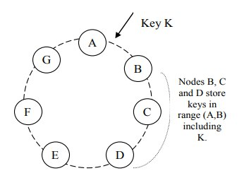
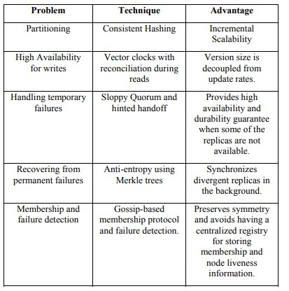

# DynamoCS: A toy version of Amazon's Dynamo

## Introduction
Amazon's Dynamo is a powerful and versatile distributed data storage system that was developed by Amazon Web Services (AWS). It is designed to provide scalability, high availability, and low latency for applications that require consistent, single-digit millisecond response times, even as the workload grows. Dynamo is a simple key-value store, used in prouduction environment at Amazon's. This is specifically used in their cart service (mentioned in the paper)


## Learning Goals
- Reliable
- Decentralised
- Highly available
- Strong eventually consistent
- Quorum systems
- Low-latency read/write storage system.

We have designed a toy version of the Dynamo i.e *DynamoCS* which provides some basic features. The main goal was to go through the process of designing a storage system which is highly scalable, fault tolerant and available. 

This also help us in learning trade-offs in messy real-world systems

## Basic Assumptions
1. Items are uniquely identified by key
2. No operation span multiple data items
3. Stored data must be less than 1MB
4. Will not focus on security problems and assume it is built for a trusted environment

## Potential Key Features
1. Dynamic Load Balancing (Load computation)
2. Scalable (Iso-efficiency)
3. Failure detection and recovery (achieved)
4. Overload handling
5. Symmetry in responsibility
6. New Storage nodes can be added without manual partition or redistribution
7. Gossip Protocol (helps in decentralising)
8. Vector Clock (versioning)
9. Fault Tolerant (replication to next 3)
10. Reconcile algorithm (Semantic reconciliation + Syntactic reconciliation)
11. Merkle tree (adv need during semantic reconciliation) (not implemenated)

## Client operations/System admin operations
1. Perform read/write: get() and put()
2. Can tell the replication factor (f)
3. Number of nodes to use for the service and number of virtual nodes 

## Tech stack used
Python (>=3.8), RpyC and Redis

## Approach

### Vector Clock (Versioning)
Used in building a decentralised routing table, where each node will contain the info about the mapping of key range to the node(s) which contains that. A vector clock should contain information like 
```python
[(node(ip), virutal_id, Range of keys, current_load, version_number), …  ]
```



*Fig1: Nodes on the ring*

### Consistent hashing

Consistent hashing is a technique used in distributed systems to efficiently and consistently distribute data across multiple nodes in a way that minimizes data movement and rebalancing when nodes are added or removed from the system.

In consistent hashing, a hash function is used to map data items and nodes onto a fixed-size identifier space, typically a ring or a circle. Each data item is assigned a unique identifier based on its key, and each node is assigned one or more identifiers based on its address or some other criteria. The identifier space is divided into smaller regions or partitions, with each node responsible for storing and handling the data items within its assigned partitions.

The key idea of consistent hashing is that when a node is added or removed from the system, only a small fraction of the data needs to be remapped to new nodes. By using the hash function, data items are consistently mapped to the nearest node in the identifier space, making it easier to locate and retrieve the data without requiring a centralized index or lookup table.

Although using consistent hashing makes reconcillation harder (must recompute Merkle trees) and also makes snapshots harder. But we decided to go with this challenging path. Other choice is to split ring into fixed, equal size arcs/segments. Use many more segments than there are nodes i.e (# partitions >> # servers)

Author of paper [1] tried it first, even though simpler techniques better.

#### Design choice we followed.
1. We can assign the nodes random positions only on the virtual ring. The distribution of the virtual nodes should be uniform such that each N node pair belongs to N different physical nodes.
2. On receiving a write to a data item, we can compute its hash and find the nearest next node(coordinator or owner) in the ring in terms of the index per the hash space.
3. On receiving a read for the data item, it can be checked from the metadata the node holds.
We will define W(write factor), R(read factor), and N(replication factor). The data will be replicated using async RPC calls. We are first writing to W nodes and for rest N - W we are writing even after replying to the client. Assuming W is large enough, we can have good fault tolerant system (w - 1 crash can be survive). For the Routing table at each node, we will keep (node: version_number_of_routing_table)
For each key in the Redis, we will maintain a version number

### Building Routing Table: 
1. Each node will store a dictionary
2. The key in this dictionary will be start_of_range, and the value will be info about that node.
```python
“Start_of_range”: {ip_x, v_id, version_number, load, end_of_range}
```
3. Whenever a client requests a key(get/put), we look into our routing table and check the lower bound of the hash(key) 
4. We will send the client info from (lower_bound, lower bound + 3 * max(R, W)) to the client
5. The client will iterate the list that it gets in response sequentially
  a. It will skip the node 
  b. If It is not able to connect to that
  c. If the version number in the req client has sent is more fresh version number than the node currently has
6. If all nodes say reject - we will retry for some given count (and then reject ?)

#### Implementation:
1. First start the worker processes
2. After ok is received from all, start putting the nodes on the ring
3. Also, tell the node for which data in the routing table is updated (we are creating seeds here)
4. Also, share the next max(R, W) nodes IP and ports to the new node so that it can fetch the data and reconcile.


## What is "quorum technique" ?
If you care about linearizability and you store a value on N servers. Write must reach some write-set of W server before you say write is complete. Read must be heared from some R servers before being called complete. 

- Guarantees a reader will see effects of a previously complted write
- An easy way to ensure this is to R + W > N
- With N fixed nodes, read will always hear one copy of successful write.

## List of challenges which we faced



*Table 1: Problems and Techinques (A sample from the original paper)*

### Challenge 1: How to handle updates to the routing table; insertion is simple. How to handle the removal of an entry? 
We made two routing tables. One will store all the down nodes and other will store all the up nodes. So we are not completely throwing out nodes, in case the system is partially down or there is network partition between two nodes. This will also allow us to periodically ping all those down nodes to check if they are up.

### Challenge 2: Whose duty is to keep the routing table up-to-date as much as possible? 
Each node is doing this ping and as it realises it is not able to talk to some other node, it will mark that node for the down routing table. And this information will spread soon, since we are sharing the routing table continuously with each other. A rough estimate we can make for this  converge in log(n) steps). Since everyone is doing this chit-chat with others.

### Challenge 3.What to do to make nodes eventually consistent? 
Reconciliation Thread: A periodic thread that will keep doing this. Check all the R nodes (first R where it can connect) and update them as well. It gets updated based on the type of reconciliation - We can do it on reads only; do we need to run a thread?
#### Case analysis: 

**Case 0:** If replied with outdated routing table? 
It will go to the node as per the routing table returned; that node will not have the keys, so it will return the nodes as per its routing table. This will continue until we reach the correct node.
 
**Case1:** Network partition happened
We will allow multiple different branches in case a partition happens
Surely a client will be able to communicate to a node if it is at least as updated as the version number provided
For read in case of syntactic conciliation: We will try to run the conciliation algorithm  and the last write will win. Or we may partially reply inconsistent, but overall we will become consistent as soon as the network goes up. Since we are eventually consistent.
For writing, we will allow them to happen usually (if they are possible)
Case2. Network partition get heals
Immediately run reconciliation algorithm (without waiting for timer) ? or can wait 

**Case 3:** sloppy quorum case is important - This one is simple
	
**Case 4:**
What if I am no more the controller of a given range and some other node becomes, so then Should I note that if my old range and new range are not matching, It will become my duty to immediately transfer the key to the new node, which is in the routing table holding those keys now? But if I was not the most updated one? Maybe a network partition happened, and it is still not healed (which means that I haven’t done the proper reconciliation), but still, I have sent the data to the new node holding this range - The newly added node can fetch the data from W nodes? We can keep an extra data structure to store the keys for which I was not supposed to be the coordinator, but as the client could not reach the actual coordinator, that node received it.

### Challenge 4. I am a freshly added node, how can I get my data for my ranges ? 
On adding new node, the node should itself fetch its keys from the next node(the current controller of the key range)

New node added (data transfer from old primary to new primary)
This part is done, so we simply ask from the immediate next node on the ring. We assume the case that we might also require to fetch from any of the replicas of that data in case primary is not available.

### Challenge 5.  How to make sure replicas are in sync ? 
Vague idea: Let us determine the difference in the locations of two nodes, i and j; they will only share those keys for which they are replicas. Issues : Chit-chat overhead
Ok, we implemented the vague idea.


## Other problems which we faced 
1. What if a node goes down and no one knows about it (or the one who knows are very few)
2. Ensure proper locking when a common resource is shared between threads
3. What if partial writes happen and if the client retries for the same? How to avoid multiple increments or decrements? Also, allow put on 
   secondaries if the primary is not reachable.
4. Allow get/put through secondaries too, in case of primary crashes, or n/w partitions? 

#### 1. Hinted Replicas ? 
In case if we are not able to write to the secondary, then only we should go to the hinted replicas or even in the case when we are not able to write to primary ?

#### 2. Can we be allowed to read from secondary?
Maybe ? (if consensus allow). We actually allowed

## Building highly scalable & reliable services over *DynamoCS*
#### Amazon shopping cart / Like count on an instagram post
`Key(item_id)` : Represent the unique id of the item 
Value: Represent the quantity of the item purchased (+/-)

Shopping cart `([items1: count1, item2: count2, …])` : Binding together lot of items belongs to a single customer (or we can segregate too, e.g., `(uid, item_id, count))`
Instagram post (post:like_count)

Multiple clients can request to make changes to the shopping cart. Our first goal is to always make the service up for the writers. If the client wants to take out an item from the cart, the client must be able to perform almost every time.

For developing the service fault-tolerant, we go with replicas, and for a write-available service, we might end up in a situation where our replicas start diverging because of some network partition. We always want that each get from the client should be responded as much with the latest (or most recent) value. Reconciliation is important in these cases. Either client can provide their implementation of reconciliation algo, or there can be a default (e.g., maintaining different counts for + and - )

Testing Phase : Did basic testing
Reconciliation : Yes working

### Additions
This is for visuals (but still pending). Live pie chart showing the distribution (range of keys) hold by each node and number of data fields on each node

## How to use this *DynamoCS* (Setup)


## Acknowledgement
We want to thanks [Prof. Abhilash Jindal (IIT Delhi)](https://abhilash-jindal.com/). Most of our learning and motivation to build this 
comes from his course [Fundamentals of Cloud Computing](http://abhilash-jindal.com/teaching/2021-2-col-733/).

## Reference
1. [Dynamo: Amazon’s Highly Available Key-value Store](https://www.allthingsdistributed.com/files/amazon-dynamo-sosp2007.pdf)
2. [COL733 by Prof. Abhilash Jindal at IIT Delhi](http://abhilash-jindal.com/teaching/2021-2-col-733/)
