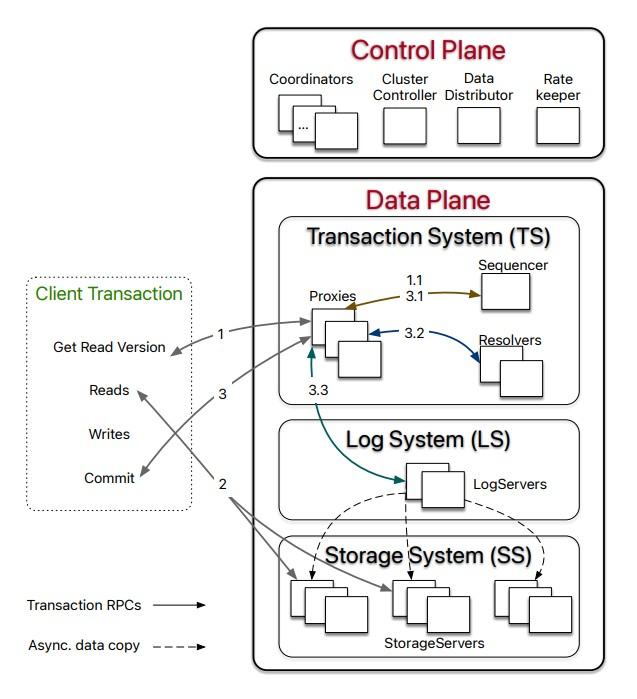

- [FoundationDB: A distributed Key-Value Store](#foundationdb-a-distributed-key-value-store)
  - [Abstract](#abstract)
    - [Hey FoundationDB, Introduce yourself](#hey-foundationdb-introduce-yourself)
    - [Why should we read this paper ?](#why-should-we-read-this-paper-)
  - [Introduction](#introduction)
  - [Contribution of this paper](#contribution-of-this-paper)
  - [Design](#design)
    - [Design Principle](#design-principle)
    - [System Interface](#system-interface)
    - [Architecture](#architecture)
      - [Control Plane (CP)](#control-plane-cp)
      - [Data Plane (DP)](#data-plane-dp)
      - [Read-Write Separation and Scaling](#read-write-separation-and-scaling)
      - [Bootstrapping FDB has no external dependency on other services](#bootstrapping-fdb-has-no-external-dependency-on-other-services)
      - [Reconfiguration](#reconfiguration)
    - [Transaction Management](#transaction-management)
      - [End-To-End Transaction Processing](#end-to-end-transaction-processing)

# FoundationDB: A distributed Key-Value Store
Author: J Zhou, Published @ SIGMOD'21
[Paper link](https://www.foundationdb.org/files/fdb-paper.pdf)

## Abstract
### Hey FoundationDB, Introduce yourself
- I was born and brought up at Apple 
- I'm transactional key-value store and offers consistency, robustness and availability for storing user data, system metadata and configuration
- I'm one of the first system which combines 
  -  flexibility & scalability from NoSQL
  -  ACID power from SQL 
- I'm the underpinning(आधार/नींव) of cloud Infra @Apple, @Snowflake
  
### Why should we read this paper ? 
- FDB adopts an unbundled architecture that *decouples* (basically Apple's didn't like the name **microservice**)
  - In-memory transactional management system (TS)
  - Distributed storage system (SS)
  - Built-in distributed configuration system 
- Each sub-system can be independently provision and configured to achieve
  - Scalability
  - High-availability
  - Fault tolerant property 
- FDB is strict serializable and lock-free
- FDB can tolerate *f* failures with only *f + 1* replicas 
- Integrates a deterministic simulation framework
  - Used to test every new features
  - Rigorous testing makes FoundationDB extremely stable
- Offers minimal and carefully chosen feature set
  - This has enabled a range of disparate system (विभिन्न प्रणालियाँ) from semi-relational database, document and object store

## Introduction
- Cloud services relies on scalable, distributed storage backend for persisting application state
- Such storage system must be 
  - fault tolerant,
  - highly scalable (scale to billions of user, petabyte or exabyte of data, and million of requests per second)
- Tradeoff b/w Relation model vs NoSQL (Document model)
  - Both are extreme; One worry about transactions nature and other sacrifices it.
  - FDB is try to balance and avoid this tradeoff
    - By providing serializable transactions 
    - More advanced features like - consistent secondary indices and referential integrity check
- Unlike most database where they bundle storage engine, data model and query language, forcing users to choose all three or none. 
  - FDB takes modular approach (unbundled architecture: control plane + data plane)
  - Control plane: Manages metadata of the cluster 
  - Data plane: consists of transactional management system
- FDB defaults to strict serializable transactions, it allows these semantics for application that don't require them with flexible, fine-grained control over conflicts
  - Strict serializability through a combination of OSS(Optimistic concurrency control) and MVCC (Multi-version concurrency control)
- Lock free architecture
- FDB can tolerate f faults in f + 1 replicas (rather than 2f + 1)
- FDB doesn't relies on quorums to mask failures, but rather tries to proactively detect and recover from them

## Contribution of this paper 
- Open source distributed storage system
- Deterministic simulation framework 
- Careful chosen feature set
- Unique approach to transaction processing
  
## Design 
- A production database needs to solve many problem 
  - Data persistence
  - Data partitioning
  - Load balancing
  - Membership 
  - Failure detection
  - Failure recovery
  - Replica placement
  - Synchronization
  - Overload control
  - Scaling
  - Concurrency 
  - Job Scheduling
  - System monitoring
  - Alerting
  - Backup
  - System upgrade
  - Deployment 
  - Configuration management
  - Bas bhai

### Design Principle
- *Divide-and-Conquer* (or separation of concerns)
  - FDB decouples write path (transaction management system) from read path (distributed storage)
  - This allow scape them independently 
  - Within transaction management system, processes are assigned various roles representing different aspects of transaction management
    - Timestamp management
    - Accepting commits
    - Conflict detection
    - logging
    - Cluster-wide orchestration 
      - Over load control
      - Load balancing 
      - Failure recovery 
  
- *Make failure a common case*
  - For distributed system, failure is a norm rather than an exception
- *Fast fail and recover fast*
  - Minimize Mean Time to Recover (MTTR)
- *Simulation testing*

### System Interface 
- The `get()`, `set()` operations for read and write single key-value pair 
- `getRange()` returns a sorted list of keys-value pairs
- `clear()` deletes all key-value pair within a range or starting with a certain key prefix 
- A FDB transaction 
  - Modifies a snapshot of the database at a certain version (in-memory instance)
    - A transaction's write (i.e., `set()` and `clear()` calls) are buffered by FDB client until final `commit` is called
  - Only write to the persistent storage when transaction commits; 
- For performance
  - Key size <= 10KB, value size <= 100KB and transaction size <= 10MB

### Architecture 

#### Control Plane (CP)
  - Responsibility 
    - *Coordinators* (heart of CP)
      - Persisting critical system metadata about the entire FDB deployment/configuration
      - These Coodinators forms a disk Paxos group and selects a singleton 
        *ClusterController* 
    - ClusterController monitors the health of all the servers in the cluster and recruits three singleton processes 
      - *Sequencer* 
        - Assign read & commmit version to the transactions 
      - *DataDistributor*
        - Monitoring failures and balancing data among StorageServers 
      - *RateKeeper*
        - Overload protection to the cluster 
    - In case of crash re-recruited if they fail or crash 
  
#### Data Plane (DP)
  - Handles OLTP workloads (read-mostly, read and write a small set of keys, 
    low contention and requires scalability)
  - Maintains 
    - A *log system* (LS) for Write-AHead-Log (WAL) for TS
      - Log system contains a set of *LogServers*
      - LogServers act as replicated, shared, distributed persistent queue, where 
        each queue store WAL data for a StorageServer
    - *Distributed Storage System* (SS) for storing data and servicing reads 
      - Contains number of *StorageServers* for serving client reads, where each storage server let the 
        data shard i.e., contiguous key ranges 
      - StorageServers are the majority of the processes in the system, and together they form a distribute B tree 
      - FDB uses modified version of SQLite as the storage engine on each server 
        (with enh which add supports to async programming, defer deletion to a background task)
  - TS provides transaction processing and consists of (all the following are roles)
    - *Sequencer*
      - Assigns read & commit version to the transaction 
    - *Proxies* 
      - Offers MVCC(MultiVersion Concurrency Control) read version to the client 
        orchestrate transaction commits 
    - *Resolvers* 
      - Checks for conflict b/w transactions 
  - All of the three are stateless processes (cool!!)
  - Storage servers serves the client read
    - Data is sharded over SS i.e., contiguous key ranges)
    - Together all these forms 

> Multiversion concurrency control (MVCC) is a database optimization technique 
> that allows multiple transactions to read and write to a database 
> simultaneously without interfering with each other

> MVCC (Multi-Version Concurrency Control): This is a method for managing 
> multiple versions of data, allowing the system to handle concurrent operations 
> without conflicts.

#### Read-Write Separation and Scaling
- Each process can scale individual
- Scaling for read is separated from scaling for writes
- Read scales linearly with the SS 
- To scales write add more processes to Proxies, Resolvers, and Log-Servers
- Apple opts for storing MVCC data in the SS, unlike Deuteronomy which store in TS (yes, because they are apple - no norm will be followed)
  - Q:What is the difference/tradeoffs b/w storing SS and TS ?

#### Bootstrapping FDB has no external dependency on other services
- All user data and most system metadata is store in SS 
  - Keys start with `0xFF` prefix (stored in SS)
- The metadata about SS is stored in LogServers
- Configuration of LS is stored in Coordinators 
- When there is no ClusterController ?
  - A servers try to become the new ClusterController by using a method called Disk Paxos, which is a way of achieving consensus among servers.
- Once a new ClusterController is elected, it recruits a new Sequencer. 
- The Sequencer is responsible for organizing the order of operations
- New Sequencer reads the configuration information of the old LS from the coordinators
- Sequencer then spawns new LS and TS 
- Sequneces waits until new TS finishes recovery (sourav: details to recovery ?) 
- Once new TS finished recovery then write the new LS configuration to all the coordinators
- Finally TS ready to serve client transactions

#### Reconfiguration 
- Whenever TS or LS fails, or a db configuration change, 
  - The reconfiguration process brings the TMS to a new configuration i.e., a clean state
- Sequencer process monitors the health of Proxies, Resolver, and Log Servers
- If any of the monitored process fails, or db configuration changes
  - Sequencer terminates itself
- Now ClusterController will detect that we have no Sequencer (failure event), then recruit the new Sequencer, which follow the Bootstrapping process to spawn new TS and LS instance 
- Transactional Processing is divided into epochs 
  - Epoch = (Generation of TMS with its unique Sequencer process)

### Transaction Management 
- Topics: Strict Serializable, Transaction Logging & Recovery

#### End-To-End Transaction Processing 
- Txn Flow
  - Love at first sight for client starts with the Proxies
  - Proxies have to send the read version (i.e., timestamp) to the client 
    - Proxy ask his friend Sequencer for the help
    - Sequencer is the honest friend and guaranteed Proxy that it will always provide the version which is no less than any previously issued transaction commit version 
    - Proxy sends the read version is send to client
    - After getting read version, Client breakups with Proxy and start talking with the SS ~~Sourav Sharma~~ storage servers
    - Client writes are buffered locally. Only at commit time, the client sends the transaction data, including read/write set (key ranges), to one of the Proxies and wait for a commit or abort response from the Proxy
    - If txn fails to commit, client may choose to restart the txn from the beginning again
- Proxy commits a client txn in three steps
  - First proxy contacts the Sequencer to obtain the commit version 
    - The version is > existing read version or commit version 

- read-write transactions
  - read
    - client asks one of the proxies to obtain read version (i.e timestamp)
    - proxy asks sequencer for the read version that is is guaranteed to be no less than any previously issued transaction commit version (what about previously issue read version ?)
    - client issue multiple reads to the StorageServers & obtain value at that specific read version
    - client writes are buffered locally without contacting the cluster (client being optimistic about no other commit would take place between it's read & commit)
  - commit
    - client sends the transaction data to proxy & waits for commit / abort response from the proxy
    - transaction data includes read & write set (i.e key ranges)
    - proxy commits transaction in three steps :
      1. proxy contacts sequencer to obtain a commit version which is guaranteed to be no less than previously issued read versions or commit versions
      2. proxy sends the transaction information to range-partitioned resolvers (why range partitioned ?), which implements OCC by checking for read-write conflicts. If resolvers return with no conflict, we proceed with final commit stage. Otherwise, proxy marks the transaction as aborted and client may choose to restart the transaction
      3. committed transactions are sent to LogServers for persistence. 
        - Q. When transaction can be considered committed by LogServers ?
          - when all designated LogServers have replied to the proxy
          - proxy then reports the committed version to the sequencer (to ensure that later transactions read versions are after this commit, is this known commit version ?) & then replies to the client
        - Q. What about StorageServers, are they not involved in committing a transaction ?
          - StorageServers async pull the mutation logs from LogServers and apply committed updates to the disk
- read-only transactions & snapshot reads
  - read-only transactions are both serializable & performant
  - **serializable** : read version provided by sequencer is no less than previously issued commit versions, thereby reads can be preformed from snapshots without raising any conflicts with concurrent writes
  - **performant** : client can commit these transactions locally without contacting the database

