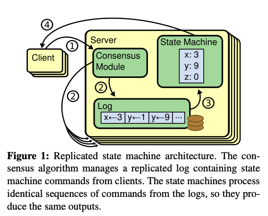

# RAFT: In search of an Understandable Consensus Algorithm
- Diego Ongaro and John Ousterhout (Stanford University) : May 20, 2014

## Introduction

- Consensus algorithm allows
    - A collection of machines to work as a coherent group
    - Survive the failures of some members

- Gains?
    - Reliable large-scale software system

- What is RAFT ?
    - Consensus algorithm for managing a replicated log
    - Much easier to understand compare to classic consensus algo **Paxos** (by Leslie Lamport)
        - Paxos is complex to understand + less intuitive
        - RAFT is easier to understand 
            - Breakdown to smaller problems

- RAFT claims ? 
    - Strong leader
        - Flow of log entry only from leader to other servers (followers) which simplifies the management of logs
    - Leader Election
        - Randomized timers to resolve conflicts (else indefinite waiting)
    - Membership change 

## Replicated State Machines



- What is Replicated State Machine ?
    - Implemented using a replicated log
    - State s[i]; apply log[i]; State s[i + 1]

- Logs contains ?
    - Sequence of commands

- Commands are present in the same sequence in each log present on each compute

- Properties of State Machine
    - Deterministic 
        - Initial State S; apply log L; Final State D

- What is the role of Raft algorithm here ?
    - Keep these logs **consistent**

- Hallucination to Client!!
    - Once commands are properly replicated, each server's state machine processes them in log order, and the outputs are returned to clients
    - RAFT make client believe server as a single, highly reliable state machine

- Consensus algorithm arise in the context of Replicated State Machines
    - Same state on multiple servers

## Must-have properties of a consensus algorithm 

- What guarantee RAFT provides ?
    - **Safety**
        - Never return an incorrect result (under all non-Byzantine conditions)
    - **Available**
        - As long as majority is there (n / 2 + 1)
    - **Not depend on Timing**
        - Independent of timing to ensure the consistency. Why ? 
            - Faulty clocks
            - Extreme message delays 
- In the common case, a command can complete as soon as a majority of the cluster has responded to a single round of RPC
    - This avoids a minority of slow server to impact the performance

## Main GOAL of RAFT ?
- Musts
    - Provide complete and practical foundation for system building
    - Safe under all operating conditions

- Apart from **MUST** the **MAIN** goal of RAFT was *Designing for Understandability*
    - PAXOS is complex, Raft is simpler
    - Raft simplify the state space by reducing the number of states to consider
        - Makes system more coherent
    - Eliminating non-determinism wherever possible
        - At some places it helped (randomization helped Raft leader election algorithm)


## The Raft Consensus Algorithm

- Raft manages replicated logs
- Raft implements consensus 
    - Electing distinguished leader
    - Information flow is always from leader to followers; client always talks with leader
    - Leader accepts logs from client and replicate then on other server 
    - Leader tells servers when it is safe to apply log entries to their state machines

- Leaders simplify the data flow
- If leader gets disconnected/fails; then a new leader got elected 

### Decomposition of Consensus Problem 

- Leader Election
    - A new leader must be chosen when an existing leader fails
- Log replication
    - Leader must accept log entries from client and replicate them across the cluster
    - Force other logs to agree with its own 
- Safety 
    - State Machine Safety
        - If any server has applied a particular log entry to it state machine, then no other server may apply a different command for the same log index
        - Ensured through election restrictions

## Raft Guarantees - True at all times!
- **Election Safety**
    - At most one leader in a given term T
- **Leader Append-Only**
    - A leader never overwrites or deletes entries in its own log; it only append new entire
- **Log Matching** 
    - If two logs contains an entry with the same index and term, then the logs are identical in all entries up through the given index
- **Leader Completeness**
    - If a log entry is committed in a given term, then that entry will be present in the logs of the leaders for all higher-numbered term
- **State Machine Safety**
    - If a server has applied a log entry at a given index to its state machine, no other server will ever apply a different log entry for the same index

## Raft Basics

- Raft cluster consists of servers (typically 5 servers)
    - Survive two server failures
- At a given time server is in three states
    - Leader
    - Follower
    - Candidate
    - 
- Normal scenario
    - one leader, rest all are followers
- Client always talks with leader
    - If client talks with a follower, the follower redirect client to the leader

- Raft divides times into *terms* of arbitrary length
    - Term acts as *logical clocks*
    - Helps servers to detect obsolete information such as stale leaders
    - 
- Terms are numbered with consecutive integers
- Each term begin with an election, in which one or more candidate attempts to become leader
    - If candidate wins, then leader for the entire term
    - If Split votes then no leader for the term (term++; election again)
- Raft ensures that there is at *most one* leader each **term**
- Transition b/w terms may be observed at different times 
- Raft server communicate using RPCs
- Three type of RPCs
    - RequestVote RPCs (by candidates)
    - AppendEntries RPCs (by leader to replicate log entries and to provide a form of heartbeat)
    - RPC for transferring snapshots between servers
- Server retry the RPC if do not receive a response in a timely manner and for performance: parallel RPCs
- 

## Leader Election
- All server startup as followers
    - Remains in followers as long as it receives valid RPCs from a leader or candidate
- Leader send periodic heartbeat (AppendEntries RPCs with no logs)
- If follower receives no communication till the *election timeout*, then it assumes there is no viable leader and begins an election to choose a new leader

- To begin an election
    - Follower increment its current term to `currentTerm + 1`
    - Vote to itself
    - Issue RequestVote RPCs in parallel to each of the other servers in the cluster
    - Loop in same state until
        - Wins
            - Got majority of votes
        - Loose
            - Another server establishes itself as leader
        - Draw
            - No winner 
- How RAFT decrease the probability of split votes ?
    - Raft uses *randomized election timeout* to ensure that split votes are rare
    - Two strategy
        - First
            - Set timeout randomly from a fixed range i.e [150-300ms]
            - This will ensure that not every one will timeout together
        - Second
            - Each candidate restarts it randomized election timeout at the start of an election, and it waits for that timeout to elapse before starting a new election
## State of a Server
- **Persisted state on all servers** (before responding to RPCs)
    - `currentTerm`
        - Latest term server has seen
        - Initialize to 0 on first boot, increase monotonically
        - This information is used by machine, to detect stale information (logical clock)
    - `votedFor`
        - Candidate that received vote in current term (or null if none)
        - If it didn't store to whom it voted for current term, then there is a possibility of submitting vote twice in same term
    - `log[]`
        - Log entries
        - Each entry contains (command for state machine, term when entry was received)
        - one-based indexing
        - This information will be used to derive state in replicated state machine
- **Volatile state on all server**
    - `commitIndex`
        - Index of highest entry known to be committed (init = 0; increase monotonically)
    - `lastApplied`
        - Index of highest log entry applied to the state machine (init = 0; increase monotonically)
- **Volatile state on leaders**
    - `nextIndex[]`
        - For each server
            - Index of the next log entry to send to that server 
            - Init = leader last log index + 1
    - `matchIndex[]`
        - For each server 
            - Index of highest log entry known to be replicated on server
            - init = 0; increase monotonically

## AppendEntries RPC
Invoked by leader to replicate log entries + heart beats

| **Arguments** | Meaning | 
|-----| --- |
| term | leader's term| 
| leaderId | so follower can redirect clients |
| prevLogIndex | index of log entry immediately preceding new ones |
| prevLogTerm | term of prevLogIndex entry |
| entries[] | log entries to store (empty in case of heartbeat) | 
| leaderCommit | leader's commitIndex | 

| **Results** | Meaning | 
| ---- | --- |
| term | `currentTerm`, for leader to update itself | 
| success | `true` if follower contained entry matching prevLogIndex and prevLogTerm|

**Receiver Implementation**
1. Reply `false` if `term < currentTerm`.
    - This means that if the leader is operating on an older term than the server's current term, return false.
2. Reply `false` if the log does not contain an entry at prevLogIndex with a term that matches prevLogTerm.
    - This ensures that the server logs can synchronize with the leader's logs.
3. If an existing entry conflicts with a new one (same index but different term), delete the existing entry and all entries that follow it.
    - There is a single source of truth, and the current leader defines that truth.
- Append any new entries that are not already in the log.
- If `leaderCommit > commitIndex`, set `commitIndex` to `min(leaderCommit, index of the last new entry)`.
    - Why safe ? 

## RequestVote RPC
Invoked by candidates to gather vote

| **Argument** | Meaning | 
| --- | --- |
| term | candidate's term |
| candidateId | candidate requesting vote | 
| lastLogIndex | index of candidate's last log entry | 
| lastLogTerm | term of candidate's last log entry | 

| **Results** | Meaning |
| ---- | ---- |
| term | `currentTerm`, for the candidate to update itself |
| voteGranted | `true` means candidate received vote |

**Receiver Implementation**
1. Reply `false` if `term < currentTerm`
2. If `votedFor == null` or `candidateId`, and candidate's log is at least as up-to-date as receiver's log, grant vote

 
## Rules for Servers
    
**All servers**
- If `commitIndex > lastApplied`, then increment `lastApplied`, apply `log[lastApplied]` to state machine
- If RPC request or response contains term `T > currentTerm` set `currentTerm = T`, convert to follower

**Followers**
- Respond to RPCs from candidates and leaders
- If election timeout elapses without receiving AppendEntries RPC from current leader or granting vote to candidate: convert to candidate

**Candidates**
- What happen in Candidate state ?
    - On conversion to candidate, start election:
        - Increment `currentTerm`
        - Vote for Self (self-obsessed)
        - Reset election timer
        - Send RequestVote RPCs to all other servers
- If vote from majority (promote to leader)
- If AppendEntries RPC received from new leader: convert to follower
- If election timeout elapses: start new election

**Leaders**
- How leader prevents election timeouts ?
    - Upon election: send initial empty AppendEntries RPCs (heartbeat) to each server
- When does leader response back to the client ?
    - If command received from client: append entry to local log, respond after entry applied to state machine
- What does leader do to bring every followers `logs[]` in sync?
    - If Leader last log index is greater than `nextIndex` of some follower f i.e. `len(leader_log) > nextIndex[f]`; send AppendEntries RPC with log entries starting at `nextIndex[f]` 
        - If successful: Update `nextIndex[f]` and `matchIndex[f]` for the follower f
        - If fails because of log inconsistency then,
            ```java
            // Follower:
            appendEntryRequest(rpcPayload={ni=nextIndex[f], newLog,..}) {
                if (logOfFollower[ni - 1] != logOfLeader[ni - 1]) {
                    reply("Prefix of log not matching")
                } else {
                    append(logOfFollower, newLog);
                }
            }
            ```
            - In the above case, leader will decrement nextIndex and retry again
- When does leader update its `commitIndex` ?
    - If there exists an `N` such that `N > commitIndex` (consider N as length of log at the leader)
        - And a majority of `matchIndex[f] >= N`
        - And `log[N].term == currentTerm`
        - then set `commitIndex = N`

## Logs Replication
- Client request contains a command to be executed by the replicated state machine
- The leader append the command to its log as a new entry, then issue `AppendEntries` RPCs in parallel to each of the other server to replicate
- When safely replicated, the leader applies the entry to its state machine and returns the result of that execution to the client
- If followers crash or run slowly, or if network packets are lost, the leader retries AppendEntries RPCs indefinitely (even after it has responded to the client) until all followers eventually store all log entries
- Each log entry stores (term number, command)
    - Why term number ? 
        - Helps to detect inconsistency in the logs

- When does leader feels safe to apply a log entry to its state machine ?
    > Applied log entry are referred as committed 
    - A log entry is committed once the leader that created the entry has replicated it on majority of servers
    - All preceding entries in the leader's log, including entries created the previous leader

- When does followers feels safe to apply a log entry ?
    - Leader keeps track of the highest index it knows to be committed, and it include that index in future AppendEntries RPCs(including heartbeats) so that the other server eventually find out
    - Once a follower learn that a log entry is committed, it applies the entry to its local state machine

- Properties maintains by the RAFT
    - If two entries in different logs have the same index and term, then they store the same command
    - If two entries in different logs have the same index and term, then the logs are identical in all preceding entries
    - 

- Leader handles inconsistencies by forcing the followers' logs to duplicate its own
    - Conflicting entries will be overwritten with entries from the leader's log
    - leader maintains `nextIndex` for each follower

- To what value new leader initialize `nextIndex`?
    - for each follower `f`: `nextIndex[f] = len(leader_log) + 1`

## Safety 

- How to sure that each state machine executes exactly the same commands in the same order ?
    - Constraints at the Leader election : because we don't want a stale follower to become leader and overwrite entries

### Election restriction
- In a leader-based consensus algorithm, the leader must eventually store all of the committed log entries
- How does Raft guarantee above ?
    - Raft use simple approach without the need to transfer those entries to the leader
    - Log entry only flow in one direction, from leaders to followers
    
    - Example:
        - 
    - Raft uses the voting process to prevent a candidate from winning an election unless its log contains all committed entries
    - Voter denies its vote if its own log is more up-to-date than that of the candidate

- How does Raft determines which of two logs is more up-to-date ?
    - Comparing the `index` (len(log)) and `term` of the last entries in the logs 
    - If the logs have last entries with different terms, then the log with the later term is more up-to-date
    - If the logs end with the same term, then whichever log is longer is more up-to-date

### Committing entries from previous terms
- Is it ok for the leader to commit all the uncommitted entries from its log ? 
    - A big no!!
        - Chances are that committed entries may get overwritten by a future leader
        - Leader doesn't change the term value present in the logs from previous leaders term
    - Only log entries from the leader's current term are committed by counting replicas;
    - Once an entry from the current term has committed in this way, then all prior entries are committed indirectly because of the Log Matching Property 
    > Even when you have replicated on all the server (you are fully sure to commit), but still Raft takes conservative approach for simplicity

### Safety argument
- Argue on Leader Completeness Property 
    - Assume it doesn't hold, then we prove a contradiction
    - Suppose the leader for term T commits a log entry from its term, but that log entry is not store by the leader of some future term. Consider the smallest term U > T whose leader doesn't store the entry
1. Committed entry must have been absent from leader U log at the time of its election 
2. Leader T replicated the entry on a majority of the cluster, and the leader U received votes from a majority of the cluster. Thus, at least one server ("the voter") both accepted the entry from leader T and voted for Leader U
    - Voter is key to reaching a contradiction 
    - 
3. The voter must have accepted the committed entry from leader_t before voting leader_u; other wise this server have rejected the AppendEntries RPC request from the leader_t 
4. The voter granted its vote to leader_u, so leader_u's log must have been as up-to-date as the voter. This leads to one of two contradiction 
5. First, the voter and U must shared the same last log term and U logs length is at least as long as voters
    - Contradiction to our assumption i.e U doesn't contains committed entry 
6. Otherwise, leader's U last log term must have been larger than voter 
    - precise : It should be larger than T
    - Remember Leader completeness property : it means logs of U must contains T committed entry, which is a contradiction


## Failure Scenarios

### Follower and candidate Crash
- Much easier to handle compare to leader crashes
- Failure for both are handled in the same way
- All RequestVote and AppendEntries RPC will be sent to it will fail 
- Raft handles these failures by retrying indefinitely 
- Raft RPCs are idempotent, so this case no harm
  - Follower just ignore 
  - Scenarios: If server crashes after completing an RPC but before responding
  
### Timing and availability 
- Initial requirment: Safety must not depend on the timing; 
- The system must not produce incorrect results, just because some event happens more quickly or slowly than expected
- However, availability (the ability of a system to respond to client in timely manner) must inevitably depend on timing
  - Raft rely on a steady leader to progress
  - If message exchanges take longer than the typical time between server crashes, candidate will not stay up long enough to win an election
  - Leader election is the aspect in Raft where timing is important
  - Raft will be able to elect and maintain steady leader as long as system satisfies the below timing requirements
    - `broadcastTime << electionTimeout << MTBF`
    - `braoadcaseTime`: Avg time it takes server to send RPCs in parallel to every server in the cluster and receive there response
    - `MTBF`: Mean Time Between Failures
    - If `electionTimeout < broadcastTime`; then no body will win the election;
    - If `electionTimeout > MTBF`; then progress will halt, as there is no election happen even after leader crashed
- Typical `electionTimeout` Raft set is `[10, 500]ms`

## Cluster membership change

## Log compaction 

## Client Interaction

## Conclusion 
